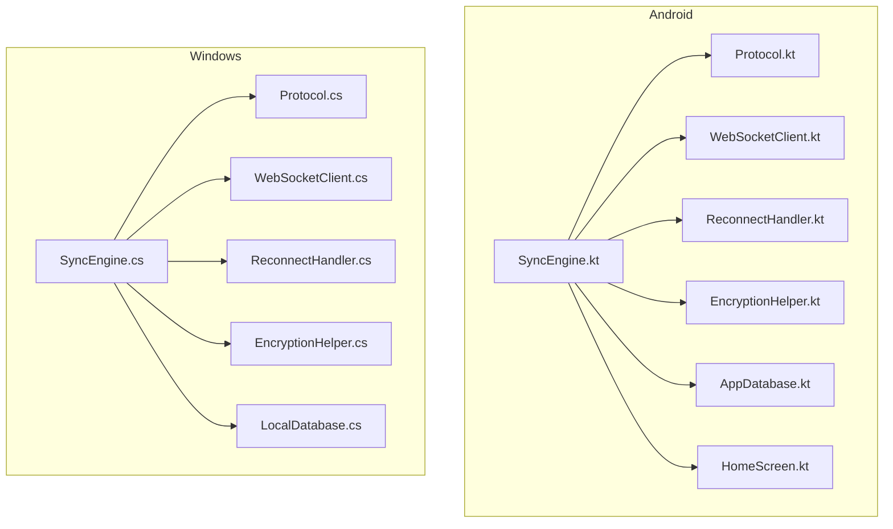
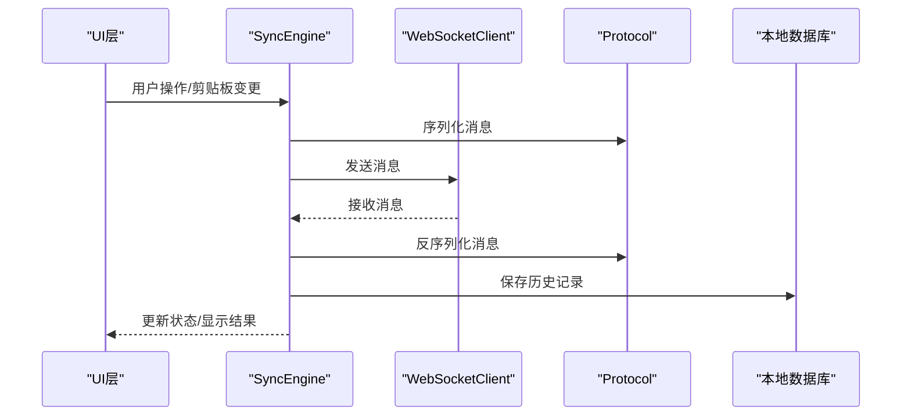
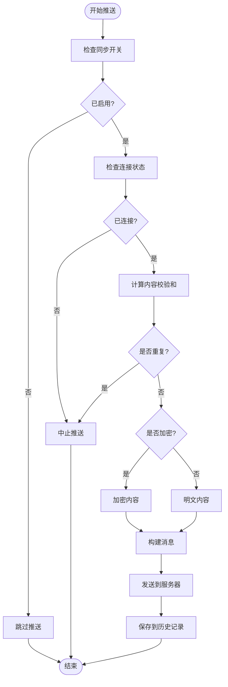
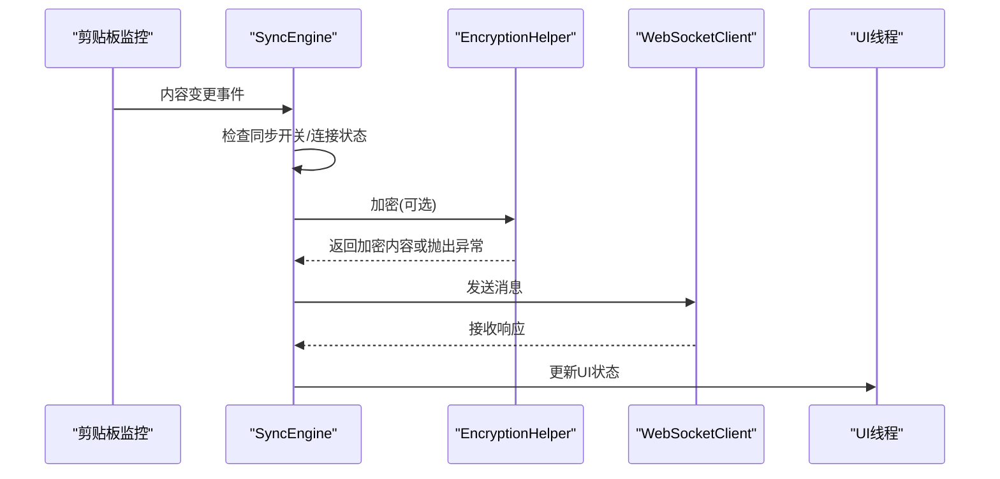
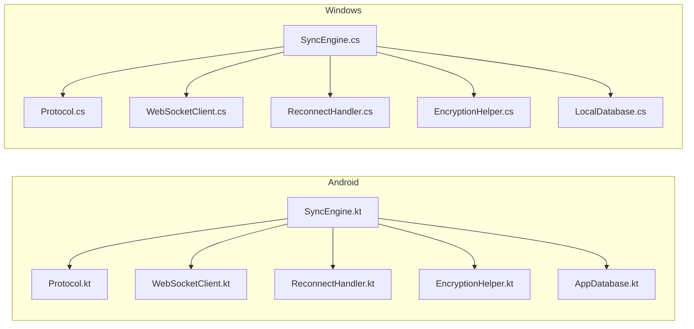

# 跨平台实现差异对比

<cite>
**本文档引用的文件**
- [SyncEngine.kt](file://clipSync-android/app/src/main/java/com/clipsync/app/core/SyncEngine.kt)
- [SyncEngine.cs](file://clipSync-windows/ClipSync.WPF/Core/SyncEngine.cs)
- [Protocol.kt](file://clipSync-android/app/src/main/java/com/clipsync/app/network/Protocol.kt)
- [Protocol.cs](file://clipSync-windows/ClipSync.WPF/Network/Protocol.cs)
- [WebSocketClient.kt](file://clipSync-android/app/src/main/java/com/clipsync/app/network/WebSocketClient.kt)
- [WebSocketClient.cs](file://clipSync-windows/ClipSync.WPF/Network/WebSocketClient.cs)
- [ReconnectHandler.kt](file://clipSync-android/app/src/main/java/com/clipsync/app/network/ReconnectHandler.kt)
- [ReconnectHandler.cs](file://clipSync-windows/ClipSync.WPF/Network/ReconnectHandler.cs)
- [EncryptionHelper.kt](file://clipSync-android/app/src/main/java/com/clipsync/app/core/EncryptionHelper.kt)
- [EncryptionHelper.cs](file://clipSync-windows/ClipSync.WPF/Core/EncryptionHelper.cs)
- [AppDatabase.kt](file://clipSync-android/app/src/main/java/com/clipsync/app/data/AppDatabase.kt)
- [LocalDatabase.cs](file://clipSync-windows/ClipSync.WPF/Storage/LocalDatabase.cs)
- [HomeScreen.kt](file://clipSync-android/app/src/main/java/com/clipsync/app/ui/screens/HomeScreen.kt)
- [DEVELOPMENT_PLAN.md](file://DEVELOPMENT_PLAN.md)
</cite>

## 目录
1. [引言](#引言)
2. [项目结构](#项目结构)
3. [核心组件](#核心组件)
4. [架构概览](#架构概览)
5. [详细组件分析](#详细组件分析)
6. [依赖关系分析](#依赖关系分析)
7. [性能考量](#性能考量)
8. [故障排除指南](#故障排除指南)
9. [结论](#结论)
10. [附录](#附录)

## 引言

本文件旨在对比分析Windows和Android平台在ClipSync跨平台同步引擎实现上的技术差异。通过对两个平台的核心组件、消息处理机制、错误处理策略、性能优化方案以及平台特定约束进行深入分析，帮助开发者理解实现差异并制定迁移与协作策略。

## 项目结构

两个平台均采用模块化的架构设计，围绕以下核心模块组织：

- 核心引擎：负责剪贴板监控、消息编解码、历史管理与状态控制
- 网络层：封装WebSocket连接、重连机制与心跳管理
- 存储层：本地数据库用于历史记录持久化
- UI层：平台特定的用户界面与交互

**图表来源**
- [SyncEngine.kt:1-250](file://clipSync-android/app/src/main/java/com/clipsync/app/core/SyncEngine.kt#L1-L250)
- [SyncEngine.cs:1-422](file://clipSync-windows/ClipSync.WPF/Core/SyncEngine.cs#L1-L422)
- [Protocol.kt:1-263](file://clipSync-android/app/src/main/java/com/clipsync/app/network/Protocol.kt#L1-L263)
- [Protocol.cs:1-167](file://clipSync-windows/ClipSync.WPF/Network/Protocol.cs#L1-L167)
- [WebSocketClient.kt:1-156](file://clipSync-android/app/src/main/java/com/clipsync/app/network/WebSocketClient.kt#L1-L156)
- [WebSocketClient.cs:1-146](file://clipSync-windows/ClipSync.WPF/Network/WebSocketClient.cs#L1-L146)
- [ReconnectHandler.kt:1-80](file://clipSync-android/app/src/main/java/com/clipsync/app/network/ReconnectHandler.kt#L1-L80)
- [ReconnectHandler.cs:1-97](file://clipSync-windows/ClipSync.WPF/Network/ReconnectHandler.cs#L1-L97)
- [EncryptionHelper.kt:1-157](file://clipSync-android/app/src/main/java/com/clipsync/app/core/EncryptionHelper.kt#L1-L157)
- [EncryptionHelper.cs:1-134](file://clipSync-windows/ClipSync.WPF/Core/EncryptionHelper.cs#L1-L134)
- [AppDatabase.kt:1-41](file://clipSync-android/app/src/main/java/com/clipsync/app/data/AppDatabase.kt#L1-L41)
- [LocalDatabase.cs:1-169](file://clipSync-windows/ClipSync.WPF/Storage/LocalDatabase.cs#L1-L169)

**章节来源**
- [DEVELOPMENT_PLAN.md:365-527](file://DEVELOPMENT_PLAN.md#L365-L527)

## 核心组件

### 同步引擎（SyncEngine）

- Android实现采用Kotlin协程与StateFlow进行异步状态管理，支持基于设置流的动态启停。
- Windows实现采用C#异步模式与事件驱动，通过回调处理消息与连接状态变化。

两者均实现去重、加密/解密、历史记录保存与回拉功能。

**章节来源**
- [SyncEngine.kt:27-250](file://clipSync-android/app/src/main/java/com/clipsync/app/core/SyncEngine.kt#L27-L250)
- [SyncEngine.cs:8-422](file://clipSync-windows/ClipSync.WPF/Core/SyncEngine.cs#L8-L422)

### 协议定义（Protocol）

- Android使用Kotlinx Serialization进行消息编解码，定义了完整的消息类型与载荷结构。
- Windows使用Newtonsoft.Json进行消息编解码，提供与Android一致的消息格式。

双方均遵循统一的WebSocket消息包络与载荷规范。

**章节来源**
- [Protocol.kt:12-263](file://clipSync-android/app/src/main/java/com/clipsync/app/network/Protocol.kt#L12-L263)
- [Protocol.cs:60-167](file://clipSync-windows/ClipSync.WPF/Network/Protocol.cs#L60-L167)

### 网络客户端（WebSocketClient）

- Android使用OkHttp的WebSocketListener，结合协程与共享流实现消息收发与状态管理。
- Windows使用System.Net.WebSockets.ClientWebSocket，自定义接收循环与异常处理。

双方均实现连接超时、读写超时与正常关闭流程。

**章节来源**
- [WebSocketClient.kt:26-156](file://clipSync-android/app/src/main/java/com/clipsync/app/network/WebSocketClient.kt#L26-L156)
- [WebSocketClient.cs:10-146](file://clipSync-windows/ClipSync.WPF/Network/WebSocketClient.cs#L10-L146)

### 重连处理器（ReconnectHandler）

- Android采用指数退避算法，最大退避时间60秒，配合SupervisorJob确保任务隔离。
- Windows采用Task延迟与指数退避，最大退避时间60秒，支持认证后自动重连。

**章节来源**
- [ReconnectHandler.kt:14-80](file://clipSync-android/app/src/main/java/com/clipsync/app/network/ReconnectHandler.kt#L14-L80)
- [ReconnectHandler.cs:8-97](file://clipSync-windows/ClipSync.WPF/Network/ReconnectHandler.cs#L8-L97)

### 加密助手（EncryptionHelper）

- 双平台均实现AES-256-CBC加密，采用PBKDF2-SHA256派生密钥，10000次迭代，16字节盐与16字节IV。
- Android输出格式为base64(salt):base64(IV + ciphertext)，Windows输出格式相同，确保跨平台兼容。

**章节来源**
- [EncryptionHelper.kt:22-157](file://clipSync-android/app/src/main/java/com/clipsync/app/core/EncryptionHelper.kt#L22-L157)
- [EncryptionHelper.cs:18-134](file://clipSync-windows/ClipSync.WPF/Core/EncryptionHelper.cs#L18-L134)

### 数据存储（AppDatabase vs LocalDatabase）

- Android使用Room数据库，提供类型安全的DAO访问与索引优化。
- Windows使用SQLite，手动管理表结构与索引，提供异步初始化与批量清理。

**章节来源**
- [AppDatabase.kt:14-41](file://clipSync-android/app/src/main/java/com/clipsync/app/data/AppDatabase.kt#L14-L41)
- [LocalDatabase.cs:9-169](file://clipSync-windows/ClipSync.WPF/Storage/LocalDatabase.cs#L9-L169)

## 架构概览

**图表来源**
- [SyncEngine.kt:72-160](file://clipSync-android/app/src/main/java/com/clipsync/app/core/SyncEngine.kt#L72-L160)
- [SyncEngine.cs:95-267](file://clipSync-windows/ClipSync.WPF/Core/SyncEngine.cs#L95-L267)
- [Protocol.kt:210-262](file://clipSync-android/app/src/main/java/com/clipsync/app/network/Protocol.kt#L210-L262)
- [Protocol.cs:60-167](file://clipSync-windows/ClipSync.WPF/Network/Protocol.cs#L60-L167)
- [WebSocketClient.kt:108-134](file://clipSync-android/app/src/main/java/com/clipsync/app/network/WebSocketClient.kt#L108-L134)
- [WebSocketClient.cs:64-81](file://clipSync-windows/ClipSync.WPF/Network/WebSocketClient.cs#L64-L81)

## 详细组件分析

### 消息处理机制对比

#### Android实现特点
- 使用Kotlin协程与StateFlow管理异步状态，支持热流与冷流转换。
- 通过WsMessageBuilder构建消息，统一序列化接口。
- 支持去重校验与加密开关，避免重复推送与明文传输。

**图表来源**
- [SyncEngine.kt:72-123](file://clipSync-android/app/src/main/java/com/clipsync/app/core/SyncEngine.kt#L72-L123)
- [EncryptionHelper.kt:107-111](file://clipSync-android/app/src/main/java/com/clipsync/app/core/EncryptionHelper.kt#L107-L111)

#### Windows实现特点
- 使用C#异步模式与事件回调，通过Dispatcher.Invoke确保剪贴板操作在STA线程执行。
- 支持文本与图像内容的差异化处理，图像内容进行Base64编码。
- 错误处理采用try-catch包装，避免UI线程阻塞。

**图表来源**
- [SyncEngine.cs:95-125](file://clipSync-windows/ClipSync.WPF/Core/SyncEngine.cs#L95-L125)
- [EncryptionHelper.cs:30-55](file://clipSync-windows/ClipSync.WPF/Core/EncryptionHelper.cs#L30-L55)
- [WebSocketClient.cs:64-81](file://clipSync-windows/ClipSync.WPF/Network/WebSocketClient.cs#L64-L81)

**章节来源**
- [SyncEngine.kt:72-160](file://clipSync-android/app/src/main/java/com/clipsync/app/core/SyncEngine.kt#L72-L160)
- [SyncEngine.cs:95-267](file://clipSync-windows/ClipSync.WPF/Core/SyncEngine.cs#L95-L267)

### 错误处理策略对比

#### Android错误处理
- 使用协程作用域与SupervisorJob隔离异常，避免单个任务影响整体运行。
- 通过日志记录与状态流向UI反馈错误信息。
- 连接失败时触发重连处理器，指数退避减少服务器压力。

#### Windows错误处理
- 使用try-catch捕获异常，通过ErrorOccurred事件向上层报告。
- 对加密失败进行显式处理，防止降级为明文传输。
- 剪贴板操作在UI线程执行，异常通过事件通知。

**章节来源**
- [SyncEngine.kt:119-124](file://clipSync-android/app/src/main/java/com/clipsync/app/core/SyncEngine.kt#L119-L124)
- [SyncEngine.cs:121-124](file://clipSync-windows/ClipSync.WPF/Core/SyncEngine.cs#L121-L124)
- [EncryptionHelper.cs:113-124](file://clipSync-windows/ClipSync.WPF/Core/EncryptionHelper.cs#L113-L124)

### 性能优化方案对比

#### Android优化
- 使用OkHttp配置ping间隔与连接超时，减少无效连接占用。
- 通过SharedFlow缓冲区容量提升消息吞吐能力。
- Room数据库索引优化查询性能，限制历史记录数量。

#### Windows优化
- 自定义接收循环，限制单条消息大小防止内存溢出。
- SQLite异步初始化与批量删除，保持历史记录精简。
- 事件驱动模型减少UI线程阻塞。

**章节来源**
- [WebSocketClient.kt:92-96](file://clipSync-android/app/src/main/java/com/clipsync/app/network/WebSocketClient.kt#L92-L96)
- [WebSocketClient.cs:15-15](file://clipSync-windows/ClipSync.WPF/Network/WebSocketClient.cs#L15-L15)
- [LocalDatabase.cs:85-95](file://clipSync-windows/ClipSync.WPF/Storage/LocalDatabase.cs#L85-L95)

### 平台特定约束与解决方案

#### Android约束
- 需要前台服务与通知以保证长连接稳定性。
- 剪贴板监听需要在应用可见时启用，避免后台限制。
- 使用协程调度器分离IO与主线程操作。

#### Windows约束
- 剪贴板操作必须在STA线程执行，通过Dispatcher.Invoke切换。
- 系统托盘集成需要管理员权限与注册表配置。
- 文件上传下载需要处理大文件与网络中断恢复。

**章节来源**
- [HomeScreen.kt:1-372](file://clipSync-android/app/src/main/java/com/clipsync/app/ui/screens/HomeScreen.kt#L1-L372)
- [SyncEngine.cs:224-241](file://clipSync-windows/ClipSync.WPF/Core/SyncEngine.cs#L224-L241)

## 依赖关系分析

**图表来源**
- [SyncEngine.kt:27-32](file://clipSync-android/app/src/main/java/com/clipsync/app/core/SyncEngine.kt#L27-L32)
- [SyncEngine.cs:10-17](file://clipSync-windows/ClipSync.WPF/Core/SyncEngine.cs#L10-L17)

**章节来源**
- [Protocol.kt:1-263](file://clipSync-android/app/src/main/java/com/clipsync/app/network/Protocol.kt#L1-L263)
- [Protocol.cs:1-167](file://clipSync-windows/ClipSync.WPF/Network/Protocol.cs#L1-L167)

## 性能考量

- 协程与异步模式：Android使用协程，Windows使用Task，两者均能有效避免阻塞UI线程。
- 序列化性能：Kotlinx Serialization与Newtonsoft.Json在消息编解码上性能相当，建议根据平台特性选择。
- 数据库优化：Android Room提供编译时SQL验证与索引优化；Windows SQLite需手动维护索引。
- 网络优化：OkHttp与System.Net.WebSockets均支持心跳与保活，建议配置合理的ping间隔。

## 故障排除指南

- 连接失败：检查服务器地址与网络状态，确认防火墙放行端口。
- 认证失败：验证令牌有效性与设备ID，检查服务器日志。
- 同步异常：查看去重校验与加密状态，确认两端配置一致。
- 性能问题：监控内存使用与CPU占用，优化数据库查询与网络请求频率。

**章节来源**
- [ReconnectHandler.kt:37-53](file://clipSync-android/app/src/main/java/com/clipsync/app/network/ReconnectHandler.kt#L37-L53)
- [ReconnectHandler.cs:33-71](file://clipSync-windows/ClipSync.WPF/Network/ReconnectHandler.cs#L33-L71)

## 结论

两个平台在核心功能上保持高度一致性，但在编程范式、异步模型与平台约束方面存在显著差异。Android偏向函数式与声明式风格，Windows偏向事件驱动与命令式风格。通过统一的协议规范与接口抽象，可以实现代码复用与跨平台协作。

## 附录

### 协议兼容性考虑

- 消息包络：type、version、timestamp、device_id、payload字段保持一致。
- 载荷结构：内容类型、格式、大小、校验和等字段在两端实现一致。
- 错误码：统一的错误码体系便于跨平台错误处理与用户提示。

**章节来源**
- [DEVELOPMENT_PLAN.md:18-362](file://DEVELOPMENT_PLAN.md#L18-L362)

### 数据序列化差异

- Android：Kotlinx Serialization，支持忽略未知字段与默认值编码。
- Windows：Newtonsoft.Json，提供灵活的JSON操作与LINQ支持。

**章节来源**
- [Protocol.kt:12-16](file://clipSync-android/app/src/main/java/com/clipsync/app/network/Protocol.kt#L12-L16)
- [Protocol.cs:67-77](file://clipSync-windows/ClipSync.WPF/Network/Protocol.cs#L67-L77)

### 网络通信优化

- 心跳机制：30秒心跳间隔，确保连接活跃度。
- 重连策略：指数退避，最大60秒退避时间。
- 超时配置：连接超时与读写超时合理设置，避免资源泄露。

**章节来源**
- [WebSocketClient.kt:93-95](file://clipSync-android/app/src/main/java/com/clipsync/app/network/WebSocketClient.kt#L93-L95)
- [WebSocketClient.cs:26-33](file://clipSync-windows/ClipSync.WPF/Network/WebSocketClient.cs#L26-L33)

### 迁移指南与最佳实践

- 接口优先：所有平台均应面向接口编程，便于替换实现与测试。
- 统一协议：严格遵循协议规范，避免平台特有扩展。
- 错误处理：建立统一的错误码与日志体系，便于问题定位。
- 性能监控：建立性能指标收集与告警机制，持续优化用户体验。

**章节来源**
- [DEVELOPMENT_PLAN.md:691-712](file://DEVELOPMENT_PLAN.md#L691-L712)