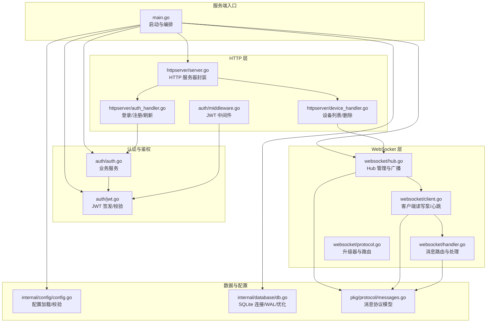
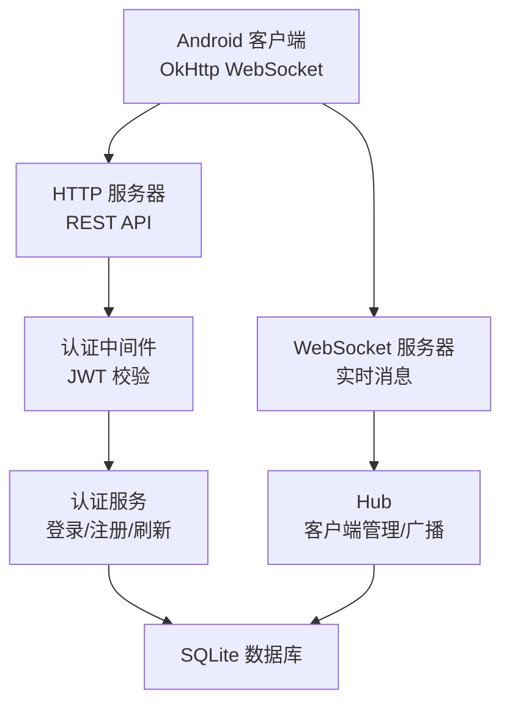
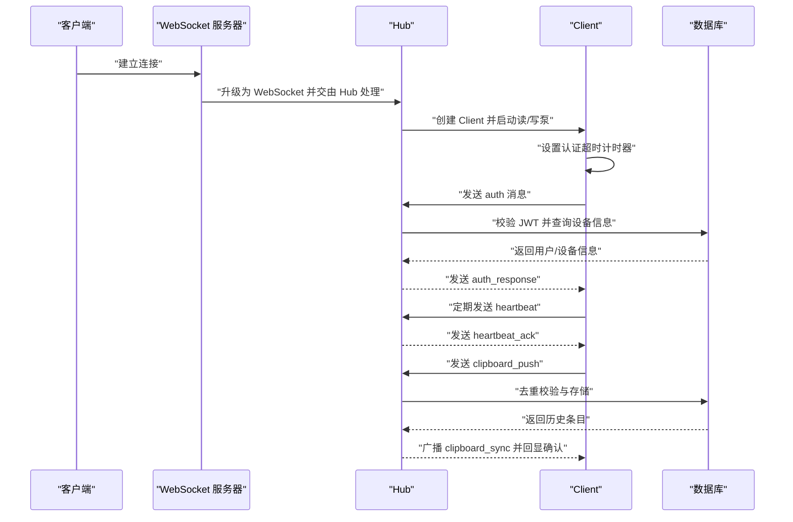
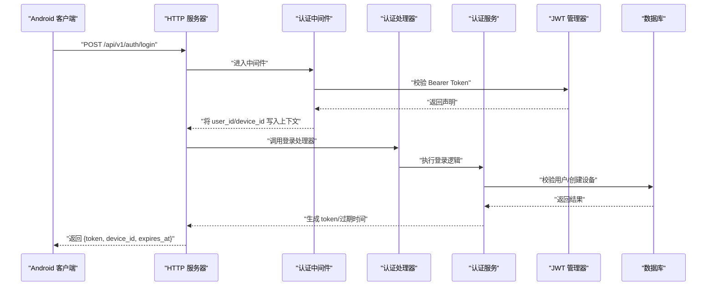
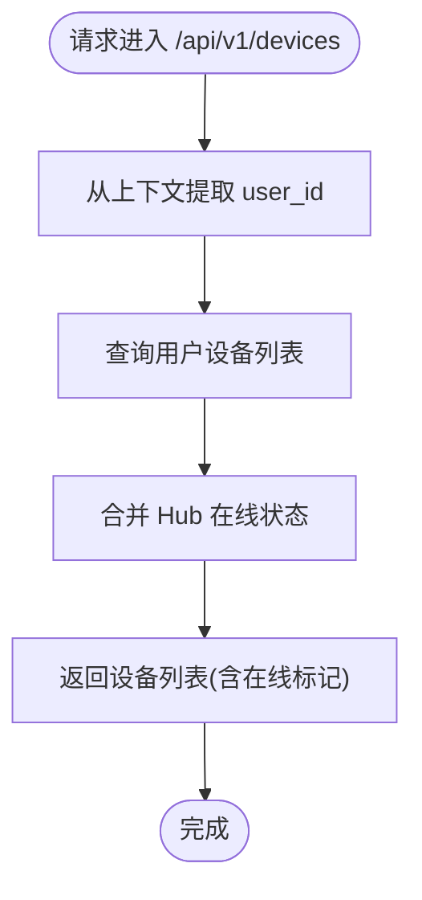
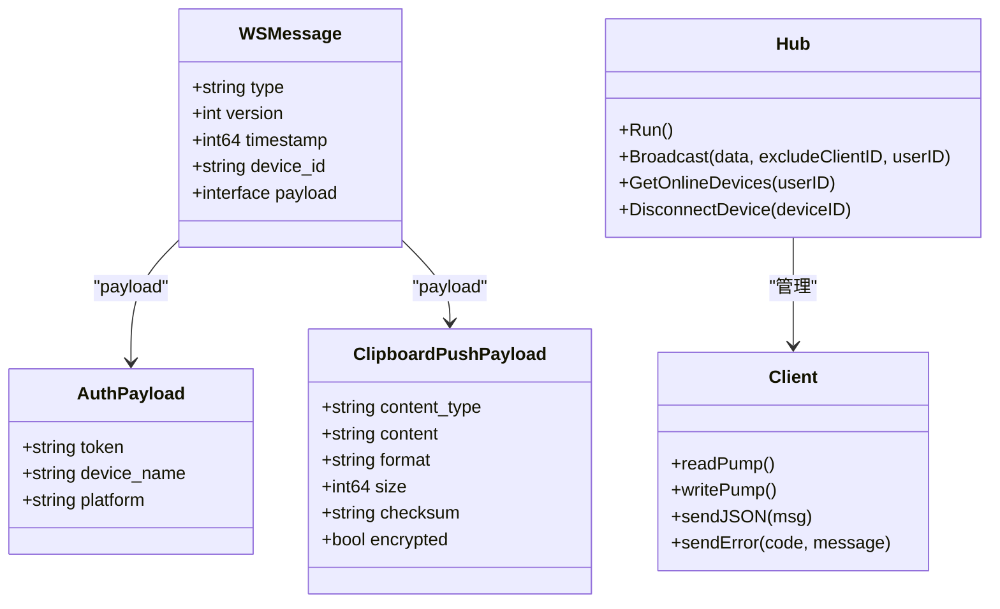
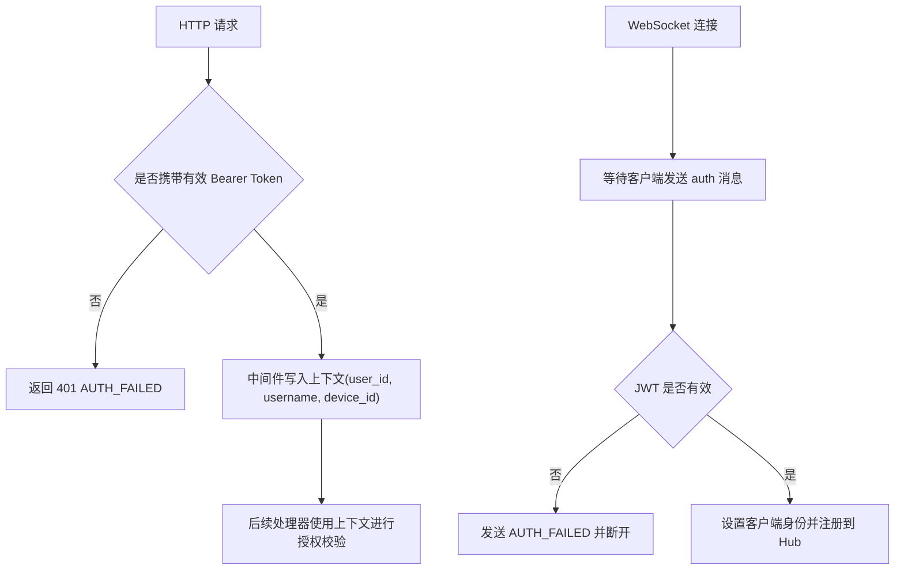
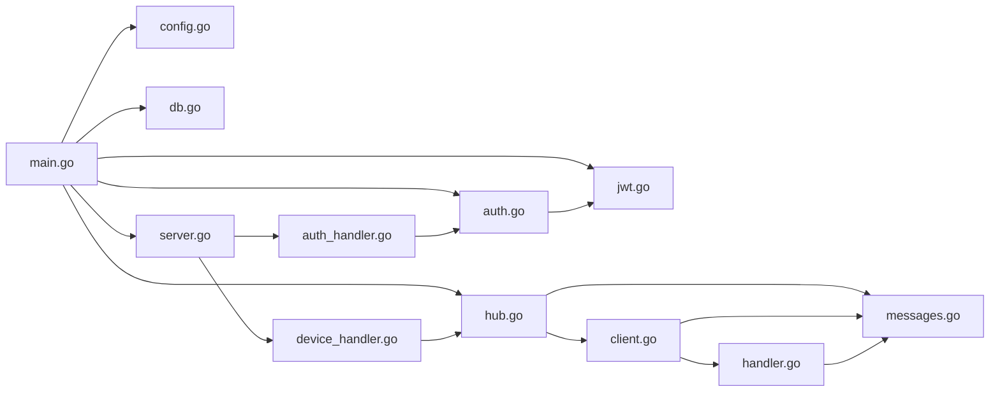

# 组件交互与协作

<cite>
**本文引用的文件**
- [main.go](file://clipSync-server/cmd/server/main.go)
- [hub.go](file://clipSync-server/internal/websocket/hub.go)
- [client.go](file://clipSync-server/internal/websocket/client.go)
- [handler.go](file://clipSync-server/internal/websocket/handler.go)
- [protocol.go](file://clipSync-server/internal/websocket/protocol.go)
- [server.go](file://clipSync-server/internal/httpserver/server.go)
- [auth_handler.go](file://clipSync-server/internal/httpserver/auth_handler.go)
- [device_handler.go](file://clipSync-server/internal/httpserver/device_handler.go)
- [middleware.go](file://clipSync-server/internal/auth/middleware.go)
- [auth.go](file://clipSync-server/internal/auth/auth.go)
- [jwt.go](file://clipSync-server/internal/auth/jwt.go)
- [config.go](file://clipSync-server/internal/config/config.go)
- [db.go](file://clipSync-server/internal/database/db.go)
- [messages.go](file://clipSync-server/pkg/protocol/messages.go)
- [WebSocketClient.kt](file://clipSync-android/app/src/main/java/com/clipsync/app/network/WebSocketClient.kt)
- [Protocol.kt](file://clipSync-android/app/src/main/java/com/clipsync/app/network/Protocol.kt)
</cite>

## 目录
1. [简介](#简介)
2. [项目结构](#项目结构)
3. [核心组件](#核心组件)
4. [架构总览](#架构总览)
5. [详细组件分析](#详细组件分析)
6. [依赖分析](#依赖分析)
7. [性能考量](#性能考量)
8. [故障排查指南](#故障排查指南)
9. [结论](#结论)
10. [附录](#附录)

## 简介
本文件聚焦于服务端组件之间的交互与协作，重点解析 WebSocket Hub、HTTP 服务器与认证系统的协同机制，明确组件间接口契约、数据流转路径、认证状态传递与验证方式、生命周期管理与资源协调策略，并给出解耦设计与依赖注入实践建议，以及监控、调试与故障排查方法。同时通过典型使用场景展示组件协作流程与性能考量。

## 项目结构
服务端采用 Go 编写，按领域分层组织：配置加载、数据库连接、认证服务、HTTP 路由与处理器、WebSocket Hub 与客户端、协议定义等模块清晰分离。入口程序负责初始化配置、数据库、仓库、认证与 WebSocket Hub，随后分别启动独立的 HTTP 与 WebSocket 服务器实例。

**图表来源**
- [main.go:21-145](file://clipSync-server/cmd/server/main.go#L21-L145)
- [server.go:18-49](file://clipSync-server/internal/httpserver/server.go#L18-L49)
- [auth_handler.go:16-214](file://clipSync-server/internal/httpserver/auth_handler.go#L16-L214)
- [device_handler.go:17-136](file://clipSync-server/internal/httpserver/device_handler.go#L17-L136)
- [middleware.go:27-61](file://clipSync-server/internal/auth/middleware.go#L27-L61)
- [auth.go:15-136](file://clipSync-server/internal/auth/auth.go#L15-L136)
- [jwt.go:24-75](file://clipSync-server/internal/auth/jwt.go#L24-L75)
- [hub.go:44-112](file://clipSync-server/internal/websocket/hub.go#L44-L112)
- [client.go:33-117](file://clipSync-server/internal/websocket/client.go#L33-L117)
- [handler.go:10-31](file://clipSync-server/internal/websocket/handler.go#L10-L31)
- [protocol.go:9-26](file://clipSync-server/internal/websocket/protocol.go#L9-L26)
- [config.go:38-71](file://clipSync-server/internal/config/config.go#L38-L71)
- [db.go:17-55](file://clipSync-server/internal/database/db.go#L17-L55)
- [messages.go:5-131](file://clipSync-server/pkg/protocol/messages.go#L5-L131)

**章节来源**
- [main.go:21-145](file://clipSync-server/cmd/server/main.go#L21-L145)
- [config.go:38-71](file://clipSync-server/internal/config/config.go#L38-L71)

## 核心组件
- 配置模块：加载 YAML 配置，提供默认值与生产安全警告。
- 数据库模块：SQLite 连接封装，启用 WAL 模式与连接池优化。
- 认证模块：用户/设备仓库、JWT 管理器、HTTP 中间件与业务服务。
- HTTP 服务器：统一路由与处理器，速率限制与健康检查。
- WebSocket Hub：客户端注册/注销/广播、心跳超时、在线设备统计。
- 协议定义：WebSocket 消息类型与载荷结构。

**章节来源**
- [config.go:10-71](file://clipSync-server/internal/config/config.go#L10-L71)
- [db.go:12-55](file://clipSync-server/internal/database/db.go#L12-L55)
- [auth.go:8-22](file://clipSync-server/internal/auth/auth.go#L8-L22)
- [jwt.go:18-30](file://clipSync-server/internal/auth/jwt.go#L18-L30)
- [server.go:11-24](file://clipSync-server/internal/httpserver/server.go#L11-L24)
- [hub.go:18-58](file://clipSync-server/internal/websocket/hub.go#L18-L58)
- [messages.go:5-131](file://clipSync-server/pkg/protocol/messages.go#L5-L131)

## 架构总览
服务端以“双栈”方式运行：HTTP 服务器监听常规 REST API，WebSocket 服务器独立监听实时通信端口。HTTP 层负责认证与设备管理；WebSocket 层负责剪贴板同步、心跳与设备状态广播。认证中间件将 JWT 解析出的用户/设备信息注入请求上下文，供 HTTP 处理器与 WebSocket Hub 使用。

**图表来源**
- [main.go:74-125](file://clipSync-server/cmd/server/main.go#L74-L125)
- [middleware.go:32-61](file://clipSync-server/internal/auth/middleware.go#L32-L61)
- [auth.go:67-116](file://clipSync-server/internal/auth/auth.go#L67-L116)
- [hub.go:181-208](file://clipSync-server/internal/websocket/hub.go#L181-L208)

## 详细组件分析

### WebSocket Hub 与客户端协作
- Hub 负责维护客户端集合、注册/注销、广播消息、统计在线设备数与总连接数。
- 客户端读泵负责解析消息、更新最后活跃时间、处理心跳；写泵负责发送消息与周期性 Ping。
- 消息路由根据类型分派到具体处理函数（认证、心跳、剪贴板推送/拉取、设备列表/注销）。

**图表来源**
- [hub.go:181-208](file://clipSync-server/internal/websocket/hub.go#L181-L208)
- [handler.go:33-110](file://clipSync-server/internal/websocket/handler.go#L33-L110)
- [handler.go:142-234](file://clipSync-server/internal/websocket/handler.go#L142-L234)
- [client.go:33-117](file://clipSync-server/internal/websocket/client.go#L33-L117)

**章节来源**
- [hub.go:18-153](file://clipSync-server/internal/websocket/hub.go#L18-L153)
- [client.go:13-150](file://clipSync-server/internal/websocket/client.go#L13-L150)
- [handler.go:10-392](file://clipSync-server/internal/websocket/handler.go#L10-L392)

### HTTP 服务器与认证系统
- 入口程序构建 HTTP 路由，注册认证、健康检查、设备管理与上传下载接口。
- 认证中间件从 Authorization 头提取 Bearer Token，调用 JWT 管理器校验后将用户/设备信息写入请求上下文。
- 登录/注册/刷新处理器调用认证服务生成或刷新令牌；设备处理器读取上下文中的用户 ID 进行设备操作。

**图表来源**
- [main.go:74-106](file://clipSync-server/cmd/server/main.go#L74-L106)
- [middleware.go:32-61](file://clipSync-server/internal/auth/middleware.go#L32-L61)
- [auth_handler.go:63-109](file://clipSync-server/internal/httpserver/auth_handler.go#L63-L109)
- [auth.go:67-116](file://clipSync-server/internal/auth/auth.go#L67-L116)
- [jwt.go:57-75](file://clipSync-server/internal/auth/jwt.go#L57-L75)

**章节来源**
- [main.go:74-106](file://clipSync-server/cmd/server/main.go#L74-L106)
- [middleware.go:22-111](file://clipSync-server/internal/auth/middleware.go#L22-L111)
- [auth_handler.go:11-215](file://clipSync-server/internal/httpserver/auth_handler.go#L11-L215)
- [auth.go:8-137](file://clipSync-server/internal/auth/auth.go#L8-L137)
- [jwt.go:18-76](file://clipSync-server/internal/auth/jwt.go#L18-L76)

### 设备管理与在线状态联动
- HTTP 设备处理器通过认证中间件获取用户 ID，查询设备列表并结合 Hub 的在线设备映射返回在线状态。
- 删除设备时，HTTP 层调用 Hub 断开对应设备连接，确保状态一致性。

**图表来源**
- [device_handler.go:25-82](file://clipSync-server/internal/httpserver/device_handler.go#L25-L82)
- [hub.go:168-179](file://clipSync-server/internal/websocket/hub.go#L168-L179)

**章节来源**
- [device_handler.go:84-136](file://clipSync-server/internal/httpserver/device_handler.go#L84-L136)
- [hub.go:155-179](file://clipSync-server/internal/websocket/hub.go#L155-L179)

### 接口契约与数据流转
- WebSocket 消息协议：统一的 envelope 结构，包含 type、version、timestamp、device_id 与 payload。
- 客户端职责：连接管理、消息序列化/反序列化、心跳与重连、错误上报。
- 服务端职责：消息路由、业务处理、数据库访问、广播与回显。

**图表来源**
- [messages.go:5-131](file://clipSync-server/pkg/protocol/messages.go#L5-L131)
- [hub.go:18-58](file://clipSync-server/internal/websocket/hub.go#L18-L58)
- [client.go:13-31](file://clipSync-server/internal/websocket/client.go#L13-L31)

**章节来源**
- [messages.go:5-131](file://clipSync-server/pkg/protocol/messages.go#L5-L131)
- [Protocol.kt:20-262](file://clipSync-android/app/src/main/java/com/clipsync/app/network/Protocol.kt#L20-L262)

### 认证状态传递与验证
- HTTP 层：中间件从 Authorization 头解析 Bearer Token，校验失败直接返回 JSON 错误；成功则将 user_id、username、device_id 写入上下文。
- WebSocket 层：客户端在连接后必须在限定时间内发送 auth 消息，服务端校验 JWT 并设置客户端身份，否则断开连接。
- 状态一致性：HTTP 层删除设备会触发 Hub 断开对应连接，避免状态不一致。

**图表来源**
- [middleware.go:32-61](file://clipSync-server/internal/auth/middleware.go#L32-L61)
- [handler.go:33-110](file://clipSync-server/internal/websocket/handler.go#L33-L110)
- [device_handler.go:130-131](file://clipSync-server/internal/httpserver/device_handler.go#L130-L131)

**章节来源**
- [middleware.go:10-111](file://clipSync-server/internal/auth/middleware.go#L10-L111)
- [handler.go:33-110](file://clipSync-server/internal/websocket/handler.go#L33-L110)
- [device_handler.go:130-131](file://clipSync-server/internal/httpserver/device_handler.go#L130-L131)

### 生命周期管理与资源协调
- 入口程序：加载配置、初始化数据库与迁移、构建仓库与认证服务、启动 Hub 与两个 HTTP 服务器（HTTP 与 WebSocket 分离端口），支持优雅关闭。
- Hub：内部 select 循环处理注册/注销/广播，带缓冲通道与并发安全锁；客户端写缓冲满时自动断开，避免阻塞。
- HTTP 服务器：统一超时配置，支持优雅关闭；WebSocket 服务器独立端口，便于扩展与隔离。
- 数据库：连接池与 WAL 模式优化，适合低资源环境。

**章节来源**
- [main.go:21-145](file://clipSync-server/cmd/server/main.go#L21-L145)
- [hub.go:60-112](file://clipSync-server/internal/websocket/hub.go#L60-L112)
- [server.go:26-49](file://clipSync-server/internal/httpserver/server.go#L26-L49)
- [db.go:17-55](file://clipSync-server/internal/database/db.go#L17-L55)

### 解耦设计与依赖注入模式
- 依赖注入：入口程序集中构造各组件并注入到下游（HTTP 路由、WebSocket Hub、处理器），避免硬编码耦合。
- 接口抽象：HTTP 与 WebSocket 均通过协议模型解耦消息格式；认证中间件仅依赖 JWT 管理器接口。
- 可替换性：配置模块可替换为环境变量；数据库层可替换为其他 SQL 方言（当前为 SQLite）。

**章节来源**
- [main.go:43-68](file://clipSync-server/cmd/server/main.go#L43-L68)
- [auth.go:15-22](file://clipSync-server/internal/auth/auth.go#L15-L22)
- [hub.go:44-58](file://clipSync-server/internal/websocket/hub.go#L44-L58)

## 依赖分析
- 组件内聚：HTTP、WebSocket、认证、数据库与配置模块边界清晰，职责单一。
- 组件耦合：HTTP 与 WebSocket 通过 Hub 协作实现设备状态共享；HTTP 与 WebSocket 共享认证服务与协议模型。
- 外部依赖：gorilla/websocket、golang-jwt/jwt、sqlite3 驱动、YAML 解析。

**图表来源**
- [main.go:21-145](file://clipSync-server/cmd/server/main.go#L21-L145)
- [auth.go:15-136](file://clipSync-server/internal/auth/auth.go#L15-L136)
- [hub.go:44-112](file://clipSync-server/internal/websocket/hub.go#L44-L112)
- [client.go:33-117](file://clipSync-server/internal/websocket/client.go#L33-L117)
- [handler.go:10-392](file://clipSync-server/internal/websocket/handler.go#L10-L392)
- [messages.go:5-131](file://clipSync-server/pkg/protocol/messages.go#L5-L131)

**章节来源**
- [main.go:21-145](file://clipSync-server/cmd/server/main.go#L21-L145)

## 性能考量
- 连接与缓冲：Hub 对客户端发送通道设置缓冲；写泵批量写出，减少系统调用次数。
- 心跳与超时：客户端读超时与心跳机制降低无效连接占用；Hub 对写缓冲满的客户端进行清理。
- 数据库优化：SQLite WAL 模式、连接池与参数优化，适合小规模并发。
- 速率限制：认证端点使用限流中间件，防止暴力破解与滥用。
- 独立端口：HTTP 与 WebSocket 分离端口，避免相互影响，便于横向扩展。

**章节来源**
- [client.go:69-117](file://clipSync-server/internal/websocket/client.go#L69-L117)
- [hub.go:81-111](file://clipSync-server/internal/websocket/hub.go#L81-L111)
- [db.go:29-50](file://clipSync-server/internal/database/db.go#L29-L50)
- [main.go:77-78](file://clipSync-server/cmd/server/main.go#L77-L78)

## 故障排查指南
- 认证失败
  - 现象：HTTP 返回 401 或 WebSocket 发送 AUTH_FAILED。
  - 排查：确认 Authorization 头格式与签名密钥；检查 JWT 是否过期；核对用户/设备是否存在。
- 连接未认证超时
  - 现象：WebSocket 连接后 30 秒内未发送 auth。
  - 排查：确认客户端在连接后尽快发送 auth 消息；检查网络延迟与服务端日志。
- 广播失败或丢包
  - 现象：部分设备未收到 clipboard_sync。
  - 排查：检查 Hub 广播通道与客户端写缓冲；关注写缓冲满导致的断连。
- 设备删除未生效
  - 现象：HTTP 删除设备后仍显示在线。
  - 排查：确认 Hub.DisconnectDevice 是否被调用；检查设备 ID 匹配逻辑。
- 数据库异常
  - 现象：迁移失败或连接不可用。
  - 排查：检查 WAL 模式与连接池配置；确认数据库目录权限。

**章节来源**
- [middleware.go:32-61](file://clipSync-server/internal/auth/middleware.go#L32-L61)
- [hub.go:181-208](file://clipSync-server/internal/websocket/hub.go#L181-L208)
- [handler.go:33-110](file://clipSync-server/internal/websocket/handler.go#L33-L110)
- [device_handler.go:130-131](file://clipSync-server/internal/httpserver/device_handler.go#L130-L131)
- [db.go:17-55](file://clipSync-server/internal/database/db.go#L17-L55)

## 结论
该系统通过清晰的分层与契约设计实现了 HTTP 与 WebSocket 的高效协作：HTTP 提供认证与设备管理，WebSocket 提供实时同步与状态广播；认证中间件与 Hub 共同保证了认证状态的一致性与安全性。入口程序采用依赖注入与优雅关闭策略，提升了可维护性与稳定性。建议在生产环境中强化 CORS 与 TLS、收紧认证中间件的错误处理与日志记录，并对 Hub 的广播与数据库访问进行压力测试与容量规划。

## 附录
- 典型使用场景
  - 新设备首次登录：HTTP 登录成功后，客户端通过 WebSocket 发送 auth，服务端校验并注册到 Hub，随后可进行剪贴板同步与心跳维持。
  - 设备注销：HTTP 删除设备后，服务端断开对应 WebSocket 连接，确保状态一致。
  - 剪贴板同步：客户端推送 clipboard_push，服务端去重校验、入库并广播 clipboard_sync，同时回显确认消息。

**章节来源**
- [auth_handler.go:63-109](file://clipSync-server/internal/httpserver/auth_handler.go#L63-L109)
- [handler.go:142-234](file://clipSync-server/internal/websocket/handler.go#L142-L234)
- [device_handler.go:130-131](file://clipSync-server/internal/httpserver/device_handler.go#L130-L131)