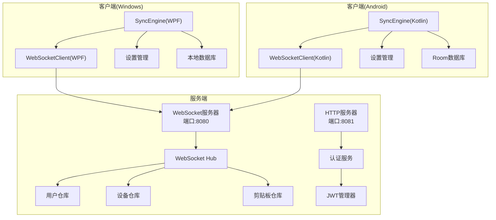
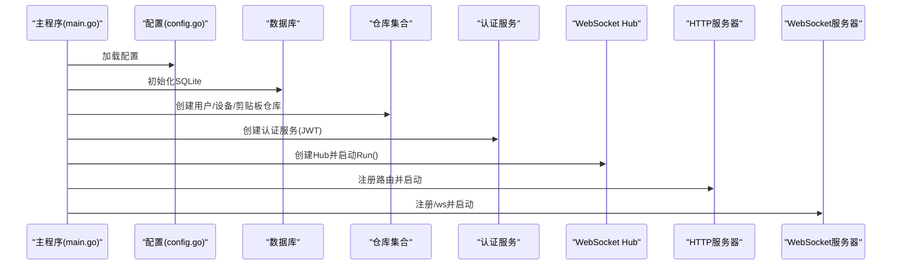
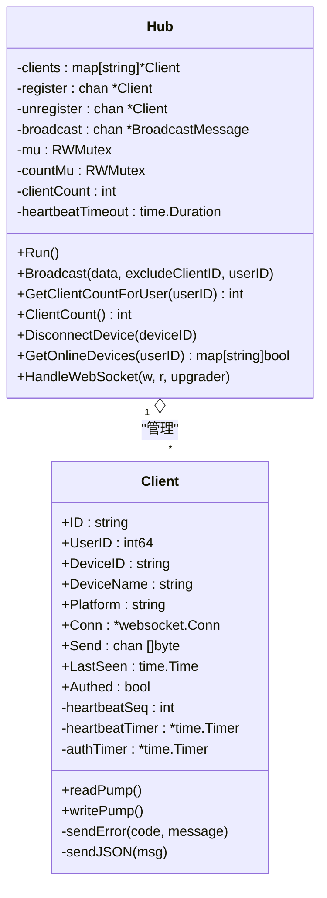
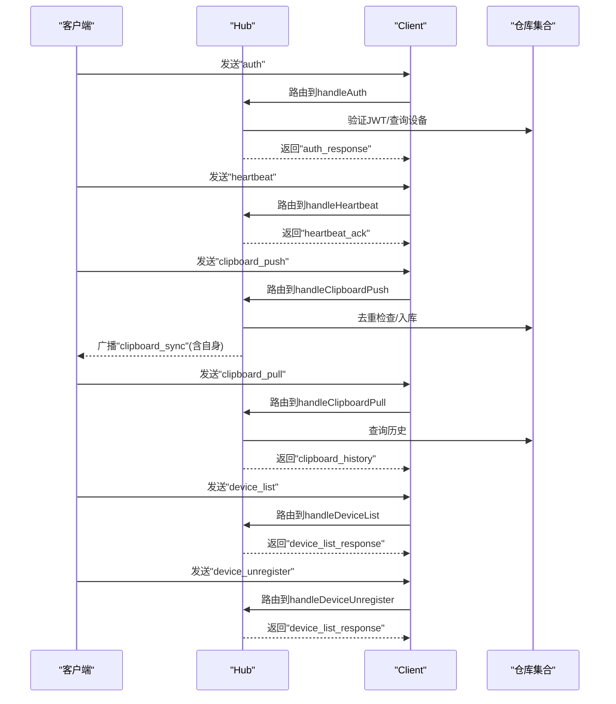
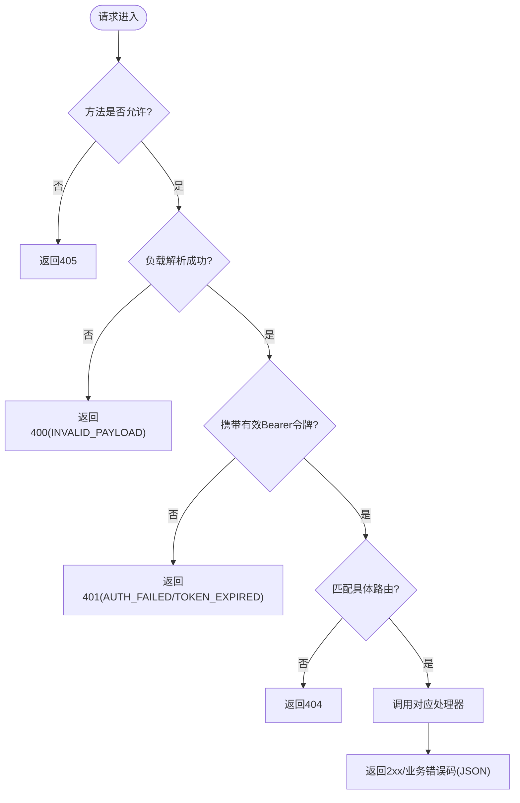
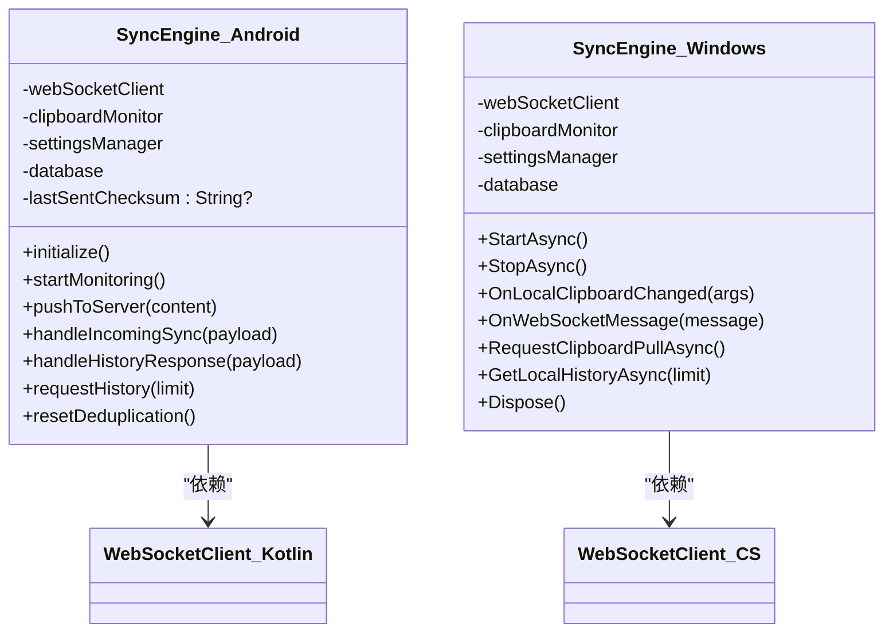
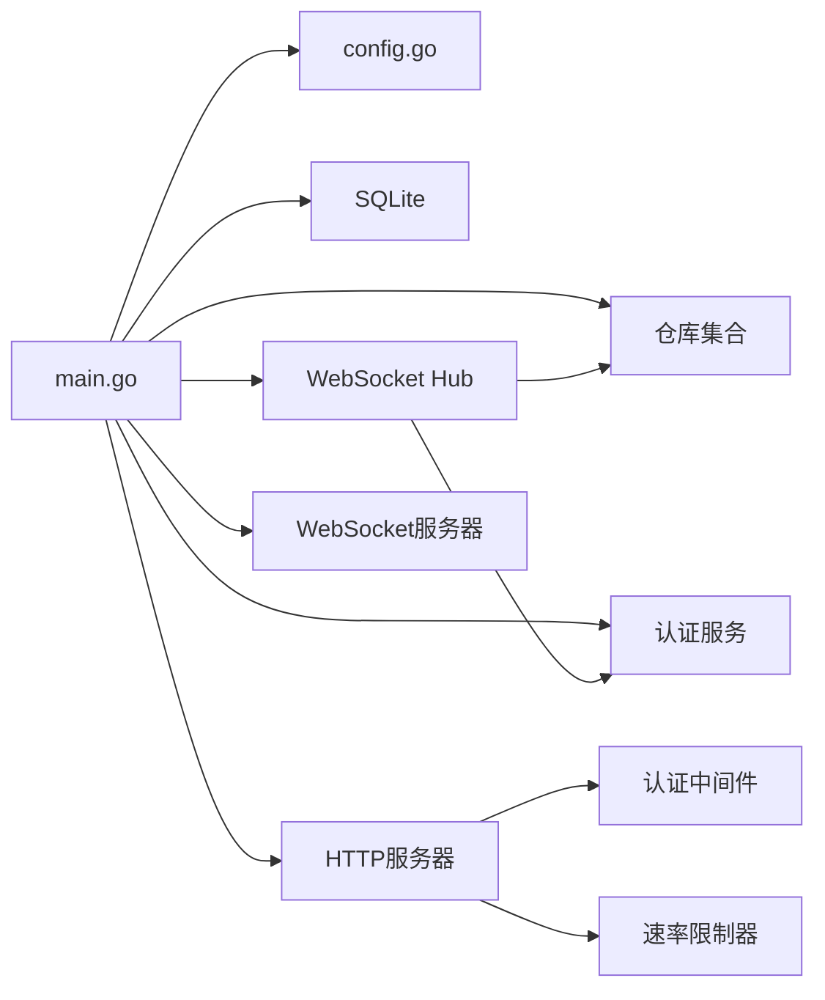

# 组件设计

<cite>
**本文引用的文件**
- [hub.go](file://clipSync-server/internal/websocket/hub.go)
- [client.go](file://clipSync-server/internal/websocket/client.go)
- [handler.go](file://clipSync-server/internal/websocket/handler.go)
- [protocol.go](file://clipSync-server/internal/websocket/protocol.go)
- [server.go](file://clipSync-server/internal/httpserver/server.go)
- [main.go](file://clipSync-server/cmd/server/main.go)
- [messages.go](file://clipSync-server/pkg/protocol/messages.go)
- [auth_handler.go](file://clipSync-server/internal/httpserver/auth_handler.go)
- [middleware.go](file://clipSync-server/internal/auth/middleware.go)
- [config.go](file://clipSync-server/internal/config/config.go)
- [SyncEngine.kt](file://clipSync-android/app/src/main/java/com/clipsync/app/core/SyncEngine.kt)
- [WebSocketClient.kt](file://clipSync-android/app/src/main/java/com/clipsync/app/network/WebSocketClient.kt)
- [SyncEngine.cs](file://clipSync-windows/ClipSync.WPF/Core/SyncEngine.cs)
- [WebSocketClient.cs](file://clipSync-windows/ClipSync.WPF/Network/WebSocketClient.cs)
- [DEVELOPMENT_PLAN.md](file://DEVELOPMENT_PLAN.md)
</cite>

## 目录
1. [简介](#简介)
2. [项目结构](#项目结构)
3. [核心组件](#核心组件)
4. [架构总览](#架构总览)
5. [组件详细分析](#组件详细分析)
6. [依赖关系分析](#依赖关系分析)
7. [性能考量](#性能考量)
8. [故障排查指南](#故障排查指南)
9. [结论](#结论)
10. [附录](#附录)

## 简介
本文件面向ClipSync系统中的组件设计，重点覆盖以下方面：
- WebSocket Hub的设计理念与实现细节：客户端管理、消息广播机制、心跳检测与超时处理
- SyncEngine组件在不同平台（Android、Windows）上的实现差异与共同特征
- HTTP服务器的路由设计与中间件架构
- 组件间依赖关系与接口契约
- 生命周期管理、资源清理与错误处理策略
- 扩展点与插件化设计建议

## 项目结构
ClipSync采用“服务端Go + 客户端跨平台”的分层架构：
- 服务端（Go）：独立进程，分别监听HTTP与WebSocket端口，提供认证、设备管理、健康检查、文件上传下载与剪贴板历史查询；WebSocket Hub负责连接管理与消息广播
- 客户端（Android、Windows）：各自维护本地设置、加密、剪贴板监控、WebSocket客户端与同步引擎，通过HTTP完成认证，通过WebSocket进行实时同步

图表来源
- [main.go:100-125](file://clipSync-server/cmd/server/main.go#L100-L125)
- [hub.go:44-58](file://clipSync-server/internal/websocket/hub.go#L44-L58)
- [SyncEngine.cs:32-57](file://clipSync-windows/ClipSync.WPF/Core/SyncEngine.cs#L32-L57)
- [SyncEngine.kt:43-50](file://clipSync-android/app/src/main/java/com/clipsync/app/core/SyncEngine.kt#L43-L50)

章节来源
- [main.go:100-125](file://clipSync-server/cmd/server/main.go#L100-L125)
- [DEVELOPMENT_PLAN.md:365-471](file://DEVELOPMENT_PLAN.md#L365-L471)

## 核心组件
- WebSocket Hub：集中管理所有WebSocket连接，负责注册/注销、广播、在线设备统计、心跳超时与断开
- 客户端WebSocket：封装连接生命周期、消息收发、重连与状态管理
- SyncEngine：在各平台负责本地剪贴板变更检测、去重、推送、接收同步、历史拉取与本地持久化
- HTTP服务器与中间件：路由配置、认证中间件、速率限制、健康检查、设备管理与文件上传下载
- 协议模型：统一的WebSocket消息格式与字段定义，确保跨平台一致性

章节来源
- [hub.go:18-58](file://clipSync-server/internal/websocket/hub.go#L18-L58)
- [client.go:13-31](file://clipSync-server/internal/websocket/client.go#L13-L31)
- [messages.go:5-132](file://clipSync-server/pkg/protocol/messages.go#L5-L132)
- [server.go:11-50](file://clipSync-server/internal/httpserver/server.go#L11-L50)
- [middleware.go:22-61](file://clipSync-server/internal/auth/middleware.go#L22-L61)

## 架构总览
服务端启动后初始化配置、数据库、仓库与认证服务，并分别启动HTTP与WebSocket服务器。HTTP端口承载认证、设备管理与文件上传下载；WebSocket端口承载实时同步与心跳。

图表来源
- [main.go:31-69](file://clipSync-server/cmd/server/main.go#L31-L69)
- [main.go:74-125](file://clipSync-server/cmd/server/main.go#L74-L125)

章节来源
- [main.go:21-146](file://clipSync-server/cmd/server/main.go#L21-L146)
- [config.go:10-72](file://clipSync-server/internal/config/config.go#L10-L72)

## 组件详细分析

### WebSocket Hub 设计与实现
- 客户端管理
  - 使用映射表保存客户端，注册/注销时加锁更新；提供并发安全的计数器与在线设备查询
  - 认证超时：未在30秒内认证的客户端会被主动断开并返回错误
- 广播机制
  - 通过广播通道接收消息，按用户维度过滤目标客户端，排除发送者；对发送缓冲区溢出的客户端进行标记并在主循环外清理
- 心跳检测
  - 读取侧设置读超时为心跳超时常量；收到Pong或心跳响应会刷新最近活跃时间；写侧周期性发送Ping并等待Pong
- 错误处理
  - 对未知消息类型、解析失败、鉴权失败等情况发送标准化错误消息

图表来源
- [hub.go:18-167](file://clipSync-server/internal/websocket/hub.go#L18-L167)
- [client.go:13-150](file://clipSync-server/internal/websocket/client.go#L13-L150)

章节来源
- [hub.go:18-230](file://clipSync-server/internal/websocket/hub.go#L18-L230)
- [client.go:33-150](file://clipSync-server/internal/websocket/client.go#L33-L150)

### 消息处理流程（以关键消息为例）
- 认证：校验JWT，填充设备信息，注册到Hub，返回认证结果
- 心跳：校验已认证，回发心跳确认并更新设备活跃时间
- 剪贴板推送：校验内容类型与重复校验，入库并广播同步消息，同时回发给发送方作为确认
- 剪贴板拉取：按用户与分页参数查询历史并返回
- 设备列表：返回用户设备清单并标注在线状态
- 设备注销：删除设备并断开当前连接

图表来源
- [handler.go:10-392](file://clipSync-server/internal/websocket/handler.go#L10-L392)
- [hub.go:114-121](file://clipSync-server/internal/websocket/hub.go#L114-L121)

章节来源
- [handler.go:10-392](file://clipSync-server/internal/websocket/handler.go#L10-L392)

### HTTP服务器与中间件架构
- 路由设计
  - 认证：登录、注册、刷新令牌
  - 设备：列出设备、删除设备
  - 文件：上传、下载
  - 健康检查：返回运行状态
- 中间件
  - JWT认证中间件：校验Authorization头，注入用户上下文
  - 速率限制：对认证相关端点进行限流
- 服务器配置
  - 设置读/写/空闲超时，优雅关闭

图表来源
- [auth_handler.go:63-208](file://clipSync-server/internal/httpserver/auth_handler.go#L63-L208)
- [middleware.go:32-61](file://clipSync-server/internal/auth/middleware.go#L32-L61)
- [server.go:26-49](file://clipSync-server/internal/httpserver/server.go#L26-L49)

章节来源
- [auth_handler.go:11-215](file://clipSync-server/internal/httpserver/auth_handler.go#L11-L215)
- [middleware.go:22-111](file://clipSync-server/internal/auth/middleware.go#L22-L111)
- [server.go:11-50](file://clipSync-server/internal/httpserver/server.go#L11-L50)

### SyncEngine 组件（Android 与 Windows）
- 共同特征
  - 启动时根据设置决定是否启用同步
  - 本地剪贴板变更触发推送，使用校验和去重
  - 接收同步消息后解密（如开启加密）、写入本地剪贴板并持久化
  - 支持请求历史并批量写入本地数据库
  - 断线重连后重置去重状态，避免重复推送
- 平台差异
  - Android：基于OkHttp的WebSocket，协程与StateFlow/SharedFlow管理状态与消息流
  - Windows：基于System.Net.WebSockets，事件驱动的消息处理与Dispatcher在UI线程设置剪贴板

图表来源
- [SyncEngine.kt:27-250](file://clipSync-android/app/src/main/java/com/clipsync/app/core/SyncEngine.kt#L27-L250)
- [SyncEngine.cs:8-422](file://clipSync-windows/ClipSync.WPF/Core/SyncEngine.cs#L8-L422)

章节来源
- [SyncEngine.kt:27-250](file://clipSync-android/app/src/main/java/com/clipsync/app/core/SyncEngine.kt#L27-L250)
- [SyncEngine.cs:8-422](file://clipSync-windows/ClipSync.WPF/Core/SyncEngine.cs#L8-L422)

### 协议与消息模型
- WebSocket消息统一结构：类型、版本、时间戳、可选设备ID与负载
- 消息类型覆盖认证、心跳、剪贴板推送/同步/拉取、设备列表、错误等
- 负载结构定义了各消息的具体字段，确保跨平台一致

章节来源
- [messages.go:5-132](file://clipSync-server/pkg/protocol/messages.go#L5-L132)
- [DEVELOPMENT_PLAN.md:18-181](file://DEVELOPMENT_PLAN.md#L18-L181)

## 依赖关系分析
- 服务端
  - Hub依赖认证服务、设备与剪贴板仓库；HTTP路由依赖认证中间件与速率限制器
  - 主程序负责装配依赖并启动双服务器
- 客户端
  - SyncEngine依赖WebSocket客户端、剪贴板监控、设置管理与本地数据库
  - 平台差异体现在WebSocket实现与UI线程操作方式

图表来源
- [main.go:31-125](file://clipSync-server/cmd/server/main.go#L31-L125)
- [middleware.go:22-61](file://clipSync-server/internal/auth/middleware.go#L22-L61)

章节来源
- [main.go:31-125](file://clipSync-server/cmd/server/main.go#L31-L125)
- [middleware.go:22-61](file://clipSync-server/internal/auth/middleware.go#L22-L61)

## 性能考量
- 连接与广播
  - Hub使用带缓冲的广播通道与读写锁保护，避免阻塞主循环；对发送缓冲区溢出的客户端延迟断开，降低连锁反应
- 心跳与超时
  - 客户端读超时与服务器Ping/Pong配合，30秒心跳间隔兼顾实时性与网络抖动容忍
- 存储与历史
  - 剪贴板历史限制与去重校验减少冗余数据；客户端本地数据库定期裁剪，控制容量
- 并发与资源
  - 服务端HTTP/WS分离端口，避免相互影响；客户端协程与事件模型降低主线程压力

## 故障排查指南
- 认证失败
  - 检查Authorization头格式与令牌有效性；服务端中间件会返回明确错误码
- 连接断开
  - 关注Hub日志中“认证超时”“客户端断开”等提示；客户端检查重连逻辑
- 消息解析错误
  - 服务端对未知类型与无效负载返回“INVALID_PAYLOAD”，需核对协议版本与字段
- 心跳异常
  - 确认客户端定时发送心跳；服务端读超时与Pong处理是否正常
- 历史拉取为空
  - 检查limit与after_id参数；确认用户与设备归属正确

章节来源
- [middleware.go:32-61](file://clipSync-server/internal/auth/middleware.go#L32-L61)
- [hub.go:181-208](file://clipSync-server/internal/websocket/hub.go#L181-L208)
- [handler.go:10-31](file://clipSync-server/internal/websocket/handler.go#L10-L31)

## 结论
ClipSync通过清晰的协议规范与模块化设计，实现了服务端与多平台客户端的并行开发与稳定集成。WebSocket Hub提供了高可用的连接管理与广播能力，HTTP中间件保障了认证与访问控制。客户端在各自平台上复用核心同步逻辑，同时适配平台特性。整体架构具备良好的扩展性与可维护性。

## 附录
- 配置项与默认值：端口、数据库路径、JWT密钥与过期、文件存储路径与大小限制、历史条数与心跳超时
- 开发计划要点：协议先行、Mock策略、里程碑测试与风险评估

章节来源
- [config.go:10-72](file://clipSync-server/internal/config/config.go#L10-L72)
- [DEVELOPMENT_PLAN.md:583-800](file://DEVELOPMENT_PLAN.md#L583-L800)