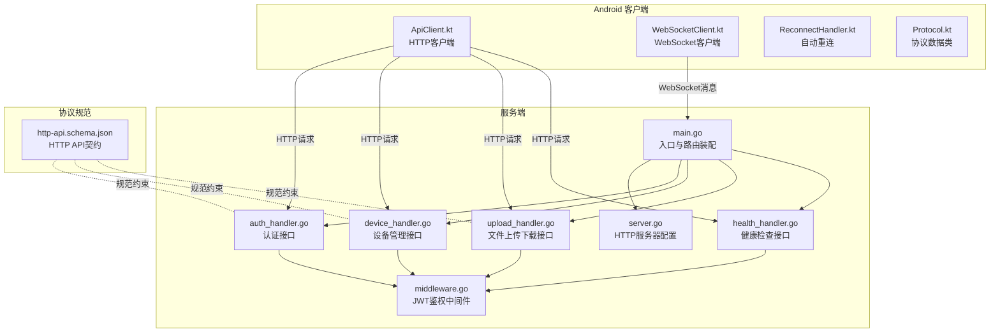
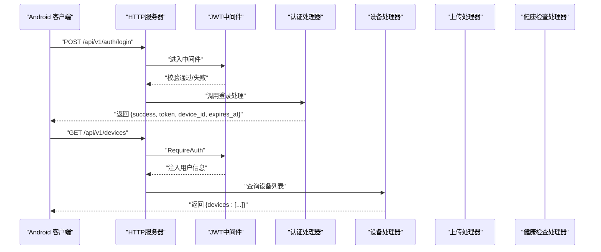
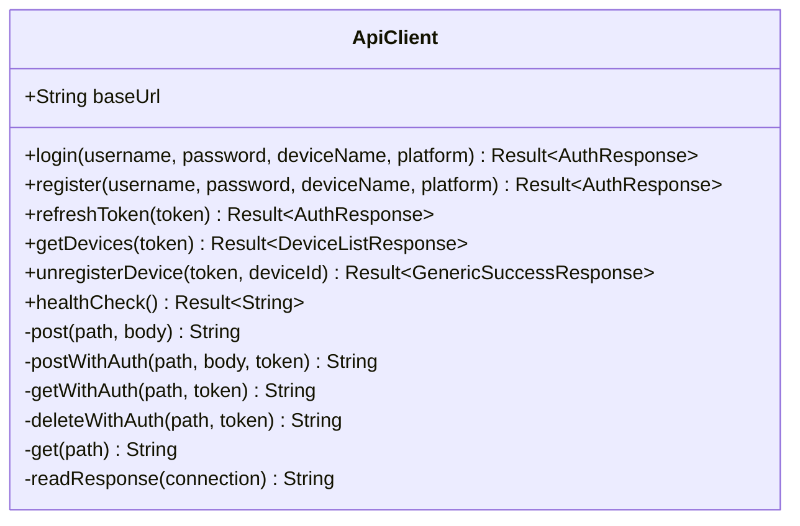
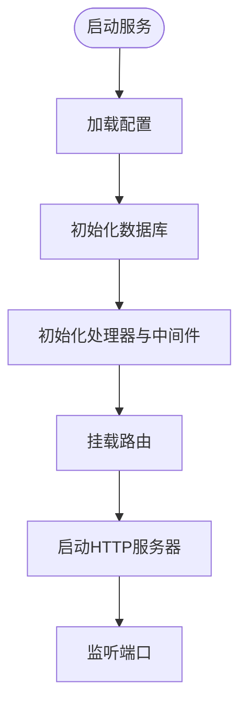
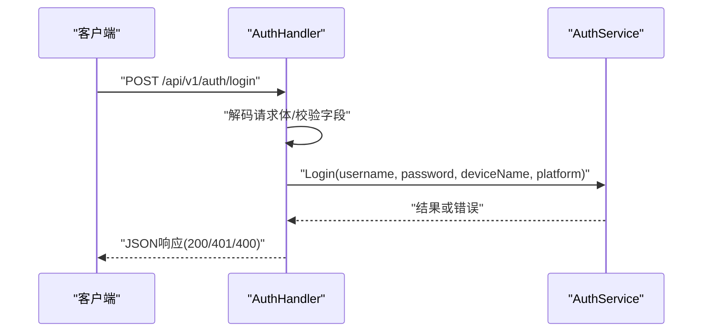
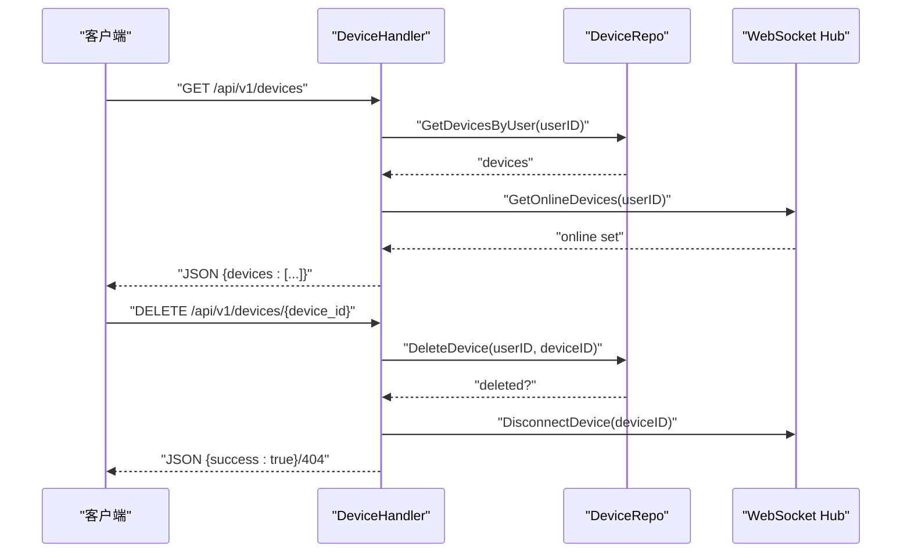
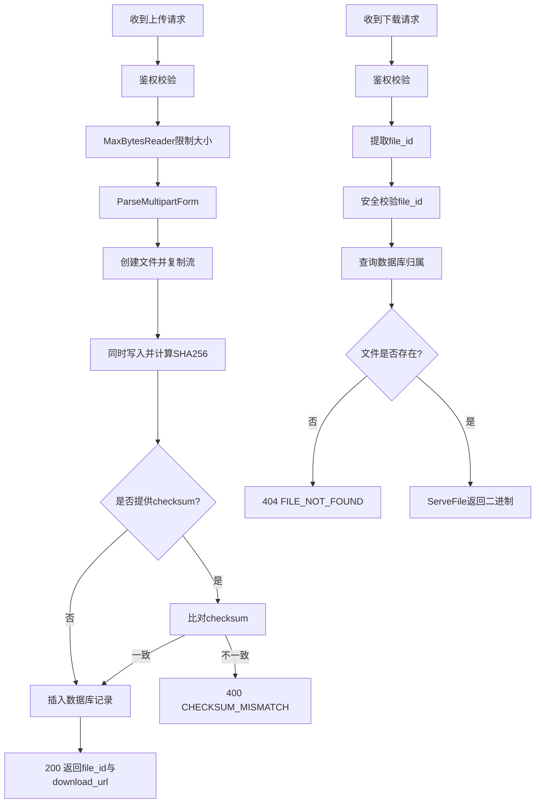
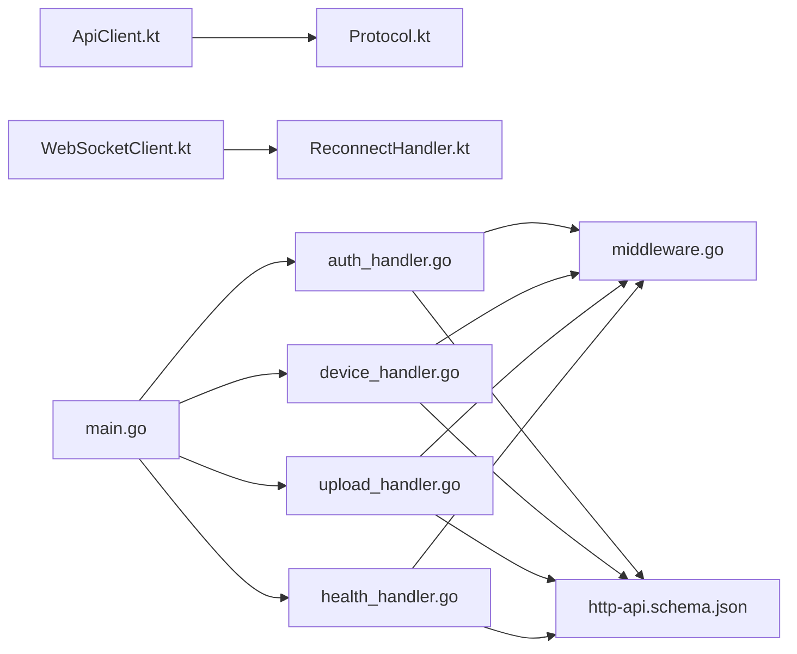

# HTTP API调用

<cite>
**本文引用的文件**
- [ApiClient.kt](file://clipSync-android/app/src/main/java/com/clipsync/app/network/ApiClient.kt)
- [Protocol.kt](file://clipSync-android/app/src/main/java/com/clipsync/app/network/Protocol.kt)
- [WebSocketClient.kt](file://clipSync-android/app/src/main/java/com/clipsync/app/network/WebSocketClient.kt)
- [ReconnectHandler.kt](file://clipSync-android/app/src/main/java/com/clipsync/app/network/ReconnectHandler.kt)
- [server.go](file://clipSync-server/internal/httpserver/server.go)
- [auth_handler.go](file://clipSync-server/internal/httpserver/auth_handler.go)
- [device_handler.go](file://clipSync-server/internal/httpserver/device_handler.go)
- [upload_handler.go](file://clipSync-server/internal/httpserver/upload_handler.go)
- [health_handler.go](file://clipSync-server/internal/httpserver/health_handler.go)
- [main.go](file://clipSync-server/cmd/server/main.go)
- [http-api.schema.json](file://protocol/http-api.schema.json)
- [middleware.go](file://clipSync-server/internal/auth/middleware.go)
- [DEVELOPMENT_PLAN.md](file://DEVELOPMENT_PLAN.md)
</cite>

## 目录
1. [简介](#简介)
2. [项目结构](#项目结构)
3. [核心组件](#核心组件)
4. [架构总览](#架构总览)
5. [详细组件分析](#详细组件分析)
6. [依赖关系分析](#依赖关系分析)
7. [性能考量](#性能考量)
8. [故障排查指南](#故障排查指南)
9. [结论](#结论)
10. [附录](#附录)

## 简介
本文件聚焦于HTTP API调用模块，系统性阐述RESTful API设计原则、请求与响应格式、认证机制、Android端HTTP客户端实现与网络封装策略。文档结合真实代码库中的Android与Go服务端实现，给出用户认证、设备管理、文件上传下载等典型API调用流程，并总结HTTP状态码处理、错误响应解析与请求重试机制。同时，解释服务器端API处理器的路由映射、参数校验与业务逻辑，帮助初学者快速上手，也为有经验的开发者提供足够的技术深度。

## 项目结构
- Android端采用自研HTTP客户端（基于HttpURLConnection），避免引入Retrofit以降低耦合；同时通过OkHttp实现WebSocket连接与自动重连。
- 服务端使用Go语言构建HTTP服务器，按功能拆分为认证、设备管理、文件上传下载、健康检查等处理器，并通过中间件统一鉴权。
- 协议规范由JSON Schema定义，确保跨平台一致性。

图表来源
- [main.go:74-106](file://clipSync-server/cmd/server/main.go#L74-L106)
- [server.go:18-41](file://clipSync-server/internal/httpserver/server.go#L18-L41)
- [auth_handler.go:63-109](file://clipSync-server/internal/httpserver/auth_handler.go#L63-L109)
- [device_handler.go:25-82](file://clipSync-server/internal/httpserver/device_handler.go#L25-L82)
- [upload_handler.go:36-150](file://clipSync-server/internal/httpserver/upload_handler.go#L36-L150)
- [health_handler.go:28-54](file://clipSync-server/internal/httpserver/health_handler.go#L28-L54)
- [ApiClient.kt:14-142](file://clipSync-android/app/src/main/java/com/clipsync/app/network/ApiClient.kt#L14-L142)
- [WebSocketClient.kt:26-156](file://clipSync-android/app/src/main/java/com/clipsync/app/network/WebSocketClient.kt#L26-L156)
- [ReconnectHandler.kt:14-80](file://clipSync-android/app/src/main/java/com/clipsync/app/network/ReconnectHandler.kt#L14-L80)
- [Protocol.kt:12-263](file://clipSync-android/app/src/main/java/com/clipsync/app/network/Protocol.kt#L12-L263)
- [http-api.schema.json:1-293](file://protocol/http-api.schema.json#L1-L293)

章节来源
- [main.go:74-106](file://clipSync-server/cmd/server/main.go#L74-L106)
- [server.go:18-41](file://clipSync-server/internal/httpserver/server.go#L18-L41)
- [ApiClient.kt:14-142](file://clipSync-android/app/src/main/java/com/clipsync/app/network/ApiClient.kt#L14-L142)
- [Protocol.kt:12-263](file://clipSync-android/app/src/main/java/com/clipsync/app/network/Protocol.kt#L12-L263)

## 核心组件
- Android HTTP客户端：提供登录、注册、刷新令牌、设备列表查询、设备注销、健康检查等方法，内部使用HttpURLConnection发送JSON请求并解析响应。
- 服务端HTTP服务器：统一设置读写超时、空闲超时；路由注册认证、设备、上传下载、健康检查等端点。
- 认证中间件：从Authorization头提取Bearer Token，校验JWT有效性并将用户信息注入请求上下文。
- 处理器层：各端点负责参数校验、业务处理与标准JSON响应输出。
- 协议规范：通过JSON Schema定义请求体字段、必填项、枚举值与响应结构，明确错误码与HTTP状态映射。

章节来源
- [ApiClient.kt:23-78](file://clipSync-android/app/src/main/java/com/clipsync/app/network/ApiClient.kt#L23-L78)
- [server.go:27-41](file://clipSync-server/internal/httpserver/server.go#L27-L41)
- [middleware.go:32-61](file://clipSync-server/internal/auth/middleware.go#L32-L61)
- [auth_handler.go:63-109](file://clipSync-server/internal/httpserver/auth_handler.go#L63-L109)
- [http-api.schema.json:8-49](file://protocol/http-api.schema.json#L8-L49)

## 架构总览
下图展示了Android端HTTP调用到服务端的完整链路，包括路由映射、鉴权中间件、处理器与数据库交互。

图表来源
- [main.go:80-98](file://clipSync-server/cmd/server/main.go#L80-L98)
- [middleware.go:32-61](file://clipSync-server/internal/auth/middleware.go#L32-L61)
- [auth_handler.go:63-109](file://clipSync-server/internal/httpserver/auth_handler.go#L63-L109)
- [device_handler.go:25-82](file://clipSync-server/internal/httpserver/device_handler.go#L25-L82)

## 详细组件分析

### Android HTTP客户端（ApiClient）
- 设计原则
  - 使用HttpURLConnection直接发送HTTP请求，避免引入第三方库，便于控制与维护。
  - 统一JSON序列化与反序列化，忽略未知字段，宽松解析。
- 关键能力
  - 登录/注册：构造请求体，POST到对应端点，解析为认证响应对象。
  - 刷新令牌：携带Authorization头，POST刷新端点。
  - 设备管理：GET设备列表，DELETE注销指定设备。
  - 健康检查：GET健康端点，返回字符串。
- 错误处理
  - 统一读取inputStream或errorStream，非2xx状态抛出IO异常，便于上层捕获与重试。
- 请求封装
  - 封装POST/GET/DELETE通用方法，支持带Authorization头与不带头两种场景。

图表来源
- [ApiClient.kt:14-142](file://clipSync-android/app/src/main/java/com/clipsync/app/network/ApiClient.kt#L14-L142)

章节来源
- [ApiClient.kt:14-142](file://clipSync-android/app/src/main/java/com/clipsync/app/network/ApiClient.kt#L14-L142)

### 服务端HTTP服务器与路由
- 服务器配置
  - 设置ReadTimeout、WriteTimeout、IdleTimeout，保证资源释放与稳定性。
- 路由装配
  - 认证端点：登录、注册、刷新令牌。
  - 健康检查：对外暴露运行状态。
  - 设备管理：列出设备、删除设备。
  - 文件上传下载：受鉴权保护。
- 中间件
  - RequireAuth中间件从Authorization头提取Bearer Token，校验后注入用户信息到上下文。

图表来源
- [main.go:21-106](file://clipSync-server/cmd/server/main.go#L21-L106)
- [server.go:27-41](file://clipSync-server/internal/httpserver/server.go#L27-L41)

章节来源
- [main.go:21-106](file://clipSync-server/cmd/server/main.go#L21-L106)
- [server.go:27-41](file://clipSync-server/internal/httpserver/server.go#L27-L41)

### 认证处理器（登录/注册/刷新）
- 登录
  - 方法限制为POST；解码请求体；校验字段完整性；调用认证服务；返回成功或错误码。
- 注册
  - 同样要求POST；用户名长度与密码强度校验；调用注册服务；返回成功或冲突错误。
- 刷新
  - 从Authorization头提取Bearer Token；调用刷新服务；返回新Token与过期时间。

图表来源
- [auth_handler.go:63-109](file://clipSync-server/internal/httpserver/auth_handler.go#L63-L109)
- [auth_handler.go:111-175](file://clipSync-server/internal/httpserver/auth_handler.go#L111-L175)
- [auth_handler.go:177-208](file://clipSync-server/internal/httpserver/auth_handler.go#L177-L208)

章节来源
- [auth_handler.go:63-109](file://clipSync-server/internal/httpserver/auth_handler.go#L63-L109)
- [auth_handler.go:111-175](file://clipSync-server/internal/httpserver/auth_handler.go#L111-L175)
- [auth_handler.go:177-208](file://clipSync-server/internal/httpserver/auth_handler.go#L177-L208)

### 设备管理处理器（列表/删除）
- 列表
  - 鉴权后根据用户ID查询设备；结合WebSocket Hub标记在线状态；返回设备数组。
- 删除
  - 鉴权后解析路径参数device_id；调用仓库删除；若未找到返回404；同时断开当前在线连接。

图表来源
- [device_handler.go:25-82](file://clipSync-server/internal/httpserver/device_handler.go#L25-L82)
- [device_handler.go:84-136](file://clipSync-server/internal/httpserver/device_handler.go#L84-L136)

章节来源
- [device_handler.go:25-82](file://clipSync-server/internal/httpserver/device_handler.go#L25-L82)
- [device_handler.go:84-136](file://clipSync-server/internal/httpserver/device_handler.go#L84-L136)

### 文件上传下载处理器
- 上传
  - 限制请求体大小；解析multipart表单；保存文件并计算SHA256；可选校验客户端提供的checksum；入库记录；返回file_id与download_url。
- 下载
  - 校验鉴权；安全校验file_id；查询数据库确认归属；校验文件存在；返回文件内容。

图表来源
- [upload_handler.go:36-150](file://clipSync-server/internal/httpserver/upload_handler.go#L36-L150)
- [upload_handler.go:152-214](file://clipSync-server/internal/httpserver/upload_handler.go#L152-L214)

章节来源
- [upload_handler.go:36-150](file://clipSync-server/internal/httpserver/upload_handler.go#L36-L150)
- [upload_handler.go:152-214](file://clipSync-server/internal/httpserver/upload_handler.go#L152-L214)

### 健康检查处理器
- 提供版本、运行时长、连接客户端数、数据库状态等信息，便于运维监控。

章节来源
- [health_handler.go:28-54](file://clipSync-server/internal/httpserver/health_handler.go#L28-L54)

### 协议与错误码规范
- JSON Schema定义了每个端点的请求体、响应体、错误码与HTTP状态映射，确保客户端与服务端契约一致。
- 常见错误码与HTTP状态：
  - AUTH_FAILED/TOKEN_EXPIRED → 401
  - INVALID_PAYLOAD → 400
  - CONTENT_TOO_LARGE → 413
  - DEVICE_NOT_FOUND → 404
  - USERNAME_EXISTS → 409
  - INTERNAL_ERROR → 500

章节来源
- [http-api.schema.json:280-292](file://protocol/http-api.schema.json#L280-L292)

## 依赖关系分析
- Android端
  - ApiClient依赖Protocol中的数据类进行序列化/反序列化。
  - WebSocketClient依赖OkHttp与ReconnectHandler实现稳定连接与自动重连。
- 服务端
  - 各处理器依赖中间件进行鉴权；设备处理器依赖WebSocket Hub获取在线状态；上传处理器依赖数据库与文件系统。
- 共同契约
  - http-api.schema.json作为共享协议，约束请求/响应与错误码。

图表来源
- [ApiClient.kt:14-142](file://clipSync-android/app/src/main/java/com/clipsync/app/network/ApiClient.kt#L14-L142)
- [Protocol.kt:12-263](file://clipSync-android/app/src/main/java/com/clipsync/app/network/Protocol.kt#L12-L263)
- [WebSocketClient.kt:26-156](file://clipSync-android/app/src/main/java/com/clipsync/app/network/WebSocketClient.kt#L26-L156)
- [ReconnectHandler.kt:14-80](file://clipSync-android/app/src/main/java/com/clipsync/app/network/ReconnectHandler.kt#L14-L80)
- [auth_handler.go:63-109](file://clipSync-server/internal/httpserver/auth_handler.go#L63-L109)
- [device_handler.go:25-82](file://clipSync-server/internal/httpserver/device_handler.go#L25-L82)
- [upload_handler.go:36-150](file://clipSync-server/internal/httpserver/upload_handler.go#L36-L150)
- [health_handler.go:28-54](file://clipSync-server/internal/httpserver/health_handler.go#L28-L54)
- [main.go:80-98](file://clipSync-server/cmd/server/main.go#L80-L98)
- [http-api.schema.json:1-293](file://protocol/http-api.schema.json#L1-L293)

章节来源
- [main.go:80-98](file://clipSync-server/cmd/server/main.go#L80-L98)
- [auth_handler.go:63-109](file://clipSync-server/internal/httpserver/auth_handler.go#L63-L109)
- [device_handler.go:25-82](file://clipSync-server/internal/httpserver/device_handler.go#L25-L82)
- [upload_handler.go:36-150](file://clipSync-server/internal/httpserver/upload_handler.go#L36-L150)
- [health_handler.go:28-54](file://clipSync-server/internal/httpserver/health_handler.go#L28-L54)

## 性能考量
- 超时设置
  - 服务端HTTP服务器设置了合理的读/写/空闲超时，避免长时间占用连接资源。
- 速率限制
  - 认证端点使用限流中间件，防止暴力破解与滥用。
- 文件上传
  - 通过MaxBytesReader限制请求体大小，避免内存压力；同时在写入磁盘的同时计算哈希，提升吞吐。
- 连接管理
  - WebSocket客户端配置心跳间隔与连接超时，配合指数退避重连策略，提升弱网环境下的可用性。

章节来源
- [server.go:27-41](file://clipSync-server/internal/httpserver/server.go#L27-L41)
- [main.go:77-84](file://clipSync-server/cmd/server/main.go#L77-L84)
- [upload_handler.go:52-61](file://clipSync-server/internal/httpserver/upload_handler.go#L52-L61)
- [WebSocketClient.kt:92-96](file://clipSync-android/app/src/main/java/com/clipsync/app/network/WebSocketClient.kt#L92-L96)
- [ReconnectHandler.kt:14-80](file://clipSync-android/app/src/main/java/com/clipsync/app/network/ReconnectHandler.kt#L14-L80)

## 故障排查指南
- 网络超时
  - 检查服务端超时配置与客户端连接/读取超时设置；必要时延长超时或优化后端处理逻辑。
- 服务器错误（5xx）
  - 查看服务端日志定位具体处理器；确认数据库连接、文件存储路径权限与容量。
- 认证失败（401）
  - 确认Authorization头格式为Bearer Token；检查JWT签名与过期时间；核对中间件是否正确注入用户信息。
- 参数错误（400）
  - 对照JSON Schema校验请求体字段类型、长度与枚举值；服务端已做基础校验与错误返回。
- 内容过大（413）
  - 上传前检查文件大小；服务端已限制最大请求体大小。
- 设备不存在（404）
  - 确认设备ID正确且属于当前用户；删除后应断开在线连接。
- 自动重连
  - Android端使用指数退避策略，观察连接状态变化；必要时调整退避上限与重试次数。

章节来源
- [server.go:27-41](file://clipSync-server/internal/httpserver/server.go#L27-L41)
- [auth_handler.go:79-84](file://clipSync-server/internal/httpserver/auth_handler.go#L79-L84)
- [upload_handler.go:55-60](file://clipSync-server/internal/httpserver/upload_handler.go#L55-L60)
- [device_handler.go:108-113](file://clipSync-server/internal/httpserver/device_handler.go#L108-L113)
- [ReconnectHandler.kt:37-53](file://clipSync-android/app/src/main/java/com/clipsync/app/network/ReconnectHandler.kt#L37-L53)

## 结论
该HTTP API调用模块以清晰的RESTful设计与严格的协议约束为基础，Android端采用轻量HTTP客户端与稳健的WebSocket实现，服务端通过中间件与处理器分层保障安全性与可维护性。结合速率限制、超时配置与错误码规范，整体具备良好的扩展性与鲁棒性。建议在后续迭代中逐步引入Retrofit以简化网络层抽象，并完善端到端测试与监控体系。

## 附录
- 开发与集成里程碑参考：协议兼容、认证流程、WebSocket连接、剪贴板同步、全功能集成与生产就绪测试。
- Mock策略：服务端提供模拟服务器，客户端可替换为Mock实现，确保并行开发零阻塞。

章节来源
- [DEVELOPMENT_PLAN.md:716-797](file://DEVELOPMENT_PLAN.md#L716-L797)