# WebSocket通信

<cite>
**本文引用的文件**
- [WebSocketClient.kt](file://clipSync-android/app/src/main/java/com/clipsync/app/network/WebSocketClient.kt)
- [ReconnectHandler.kt](file://clipSync-android/app/src/main/java/com/clipsync/app/network/ReconnectHandler.kt)
- [Protocol.kt](file://clipSync-android/app/src/main/java/com/clipsync/app/network/Protocol.kt)
- [ClipboardService.kt](file://clipSync-android/app/src/main/java/com/clipsync/app/service/ClipboardService.kt)
- [SettingsManager.kt](file://clipSync-android/app/src/main/java/com/clipsync/app/core/SettingsManager.kt)
- [WebSocketClient.cs](file://clipSync-windows/ClipSync.WPF/Network/WebSocketClient.cs)
- [ReconnectHandler.cs](file://clipSync-windows/ClipSync.WPF/Network/ReconnectHandler.cs)
- [Protocol.cs](file://clipSync-windows/ClipSync.WPF/Network/Protocol.cs)
- [SettingsManager.cs](file://clipSync-windows/ClipSync.WPF/Core/SettingsManager.cs)
- [client.go](file://clipSync-server/internal/websocket/client.go)
- [hub.go](file://clipSync-server/internal/websocket/hub.go)
- [protocol.go](file://clipSync-server/internal/websocket/protocol.go)
- [messages.go](file://clipSync-server/pkg/protocol/messages.go)
- [main.go](file://clipSync-server/cmd/server/main.go)
</cite>

## 目录
1. [简介](#简介)
2. [项目结构](#项目结构)
3. [核心组件](#核心组件)
4. [架构总览](#架构总览)
5. [详细组件分析](#详细组件分析)
6. [依赖关系分析](#依赖关系分析)
7. [性能考量](#性能考量)
8. [故障排查指南](#故障排查指南)
9. [结论](#结论)
10. [附录](#附录)

## 简介
本文件针对跨平台（Android 与 Windows）的 WebSocket 通信模块进行系统性说明，覆盖连接建立、消息收发、连接状态管理、断线重连、错误处理与资源清理等主题。文档同时解释服务端 WebSocket Hub 的交互模式（认证、心跳、广播），并提供来自实际代码库的关键流程示例路径，帮助初学者快速上手，同时为有经验的开发者提供足够的技术深度。

## 项目结构
该仓库采用按平台分层的组织方式：Android 客户端位于 clipSync-android，Windows 客户端位于 clipSync-windows，服务端位于 clipSync-server。WebSocket 通信涉及三部分：
- 客户端：Android 使用 OkHttp 的 WebSocket 实现；Windows 使用 .NET System.Net.WebSockets
- 协议：两端均遵循统一的消息协议模型（类型、版本、时间戳、设备标识、负载）
- 服务端：基于 Gorilla WebSocket 的 Hub，负责升级 HTTP 连接、维护客户端集合、广播消息与心跳

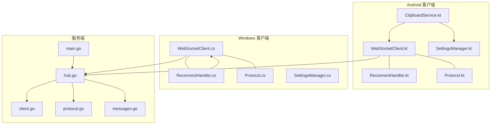

图表来源
- [WebSocketClient.kt:26-145](file://clipSync-android/app/src/main/java/com/clipsync/app/network/WebSocketClient.kt#L26-L145)
- [ReconnectHandler.kt:14-79](file://clipSync-android/app/src/main/java/com/clipsync/app/network/ReconnectHandler.kt#L14-L79)
- [Protocol.kt:20-34](file://clipSync-android/app/src/main/java/com/clipsync/app/network/Protocol.kt#L20-L34)
- [SettingsManager.kt:21-170](file://clipSync-android/app/src/main/java/com/clipsync/app/core/SettingsManager.kt#L21-L170)
- [ClipboardService.kt:39-249](file://clipSync-android/app/src/main/java/com/clipsync/app/service/ClipboardService.kt#L39-L249)
- [WebSocketClient.cs:10-146](file://clipSync-windows/ClipSync.WPF/Network/WebSocketClient.cs#L10-L146)
- [ReconnectHandler.cs:8-97](file://clipSync-windows/ClipSync.WPF/Network/ReconnectHandler.cs#L8-L97)
- [Protocol.cs:6-167](file://clipSync-windows/ClipSync.WPF/Network/Protocol.cs#L6-L167)
- [SettingsManager.cs:44-102](file://clipSync-windows/ClipSync.WPF/Core/SettingsManager.cs#L44-L102)
- [hub.go:18-230](file://clipSync-server/internal/websocket/hub.go#L18-L230)
- [client.go:13-150](file://clipSync-server/internal/websocket/client.go#L13-L150)
- [protocol.go:9-27](file://clipSync-server/internal/websocket/protocol.go#L9-L27)
- [messages.go:5-132](file://clipSync-server/pkg/protocol/messages.go#L5-L132)
- [main.go:67-125](file://clipSync-server/cmd/server/main.go#L67-L125)

章节来源
- [main.go:110-125](file://clipSync-server/cmd/server/main.go#L110-L125)

## 核心组件
- Android 客户端
  - WebSocketClient：封装 OkHttp WebSocket，提供连接、发送、关闭、状态流与消息共享流
  - ReconnectHandler：指数退避自动重连，跟踪连接状态与失败次数
  - Protocol：消息编解码（Kotlinx Serialization），定义消息类型与负载结构
  - ClipboardService：前台服务，整合剪贴板监控、同步引擎与 WebSocket 生命周期
  - SettingsManager：持久化存储服务器地址、令牌、设备信息等
- Windows 客户端
  - WebSocketClient：封装 ClientWebSocket，提供连接、发送、接收循环、关闭与事件
  - ReconnectHandler：指数退避重连，带认证后才开始计数
  - Protocol：消息编解码（Newtonsoft.Json），构建认证、心跳、推送等消息
  - SettingsManager：本地 JSON 配置文件读写
- 服务端
  - Hub：管理所有客户端连接，注册/注销、广播、统计在线设备
  - Client：单个连接的读写泵、心跳与超时处理、错误消息发送
  - 协议：统一的 WSMessage 结构与消息类型常量

章节来源
- [WebSocketClient.kt:26-145](file://clipSync-android/app/src/main/java/com/clipsync/app/network/WebSocketClient.kt#L26-L145)
- [ReconnectHandler.kt:14-79](file://clipSync-android/app/src/main/java/com/clipsync/app/network/ReconnectHandler.kt#L14-L79)
- [Protocol.kt:20-34](file://clipSync-android/app/src/main/java/com/clipsync/app/network/Protocol.kt#L20-L34)
- [ClipboardService.kt:39-249](file://clipSync-android/app/src/main/java/com/clipsync/app/service/ClipboardService.kt#L39-L249)
- [SettingsManager.kt:21-170](file://clipSync-android/app/src/main/java/com/clipsync/app/core/SettingsManager.kt#L21-L170)
- [WebSocketClient.cs:10-146](file://clipSync-windows/ClipSync.WPF/Network/WebSocketClient.cs#L10-L146)
- [ReconnectHandler.cs:8-97](file://clipSync-windows/ClipSync.WPF/Network/ReconnectHandler.cs#L8-L97)
- [Protocol.cs:6-167](file://clipSync-windows/ClipSync.WPF/Network/Protocol.cs#L6-L167)
- [SettingsManager.cs:44-102](file://clipSync-windows/ClipSync.WPF/Core/SettingsManager.cs#L44-L102)
- [hub.go:18-230](file://clipSync-server/internal/websocket/hub.go#L18-L230)
- [client.go:13-150](file://clipSync-server/internal/websocket/client.go#L13-L150)
- [messages.go:5-132](file://clipSync-server/pkg/protocol/messages.go#L5-L132)

## 架构总览
下图展示了从客户端到服务端的典型交互：客户端发起连接，服务端升级为 WebSocket，双方通过心跳维持连接，随后进行认证与业务消息交换（剪贴板同步、历史拉取、设备列表等），服务端通过 Hub 对用户内的其他设备进行广播。

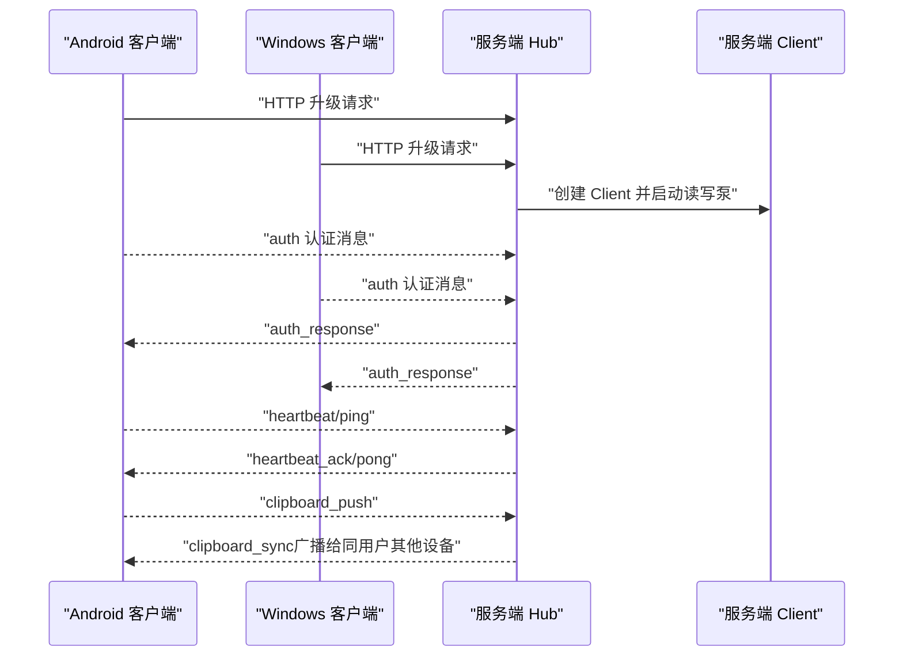

图表来源
- [client.go:33-117](file://clipSync-server/internal/websocket/client.go#L33-L117)
- [hub.go:114-121](file://clipSync-server/internal/websocket/hub.go#L114-L121)
- [Protocol.kt:210-262](file://clipSync-android/app/src/main/java/com/clipsync/app/network/Protocol.kt#L210-L262)
- [Protocol.cs:79-164](file://clipSync-windows/ClipSync.WPF/Network/Protocol.cs#L79-L164)

## 详细组件分析

### Android 客户端：WebSocketClient
- 连接建立
  - 使用 OkHttp 构建 OkHttpClient，设置 ping 间隔与连接超时，创建 WebSocket 请求并建立连接
  - 连接成功后更新状态为已连接，并通知重连处理器
- 消息收发
  - 接收文本或二进制消息，统一转为字符串并通过 SharedFlow 发出
  - 发送支持字符串与协议消息对象（先序列化为 JSON）
- 连接状态管理
  - 使用 ConnectionState 密封类表示 Connected/Connecting/Disconnected/Error
  - 通过 StateFlow 对外暴露当前状态
- 断线与重连
  - 失败或关闭时更新状态并触发重连处理器
  - ReconnectHandler 提供指数退避重连逻辑

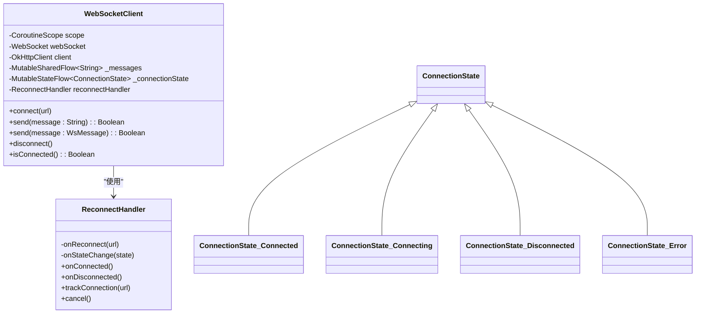

图表来源
- [WebSocketClient.kt:26-145](file://clipSync-android/app/src/main/java/com/clipsync/app/network/WebSocketClient.kt#L26-L145)
- [ReconnectHandler.kt:14-79](file://clipSync-android/app/src/main/java/com/clipsync/app/network/ReconnectHandler.kt#L14-L79)

章节来源
- [WebSocketClient.kt:83-103](file://clipSync-android/app/src/main/java/com/clipsync/app/network/WebSocketClient.kt#L83-L103)
- [WebSocketClient.kt:108-122](file://clipSync-android/app/src/main/java/com/clipsync/app/network/WebSocketClient.kt#L108-L122)
- [WebSocketClient.kt:127-134](file://clipSync-android/app/src/main/java/com/clipsync/app/network/WebSocketClient.kt#L127-L134)
- [WebSocketClient.kt:150-155](file://clipSync-android/app/src/main/java/com/clipsync/app/network/WebSocketClient.kt#L150-L155)

### Android 客户端：消息序列化与协议
- 使用 Kotlinx Serialization 将消息对象编码为 JSON 字符串
- 定义消息类型枚举与各消息负载的数据类
- 提供便捷的消息构造器（WsMessageBuilder）

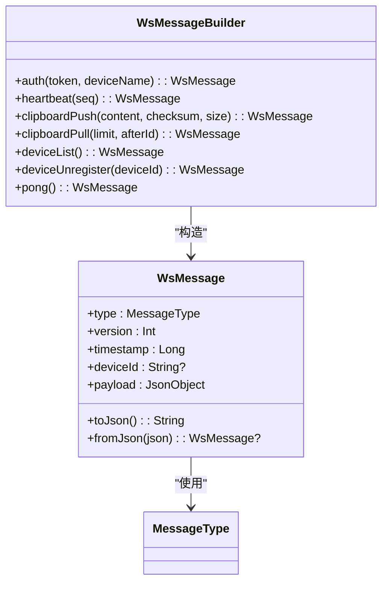

图表来源
- [Protocol.kt:20-34](file://clipSync-android/app/src/main/java/com/clipsync/app/network/Protocol.kt#L20-L34)
- [Protocol.kt:210-262](file://clipSync-android/app/src/main/java/com/clipsync/app/network/Protocol.kt#L210-L262)

章节来源
- [Protocol.kt:12-16](file://clipSync-android/app/src/main/java/com/clipsync/app/network/Protocol.kt#L12-L16)
- [Protocol.kt:20-34](file://clipSync-android/app/src/main/java/com/clipsync/app/network/Protocol.kt#L20-L34)
- [Protocol.kt:210-262](file://clipSync-android/app/src/main/java/com/clipsync/app/network/Protocol.kt#L210-L262)

### Android 客户端：前台服务与生命周期
- ClipboardService 在前台运行，初始化设置、数据库、剪贴板监控、同步引擎与 WebSocket
- 订阅 WebSocket 消息流，根据消息类型分派处理（认证响应、心跳确认、剪贴板同步、设备列表、错误、Ping 应答）
- 连接生命周期：启动时连接服务器，销毁时停止监控、取消心跳、断开 WebSocket

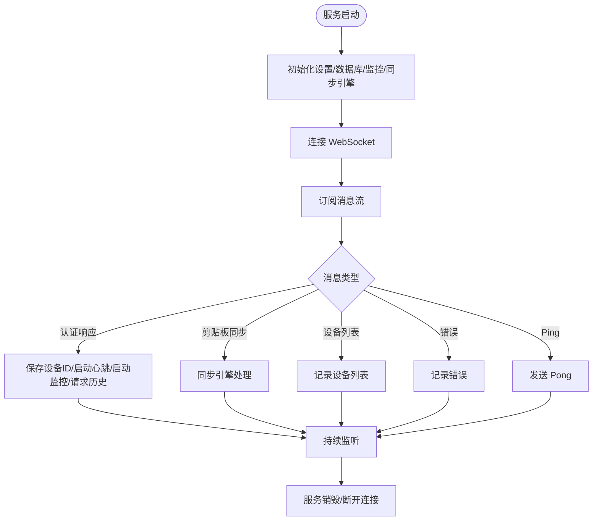

图表来源
- [ClipboardService.kt:52-99](file://clipSync-android/app/src/main/java/com/clipsync/app/service/ClipboardService.kt#L52-L99)
- [ClipboardService.kt:146-219](file://clipSync-android/app/src/main/java/com/clipsync/app/service/ClipboardService.kt#L146-L219)

章节来源
- [ClipboardService.kt:52-99](file://clipSync-android/app/src/main/java/com/clipsync/app/service/ClipboardService.kt#L52-L99)
- [ClipboardService.kt:146-219](file://clipSync-android/app/src/main/java/com/clipsync/app/service/ClipboardService.kt#L146-L219)

### Android 客户端：断线重连策略
- ReconnectHandler 采用指数退避（初始 1s，最大 60s），在连接成功时重置计数
- WebSocketClient 的监听器在 onClosed/onFailure 中触发重连

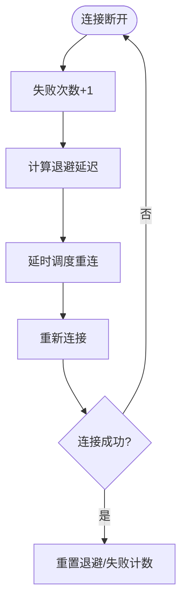

图表来源
- [ReconnectHandler.kt:27-53](file://clipSync-android/app/src/main/java/com/clipsync/app/network/ReconnectHandler.kt#L27-L53)
- [WebSocketClient.kt:67-77](file://clipSync-android/app/src/main/java/com/clipsync/app/network/WebSocketClient.kt#L67-L77)

章节来源
- [ReconnectHandler.kt:14-79](file://clipSync-android/app/src/main/java/com/clipsync/app/network/ReconnectHandler.kt#L14-L79)
- [WebSocketClient.kt:39-44](file://clipSync-android/app/src/main/java/com/clipsync/app/network/WebSocketClient.kt#L39-L44)
- [WebSocketClient.kt:67-77](file://clipSync-android/app/src/main/java/com/clipsync/app/network/WebSocketClient.kt#L67-L77)

### Windows 客户端：WebSocketClient
- 使用 System.Net.WebSockets.ClientWebSocket
- 连接成功后启动独立接收循环，限制单条消息最大大小，防止内存膨胀
- 发送采用 UTF-8 编码文本帧
- 提供连接状态变更事件与消息到达事件

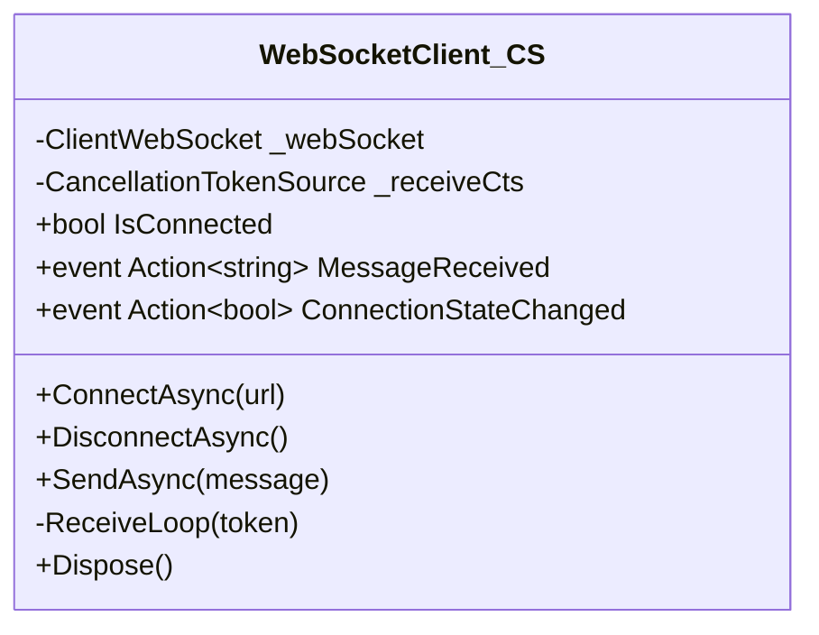

图表来源
- [WebSocketClient.cs:10-146](file://clipSync-windows/ClipSync.WPF/Network/WebSocketClient.cs#L10-L146)

章节来源
- [WebSocketClient.cs:22-39](file://clipSync-windows/ClipSync.WPF/Network/WebSocketClient.cs#L22-L39)
- [WebSocketClient.cs:64-81](file://clipSync-windows/ClipSync.WPF/Network/WebSocketClient.cs#L64-L81)
- [WebSocketClient.cs:83-136](file://clipSync-windows/ClipSync.WPF/Network/WebSocketClient.cs#L83-L136)

### Windows 客户端：断线重连与认证
- ReconnectHandler 在认证成功后才开始计数与重连
- 重连时自动补全 ws/wss 前缀并发送认证消息

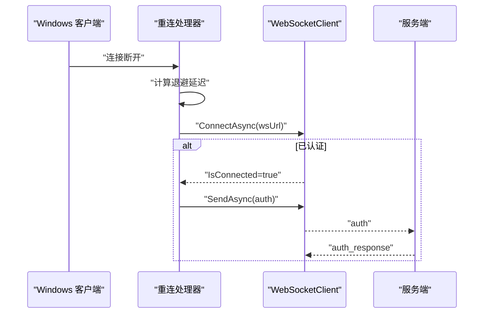

图表来源
- [ReconnectHandler.cs:33-71](file://clipSync-windows/ClipSync.WPF/Network/ReconnectHandler.cs#L33-L71)
- [Protocol.cs:79-88](file://clipSync-windows/ClipSync.WPF/Network/Protocol.cs#L79-L88)

章节来源
- [ReconnectHandler.cs:27-71](file://clipSync-windows/ClipSync.WPF/Network/ReconnectHandler.cs#L27-L71)
- [Protocol.cs:79-88](file://clipSync-windows/ClipSync.WPF/Network/Protocol.cs#L79-L88)

### 服务端：Hub 与 Client
- Hub 负责注册/注销客户端、统计在线设备、广播消息（可排除特定客户端、仅限指定用户）
- Client 维护读写泵，设置读超时与心跳，解析消息并分派处理
- 服务端协议定义统一的消息结构与类型常量

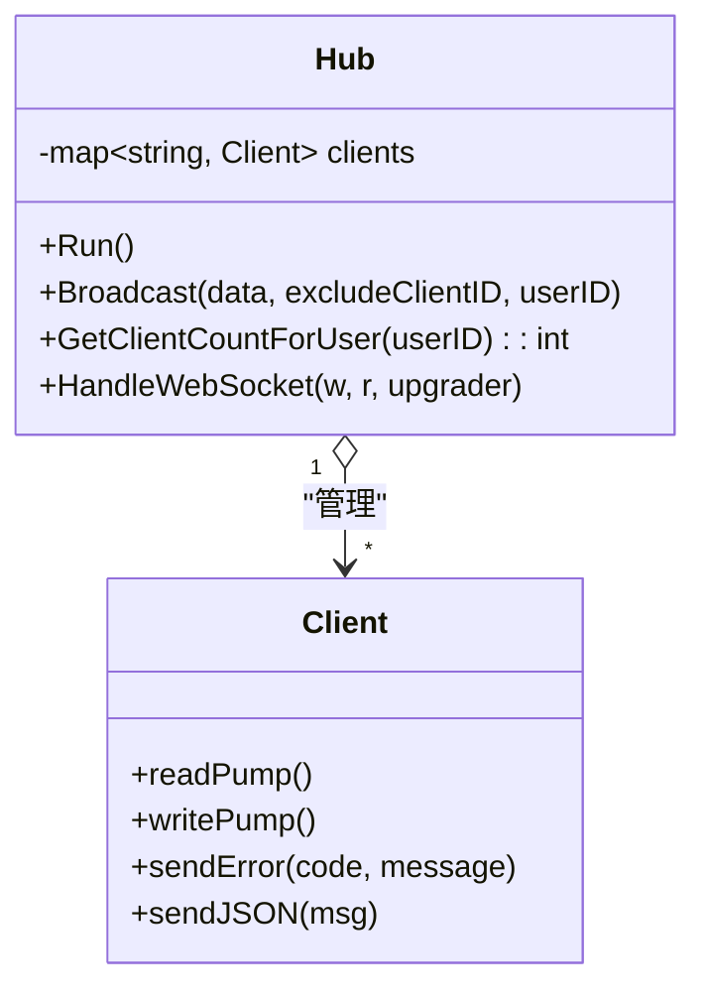

图表来源
- [hub.go:18-121](file://clipSync-server/internal/websocket/hub.go#L18-L121)
- [client.go:33-117](file://clipSync-server/internal/websocket/client.go#L33-L117)

章节来源
- [hub.go:61-121](file://clipSync-server/internal/websocket/hub.go#L61-L121)
- [client.go:33-117](file://clipSync-server/internal/websocket/client.go#L33-L117)
- [messages.go:5-132](file://clipSync-server/pkg/protocol/messages.go#L5-L132)

### 服务端：HTTP 到 WebSocket 升级
- 服务端在独立端口上提供 /ws 路由，使用 Upgrader 将 HTTP 连接升级为 WebSocket
- 启动 Hub 循环并在 goroutine 中处理新连接

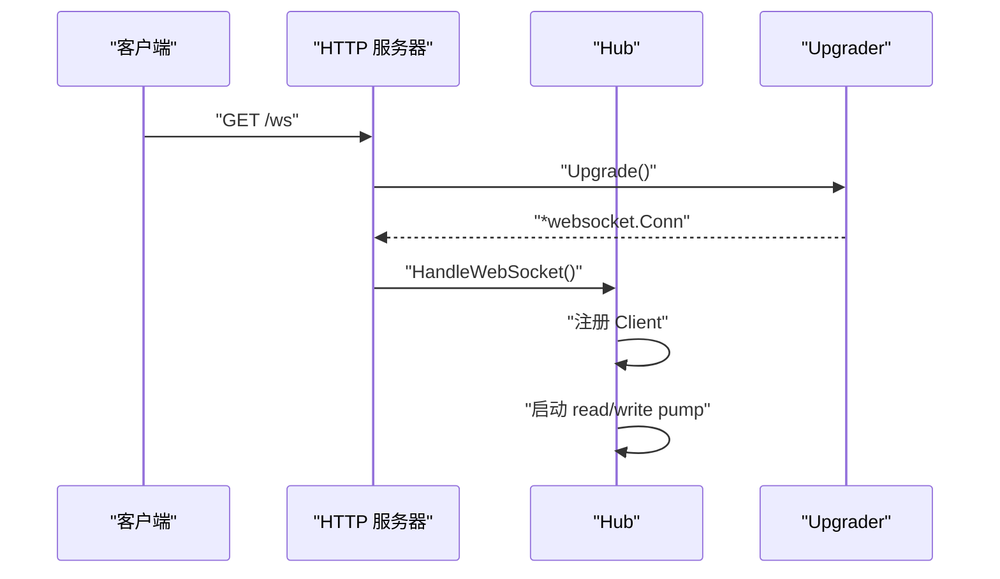

图表来源
- [protocol.go:20-27](file://clipSync-server/internal/websocket/protocol.go#L20-L27)
- [main.go:109-125](file://clipSync-server/cmd/server/main.go#L109-L125)

章节来源
- [protocol.go:9-27](file://clipSync-server/internal/websocket/protocol.go#L9-L27)
- [main.go:109-125](file://clipSync-server/cmd/server/main.go#L109-L125)

## 依赖关系分析
- 客户端依赖
  - Android：OkHttp、Kotlinx Serialization、协程 Flow
  - Windows：System.Net.WebSockets、Newtonsoft.Json
- 服务端依赖
  - Gorilla WebSocket、自定义协议包、数据库与认证中间件
- 共同协议
  - WSMessage 类型、消息类型常量、负载结构

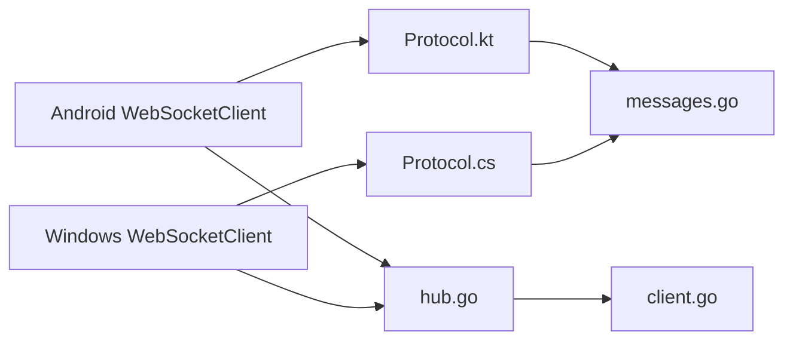

图表来源
- [Protocol.kt:20-34](file://clipSync-android/app/src/main/java/com/clipsync/app/network/Protocol.kt#L20-L34)
- [Protocol.cs:6-36](file://clipSync-windows/ClipSync.WPF/Network/Protocol.cs#L6-L36)
- [messages.go:5-132](file://clipSync-server/pkg/protocol/messages.go#L5-L132)
- [hub.go:18-58](file://clipSync-server/internal/websocket/hub.go#L18-L58)
- [client.go:13-31](file://clipSync-server/internal/websocket/client.go#L13-L31)

章节来源
- [Protocol.kt:20-34](file://clipSync-android/app/src/main/java/com/clipsync/app/network/Protocol.kt#L20-L34)
- [Protocol.cs:6-36](file://clipSync-windows/ClipSync.WPF/Network/Protocol.cs#L6-L36)
- [messages.go:5-132](file://clipSync-server/pkg/protocol/messages.go#L5-L132)
- [hub.go:18-58](file://clipSync-server/internal/websocket/hub.go#L18-L58)
- [client.go:13-31](file://clipSync-server/internal/websocket/client.go#L13-L31)

## 性能考量
- 心跳与保活
  - Android：设置 ping 间隔，避免读超时
  - 服务端：定时 Ping，客户端续期读截止时间
- 消息缓冲与背压
  - 服务端 Hub 对广播队列进行非阻塞发送，若客户端发送缓冲满则标记断开
  - Android 客户端使用 SharedFlow 缓冲容量，避免阻塞
- 大消息防护
  - 服务端与 Windows 客户端均限制单条消息大小，防止内存占用过高
- 序列化开销
  - Android 使用 Kotlinx Serialization，Windows 使用 Newtonsoft.Json，二者均为成熟的高性能库

章节来源
- [WebSocketClient.kt:92-96](file://clipSync-android/app/src/main/java/com/clipsync/app/network/WebSocketClient.kt#L92-L96)
- [client.go:40-45](file://clipSync-server/internal/websocket/client.go#L40-L45)
- [client.go:106-115](file://clipSync-server/internal/websocket/client.go#L106-L115)
- [WebSocketClient.cs:15-15](file://clipSync-windows/ClipSync.WPF/Network/WebSocketClient.cs#L15-L15)
- [WebSocketClient.cs:110-117](file://clipSync-windows/ClipSync.WPF/Network/WebSocketClient.cs#L110-L117)

## 故障排查指南
- 连接超时
  - Android：检查连接超时与读超时配置，确保网络可达
  - Windows：确认连接 URI 正确（ws/wss），捕获异常并重试
- 断开重连
  - Android：查看 ReconnectHandler 的退避日志与状态变化
  - Windows：确认认证后再开始重连，避免未认证连接
- 消息丢失
  - 服务端广播时非阻塞发送，若客户端缓冲满可能丢弃；建议增加缓冲或降低发送频率
  - 客户端 SharedFlow 有缓冲容量，注意上游发送速率
- 认证失败
  - 服务端会在未认证超时后主动断开；客户端需在连接成功后尽快发送认证消息
- 错误处理
  - 服务端收到无效负载会返回 error 消息；客户端应记录并上报
  - Windows 客户端在接收循环中捕获异常并触发连接状态变更

章节来源
- [WebSocketClient.kt:92-96](file://clipSync-android/app/src/main/java/com/clipsync/app/network/WebSocketClient.kt#L92-L96)
- [ReconnectHandler.kt:27-53](file://clipSync-android/app/src/main/java/com/clipsync/app/network/ReconnectHandler.kt#L27-L53)
- [ReconnectHandler.cs:27-71](file://clipSync-windows/ClipSync.WPF/Network/ReconnectHandler.cs#L27-L71)
- [client.go:197-204](file://clipSync-server/internal/websocket/client.go#L197-L204)
- [client.go:120-135](file://clipSync-server/internal/websocket/client.go#L120-L135)
- [WebSocketClient.cs:124-135](file://clipSync-windows/ClipSync.WPF/Network/WebSocketClient.cs#L124-L135)

## 结论
本项目在 Android 与 Windows 平台分别采用成熟稳定的 WebSocket 实现，配合统一的协议模型与服务端 Hub，实现了可靠的实时通信与跨设备剪贴板同步。通过指数退避重连、心跳保活、大消息防护与错误反馈机制，系统在复杂网络环境下具备良好的鲁棒性。建议在生产环境中进一步强化安全（如启用 TLS、严格 Origin 校验）与可观测性（埋点与日志分级）。

## 附录
- 关键流程示例路径（不直接展示代码内容）
  - Android 连接建立：[WebSocketClient.kt:83-103](file://clipSync-android/app/src/main/java/com/clipsync/app/network/WebSocketClient.kt#L83-L103)
  - Android 发送协议消息：[WebSocketClient.kt:120-122](file://clipSync-android/app/src/main/java/com/clipsync/app/network/WebSocketClient.kt#L120-L122)
  - Android 消息处理分派：[ClipboardService.kt:154-167](file://clipSync-android/app/src/main/java/com/clipsync/app/service/ClipboardService.kt#L154-L167)
  - Windows 连接与接收循环：[WebSocketClient.cs:22-39](file://clipSync-windows/ClipSync.WPF/Network/WebSocketClient.cs#L22-L39), [WebSocketClient.cs:83-136](file://clipSync-windows/ClipSync.WPF/Network/WebSocketClient.cs#L83-L136)
  - Windows 重连与认证：[ReconnectHandler.cs:33-71](file://clipSync-windows/ClipSync.WPF/Network/ReconnectHandler.cs#L33-L71)
  - 服务端升级与 Hub 运行：[protocol.go:20-27](file://clipSync-server/internal/websocket/protocol.go#L20-L27), [main.go:109-125](file://clipSync-server/cmd/server/main.go#L109-L125)
  - 服务端广播与错误消息：[hub.go:114-121](file://clipSync-server/internal/websocket/hub.go#L114-L121), [client.go:120-135](file://clipSync-server/internal/websocket/client.go#L120-L135)