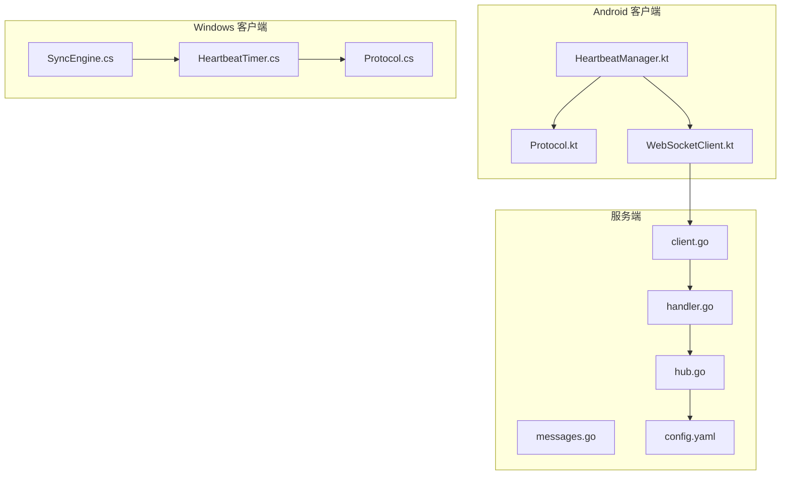
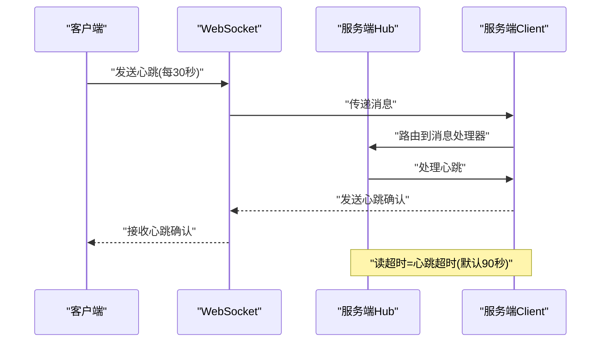
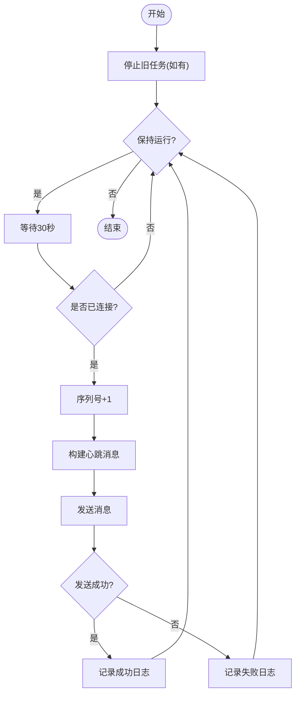
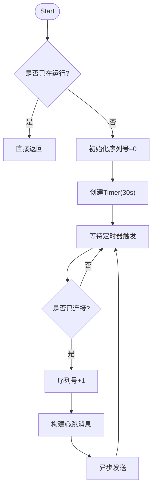
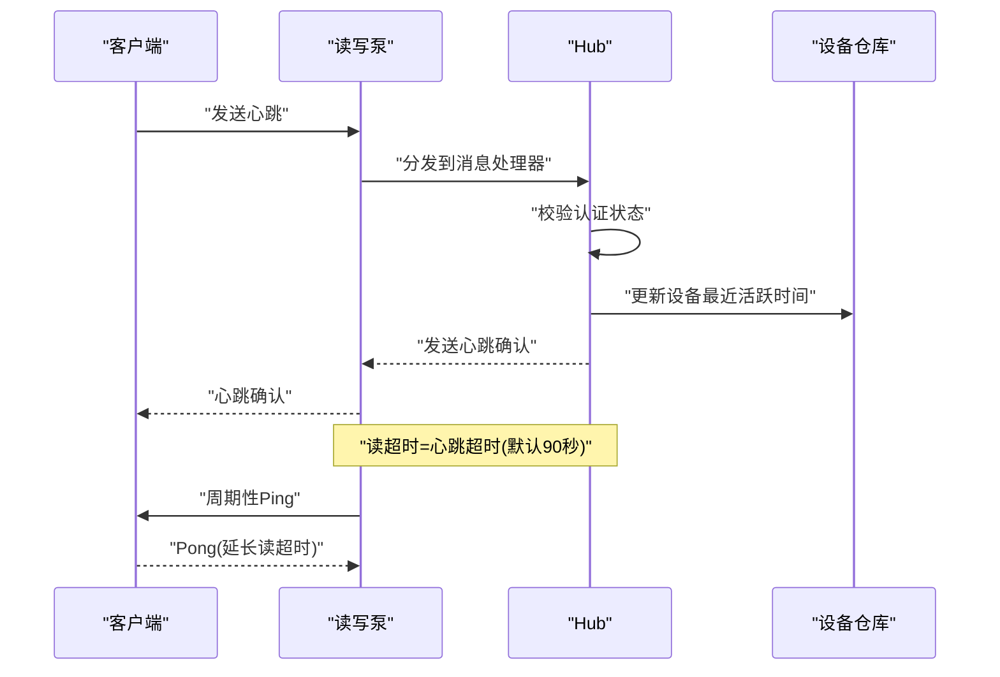
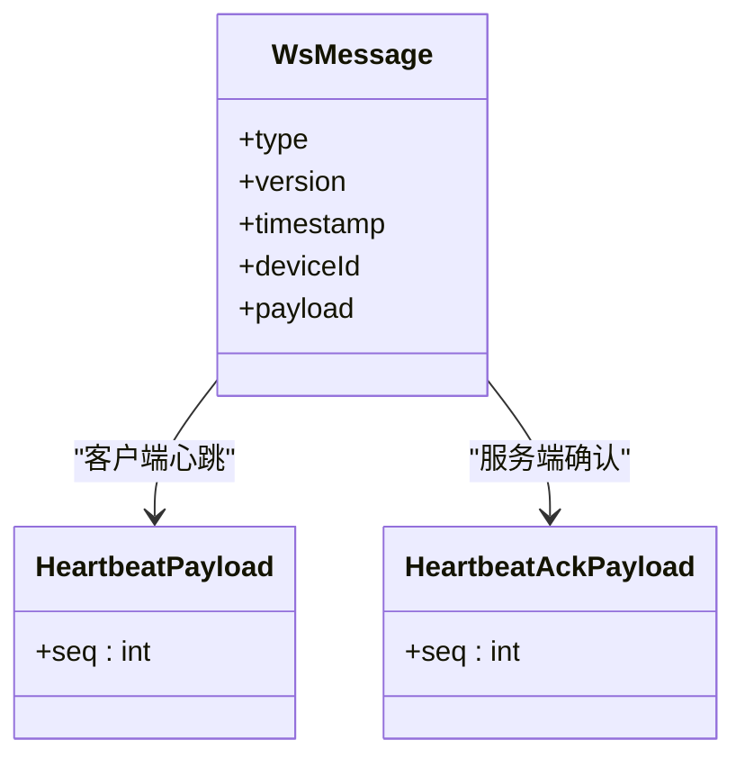
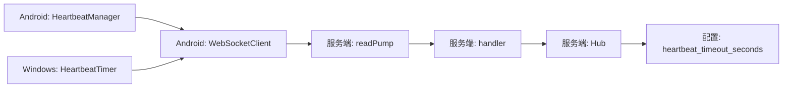

# 心跳检测

<cite>
**本文引用的文件**
- [clipSync-android/HeartbeatManager.kt](file://clipSync-android/app/src/main/java/com/clipsync/app/network/HeartbeatManager.kt)
- [clipSync-android/Protocol.kt](file://clipSync-android/app/src/main/java/com/clipsync/app/network/Protocol.kt)
- [clipSync-android/WebSocketClient.kt](file://clipSync-android/app/src/main/java/com/clipsync/app/network/WebSocketClient.kt)
- [clipSync-android/SyncEngine.kt](file://clipSync-android/app/src/main/java/com/clipsync/app/core/SyncEngine.kt)
- [clipSync-windows/HeartbeatTimer.cs](file://clipSync-windows/ClipSync.WPF/Network/HeartbeatTimer.cs)
- [clipSync-windows/Protocol.cs](file://clipSync-windows/ClipSync.WPF/Network/Protocol.cs)
- [clipSync-windows/SyncEngine.cs](file://clipSync-windows/ClipSync.WPF/Core/SyncEngine.cs)
- [clipSync-server/internal/websocket/client.go](file://clipSync-server/internal/websocket/client.go)
- [clipSync-server/internal/websocket/handler.go](file://clipSync-server/internal/websocket/handler.go)
- [clipSync-server/internal/websocket/hub.go](file://clipSync-server/internal/websocket/hub.go)
- [clipSync-server/pkg/protocol/messages.go](file://clipSync-server/pkg/protocol/messages.go)
- [clipSync-server/configs/config.yaml](file://clipSync-server/configs/config.yaml)
- [DEVELOPMENT_PLAN.md](file://DEVELOPMENT_PLAN.md)
</cite>

## 目录
1. [简介](#简介)
2. [项目结构](#项目结构)
3. [核心组件](#核心组件)
4. [架构总览](#架构总览)
5. [详细组件分析](#详细组件分析)
6. [依赖关系分析](#依赖关系分析)
7. [性能考量](#性能考量)
8. [故障排查指南](#故障排查指南)
9. [结论](#结论)
10. [附录](#附录)

## 简介
本章节面向“心跳检测”模块，系统性阐述心跳机制的设计原理、定时器实现与保活策略，以及心跳包格式、发送频率、超时判断逻辑。文档结合 Android（Kotlin）与 Windows（C#）两端客户端与 Go 服务端的实际代码，给出心跳定时器的启动/停止流程、心跳包的构造与解析、连接健康状态评估方法，并覆盖异常处理、服务器端心跳监听与客户端响应机制。最后总结心跳在防止连接空闲、及时发现网络问题、维护长连接有效性方面的作用，并提供常见问题（心跳超时、心跳风暴、时钟偏差）的解决方案。

## 项目结构
心跳检测涉及三端：Android 客户端、Windows 客户端与服务端。Android 使用协程定时器发送心跳；Windows 使用 .NET Timer；服务端通过 Gorilla WebSocket 的读写泵与超时控制实现心跳监听与超时判定。

**图示来源**
- [clipSync-android/HeartbeatManager.kt:1-76](file://clipSync-android/app/src/main/java/com/clipsync/app/network/HeartbeatManager.kt#L1-L76)
- [clipSync-android/Protocol.kt:1-263](file://clipSync-android/app/src/main/java/com/clipsync/app/network/Protocol.kt#L1-L263)
- [clipSync-android/WebSocketClient.kt:1-156](file://clipSync-android/app/src/main/java/com/clipsync/app/network/WebSocketClient.kt#L1-L156)
- [clipSync-windows/HeartbeatTimer.cs:1-52](file://clipSync-windows/ClipSync.WPF/Network/HeartbeatTimer.cs#L1-L52)
- [clipSync-windows/Protocol.cs:1-167](file://clipSync-windows/ClipSync.WPF/Network/Protocol.cs#L1-L167)
- [clipSync-windows/SyncEngine.cs:1-422](file://clipSync-windows/ClipSync.WPF/Core/SyncEngine.cs#L1-L422)
- [clipSync-server/internal/websocket/client.go:1-150](file://clipSync-server/internal/websocket/client.go#L1-L150)
- [clipSync-server/internal/websocket/handler.go:1-392](file://clipSync-server/internal/websocket/handler.go#L1-L392)
- [clipSync-server/internal/websocket/hub.go:1-230](file://clipSync-server/internal/websocket/hub.go#L1-L230)
- [clipSync-server/pkg/protocol/messages.go:1-132](file://clipSync-server/pkg/protocol/messages.go#L1-L132)
- [clipSync-server/configs/config.yaml:1-29](file://clipSync-server/configs/config.yaml#L1-L29)

**章节来源**
- [DEVELOPMENT_PLAN.md:18-52](file://DEVELOPMENT_PLAN.md#L18-L52)

## 核心组件
- Android 心跳管理器：基于协程的周期性心跳发送器，负责序列号递增、消息构建与发送。
- Windows 心跳计时器：基于 .NET Timer 的周期性心跳发送器，负责序列号递增与消息发送。
- 服务端心跳处理器：接收客户端心跳，返回心跳确认，并更新设备最近活跃时间。
- 协议定义：统一的心跳消息类型与载荷结构，确保跨平台一致性。
- 连接与超时：OkHttp WebSocket 的 ping 间隔与服务端读超时共同构成心跳保活与超时判定。

**章节来源**
- [clipSync-android/HeartbeatManager.kt:16-76](file://clipSync-android/app/src/main/java/com/clipsync/app/network/HeartbeatManager.kt#L16-L76)
- [clipSync-windows/HeartbeatTimer.cs:7-52](file://clipSync-windows/ClipSync.WPF/Network/HeartbeatTimer.cs#L7-L52)
- [clipSync-server/internal/websocket/handler.go:112-140](file://clipSync-server/internal/websocket/handler.go#L112-L140)
- [clipSync-server/pkg/protocol/messages.go:28-31](file://clipSync-server/pkg/protocol/messages.go#L28-L31)
- [clipSync-android/WebSocketClient.kt:92-103](file://clipSync-android/app/src/main/java/com/clipsync/app/network/WebSocketClient.kt#L92-L103)

## 架构总览
心跳检测贯穿客户端与服务端：客户端周期性发送心跳，服务端接收并回发心跳确认，同时刷新设备活跃时间；若超过设定超时未收到心跳或读超时，则判定连接异常并断开。

**图示来源**
- [clipSync-android/HeartbeatManager.kt:27-44](file://clipSync-android/app/src/main/java/com/clipsync/app/network/HeartbeatManager.kt#L27-L44)
- [clipSync-windows/HeartbeatTimer.cs:21-49](file://clipSync-windows/ClipSync.WPF/Network/HeartbeatTimer.cs#L21-L49)
- [clipSync-server/internal/websocket/handler.go:112-140](file://clipSync-server/internal/websocket/handler.go#L112-L140)
- [clipSync-server/internal/websocket/client.go:40-45](file://clipSync-server/internal/websocket/client.go#L40-L45)
- [clipSync-server/configs/config.yaml:27-29](file://clipSync-server/configs/config.yaml#L27-L29)

## 详细组件分析

### Android 心跳管理器（HeartbeatManager）
- 设计要点
  - 基于协程 IO 调度器的后台作用域，避免阻塞主线程。
  - 每 30 秒发送一次心跳，使用序列号自增便于调试与追踪。
  - 发送前检查连接状态，失败时记录日志但不中断循环。
  - 提供启动、停止、重置序列号与销毁资源的生命周期管理。
- 关键行为
  - 启动：取消旧任务，创建新协程循环，延迟 30 秒后发送心跳。
  - 发送：通过 WebSocketClient 发送心跳消息，记录成功/失败日志。
  - 停止：取消协程作业，释放资源。
- 数据结构
  - 序列号：整型自增，用于区分心跳批次。
  - 时间间隔：毫秒级常量，固定 30 秒。

**图示来源**
- [clipSync-android/HeartbeatManager.kt:27-69](file://clipSync-android/app/src/main/java/com/clipsync/app/network/HeartbeatManager.kt#L27-L69)

**章节来源**
- [clipSync-android/HeartbeatManager.kt:16-76](file://clipSync-android/app/src/main/java/com/clipsync/app/network/HeartbeatManager.kt#L16-L76)
- [clipSync-android/Protocol.kt:210-225](file://clipSync-android/app/src/main/java/com/clipsync/app/network/Protocol.kt#L210-L225)
- [clipSync-android/WebSocketClient.kt:108-122](file://clipSync-android/app/src/main/java/com/clipsync/app/network/WebSocketClient.kt#L108-L122)

### Windows 心跳计时器（HeartbeatTimer）
- 设计要点
  - 使用 .NET Timer，间隔 30 秒触发一次心跳发送。
  - 在连接断开时停止发送，避免无效操作。
  - 支持心跳确认回调（当前为空实现，可用于后续扩展）。
- 关键行为
  - Start：初始化序列号为 0，启动定时器。
  - Stop：标记停止并释放定时器资源。
  - SendHeartbeat：序列号+1，构建心跳消息并通过 WebSocketClient 异步发送。
- 数据结构
  - 序列号：整型自增。
  - 间隔：常量 30 秒。

**图示来源**
- [clipSync-windows/HeartbeatTimer.cs:21-49](file://clipSync-windows/ClipSync.WPF/Network/HeartbeatTimer.cs#L21-L49)

**章节来源**
- [clipSync-windows/HeartbeatTimer.cs:7-52](file://clipSync-windows/ClipSync.WPF/Network/HeartbeatTimer.cs#L7-L52)
- [clipSync-windows/Protocol.cs:90-97](file://clipSync-windows/ClipSync.WPF/Network/Protocol.cs#L90-L97)

### 服务端心跳处理与超时判定
- 心跳处理
  - 接收客户端心跳消息，校验认证状态。
  - 自增服务端心跳序列号并回发心跳确认。
  - 更新设备最近活跃时间，用于在线状态统计。
- 超时判定
  - 读超时由服务端 Hub 配置，客户端未按时发送心跳或读超时触发断开。
  - 写泵周期性发送 Ping，读泵通过 PongHandler 延长读超时，形成双向保活。
- 连接生命周期
  - Hub 初始化时设置心跳超时（默认 90 秒），并在注册/注销时维护客户端集合。

**图示来源**
- [clipSync-server/internal/websocket/handler.go:112-140](file://clipSync-server/internal/websocket/handler.go#L112-L140)
- [clipSync-server/internal/websocket/client.go:40-45](file://clipSync-server/internal/websocket/client.go#L40-L45)
- [clipSync-server/internal/websocket/client.go:106-115](file://clipSync-server/internal/websocket/client.go#L106-L115)
- [clipSync-server/internal/websocket/hub.go:45-58](file://clipSync-server/internal/websocket/hub.go#L45-L58)
- [clipSync-server/configs/config.yaml:27-29](file://clipSync-server/configs/config.yaml#L27-L29)

**章节来源**
- [clipSync-server/internal/websocket/handler.go:112-140](file://clipSync-server/internal/websocket/handler.go#L112-L140)
- [clipSync-server/internal/websocket/client.go:34-67](file://clipSync-server/internal/websocket/client.go#L34-L67)
- [clipSync-server/internal/websocket/hub.go:45-58](file://clipSync-server/internal/websocket/hub.go#L45-L58)
- [clipSync-server/configs/config.yaml:27-29](file://clipSync-server/configs/config.yaml#L27-L29)

### 心跳包格式与协议
- 消息类型
  - 客户端发送：heartbeat
  - 服务端回发：heartbeat_ack
- 载荷字段
  - seq：整数，序列号，用于区分心跳批次与调试。
- 协议版本与时序
  - 统一使用协议版本字段，时间戳采用毫秒级 Unix 时间。
- 平台差异
  - Android/Kotlin 使用 Kotlinx Serialization 构建消息。
  - Windows 使用 Newtonsoft.Json 构建消息。
  - 服务端使用 JSON 字段映射与常量枚举标识消息类型。

**图示来源**
- [clipSync-android/Protocol.kt:20-34](file://clipSync-android/app/src/main/java/com/clipsync/app/network/Protocol.kt#L20-L34)
- [clipSync-android/Protocol.kt:70-78](file://clipSync-android/app/src/main/java/com/clipsync/app/network/Protocol.kt#L70-L78)
- [clipSync-server/pkg/protocol/messages.go:5-12](file://clipSync-server/pkg/protocol/messages.go#L5-L12)
- [clipSync-server/pkg/protocol/messages.go:28-31](file://clipSync-server/pkg/protocol/messages.go#L28-L31)

**章节来源**
- [clipSync-android/Protocol.kt:20-78](file://clipSync-android/app/src/main/java/com/clipsync/app/network/Protocol.kt#L20-L78)
- [clipSync-server/pkg/protocol/messages.go:5-31](file://clipSync-server/pkg/protocol/messages.go#L5-L31)
- [DEVELOPMENT_PLAN.md:77-85](file://DEVELOPMENT_PLAN.md#L77-L85)

### 客户端连接健康状态评估
- Android
  - 通过 ConnectionState 状态流与 WebSocketClient 的连接状态方法进行评估。
  - 心跳发送前检查连接状态，避免在断开状态下浪费资源。
- Windows
  - 通过 WebSocketClient 的 IsConnected 属性与事件通知评估连接状态。
  - 心跳确认到达后可触发保活逻辑（当前为空实现，可用于扩展）。
- 服务端
  - 通过读超时与最近活跃时间 LastSeen 判断设备在线状态。
  - Hub 维护在线设备集合，支持查询与广播。

**章节来源**
- [clipSync-android/WebSocketClient.kt:136-140](file://clipSync-android/app/src/main/java/com/clipsync/app/network/WebSocketClient.kt#L136-L140)
- [clipSync-windows/SyncEngine.cs:25](file://clipSync-windows/ClipSync.WPF/Core/SyncEngine.cs#L25-L30)
- [clipSync-server/internal/websocket/handler.go:136-139](file://clipSync-server/internal/websocket/handler.go#L136-L139)

## 依赖关系分析
- 客户端到服务端的消息路径
  - Android：HeartbeatManager -> WebSocketClient -> 服务端 readPump -> handler -> Hub -> 设备仓库。
  - Windows：HeartbeatTimer -> WebSocketClient -> 服务端 readPump -> handler -> Hub -> 设备仓库。
- 协议层
  - 三端共享消息类型与载荷定义，确保互操作性。
- 配置层
  - 服务端心跳超时通过配置文件注入 Hub，影响读超时与断开策略。

**图示来源**
- [clipSync-android/HeartbeatManager.kt:27-44](file://clipSync-android/app/src/main/java/com/clipsync/app/network/HeartbeatManager.kt#L27-L44)
- [clipSync-windows/HeartbeatTimer.cs:21-49](file://clipSync-windows/ClipSync.WPF/Network/HeartbeatTimer.cs#L21-L49)
- [clipSync-server/internal/websocket/client.go:34-67](file://clipSync-server/internal/websocket/client.go#L34-L67)
- [clipSync-server/internal/websocket/handler.go:112-140](file://clipSync-server/internal/websocket/handler.go#L112-L140)
- [clipSync-server/internal/websocket/hub.go:45-58](file://clipSync-server/internal/websocket/hub.go#L45-L58)
- [clipSync-server/configs/config.yaml:27-29](file://clipSync-server/configs/config.yaml#L27-L29)

**章节来源**
- [clipSync-server/internal/websocket/hub.go:45-58](file://clipSync-server/internal/websocket/hub.go#L45-L58)
- [clipSync-server/configs/config.yaml:27-29](file://clipSync-server/configs/config.yaml#L27-L29)

## 性能考量
- 心跳频率
  - 固定 30 秒发送一次，折中网络开销与保活灵敏度。
- 资源占用
  - Android 使用协程 IO 调度器，Windows 使用 Timer，均避免阻塞主线程。
- 超时参数
  - 服务端读超时默认 90 秒，建议根据网络质量与业务需求调整。
- 扩展建议
  - 可引入动态心跳间隔（如指数退避）以降低风暴风险。
  - 可加入心跳确认回执统计，用于自适应调优。

[本节为通用指导，无需具体文件分析]

## 故障排查指南
- 心跳超时
  - 现象：服务端在读超时后断开连接。
  - 排查：检查客户端是否持续发送心跳；确认网络链路稳定性；核对服务端心跳超时配置。
  - 处理：调整超时阈值或优化网络环境。
- 心跳风暴
  - 现象：短时间内大量心跳导致带宽与 CPU 压力。
  - 排查：确认客户端心跳间隔是否被错误修改；检查是否存在并发心跳任务。
  - 处理：恢复固定 30 秒间隔；合并心跳发送；限制并发。
- 时钟偏差
  - 现象：不同设备时钟差异导致心跳时间戳异常。
  - 排查：确认各端时间同步策略。
  - 处理：使用相对时间戳或服务端统一时间基准。
- 认证前置
  - 现象：未认证设备发送心跳被拒绝。
  - 排查：确认认证流程是否完成。
  - 处理：先完成认证再启动心跳。
- 日志定位
  - Android：HeartbeatManager 与 WebSocketClient 的日志输出。
  - Windows：HeartbeatTimer 与 SyncEngine 的事件回调。
  - 服务端：Hub 注册/注销日志与读超时日志。

**章节来源**
- [clipSync-server/internal/websocket/client.go:40-45](file://clipSync-server/internal/websocket/client.go#L40-L45)
- [clipSync-server/internal/websocket/handler.go:112-140](file://clipSync-server/internal/websocket/handler.go#L112-L140)
- [clipSync-server/configs/config.yaml:27-29](file://clipSync-server/configs/config.yaml#L27-L29)

## 结论
心跳检测通过“客户端定期发送心跳 + 服务端确认与超时判定”的双通道机制，有效维持长连接活性、及时发现网络异常并维护设备在线状态。Android 与 Windows 客户端分别采用协程与 Timer 实现稳定的心跳发送；服务端通过读超时与 PongHandler 形成可靠的保活闭环。结合合理的超时阈值与日志监控，可显著提升系统的鲁棒性与用户体验。

[本节为总结性内容，无需具体文件分析]

## 附录
- 心跳包字段说明
  - type：heartbeat 或 heartbeat_ack
  - version：协议版本
  - timestamp：毫秒级 Unix 时间
  - device_id：设备唯一标识（可选）
  - payload.seq：整数序列号
- 发送频率
  - 固定 30 秒一次
- 超时阈值
  - 默认 90 秒（可在配置中调整）

**章节来源**
- [DEVELOPMENT_PLAN.md:77-85](file://DEVELOPMENT_PLAN.md#L77-L85)
- [clipSync-server/configs/config.yaml:27-29](file://clipSync-server/configs/config.yaml#L27-L29)