# 网络通信

<cite>
**本文引用的文件**
- [clipSync-android 应用网络层：ApiClient.kt](file://clipSync-android/app/src/main/java/com/clipsync/app/network/ApiClient.kt)
- [clipSync-android 应用网络层：WebSocketClient.kt](file://clipSync-android/app/src/main/java/com/clipsync/app/network/WebSocketClient.kt)
- [clipSync-android 应用网络层：HeartbeatManager.kt](file://clipSync-android/app/src/main/java/com/clipsync/app/network/HeartbeatManager.kt)
- [clipSync-android 应用网络层：ReconnectHandler.kt](file://clipSync-android/app/src/main/java/com/clipsync/app/network/ReconnectHandler.kt)
- [clipSync-android 应用网络层：Protocol.kt](file://clipSync-android/app/src/main/java/com/clipsync/app/network/Protocol.kt)
- [clipSync-windows 客户端网络层：HttpClient.cs](file://clipSync-windows/ClipSync.WPF/Network/HttpClient.cs)
- [clipSync-windows 客户端网络层：WebSocketClient.cs](file://clipSync-windows/ClipSync.WPF/Network/WebSocketClient.cs)
- [clipSync-windows 客户端网络层：ReconnectHandler.cs](file://clipSync-windows/ClipSync.WPF/Network/ReconnectHandler.cs)
- [clipSync-windows 客户端网络层：HeartbeatTimer.cs](file://clipSync-windows/ClipSync.WPF/Network/HeartbeatTimer.cs)
- [clipSync-server 服务端入口：main.go](file://clipSync-server/cmd/server/main.go)
- [clipSync-server 服务端：hub.go](file://clipSync-server/internal/websocket/hub.go)
- [clipSync-server 服务端：client.go](file://clipSync-server/internal/websocket/client.go)
- [clipSync-server 服务端：protocol.go](file://clipSync-server/internal/websocket/protocol.go)
- [协议规范：ws-messages.schema.json](file://protocol/ws-messages.schema.json)
- [协议规范：http-api.schema.json](file://protocol/http-api.schema.json)
</cite>

## 目录
1. [简介](#简介)
2. [项目结构](#项目结构)
3. [核心组件](#核心组件)
4. [架构总览](#架构总览)
5. [详细组件分析](#详细组件分析)
6. [依赖关系分析](#依赖关系分析)
7. [性能考量](#性能考量)
8. [故障排查指南](#故障排查指南)
9. [结论](#结论)
10. [附录](#附录)

## 简介
本章节面向“网络通信模块”的实现与使用，覆盖以下主题：
- WebSocket 通信协议与消息编解码
- HTTP API 调用（登录、注册、刷新令牌、设备列表、注销）
- 连接生命周期管理、状态机与事件流
- 自动重连机制（指数退避）
- 心跳检测与保活策略
- 错误处理与异常恢复
- 各平台客户端实现对比（Android/Kotlin 与 Windows/C#）
- 与业务组件的集成关系（剪贴板同步、设备管理）

本文件既适合初学者快速上手，也为资深开发者提供代码级参考与最佳实践建议。

## 项目结构
网络通信模块横跨三个平台：
- Android 应用：基于 OkHttp 的 WebSocket 客户端，配合 Kotlin 协程与 Flow 管理连接状态与消息流；HTTP API 使用原生 HttpURLConnection。
- Windows WPF：基于 .NET System.Net.WebSockets 的 WebSocket 客户端；HTTP API 使用 System.Net.Http；心跳与重连独立实现。
- 服务端 Go：基于 gorilla/websocket 的 Hub/Client 模型，统一处理认证超时、心跳、广播与错误消息。

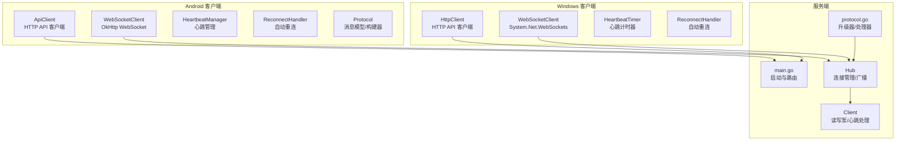

图表来源
- [clipSync-android 应用网络层：ApiClient.kt:14-142](file://clipSync-android/app/src/main/java/com/clipsync/app/network/ApiClient.kt#L14-L142)
- [clipSync-android 应用网络层：WebSocketClient.kt:26-156](file://clipSync-android/app/src/main/java/com/clipsync/app/network/WebSocketClient.kt#L26-L156)
- [clipSync-android 应用网络层：HeartbeatManager.kt:16-76](file://clipSync-android/app/src/main/java/com/clipsync/app/network/HeartbeatManager.kt#L16-L76)
- [clipSync-android 应用网络层：ReconnectHandler.kt:14-80](file://clipSync-android/app/src/main/java/com/clipsync/app/network/ReconnectHandler.kt#L14-L80)
- [clipSync-android 应用网络层：Protocol.kt:12-263](file://clipSync-android/app/src/main/java/com/clipsync/app/network/Protocol.kt#L12-L263)
- [clipSync-windows 客户端网络层：HttpClient.cs:20-180](file://clipSync-windows/ClipSync.WPF/Network/HttpClient.cs#L20-L180)
- [clipSync-windows 客户端网络层：WebSocketClient.cs:9-126](file://clipSync-windows/ClipSync.WPF/Network/WebSocketClient.cs#L9-L126)
- [clipSync-windows 客户端网络层：ReconnectHandler.cs:8-97](file://clipSync-windows/ClipSync.WPF/Network/ReconnectHandler.cs#L8-L97)
- [clipSync-windows 客户端网络层：HeartbeatTimer.cs:7-52](file://clipSync-windows/ClipSync.WPF/Network/HeartbeatTimer.cs#L7-L52)
- [clipSync-server 服务端入口：main.go:21-141](file://clipSync-server/cmd/server/main.go#L21-L141)
- [clipSync-server 服务端：hub.go:18-230](file://clipSync-server/internal/websocket/hub.go#L18-L230)
- [clipSync-server 服务端：client.go:13-150](file://clipSync-server/internal/websocket/client.go#L13-L150)
- [clipSync-server 服务端：protocol.go:9-27](file://clipSync-server/internal/websocket/protocol.go#L9-L27)

章节来源
- [clipSync-server 服务端入口：main.go:21-141](file://clipSync-server/cmd/server/main.go#L21-L141)

## 核心组件
- 协议与消息模型
  - 统一的 WebSocket 消息封装体与类型枚举，支持鉴权、心跳、剪贴板推送/拉取/历史、设备列表、错误等消息类型。
  - HTTP API 的请求/响应数据类，用于登录、注册、刷新令牌、设备列表与注销。
- Android 端
  - ApiClient：基于 HttpURLConnection 的轻量 HTTP 客户端，负责认证与设备管理接口。
  - WebSocketClient：基于 OkHttp，提供连接、发送、接收、状态流与事件回调。
  - HeartbeatManager：周期性发送心跳，维护序列号。
  - ReconnectHandler：指数退避自动重连，跟踪失败次数与回退时间。
- Windows 端
  - HttpClient：基于 System.Net.Http 的登录/注册/刷新令牌。
  - WebSocketClient：基于 System.Net.WebSockets，提供连接、断开、发送与接收循环。
  - HeartbeatTimer：基于 System.Threading.Timer 的心跳定时器。
  - ReconnectHandler：在认证后触发重连，指数退避，按设置拼接 ws/wss 地址。
- 服务端
  - Hub：集中管理客户端连接、广播、在线设备统计与用户隔离。
  - Client：读写泵、心跳超时、PONG 处理、错误消息发送。
  - 协议升级器：gorilla/websocket Upgrader 配置。

章节来源
- [clipSync-android 应用网络层：Protocol.kt:12-263](file://clipSync-android/app/src/main/java/com/clipsync/app/network/Protocol.kt#L12-L263)
- [clipSync-android 应用网络层：ApiClient.kt:14-142](file://clipSync-android/app/src/main/java/com/clipsync/app/network/ApiClient.kt#L14-L142)
- [clipSync-android 应用网络层：WebSocketClient.kt:26-156](file://clipSync-android/app/src/main/java/com/clipsync/app/network/WebSocketClient.kt#L26-L156)
- [clipSync-android 应用网络层：HeartbeatManager.kt:16-76](file://clipSync-android/app/src/main/java/com/clipsync/app/network/HeartbeatManager.kt#L16-L76)
- [clipSync-android 应用网络层：ReconnectHandler.kt:14-80](file://clipSync-android/app/src/main/java/com/clipsync/app/network/ReconnectHandler.kt#L14-L80)
- [clipSync-windows 客户端网络层：HttpClient.cs:20-180](file://clipSync-windows/ClipSync.WPF/Network/HttpClient.cs#L20-L180)
- [clipSync-windows 客户端网络层：WebSocketClient.cs:9-126](file://clipSync-windows/ClipSync.WPF/Network/WebSocketClient.cs#L9-L126)
- [clipSync-windows 客户端网络层：HeartbeatTimer.cs:7-52](file://clipSync-windows/ClipSync.WPF/Network/HeartbeatTimer.cs#L7-L52)
- [clipSync-windows 客户端网络层：ReconnectHandler.cs:8-97](file://clipSync-windows/ClipSync.WPF/Network/ReconnectHandler.cs#L8-L97)
- [clipSync-server 服务端：hub.go:18-230](file://clipSync-server/internal/websocket/hub.go#L18-L230)
- [clipSync-server 服务端：client.go:13-150](file://clipSync-server/internal/websocket/client.go#L13-L150)
- [clipSync-server 服务端：protocol.go:9-27](file://clipSync-server/internal/websocket/protocol.go#L9-L27)

## 架构总览
下图展示从应用到服务端的完整链路：HTTP 认证与设备管理，WebSocket 实时同步与心跳保活，服务端 Hub 广播与客户端读写泵。

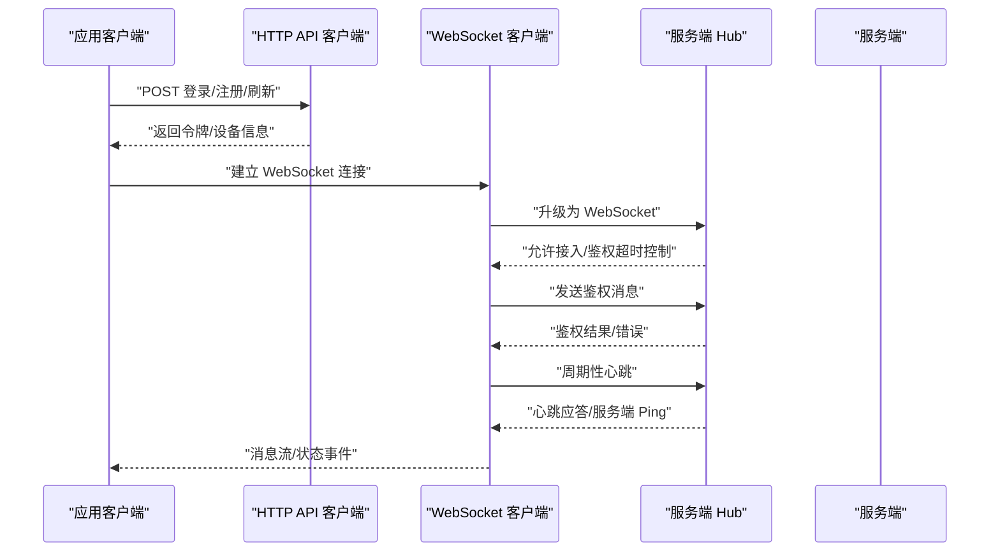

图表来源
- [clipSync-android 应用网络层：ApiClient.kt:23-54](file://clipSync-android/app/src/main/java/com/clipsync/app/network/ApiClient.kt#L23-L54)
- [clipSync-android 应用网络层：WebSocketClient.kt:83-103](file://clipSync-android/app/src/main/java/com/clipsync/app/network/WebSocketClient.kt#L83-L103)
- [clipSync-server 服务端：hub.go:182-208](file://clipSync-server/internal/websocket/hub.go#L182-L208)
- [clipSync-server 服务端：client.go:34-67](file://clipSync-server/internal/websocket/client.go#L34-L67)

## 详细组件分析

### 协议与消息模型
- 消息封装体包含类型、版本、时间戳、可选设备 ID 与负载对象，统一通过 JSON 编解码。
- 消息类型覆盖鉴权、心跳、剪贴板推送/同步/拉取、设备列表、错误、Ping/Pong 等。
- Android 提供 WsMessageBuilder 便捷构造各类消息；Windows 侧由 Protocol 工具方法生成消息。
- 服务端对消息进行解析与校验，不符合模式的消息会返回错误。

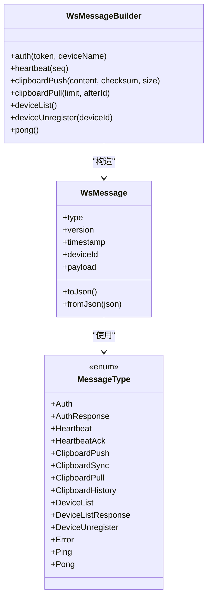

图表来源
- [clipSync-android 应用网络层：Protocol.kt:20-263](file://clipSync-android/app/src/main/java/com/clipsync/app/network/Protocol.kt#L20-L263)

章节来源
- [clipSync-android 应用网络层：Protocol.kt:12-263](file://clipSync-android/app/src/main/java/com/clipsync/app/network/Protocol.kt#L12-L263)
- [协议规范：ws-messages.schema.json:1-261](file://protocol/ws-messages.schema.json#L1-L261)

### Android：HTTP API 客户端（ApiClient）
- 支持登录、注册、刷新令牌、设备列表查询、设备注销、健康检查。
- 使用 HttpURLConnection 发送请求，设置 Content-Type 为 application/json，并在需要鉴权的接口中添加 Authorization 头。
- 响应体通过 Kotlinx Serialization 解析为强类型对象；非 2xx 响应抛出 IO 异常，便于上层捕获。

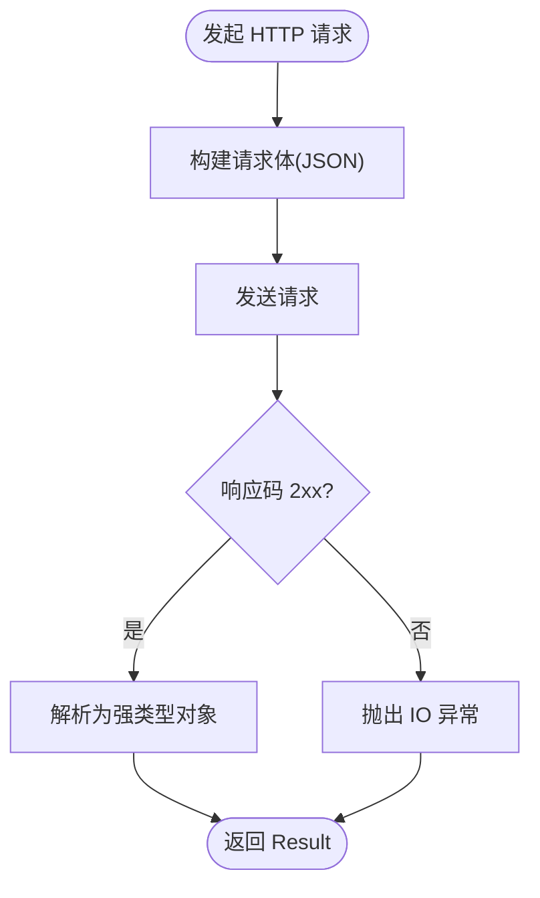

图表来源
- [clipSync-android 应用网络层：ApiClient.kt:80-136](file://clipSync-android/app/src/main/java/com/clipsync/app/network/ApiClient.kt#L80-L136)

章节来源
- [clipSync-android 应用网络层：ApiClient.kt:14-142](file://clipSync-android/app/src/main/java/com/clipsync/app/network/ApiClient.kt#L14-L142)
- [协议规范：http-api.schema.json:8-293](file://protocol/http-api.schema.json#L8-L293)

### Android：WebSocket 客户端（OkHttp）
- 基于 OkHttp 的 WebSocketListener，管理连接生命周期与消息收发。
- 提供连接状态 StateFlow 与消息 SharedFlow，便于 UI 或业务层订阅。
- 心跳与重连分别由 HeartbeatManager 与 ReconnectHandler 管理，互不耦合。
- 连接参数：Ping 间隔 30 秒，连接超时 10 秒，读超时 0（无限制）。

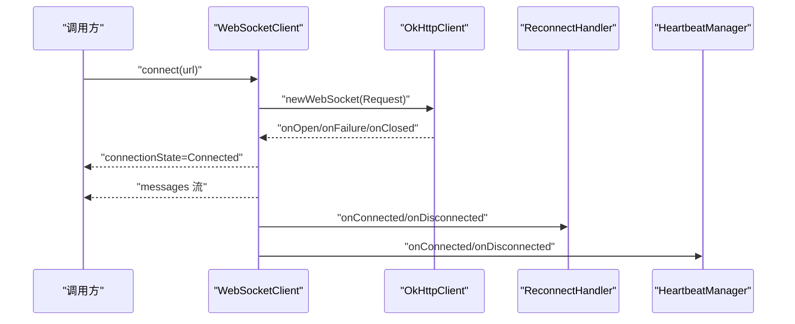

图表来源
- [clipSync-android 应用网络层：WebSocketClient.kt:46-103](file://clipSync-android/app/src/main/java/com/clipsync/app/network/WebSocketClient.kt#L46-L103)
- [clipSync-android 应用网络层：ReconnectHandler.kt:27-53](file://clipSync-android/app/src/main/java/com/clipsync/app/network/ReconnectHandler.kt#L27-L53)
- [clipSync-android 应用网络层：HeartbeatManager.kt:27-44](file://clipSync-android/app/src/main/java/com/clipsync/app/network/HeartbeatManager.kt#L27-L44)

章节来源
- [clipSync-android 应用网络层：WebSocketClient.kt:26-156](file://clipSync-android/app/src/main/java/com/clipsync/app/network/WebSocketClient.kt#L26-L156)
- [clipSync-android 应用网络层：ReconnectHandler.kt:14-80](file://clipSync-android/app/src/main/java/com/clipsync/app/network/ReconnectHandler.kt#L14-L80)
- [clipSync-android 应用网络层：HeartbeatManager.kt:16-76](file://clipSync-android/app/src/main/java/com/clipsync/app/network/HeartbeatManager.kt#L16-L76)

### Android：心跳管理（HeartbeatManager）
- 默认 30 秒发送一次心跳，携带自增序列号。
- 连接断开或发送失败时记录日志，不影响其他流程。
- 提供 start/stop/reset/destroy 生命周期管理。

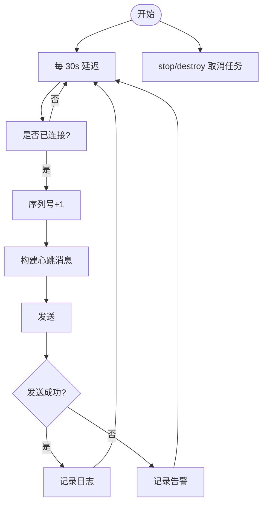

图表来源
- [clipSync-android 应用网络层：HeartbeatManager.kt:27-69](file://clipSync-android/app/src/main/java/com/clipsync/app/network/HeartbeatManager.kt#L27-L69)

章节来源
- [clipSync-android 应用网络层：HeartbeatManager.kt:16-76](file://clipSync-android/app/src/main/java/com/clipsync/app/network/HeartbeatManager.kt#L16-L76)

### Android：自动重连（ReconnectHandler）
- 指数退避：1s → 2s → 4s → 8s → 16s → 32s → 最大 60s。
- 连接成功后重置失败计数与回退时间；断开时调度重连任务。
- 通过回调触发重新连接与状态变更通知。

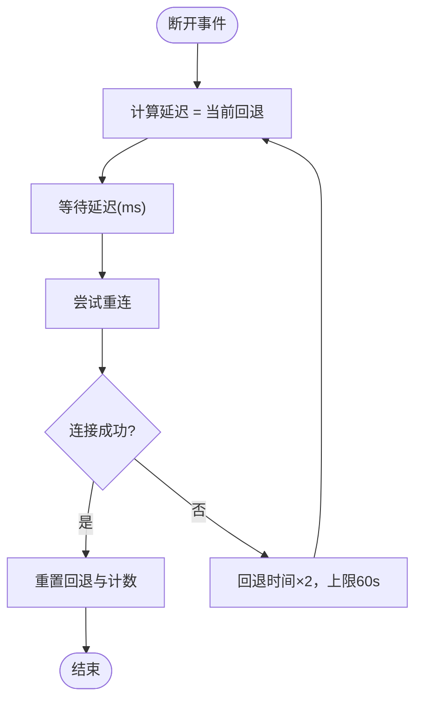

图表来源
- [clipSync-android 应用网络层：ReconnectHandler.kt:37-53](file://clipSync-android/app/src/main/java/com/clipsync/app/network/ReconnectHandler.kt#L37-L53)

章节来源
- [clipSync-android 应用网络层：ReconnectHandler.kt:14-80](file://clipSync-android/app/src/main/java/com/clipsync/app/network/ReconnectHandler.kt#L14-L80)

### Windows：HTTP API 客户端（HttpClient）
- 基于 System.Net.Http 的登录、注册、刷新令牌接口。
- 使用 Newtonsoft.Json 解析响应，区分成功与错误分支。
- 异常包装为统一的 AuthResult 返回，便于 UI 展示。

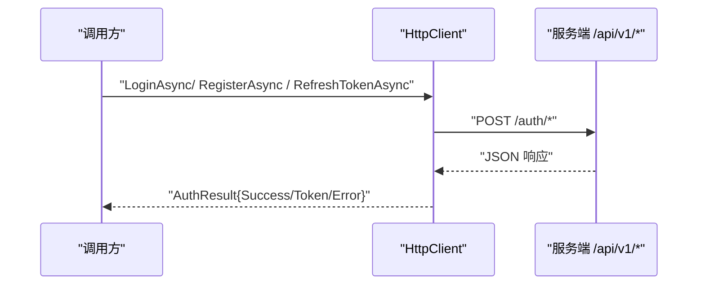

图表来源
- [clipSync-windows 客户端网络层：HttpClient.cs:32-177](file://clipSync-windows/ClipSync.WPF/Network/HttpClient.cs#L32-L177)

章节来源
- [clipSync-windows 客户端网络层：HttpClient.cs:20-180](file://clipSync-windows/ClipSync.WPF/Network/HttpClient.cs#L20-L180)

### Windows：WebSocket 客户端（System.Net.WebSockets）
- ConnectAsync/DisconnectAsync 明确连接生命周期。
- ReceiveLoop 循环读取消息，收到关闭帧或异常时触发断开事件。
- SendAsync 在连接状态下发送文本消息，异常时忽略以避免崩溃。

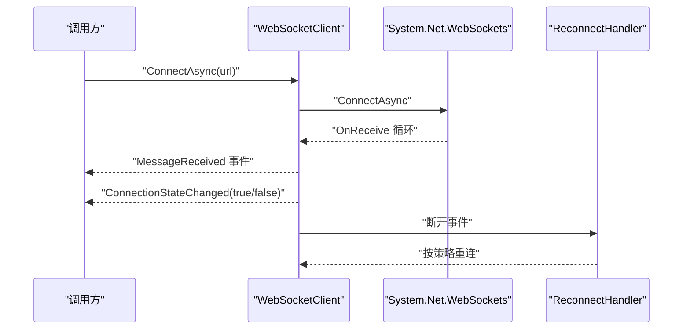

图表来源
- [clipSync-windows 客户端网络层：WebSocketClient.cs:20-116](file://clipSync-windows/ClipSync.WPF/Network/WebSocketClient.cs#L20-L116)
- [clipSync-windows 客户端网络层：ReconnectHandler.cs:33-71](file://clipSync-windows/ClipSync.WPF/Network/ReconnectHandler.cs#L33-L71)

章节来源
- [clipSync-windows 客户端网络层：WebSocketClient.cs:9-126](file://clipSync-windows/ClipSync.WPF/Network/WebSocketClient.cs#L9-L126)
- [clipSync-windows 客户端网络层：ReconnectHandler.cs:8-97](file://clipSync-windows/ClipSync.WPF/Network/ReconnectHandler.cs#L8-L97)

### Windows：心跳与重连
- HeartbeatTimer 基于 System.Threading.Timer，每 30 秒发送心跳。
- ReconnectHandler 在认证后开始追踪，指数退避重连，自动补全 ws/wss 前缀。

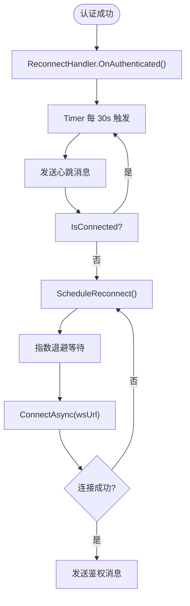

图表来源
- [clipSync-windows 客户端网络层：HeartbeatTimer.cs:21-49](file://clipSync-windows/ClipSync.WPF/Network/HeartbeatTimer.cs#L21-L49)
- [clipSync-windows 客户端网络层：ReconnectHandler.cs:27-71](file://clipSync-windows/ClipSync.WPF/Network/ReconnectHandler.cs#L27-L71)

章节来源
- [clipSync-windows 客户端网络层：HeartbeatTimer.cs:7-52](file://clipSync-windows/ClipSync.WPF/Network/HeartbeatTimer.cs#L7-L52)
- [clipSync-windows 客户端网络层：ReconnectHandler.cs:8-97](file://clipSync-windows/ClipSync.WPF/Network/ReconnectHandler.cs#L8-L97)

### 服务端：Hub 与 Client
- Hub 维护客户端集合、广播通道、用户隔离与在线设备统计。
- Client 的 readPump 设置读超时与 PONG 处理，writePump 定期 Ping 并批量写出消息。
- 未在时限内完成鉴权的客户端会被强制断开。

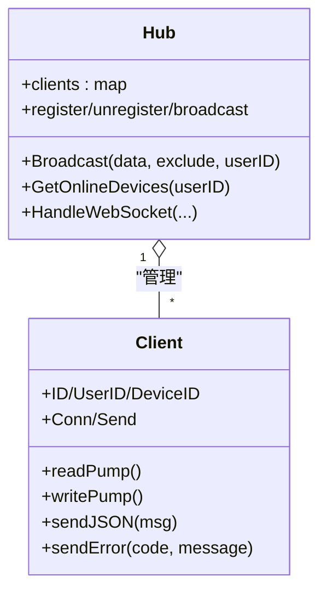

图表来源
- [clipSync-server 服务端：hub.go:18-230](file://clipSync-server/internal/websocket/hub.go#L18-L230)
- [clipSync-server 服务端：client.go:13-150](file://clipSync-server/internal/websocket/client.go#L13-L150)

章节来源
- [clipSync-server 服务端：hub.go:18-230](file://clipSync-server/internal/websocket/hub.go#L18-L230)
- [clipSync-server 服务端：client.go:13-150](file://clipSync-server/internal/websocket/client.go#L13-L150)

### 服务端：协议升级与路由
- main.go 将 /ws 路由交由 Hub 处理，分别启动 HTTP 与 WebSocket 服务。
- protocol.go 提供 Upgrader 配置，允许跨域（生产环境建议收紧）。

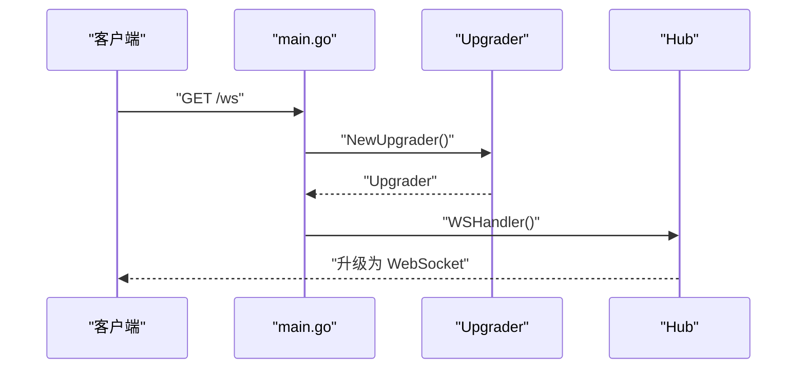

图表来源
- [clipSync-server 服务端入口：main.go:104-120](file://clipSync-server/cmd/server/main.go#L104-L120)
- [clipSync-server 服务端：protocol.go:21-27](file://clipSync-server/internal/websocket/protocol.go#L21-L27)

章节来源
- [clipSync-server 服务端入口：main.go:21-141](file://clipSync-server/cmd/server/main.go#L21-L141)
- [clipSync-server 服务端：protocol.go:9-27](file://clipSync-server/internal/websocket/protocol.go#L9-L27)

## 依赖关系分析
- Android
  - WebSocketClient 依赖 OkHttp 与 Kotlin 协程 Flow；与 ReconnectHandler、HeartbeatManager 解耦。
  - ApiClient 依赖 Kotlinx Serialization 与 HttpURLConnection。
- Windows
  - WebSocketClient 依赖 System.Net.WebSockets；HttpClient 依赖 System.Net.Http。
  - ReconnectHandler 依赖 SettingsManager 读取配置，依赖 WebSocketClient 重连。
- 服务端
  - Hub 依赖 gorilla/websocket、数据库仓库与认证服务。
  - main.go 组装路由与中间件，分离 HTTP 与 WebSocket 服务。

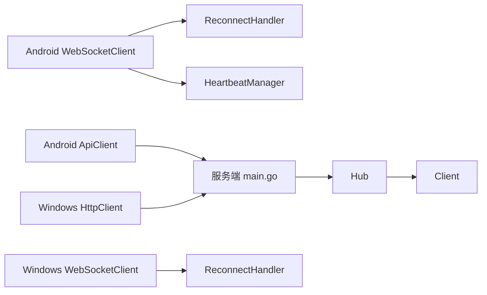

图表来源
- [clipSync-android 应用网络层：WebSocketClient.kt:26-156](file://clipSync-android/app/src/main/java/com/clipsync/app/network/WebSocketClient.kt#L26-L156)
- [clipSync-android 应用网络层：ReconnectHandler.kt:14-80](file://clipSync-android/app/src/main/java/com/clipsync/app/network/ReconnectHandler.kt#L14-L80)
- [clipSync-android 应用网络层：HeartbeatManager.kt:16-76](file://clipSync-android/app/src/main/java/com/clipsync/app/network/HeartbeatManager.kt#L16-L76)
- [clipSync-android 应用网络层：ApiClient.kt:14-142](file://clipSync-android/app/src/main/java/com/clipsync/app/network/ApiClient.kt#L14-L142)
- [clipSync-windows 客户端网络层：WebSocketClient.cs:9-126](file://clipSync-windows/ClipSync.WPF/Network/WebSocketClient.cs#L9-L126)
- [clipSync-windows 客户端网络层：ReconnectHandler.cs:8-97](file://clipSync-windows/ClipSync.WPF/Network/ReconnectHandler.cs#L8-L97)
- [clipSync-windows 客户端网络层：HttpClient.cs:20-180](file://clipSync-windows/ClipSync.WPF/Network/HttpClient.cs#L20-L180)
- [clipSync-server 服务端入口：main.go:21-141](file://clipSync-server/cmd/server/main.go#L21-L141)
- [clipSync-server 服务端：hub.go:18-230](file://clipSync-server/internal/websocket/hub.go#L18-L230)
- [clipSync-server 服务端：client.go:13-150](file://clipSync-server/internal/websocket/client.go#L13-L150)

## 性能考量
- 连接参数
  - Android：Ping 间隔 30 秒，连接超时 10 秒，读超时 0（WebSocket 无固定读超时）。
  - Windows：心跳间隔 30 秒；SendAsync/ReceiveLoop 使用 UTF-8 字节缓冲区（64KB）。
- 消息吞吐
  - Hub 的广播通道容量为 256，客户端发送缓冲为 256；当缓冲满时会断开客户端以保护系统。
- 超时与保活
  - 服务端为每个客户端设置读超时（心跳超时），客户端需及时响应 PONG/PING 以维持连接。
- 资源释放
  - Android 与 Windows 的断开逻辑均确保取消任务、释放连接与取消令牌。

章节来源
- [clipSync-android 应用网络层：WebSocketClient.kt:92-96](file://clipSync-android/app/src/main/java/com/clipsync/app/network/WebSocketClient.kt#L92-L96)
- [clipSync-server 服务端：hub.go:50-57](file://clipSync-server/internal/websocket/hub.go#L50-L57)
- [clipSync-server 服务端：client.go:70-116](file://clipSync-server/internal/websocket/client.go#L70-L116)
- [clipSync-windows 客户端网络层：WebSocketClient.cs:81-116](file://clipSync-windows/ClipSync.WPF/Network/WebSocketClient.cs#L81-L116)

## 故障排查指南
- HTTP 认证失败
  - 现象：登录/注册/刷新返回错误。
  - 排查：确认用户名/密码长度、设备名与平台字段；检查服务端限流与错误码映射。
  - 参考
    - [clipSync-android 应用网络层：ApiClient.kt:23-54](file://clipSync-android/app/src/main/java/com/clipsync/app/network/ApiClient.kt#L23-L54)
    - [clipSync-windows 客户端网络层：HttpClient.cs:32-177](file://clipSync-windows/ClipSync.WPF/Network/HttpClient.cs#L32-L177)
    - [协议规范：http-api.schema.json:8-293](file://protocol/http-api.schema.json#L8-L293)
- WebSocket 无法连接
  - 现象：连接状态停留在 Connecting 或频繁断开。
  - 排查：检查服务端 /ws 路由、Upgrader 配置、防火墙与代理；确认 URL 前缀（ws/wss）。
  - 参考
    - [clipSync-server 服务端入口：main.go:104-120](file://clipSync-server/cmd/server/main.go#L104-L120)
    - [clipSync-server 服务端：protocol.go:21-27](file://clipSync-server/internal/websocket/protocol.go#L21-L27)
- 鉴权超时
  - 现象：连接后未在 30 秒内发送鉴权消息被断开。
  - 排查：确认鉴权消息格式与发送时机；检查服务端鉴权超时逻辑。
  - 参考
    - [clipSync-server 服务端：hub.go:197-204](file://clipSync-server/internal/websocket/hub.go#L197-L204)
- 心跳丢失
  - 现象：服务端因读超时断开客户端。
  - 排查：确认客户端心跳定时器与服务端心跳超时一致；检查网络抖动与丢包。
  - 参考
    - [clipSync-android 应用网络层：HeartbeatManager.kt:27-44](file://clipSync-android/app/src/main/java/com/clipsync/app/network/HeartbeatManager.kt#L27-L44)
    - [clipSync-windows 客户端网络层：HeartbeatTimer.cs:21-49](file://clipSync-windows/ClipSync.WPF/Network/HeartbeatTimer.cs#L21-L49)
    - [clipSync-server 服务端：client.go:40-45](file://clipSync-server/internal/websocket/client.go#L40-L45)
- 重连风暴
  - 现象：断线后短时间内大量重连尝试。
  - 排查：确认指数退避上限与并发重连任务；避免重复触发重连。
  - 参考
    - [clipSync-android 应用网络层：ReconnectHandler.kt:37-53](file://clipSync-android/app/src/main/java/com/clipsync/app/network/ReconnectHandler.kt#L37-L53)
    - [clipSync-windows 客户端网络层：ReconnectHandler.cs:33-71](file://clipSync-windows/ClipSync.WPF/Network/ReconnectHandler.cs#L33-L71)

章节来源
- [clipSync-android 应用网络层：ApiClient.kt:23-54](file://clipSync-android/app/src/main/java/com/clipsync/app/network/ApiClient.kt#L23-L54)
- [clipSync-windows 客户端网络层：HttpClient.cs:32-177](file://clipSync-windows/ClipSync.WPF/Network/HttpClient.cs#L32-L177)
- [clipSync-server 服务端入口：main.go:104-120](file://clipSync-server/cmd/server/main.go#L104-L120)
- [clipSync-server 服务端：hub.go:197-204](file://clipSync-server/internal/websocket/hub.go#L197-L204)
- [clipSync-server 服务端：client.go:40-45](file://clipSync-server/internal/websocket/client.go#L40-L45)
- [clipSync-android 应用网络层：HeartbeatManager.kt:27-44](file://clipSync-android/app/src/main/java/com/clipsync/app/network/HeartbeatManager.kt#L27-L44)
- [clipSync-windows 客户端网络层：HeartbeatTimer.cs:21-49](file://clipSync-windows/ClipSync.WPF/Network/HeartbeatTimer.cs#L21-L49)
- [clipSync-android 应用网络层：ReconnectHandler.kt:37-53](file://clipSync-android/app/src/main/java/com/clipsync/app/network/ReconnectHandler.kt#L37-L53)
- [clipSync-windows 客户端网络层：ReconnectHandler.cs:33-71](file://clipSync-windows/ClipSync.WPF/Network/ReconnectHandler.cs#L33-L71)

## 结论
该网络通信模块在多平台实现了统一的协议与清晰的职责划分：Android 使用 OkHttp 与协程，Windows 使用 .NET 原生能力，服务端采用 gorilla/websocket。通过心跳与指数退避重连保障长连接稳定性，结合严格的鉴权与超时控制提升可靠性。建议在生产环境中进一步强化 CORS 策略、TLS 传输与速率限制策略，并完善可观测性与日志分级。

## 附录

### 配置项与参数速查
- Android
  - WebSocket 参数：Ping 间隔 30 秒，连接超时 10 秒，读超时 0。
  - 心跳间隔：30 秒。
  - 重连退避：1s → 2s → 4s → 8s → 16s → 32s → 最大 60s。
- Windows
  - 心跳间隔：30 秒。
  - 重连退避：最小 1000ms，最大 60000ms，倍数 2。
  - WS URL 前缀：若无 ws/wss 则自动补全 ws://。
- 服务端
  - /ws 升级器：允许跨域（开发可用，生产建议收紧）。
  - 读超时：心跳超时；写超时：30 秒；空闲超时：60 秒。

章节来源
- [clipSync-android 应用网络层：WebSocketClient.kt:92-96](file://clipSync-android/app/src/main/java/com/clipsync/app/network/WebSocketClient.kt#L92-L96)
- [clipSync-android 应用网络层：HeartbeatManager.kt:27-44](file://clipSync-android/app/src/main/java/com/clipsync/app/network/HeartbeatManager.kt#L27-L44)
- [clipSync-android 应用网络层：ReconnectHandler.kt:74-78](file://clipSync-android/app/src/main/java/com/clipsync/app/network/ReconnectHandler.kt#L74-L78)
- [clipSync-windows 客户端网络层：HeartbeatTimer.cs](file://clipSync-windows/ClipSync.WPF/Network/HeartbeatTimer.cs#L14)
- [clipSync-windows 客户端网络层：ReconnectHandler.cs:16-18](file://clipSync-windows/ClipSync.WPF/Network/ReconnectHandler.cs#L16-L18)
- [clipSync-server 服务端入口：main.go:107-113](file://clipSync-server/cmd/server/main.go#L107-L113)
- [clipSync-server 服务端：protocol.go:10-18](file://clipSync-server/internal/websocket/protocol.go#L10-L18)