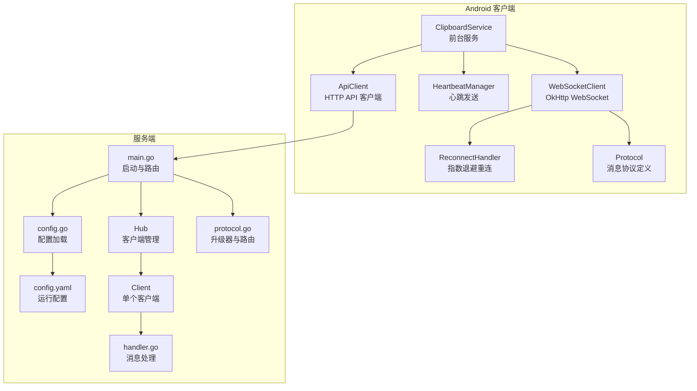
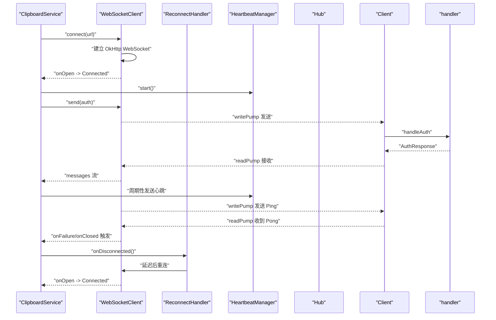
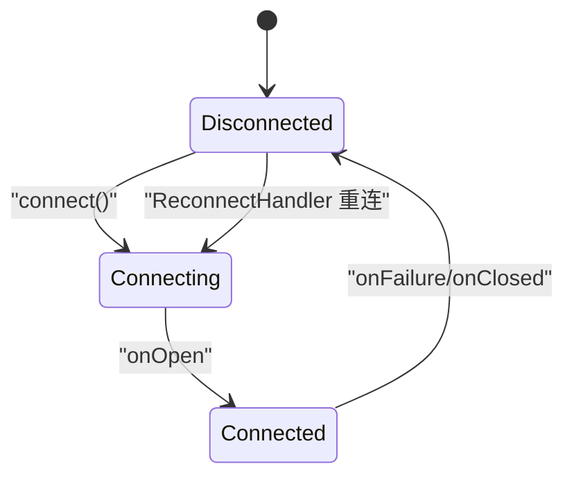
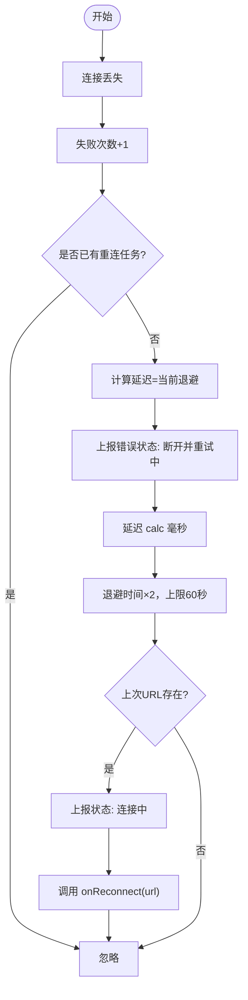
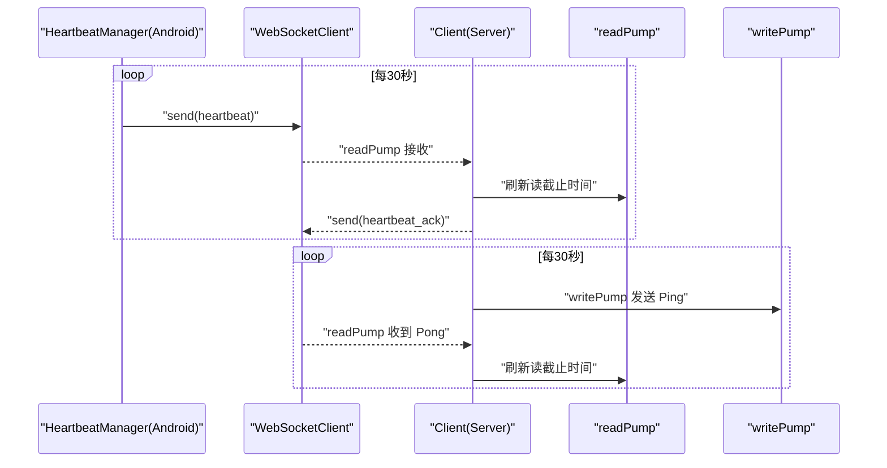
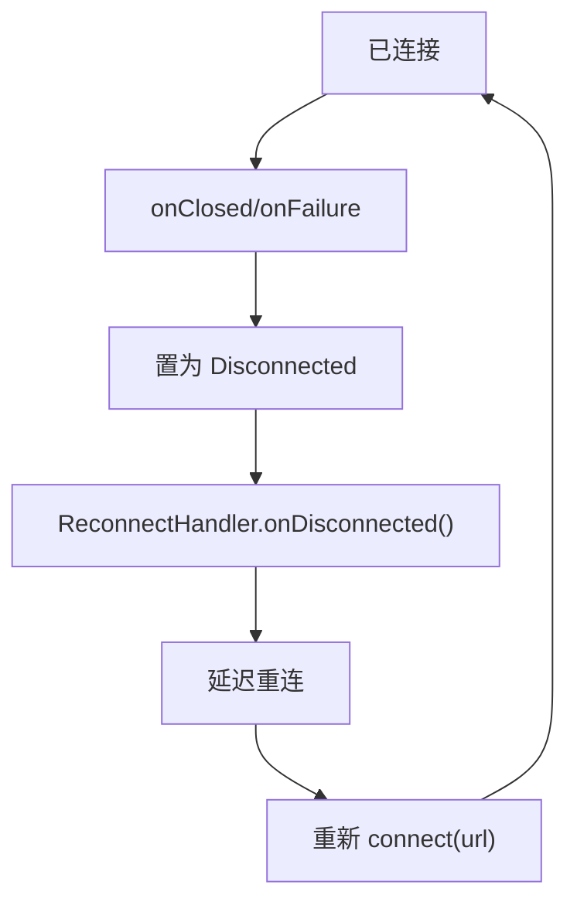
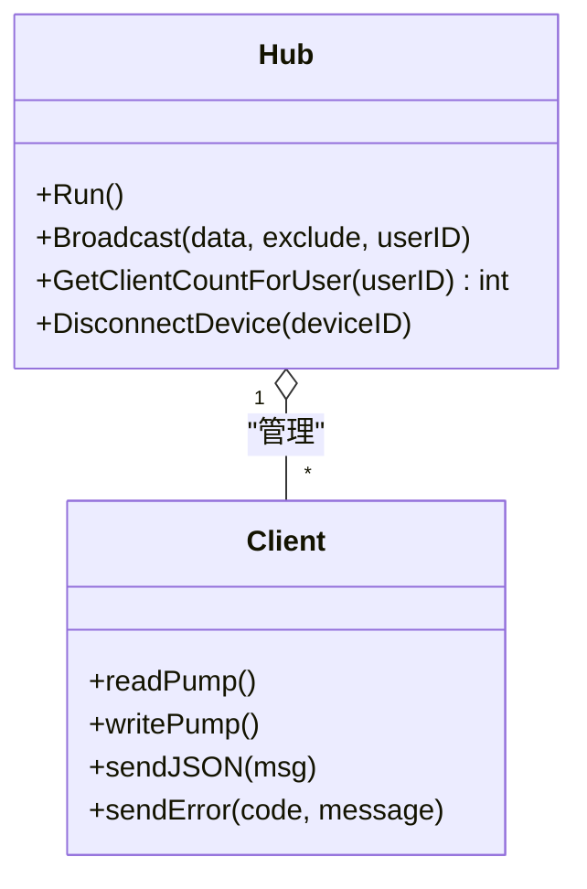
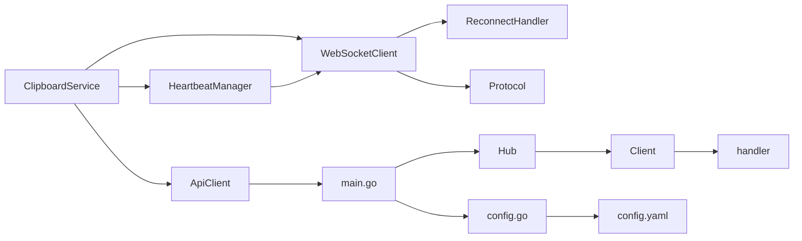

# 连接管理

<cite>
**本文引用的文件**
- [WebSocketClient.kt](file://clipSync-android/app/src/main/java/com/clipsync/app/network/WebSocketClient.kt)
- [ReconnectHandler.kt](file://clipSync-android/app/src/main/java/com/clipsync/app/network/ReconnectHandler.kt)
- [HeartbeatManager.kt](file://clipSync-android/app/src/main/java/com/clipsync/app/network/HeartbeatManager.kt)
- [Protocol.kt](file://clipSync-android/app/src/main/java/com/clipsync/app/network/Protocol.kt)
- [ApiClient.kt](file://clipSync-android/app/src/main/java/com/clipsync/app/network/ApiClient.kt)
- [ClipboardService.kt](file://clipSync-android/app/src/main/java/com/clipsync/app/service/ClipboardService.kt)
- [client.go](file://clipSync-server/internal/websocket/client.go)
- [handler.go](file://clipSync-server/internal/websocket/handler.go)
- [hub.go](file://clipSync-server/internal/websocket/hub.go)
- [protocol.go](file://clipSync-server/internal/websocket/protocol.go)
- [main.go](file://clipSync-server/cmd/server/main.go)
- [config.yaml](file://clipSync-server/configs/config.yaml)
- [config.go](file://clipSync-server/internal/config/config.go)
</cite>

## 目录
1. [简介](#简介)
2. [项目结构](#项目结构)
3. [核心组件](#核心组件)
4. [架构总览](#架构总览)
5. [详细组件分析](#详细组件分析)
6. [依赖关系分析](#依赖关系分析)
7. [性能考量](#性能考量)
8. [故障排查指南](#故障排查指南)
9. [结论](#结论)
10. [附录](#附录)

## 简介
本文件聚焦于连接管理模块，系统性阐述客户端与服务端的连接状态监控、自动重连机制、心跳保活、连接池与资源释放策略，并结合实际代码路径给出重连策略（指数退避）、超时处理、网络异常捕获与恢复流程。文档同时覆盖服务器端的客户端连接维护、心跳检测与连接清理，帮助初学者快速上手，也为资深开发者提供足够的技术深度。

## 项目结构
连接管理涉及 Android 客户端与 Go 服务端两部分：
- Android 客户端：WebSocket 客户端、重连处理器、心跳管理器、消息协议与 HTTP API 客户端、前台服务编排连接生命周期。
- 服务端：WebSocket Hub、客户端读写泵、消息路由与处理、认证与设备管理、配置加载与心跳超时控制。

图表来源
- [ClipboardService.kt:131-144](file://clipSync-android/app/src/main/java/com/clipsync/app/service/ClipboardService.kt#L131-L144)
- [WebSocketClient.kt:83-103](file://clipSync-android/app/src/main/java/com/clipsync/app/network/WebSocketClient.kt#L83-L103)
- [ReconnectHandler.kt:37-53](file://clipSync-android/app/src/main/java/com/clipsync/app/network/ReconnectHandler.kt#L37-L53)
- [HeartbeatManager.kt:27-44](file://clipSync-android/app/src/main/java/com/clipsync/app/network/HeartbeatManager.kt#L27-L44)
- [ApiClient.kt:23-32](file://clipSync-android/app/src/main/java/com/clipsync/app/network/ApiClient.kt#L23-L32)
- [main.go:108-125](file://clipSync-server/cmd/server/main.go#L108-L125)
- [hub.go:61-112](file://clipSync-server/internal/websocket/hub.go#L61-L112)
- [client.go:34-67](file://clipSync-server/internal/websocket/client.go#L34-L67)
- [handler.go:10-31](file://clipSync-server/internal/websocket/handler.go#L10-L31)
- [protocol.go:20-26](file://clipSync-server/internal/websocket/protocol.go#L20-L26)
- [config.go:38-55](file://clipSync-server/internal/config/config.go#L38-L55)
- [config.yaml:27-28](file://clipSync-server/configs/config.yaml#L27-L28)

章节来源
- [main.go:108-125](file://clipSync-server/cmd/server/main.go#L108-L125)
- [config.go:38-55](file://clipSync-server/internal/config/config.go#L38-L55)
- [config.yaml:27-28](file://clipSync-server/configs/config.yaml#L27-L28)

## 核心组件
- Android 客户端连接管理
  - WebSocketClient：封装 OkHttp WebSocket，负责连接建立、消息收发、状态流与关闭。
  - ReconnectHandler：指数退避自动重连，跟踪失败次数与当前退避时间，触发重连回调。
  - HeartbeatManager：周期性发送心跳，维护序列号，连接断开时停止。
  - Protocol：统一的消息协议与构建器，定义消息类型、载荷与序列化。
  - ApiClient：HTTP API 客户端，登录/注册/刷新令牌/设备列表/注销等。
  - ClipboardService：前台服务，编排连接生命周期、消息处理、剪贴板监控与历史请求。
- 服务端连接管理
  - Hub：集中管理所有客户端连接，注册/注销、广播、统计在线设备数。
  - Client：单个客户端连接，读写泵、心跳定时器、认证计时器、错误发送。
  - handler：消息路由与处理，认证、心跳、剪贴板同步、设备列表、注销。
  - protocol：WebSocket 升级器与路由函数。
  - main：启动 HTTP 与 WebSocket 服务，加载配置，优雅关闭。

章节来源
- [WebSocketClient.kt:26-145](file://clipSync-android/app/src/main/java/com/clipsync/app/network/WebSocketClient.kt#L26-L145)
- [ReconnectHandler.kt:14-79](file://clipSync-android/app/src/main/java/com/clipsync/app/network/ReconnectHandler.kt#L14-L79)
- [HeartbeatManager.kt:16-75](file://clipSync-android/app/src/main/java/com/clipsync/app/network/HeartbeatManager.kt#L16-L75)
- [Protocol.kt:11-263](file://clipSync-android/app/src/main/java/com/clipsync/app/network/Protocol.kt#L11-L263)
- [ApiClient.kt:14-142](file://clipSync-android/app/src/main/java/com/clipsync/app/network/ApiClient.kt#L14-L142)
- [ClipboardService.kt:39-249](file://clipSync-android/app/src/main/java/com/clipsync/app/service/ClipboardService.kt#L39-L249)
- [hub.go:18-230](file://clipSync-server/internal/websocket/hub.go#L18-L230)
- [client.go:13-150](file://clipSync-server/internal/websocket/client.go#L13-L150)
- [handler.go:10-392](file://clipSync-server/internal/websocket/handler.go#L10-L392)
- [protocol.go:9-27](file://clipSync-server/internal/websocket/protocol.go#L9-L27)
- [main.go:21-146](file://clipSync-server/cmd/server/main.go#L21-L146)

## 架构总览
下图展示从 Android 前台服务到 WebSocket 客户端、重连与心跳，再到服务端 Hub 与客户端处理的整体流程。

图表来源
- [ClipboardService.kt:131-144](file://clipSync-android/app/src/main/java/com/clipsync/app/service/ClipboardService.kt#L131-L144)
- [WebSocketClient.kt:46-78](file://clipSync-android/app/src/main/java/com/clipsync/app/network/WebSocketClient.kt#L46-L78)
- [ReconnectHandler.kt:37-53](file://clipSync-android/app/src/main/java/com/clipsync/app/network/ReconnectHandler.kt#L37-L53)
- [HeartbeatManager.kt:27-44](file://clipSync-android/app/src/main/java/com/clipsync/app/network/HeartbeatManager.kt#L27-L44)
- [client.go:69-117](file://clipSync-server/internal/websocket/client.go#L69-L117)
- [handler.go:33-110](file://clipSync-server/internal/websocket/handler.go#L33-L110)

## 详细组件分析

### Android 客户端连接状态监控与通知
- 状态流：使用 Kotlin Flow 的 StateFlow 暴露连接状态，供 UI 或服务订阅。
- 状态转换：
  - 连接中：调用 connect 后置为“连接中”。
  - 已连接：onOpen 回调中置为“已连接”，并通知重连处理器连接成功。
  - 断开：onClosed/onFailure 中置为“断开”，并触发重连。
- 订阅与消费：ClipboardService 订阅 messages 流，按消息类型分派处理。

图表来源
- [WebSocketClient.kt:36-78](file://clipSync-android/app/src/main/java/com/clipsync/app/network/WebSocketClient.kt#L36-L78)
- [ClipboardService.kt:146-167](file://clipSync-android/app/src/main/java/com/clipsync/app/service/ClipboardService.kt#L146-L167)

章节来源
- [WebSocketClient.kt:36-78](file://clipSync-android/app/src/main/java/com/clipsync/app/network/WebSocketClient.kt#L36-L78)
- [ClipboardService.kt:146-167](file://clipSync-android/app/src/main/java/com/clipsync/app/service/ClipboardService.kt#L146-L167)

### 自动重连机制与指数退避策略
- 策略要点
  - 初始退避：1 秒；每次失败翻倍，上限 60 秒。
  - 成功连接后重置失败计数与退避时间。
  - 防止并发重连：若已有重连任务在执行则跳过新任务。
  - 跟踪上次连接 URL，确保重连使用相同地址。
- 关键行为
  - onDisconnected：递增失败次数，计算延迟，发出“断开并重试中”的错误状态，启动协程延迟后重连。
  - onConnected：重置状态，取消重连任务。
  - cancel：取消重连任务并重置状态。

图表来源
- [ReconnectHandler.kt:37-53](file://clipSync-android/app/src/main/java/com/clipsync/app/network/ReconnectHandler.kt#L37-L53)
- [WebSocketClient.kt:39-44](file://clipSync-android/app/src/main/java/com/clipsync/app/network/WebSocketClient.kt#L39-L44)

章节来源
- [ReconnectHandler.kt:14-79](file://clipSync-android/app/src/main/java/com/clipsync/app/network/ReconnectHandler.kt#L14-L79)
- [WebSocketClient.kt:39-44](file://clipSync-android/app/src/main/java/com/clipsync/app/network/WebSocketClient.kt#L39-L44)

### 心跳检测与保活
- 客户端心跳
  - HeartbeatManager 每 30 秒发送一次心跳，序列号自增，仅在已连接时发送。
  - 失败时不中断服务，但会记录日志；成功则继续。
- 服务端心跳
  - readPump 设置读超时为心跳超时，收到 Pong 或心跳后刷新读截止时间。
  - writePump 每 30 秒发送一次 Ping，作为服务端主动探测。
  - 若超过心跳超时未收到心跳或 Ping/Pong，客户端被注销并关闭连接。
- 配置
  - 服务端心跳超时默认 90 秒，可在配置文件中调整。

图表来源
- [HeartbeatManager.kt:27-44](file://clipSync-android/app/src/main/java/com/clipsync/app/network/HeartbeatManager.kt#L27-L44)
- [client.go:34-67](file://clipSync-server/internal/websocket/client.go#L34-L67)
- [client.go:69-117](file://clipSync-server/internal/websocket/client.go#L69-L117)
- [config.yaml:27-28](file://clipSync-server/configs/config.yaml#L27-L28)

章节来源
- [HeartbeatManager.kt:16-75](file://clipSync-android/app/src/main/java/com/clipsync/app/network/HeartbeatManager.kt#L16-L75)
- [client.go:34-67](file://clipSync-server/internal/websocket/client.go#L34-L67)
- [client.go:69-117](file://clipSync-server/internal/websocket/client.go#L69-L117)
- [config.yaml:27-28](file://clipSync-server/configs/config.yaml#L27-L28)

### 连接断开检测与自动恢复流程
- 断开检测
  - Android：onFailure/onClosed 将状态置为断开，触发重连。
  - 服务端：readPump 在读取错误或超时（心跳超时）时注销客户端并关闭连接。
- 自动恢复
  - 由 ReconnectHandler 执行指数退避重连，成功后重置状态。
- 连接状态通知
  - ConnectionState 状态流向 UI/服务广播，便于界面与逻辑层感知。

图表来源
- [WebSocketClient.kt:67-77](file://clipSync-android/app/src/main/java/com/clipsync/app/network/WebSocketClient.kt#L67-L77)
- [client.go:34-67](file://clipSync-server/internal/websocket/client.go#L34-L67)
- [ReconnectHandler.kt:37-53](file://clipSync-android/app/src/main/java/com/clipsync/app/network/ReconnectHandler.kt#L37-L53)

章节来源
- [WebSocketClient.kt:67-77](file://clipSync-android/app/src/main/java/com/clipsync/app/network/WebSocketClient.kt#L67-L77)
- [client.go:34-67](file://clipSync-server/internal/websocket/client.go#L34-L67)
- [ReconnectHandler.kt:37-53](file://clipSync-android/app/src/main/java/com/clipsync/app/network/ReconnectHandler.kt#L37-L53)

### 服务器端连接管理与清理
- Hub 维护
  - register/unregister：注册/注销客户端，维护在线计数。
  - Broadcast：按用户广播消息，丢弃发送缓冲区满的客户端。
- Client 生命周期
  - readPump：设置读超时与 Pong 处理，解析消息并调用 handleMessage。
  - writePump：写队列发送消息，定时发送 Ping。
  - authTimer：30 秒内未认证则断开。
- 清理策略
  - 心跳超时未响应：注销并关闭。
  - 发送缓冲区持续拥塞：注销并关闭。
  - 显式注销设备：通过 Hub.DisconnectDevice 主动断开。

图表来源
- [hub.go:61-112](file://clipSync-server/internal/websocket/hub.go#L61-L112)
- [client.go:34-117](file://clipSync-server/internal/websocket/client.go#L34-L117)

章节来源
- [hub.go:18-230](file://clipSync-server/internal/websocket/hub.go#L18-L230)
- [client.go:13-150](file://clipSync-server/internal/websocket/client.go#L13-L150)

### 连接超时处理与网络异常捕获
- 客户端
  - OkHttp 配置：连接超时 10 秒，读超时 0（WebSocket 无固定读超时），心跳间隔 30 秒。
  - 心跳超时：服务端 readPump 设置读截止时间为心跳超时，避免阻塞。
- 服务端
  - 读写超时、空闲超时：HTTP 服务器设置 ReadTimeout/WriteTimeout/IdleTimeout。
  - 心跳超时：默认 90 秒，超时未见心跳则断开。
- 异常捕获
  - Android：onFailure 记录异常并触发重连。
  - 服务端：readPump 对意外关闭进行日志记录，writePump 错误时退出泵循环。

章节来源
- [WebSocketClient.kt:92-96](file://clipSync-android/app/src/main/java/com/clipsync/app/network/WebSocketClient.kt#L92-L96)
- [client.go:40-45](file://clipSync-server/internal/websocket/client.go#L40-L45)
- [main.go:112-118](file://clipSync-server/cmd/server/main.go#L112-L118)
- [config.yaml:27-28](file://clipSync-server/configs/config.yaml#L27-L28)

### 资源释放策略
- Android
  - ClipboardService.onDestroy：停止剪贴板监控、销毁心跳、断开 WebSocket、取消协程作用域。
  - WebSocketClient.disconnect：取消重连、关闭连接、清空引用、置为断开。
- 服务端
  - Hub.unregister：删除客户端、关闭发送通道、减少计数。
  - Client.read/writePump：defer 中关闭连接，退出泵循环。
  - main：优雅关闭 HTTP 与 WebSocket 服务器。

章节来源
- [ClipboardService.kt:91-99](file://clipSync-android/app/src/main/java/com/clipsync/app/service/ClipboardService.kt#L91-L99)
- [WebSocketClient.kt:127-134](file://clipSync-android/app/src/main/java/com/clipsync/app/network/WebSocketClient.kt#L127-L134)
- [hub.go:71-79](file://clipSync-server/internal/websocket/hub.go#L71-L79)
- [client.go:34-38](file://clipSync-server/internal/websocket/client.go#L34-L38)
- [main.go:127-142](file://clipSync-server/cmd/server/main.go#L127-L142)

### 重连策略实现细节（间隔计算、最大重试次数、退避算法）
- 间隔计算：初始 1 秒，每次失败翻倍，上限 60 秒。
- 最大重试次数：代码未显式限制，采用指数退避直至上限；建议业务侧根据场景增加最大尝试次数或外部策略。
- 退避算法：当前退避时间乘以 2，不超过最大值。

章节来源
- [ReconnectHandler.kt:74-78](file://clipSync-android/app/src/main/java/com/clipsync/app/network/ReconnectHandler.kt#L74-L78)
- [ReconnectHandler.kt:47](file://clipSync-android/app/src/main/java/com/clipsync/app/network/ReconnectHandler.kt#L47)

### 连接池管理
- Android：OkHttpClient 由 WebSocketClient 创建并复用，未实现多路复用或连接池复用策略；单连接模型。
- 服务端：Hub 维护 map[string]*Client，按用户广播；未实现连接池复用。

章节来源
- [WebSocketClient.kt:92-96](file://clipSync-android/app/src/main/java/com/clipsync/app/network/WebSocketClient.kt#L92-L96)
- [hub.go:19-35](file://clipSync-server/internal/websocket/hub.go#L19-L35)

### 常见连接问题与对策
- 网络波动
  - 使用指数退避重连，避免风暴式重试。
  - 心跳与读超时配合，及时发现半死连接。
- 服务器重启
  - 客户端重连恢复；服务端 Hub 在重启后重新注册新连接。
- 连接泄漏
  - Android：服务销毁时断开并取消协程；WebSocketClient.clear 引用。
  - 服务端：Hub 注销时关闭发送通道并减少计数；readPump defer 中关闭连接。

章节来源
- [ReconnectHandler.kt:67-72](file://clipSync-android/app/src/main/java/com/clipsync/app/network/ReconnectHandler.kt#L67-L72)
- [WebSocketClient.kt:127-134](file://clipSync-android/app/src/main/java/com/clipsync/app/network/WebSocketClient.kt#L127-L134)
- [hub.go:71-79](file://clipSync-server/internal/websocket/hub.go#L71-L79)
- [client.go:34-38](file://clipSync-server/internal/websocket/client.go#L34-L38)

## 依赖关系分析
- Android 客户端
  - ClipboardService 依赖 WebSocketClient、HeartbeatManager、SyncEngine、SettingsManager、AppDatabase。
  - WebSocketClient 依赖 OkHttp、ReconnectHandler、Protocol。
  - ReconnectHandler 依赖 Kotlin 协程与 ConnectionState。
  - HeartbeatManager 依赖 WebSocketClient 与 Protocol。
  - ApiClient 依赖 Kotlin 序列化与 HttpURLConnection。
- 服务端
  - main 依赖 config、httpserver、websocket、database、auth。
  - Hub 依赖 Client、protocol、auth、database。
  - Client 依赖 gorilla/websocket、protocol。
  - handler 依赖 protocol、auth、database。

图表来源
- [ClipboardService.kt:60-68](file://clipSync-android/app/src/main/java/com/clipsync/app/service/ClipboardService.kt#L60-L68)
- [WebSocketClient.kt:39-44](file://clipSync-android/app/src/main/java/com/clipsync/app/network/WebSocketClient.kt#L39-L44)
- [ReconnectHandler.kt:14-17](file://clipSync-android/app/src/main/java/com/clipsync/app/network/ReconnectHandler.kt#L14-L17)
- [HeartbeatManager.kt:16-18](file://clipSync-android/app/src/main/java/com/clipsync/app/network/HeartbeatManager.kt#L16-L18)
- [ApiClient.kt:14](file://clipSync-android/app/src/main/java/com/clipsync/app/network/ApiClient.kt#L14)
- [main.go:108-125](file://clipSync-server/cmd/server/main.go#L108-L125)
- [hub.go:18-35](file://clipSync-server/internal/websocket/hub.go#L18-L35)
- [client.go:13-31](file://clipSync-server/internal/websocket/client.go#L13-L31)
- [handler.go:10-31](file://clipSync-server/internal/websocket/handler.go#L10-L31)
- [config.go:38-55](file://clipSync-server/internal/config/config.go#L38-L55)
- [config.yaml:1-29](file://clipSync-server/configs/config.yaml#L1-L29)

章节来源
- [ClipboardService.kt:60-68](file://clipSync-android/app/src/main/java/com/clipsync/app/service/ClipboardService.kt#L60-L68)
- [WebSocketClient.kt:39-44](file://clipSync-android/app/src/main/java/com/clipsync/app/network/WebSocketClient.kt#L39-L44)
- [main.go:108-125](file://clipSync-server/cmd/server/main.go#L108-L125)

## 性能考量
- 心跳频率与超时
  - 客户端心跳 30 秒，服务端心跳超时 90 秒，平衡保活与带宽。
- 发送缓冲区
  - 服务端 Client.Send 缓冲区默认 256；当缓冲区满时标记断开，避免内存膨胀。
- 读写超时
  - 服务端 HTTP 服务器设置 Read/Write/Idle 超时，防止线程与连接长期占用。
- 序列化与协议
  - Kotlin 序列化与 JSON 解析在消息较多时可能成为瓶颈，建议批量发送与压缩（如需）。

章节来源
- [client.go:192](file://clipSync-server/internal/websocket/client.go#L192)
- [main.go:112-118](file://clipSync-server/cmd/server/main.go#L112-L118)
- [Protocol.kt:12-16](file://clipSync-android/app/src/main/java/com/clipsync/app/network/Protocol.kt#L12-L16)

## 故障排查指南
- 连接频繁断开
  - 检查指数退避是否生效，确认服务端心跳超时是否过短。
  - 查看 Android 日志中的 onFailure/onClosed 触发原因。
- 心跳未达预期
  - 确认 HeartbeatManager 是否在 AuthResponse 后启动。
  - 检查服务端 readPump 是否刷新读截止时间。
- 服务端大量连接堆积
  - 检查 Hub 广播时的发送缓冲区满情况，必要时降低广播频率或增大缓冲。
- 无法认证
  - 确认客户端发送的 Auth 消息格式正确，服务端认证中间件有效。
- 优雅关闭
  - 服务端信号处理与上下文超时关闭，避免资源泄露。

章节来源
- [ReconnectHandler.kt:37-53](file://clipSync-android/app/src/main/java/com/clipsync/app/network/ReconnectHandler.kt#L37-L53)
- [client.go:40-45](file://clipSync-server/internal/websocket/client.go#L40-L45)
- [handler.go:33-110](file://clipSync-server/internal/websocket/handler.go#L33-L110)
- [main.go:127-142](file://clipSync-server/cmd/server/main.go#L127-L142)

## 结论
该连接管理模块在 Android 与服务端两端实现了清晰的状态机、指数退避重连、心跳保活与资源释放策略。通过 Hub 与 Client 的协作，服务端能够稳定维护多客户端连接并进行广播与清理。建议在生产环境中进一步明确最大重试次数、优化心跳与超时阈值，并考虑连接池与消息批处理以提升吞吐与稳定性。

## 附录
- 配置项参考
  - 心跳超时：服务端配置项 heartbeat_timeout_seconds，默认 90 秒。
  - WebSocket/HTTP 端口：ws_port/http_port。
  - 历史条数限制：clipboard_history_limit。
- 关键实现路径
  - Android：连接、重连、心跳、消息协议与 HTTP API 客户端。
  - 服务端：Hub、Client、消息处理与升级器。

章节来源
- [config.yaml:27-28](file://clipSync-server/configs/config.yaml#L27-L28)
- [config.go:38-55](file://clipSync-server/internal/config/config.go#L38-L55)
- [Protocol.kt:11-263](file://clipSync-android/app/src/main/java/com/clipsync/app/network/Protocol.kt#L11-L263)
- [ApiClient.kt:14-142](file://clipSync-android/app/src/main/java/com/clipsync/app/network/ApiClient.kt#L14-L142)
- [WebSocketClient.kt:26-145](file://clipSync-android/app/src/main/java/com/clipsync/app/network/WebSocketClient.kt#L26-L145)
- [ReconnectHandler.kt:14-79](file://clipSync-android/app/src/main/java/com/clipsync/app/network/ReconnectHandler.kt#L14-L79)
- [HeartbeatManager.kt:16-75](file://clipSync-android/app/src/main/java/com/clipsync/app/network/HeartbeatManager.kt#L16-L75)
- [hub.go:18-230](file://clipSync-server/internal/websocket/hub.go#L18-L230)
- [client.go:13-150](file://clipSync-server/internal/websocket/client.go#L13-L150)
- [handler.go:10-392](file://clipSync-server/internal/websocket/handler.go#L10-L392)
- [protocol.go:9-27](file://clipSync-server/internal/websocket/protocol.go#L9-L27)
- [main.go:21-146](file://clipSync-server/cmd/server/main.go#L21-L146)