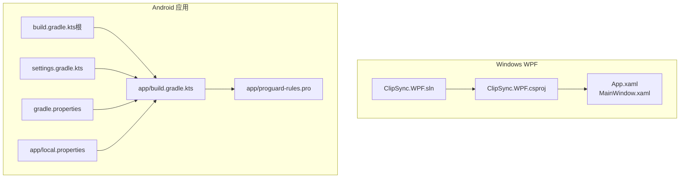
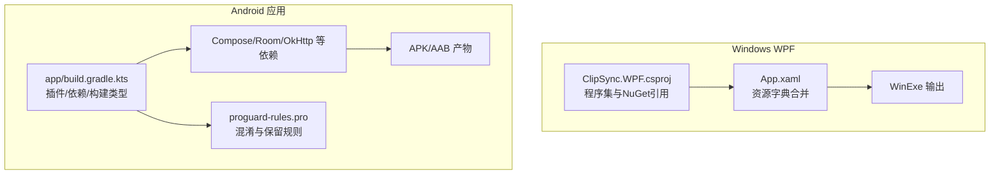
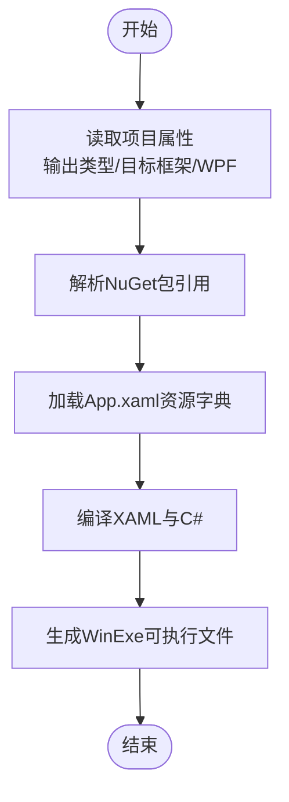
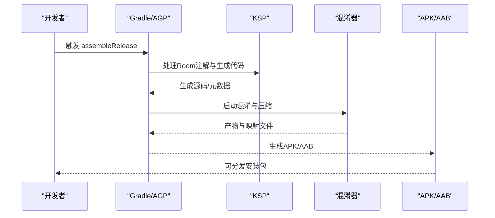
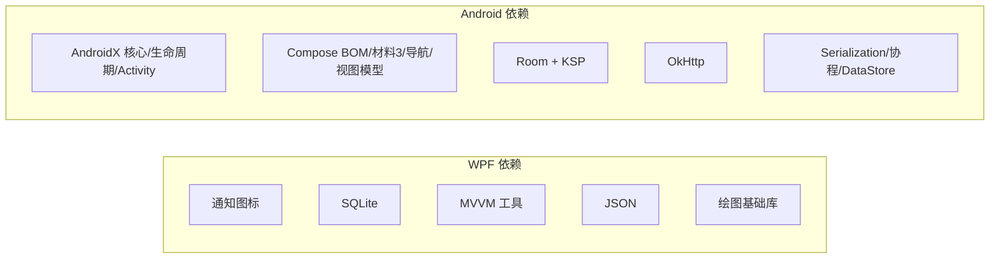

# 客户端打包

<cite>
**本文引用的文件**
- [clipSync.WPF.csproj](file://clipSync-windows/ClipSync.WPF/ClipSync.WPF.csproj)
- [ClipSync.WPF.sln](file://clipSync-windows/ClipSync.WPF.sln)
- [App.xaml](file://clipSync-windows/ClipSync.WPF/App.xaml)
- [MainWindow.xaml](file://clipSync-windows/ClipSync.WPF/MainWindow.xaml)
- [build.gradle.kts（应用模块）](file://clipSync-android/app/build.gradle.kts)
- [build.gradle.kts（根项目）](file://clipSync-android/build.gradle.kts)
- [proguard-rules.pro](file://clipSync-android/app/proguard-rules.pro)
- [gradle.properties](file://clipSync-android/gradle.properties)
- [local.properties](file://clipSync-android/app/local.properties)
- [settings.gradle.kts](file://clipSync-android/settings.gradle.kts)
</cite>

## 目录
1. [简介](#简介)
2. [项目结构](#项目结构)
3. [核心组件](#核心组件)
4. [架构总览](#架构总览)
5. [详细组件分析](#详细组件分析)
6. [依赖分析](#依赖分析)
7. [性能考虑](#性能考虑)
8. [故障排查指南](#故障排查指南)
9. [结论](#结论)
10. [附录](#附录)

## 简介
本文件面向ClipSync客户端的打包与发布，覆盖Windows WPF与Android应用的构建、打包与发布流程。内容包括：
- Windows WPF：MSBuild与Visual Studio解决方案配置、程序集引用、资源嵌入、输出目录与程序集信息。
- Android：Gradle构建配置、签名与混淆策略、打包产物与版本管理。
- CI/CD建议：自动化流水线、代码签名与发布渠道管理。
- 常见问题：依赖缺失、签名失败、资源找不到等。

目标是让初学者快速上手，同时为有经验的开发者提供可落地的技术细节与参考路径。

## 项目结构
- Windows WPF位于clipSync-windows/ClipSync.WPF，使用.NET 8与WPF，通过Visual Studio解决方案组织。
- Android位于clipSync-android，采用Kotlin DSL的Gradle脚本，Compose与Room等现代化组件已启用。

图表来源
- [ClipSync.WPF.sln:1-20](file://clipSync-windows/ClipSync.WPF.sln#L1-L20)
- [ClipSync.WPF.csproj:1-24](file://clipSync-windows/ClipSync.WPF/ClipSync.WPF.csproj#L1-L24)
- [App.xaml:1-13](file://clipSync-windows/ClipSync.WPF/App.xaml#L1-L13)
- [MainWindow.xaml:1-119](file://clipSync-windows/ClipSync.WPF/MainWindow.xaml#L1-L119)
- [build.gradle.kts（应用模块）:1-102](file://clipSync-android/app/build.gradle.kts#L1-L102)
- [build.gradle.kts（根项目）:1-8](file://clipSync-android/build.gradle.kts#L1-L8)
- [settings.gradle.kts:1-18](file://clipSync-android/settings.gradle.kts#L1-L18)
- [gradle.properties:1-2](file://clipSync-android/gradle.properties#L1-L2)
- [local.properties:1-9](file://clipSync-android/app/local.properties#L1-L9)
- [proguard-rules.pro:1-16](file://clipSync-android/app/proguard-rules.pro#L1-L16)

章节来源
- [ClipSync.WPF.sln:1-20](file://clipSync-windows/ClipSync.WPF.sln#L1-L20)
- [ClipSync.WPF.csproj:1-24](file://clipSync-windows/ClipSync.WPF/ClipSync.WPF.csproj#L1-L24)
- [build.gradle.kts（应用模块）:1-102](file://clipSync-android/app/build.gradle.kts#L1-L102)
- [build.gradle.kts（根项目）:1-8](file://clipSync-android/build.gradle.kts#L1-L8)
- [settings.gradle.kts:1-18](file://clipSync-android/settings.gradle.kts#L1-L18)
- [gradle.properties:1-2](file://clipSync-android/gradle.properties#L1-L2)
- [local.properties:1-9](file://clipSync-android/app/local.properties#L1-L9)
- [proguard-rules.pro:1-16](file://clipSync-android/app/proguard-rules.pro#L1-L16)

## 核心组件
- Windows WPF
  - 项目SDK与目标框架：使用Microsoft.NET.Sdk，目标框架为net8.0-windows。
  - UI框架：启用WPF，输出类型为WinExe。
  - 关键NuGet包：通知图标、SQLite、MVVM工具、JSON序列化、绘图基础库。
  - 资源引用：在App.xaml中合并样式资源，MainWindow.xaml定义界面布局与主题资源引用。
- Android 应用
  - 插件与编译参数：Android应用插件、Kotlin、KSP、Serialization插件；Java/Kotlin编译目标为17。
  - 构建类型：release开启混淆与压缩，debug关闭混淆；Compose启用。
  - 依赖：AndroidX、Jetpack Compose、Navigation、Room（含KSP）、OkHttp、Serialization、协程、DataStore。
  - 混淆规则：保留kotlinx.serialization、Room实体、OkHttp、协程相关类名与注解。
  - 打包排除：META-INF许可证重复项排除。

章节来源
- [ClipSync.WPF.csproj:1-24](file://clipSync-windows/ClipSync.WPF/ClipSync.WPF.csproj#L1-L24)
- [App.xaml:1-13](file://clipSync-windows/ClipSync.WPF/App.xaml#L1-L13)
- [MainWindow.xaml:1-119](file://clipSync-windows/ClipSync.WPF/MainWindow.xaml#L1-L119)
- [build.gradle.kts（应用模块）:1-102](file://clipSync-android/app/build.gradle.kts#L1-L102)
- [proguard-rules.pro:1-16](file://clipSync-android/app/proguard-rules.pro#L1-L16)

## 架构总览
下图展示了两个平台的构建与打包关键点，以及资源与依赖关系：

图表来源
- [ClipSync.WPF.csproj:1-24](file://clipSync-windows/ClipSync.WPF/ClipSync.WPF.csproj#L1-L24)
- [App.xaml:1-13](file://clipSync-windows/ClipSync.WPF/App.xaml#L1-L13)
- [build.gradle.kts（应用模块）:1-102](file://clipSync-android/app/build.gradle.kts#L1-L102)
- [proguard-rules.pro:1-16](file://clipSync-android/app/proguard-rules.pro#L1-L16)

## 详细组件分析

### Windows WPF 组件分析
- 项目属性与输出
  - 输出类型为WinExe，目标框架为net8.0-windows，启用WPF。
  - 程序集名称与根命名空间用于统一标识与避免冲突。
- NuGet 包引用
  - 通知图标、SQLite、MVVM工具、JSON、绘图基础库等，满足系统托盘、本地存储、UI MVVM与数据序列化需求。
- 资源与样式
  - 在App.xaml中合并资源字典，MainWindow.xaml引用静态资源实现主题化外观与交互控件。
- 构建与调试
  - Visual Studio解决方案定义了Debug/Release配置，配合csproj中的属性即可完成常规构建。

图表来源
- [ClipSync.WPF.csproj:1-24](file://clipSync-windows/ClipSync.WPF/ClipSync.WPF.csproj#L1-L24)
- [App.xaml:1-13](file://clipSync-windows/ClipSync.WPF/App.xaml#L1-L13)
- [MainWindow.xaml:1-119](file://clipSync-windows/ClipSync.WPF/MainWindow.xaml#L1-L119)

章节来源
- [ClipSync.WPF.csproj:1-24](file://clipSync-windows/ClipSync.WPF/ClipSync.WPF.csproj#L1-L24)
- [App.xaml:1-13](file://clipSync-windows/ClipSync.WPF/App.xaml#L1-L13)
- [MainWindow.xaml:1-119](file://clipSync-windows/ClipSync.WPF/MainWindow.xaml#L1-L119)
- [ClipSync.WPF.sln:1-20](file://clipSync-windows/ClipSync.WPF.sln#L1-L20)

### Android 组件分析
- 构建脚本与仓库
  - 根级build.gradle.kts集中声明插件版本，app/build.gradle.kts定义应用域配置。
  - settings.gradle.kts设置仓库与模块包含，确保依赖解析一致。
- 编译与构建类型
  - compileSdk/targetSdk/minSdk/versionCode/versionName明确；release开启混淆与压缩，debug关闭。
  - Java/Kotlin编译目标均为17，Compose启用并配置扩展版本。
- 依赖与打包
  - 依赖矩阵覆盖AndroidX、Compose、Navigation、Room（KSP）、OkHttp、Serialization、协程、DataStore。
  - packaging.resources.excludes排除重复的META-INF许可证，避免打包冲突。
- 混淆与保留
  - 保留kotlinx.serialization注解与类、Room实体类、OkHttp相关警告豁免、协程相关类名与异常处理器。

图表来源
- [build.gradle.kts（应用模块）:1-102](file://clipSync-android/app/build.gradle.kts#L1-L102)
- [build.gradle.kts（根项目）:1-8](file://clipSync-android/build.gradle.kts#L1-L8)
- [proguard-rules.pro:1-16](file://clipSync-android/app/proguard-rules.pro#L1-L16)

章节来源
- [build.gradle.kts（应用模块）:1-102](file://clipSync-android/app/build.gradle.kts#L1-L102)
- [build.gradle.kts（根项目）:1-8](file://clipSync-android/build.gradle.kts#L1-L8)
- [settings.gradle.kts:1-18](file://clipSync-android/settings.gradle.kts#L1-L18)
- [gradle.properties:1-2](file://clipSync-android/gradle.properties#L1-L2)
- [local.properties:1-9](file://clipSync-android/app/local.properties#L1-L9)
- [proguard-rules.pro:1-16](file://clipSync-android/app/proguard-rules.pro#L1-L16)

## 依赖分析
- Windows WPF
  - 第三方库：通知图标、SQLite、MVVM工具、JSON、绘图基础库。
  - 运行时要求：.NET 8运行时与Windows WPF支持。
- Android
  - 依赖分层：AndroidX基础层、Compose UI层、Room持久化层、网络层（OkHttp）、序列化与协程、DataStore偏好。
  - 版本策略：Compose BOM统一版本，Room通过KSP编译器生成代码。

图表来源
- [ClipSync.WPF.csproj:13-19](file://clipSync-windows/ClipSync.WPF/ClipSync.WPF.csproj#L13-L19)
- [build.gradle.kts（应用模块）:57-101](file://clipSync-android/app/build.gradle.kts#L57-L101)

章节来源
- [ClipSync.WPF.csproj:13-19](file://clipSync-windows/ClipSync.WPF/ClipSync.WPF.csproj#L13-L19)
- [build.gradle.kts（应用模块）:57-101](file://clipSync-android/app/build.gradle.kts#L57-L101)

## 性能考虑
- Windows WPF
  - 使用MVVM工具降低UI与逻辑耦合，减少主线程阻塞。
  - SQLite访问应避免在UI线程执行，结合异步模式提升响应性。
- Android
  - release构建启用混淆与压缩，减小体积并提升安全性。
  - Compose预览与调试工具仅在debug启用，避免影响release性能。
  - Room查询与DAO操作建议使用协程与异步API，避免ANR。

## 故障排查指南
- Windows WPF
  - 依赖缺失：检查NuGet包是否完整还原，确认目标框架与WPF启用正确。
  - 资源找不到：确认App.xaml中资源字典路径与MainWindow.xaml引用的静态资源存在且拼写正确。
  - 程序集信息：核对程序集名称与根命名空间，避免多项目冲突。
- Android
  - 依赖解析失败：检查settings.gradle.kts仓库配置与gradle.properties中的路径检查开关。
  - SDK路径问题：local.properties需指向正确的Android SDK路径。
  - 混淆导致崩溃：根据proguard-rules.pro逐项核对保留规则，尤其是序列化、Room实体、OkHttp与协程相关类。
  - 打包冲突：确认META-INF排除规则生效，避免重复许可证文件导致打包失败。
  - 构建类型混淆：release必须保持混淆开启以获得最小化产物，debug关闭以便调试。

章节来源
- [ClipSync.WPF.csproj:1-24](file://clipSync-windows/ClipSync.WPF/ClipSync.WPF.csproj#L1-L24)
- [App.xaml:1-13](file://clipSync-windows/ClipSync.WPF/App.xaml#L1-L13)
- [MainWindow.xaml:1-119](file://clipSync-windows/ClipSync.WPF/MainWindow.xaml#L1-L119)
- [build.gradle.kts（应用模块）:1-102](file://clipSync-android/app/build.gradle.kts#L1-L102)
- [gradle.properties:1-2](file://clipSync-android/gradle.properties#L1-L2)
- [local.properties:1-9](file://clipSync-android/app/local.properties#L1-L9)
- [proguard-rules.pro:1-16](file://clipSync-android/app/proguard-rules.pro#L1-L16)

## 结论
- Windows WPF与Android应用均采用现代构建体系：前者基于.NET 8与WPF，后者基于Kotlin DSL与Gradle。
- 两者在release构建中均强调依赖管理、资源与样式整合、以及安全与体积优化（混淆/压缩）。
- 建议在CI/CD中固化构建命令、签名与发布流程，确保一致性与可追溯性。

## 附录
- Windows WPF 构建与打包要点
  - 解决方案配置：通过ClipSync.WPF.sln定义Debug/Release配置。
  - 项目配置：ClipSync.WPF.csproj定义输出类型、目标框架、WPF启用、程序集名称与根命名空间。
  - 资源引用：App.xaml合并资源字典，MainWindow.xaml引用静态资源。
  - 常用命令（示例）
    - 恢复包：dotnet restore
    - 构建：dotnet build -c Release
    - 发布（自包含/框架依赖可按需配置）：dotnet publish -c Release
- Android 构建与打包要点
  - 插件与版本：根级build.gradle.kts集中声明插件版本；app/build.gradle.kts定义应用域配置。
  - 构建类型：release开启混淆与压缩，debug关闭；compileOptions/kotlinOptions统一到Java/Kotlin 17。
  - 依赖矩阵：Compose、Navigation、Room（KSP）、OkHttp、Serialization、协程、DataStore。
  - 混淆规则：保留kotlinx.serialization、Room实体、OkHttp、协程相关类名与注解。
  - 打包排除：META-INF重复许可证排除。
  - 常用命令（示例）
    - 清理：./gradlew clean
    - 构建release：./gradlew assembleRelease
    - 生成AAB（发布到Google Play）：./gradlew bundleRelease
  - 签名与发布
    - Android建议在CI中配置密钥库与签名参数，避免明文存储在仓库。
    - 发布渠道：可通过Gradle构建变体或多渠道打包策略管理不同发布渠道。
- CI/CD 建议
  - Windows：在CI中安装.NET 8 SDK与Visual Studio组件，执行restore/build/publish。
  - Android：在CI中安装Android SDK/NDK与JDK 17，执行clean assembleRelease/bundleRelease，上传产物与符号表。