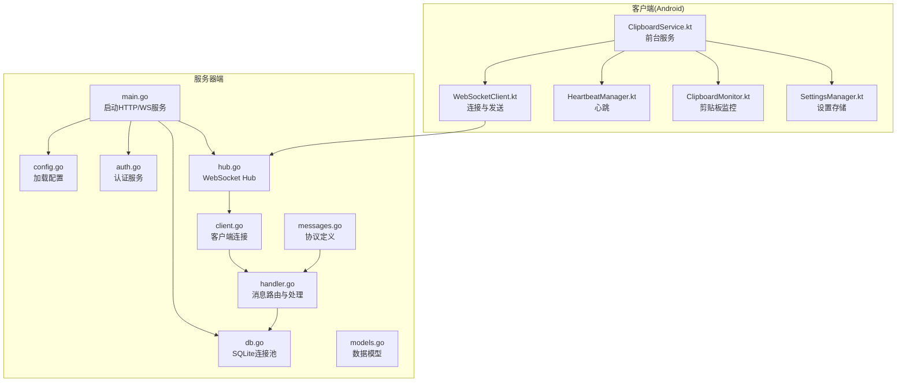
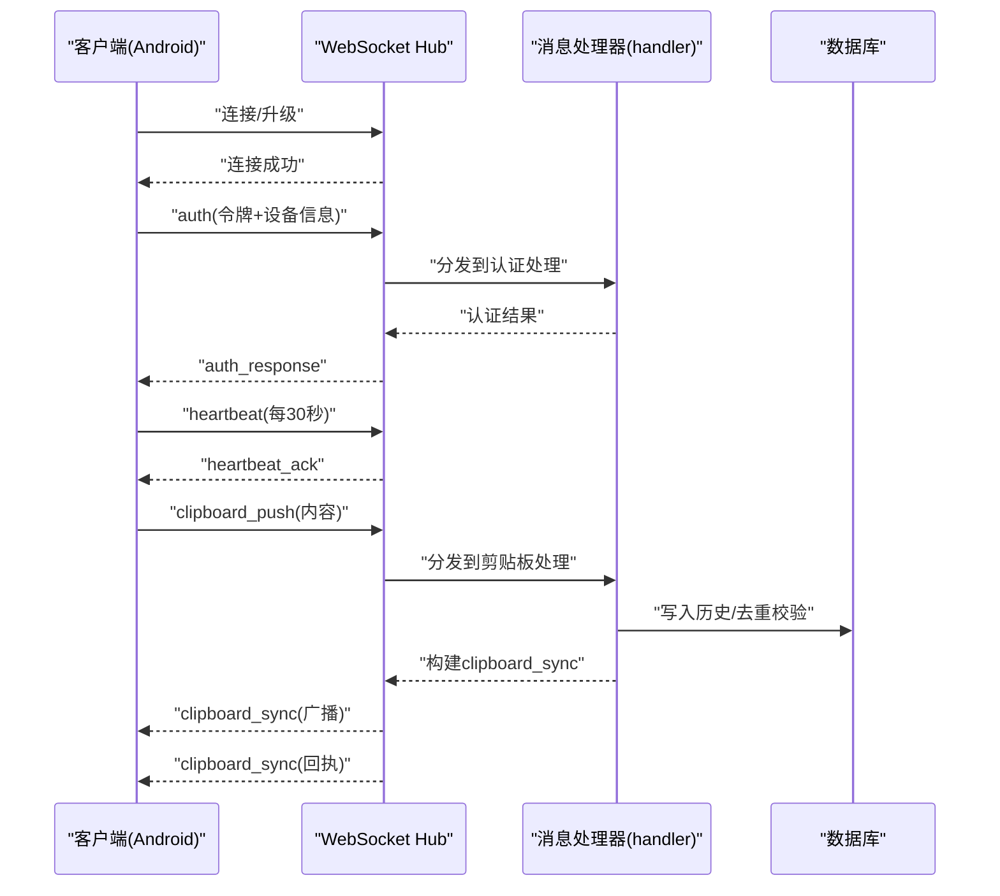
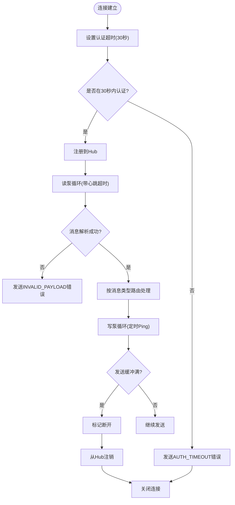
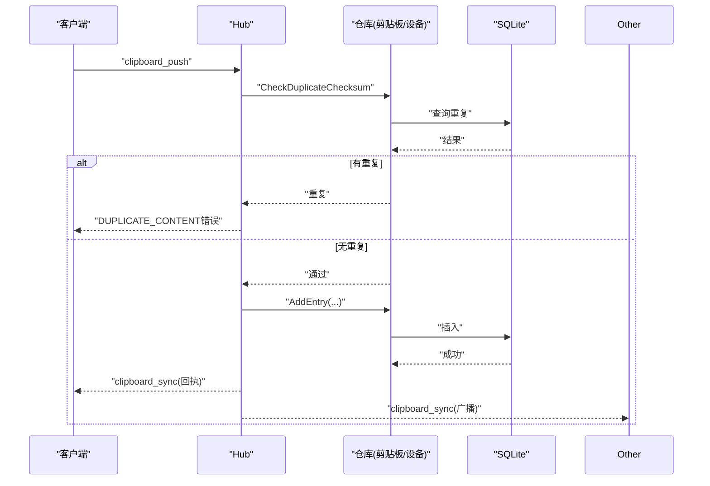
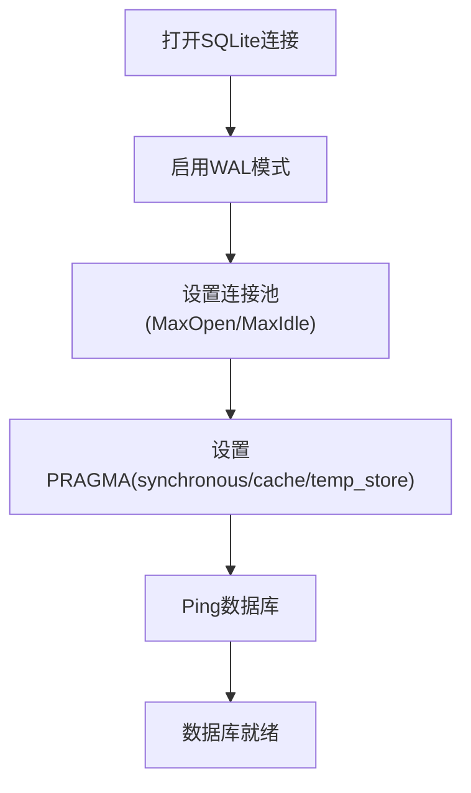
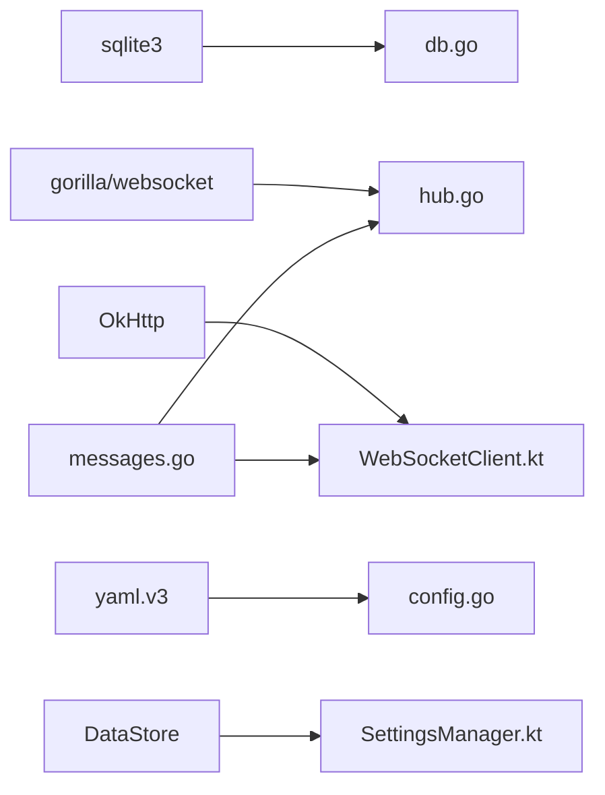

# 故障排除

<cite>
**本文引用的文件**
- [hub.go](file://clipSync-server/internal/websocket/hub.go)
- [client.go](file://clipSync-server/internal/websocket/client.go)
- [handler.go](file://clipSync-server/internal/websocket/handler.go)
- [protocol.go](file://clipSync-server/internal/websocket/protocol.go)
- [messages.go](file://clipSync-server/pkg/protocol/messages.go)
- [db.go](file://clipSync-server/internal/database/db.go)
- [models.go](file://clipSync-server/internal/database/models.go)
- [main.go](file://clipSync-server/cmd/server/main.go)
- [config.go](file://clipSync-server/internal/config/config.go)
- [auth.go](file://clipSync-server/internal/auth/auth.go)
- [SettingsManager.kt](file://clipSync-android/app/src/main/java/com/clipsync/app/core/SettingsManager.kt)
- [WebSocketClient.kt](file://clipSync-android/app/src/main/java/com/clipsync/app/network/WebSocketClient.kt)
- [ClipboardMonitor.kt](file://clipSync-android/app/src/main/java/com/clipsync/app/core/ClipboardMonitor.kt)
- [ClipboardService.kt](file://clipSync-android/app/src/main/java/com/clipsync/app/service/ClipboardService.kt)
- [HeartbeatManager.kt](file://clipSync-android/app/src/main/java/com/clipsync/app/network/HeartbeatManager.kt)
- [test-protocol-compatibility.ps1](file://scripts/test-protocol-compatibility.ps1)
</cite>

## 目录
1. [简介](#简介)
2. [项目结构](#项目结构)
3. [核心组件](#核心组件)
4. [架构总览](#架构总览)
5. [详细组件分析](#详细组件分析)
6. [依赖分析](#依赖分析)
7. [性能考虑](#性能考虑)
8. [故障排除指南](#故障排除指南)
9. [结论](#结论)
10. [附录](#附录)

## 简介
本文件面向运维与开发人员，系统化梳理 ClipSync 的故障排除流程与方法，覆盖 WebSocket 连接问题、数据库连接与性能、客户端常见问题（剪贴板监控、同步延迟、设置重置）、日志分析与错误码解读、配置检查清单、网络连通性测试、数据库健康检查脚本以及常见部署问题。文档以代码为依据，提供可操作的排障步骤与可视化图示，兼顾初学者易读性与资深工程师的技术深度。

## 项目结构
- 服务器端（Go）：负责认证、设备管理、剪贴板历史、WebSocket Hub、HTTP API、SQLite 数据库存储。
- 客户端（Android）：前台服务持续监控剪贴板，通过 WebSocket 同步消息，心跳保活，自动重连。
- 协议层：统一的消息类型、负载结构与版本号，确保跨平台一致性。
- 脚本：协议兼容性测试脚本，辅助验证各端实现一致性。

**图表来源**
- [main.go:21-146](file://clipSync-server/cmd/server/main.go#L21-L146)
- [hub.go:18-58](file://clipSync-server/internal/websocket/hub.go#L18-L58)
- [client.go:13-31](file://clipSync-server/internal/websocket/client.go#L13-L31)
- [handler.go:10-31](file://clipSync-server/internal/websocket/handler.go#L10-L31)
- [db.go:12-56](file://clipSync-server/internal/database/db.go#L12-L56)
- [messages.go:5-132](file://clipSync-server/pkg/protocol/messages.go#L5-L132)
- [ClipboardService.kt:39-249](file://clipSync-android/app/src/main/java/com/clipsync/app/service/ClipboardService.kt#L39-L249)
- [WebSocketClient.kt:26-156](file://clipSync-android/app/src/main/java/com/clipsync/app/network/WebSocketClient.kt#L26-L156)
- [HeartbeatManager.kt:16-75](file://clipSync-android/app/src/main/java/com/clipsync/app/network/HeartbeatManager.kt#L16-L75)
- [ClipboardMonitor.kt:15-106](file://clipSync-android/app/src/main/java/com/clipsync/app/core/ClipboardMonitor.kt#L15-L106)
- [SettingsManager.kt:21-170](file://clipSync-android/app/src/main/java/com/clipsync/app/core/SettingsManager.kt#L21-L170)

**章节来源**
- [main.go:21-146](file://clipSync-server/cmd/server/main.go#L21-L146)
- [config.go:10-72](file://clipSync-server/internal/config/config.go#L10-L72)

## 核心组件
- WebSocket Hub：维护连接、广播消息、心跳超时、设备在线状态统计与断开策略。
- 客户端连接：读写泵、心跳保活、错误回传、发送缓冲区溢出处理。
- 认证与授权：JWT 生成与校验，WebSocket 认证。
- 数据库：SQLite WAL 模式、连接池、PRAGMA 优化、Ping 校验。
- 协议：统一消息类型、版本号、错误码常量。
- Android 前台服务：剪贴板监控、心跳、自动重连、消息处理与历史拉取。

**章节来源**
- [hub.go:18-153](file://clipSync-server/internal/websocket/hub.go#L18-L153)
- [client.go:13-150](file://clipSync-server/internal/websocket/client.go#L13-L150)
- [handler.go:10-392](file://clipSync-server/internal/websocket/handler.go#L10-L392)
- [db.go:12-56](file://clipSync-server/internal/database/db.go#L12-L56)
- [messages.go:107-132](file://clipSync-server/pkg/protocol/messages.go#L107-L132)
- [ClipboardService.kt:39-249](file://clipSync-android/app/src/main/java/com/clipsync/app/service/ClipboardService.kt#L39-L249)

## 架构总览
服务器端通过独立的 HTTP 与 WebSocket 服务对外提供能力；客户端通过 OkHttp 连接 WebSocket，周期性发送心跳，自动重连，收到服务端消息后进行本地处理与持久化。

**图表来源**
- [handler.go:33-234](file://clipSync-server/internal/websocket/handler.go#L33-L234)
- [hub.go:182-208](file://clipSync-server/internal/websocket/hub.go#L182-L208)
- [client.go:33-117](file://clipSync-server/internal/websocket/client.go#L33-L117)
- [db.go:12-56](file://clipSync-server/internal/database/db.go#L12-L56)

## 详细组件分析

### WebSocket Hub 与客户端连接
- Hub 维护客户端映射、注册/注销通道、广播通道、心跳超时、历史条数限制、在线计数。
- 客户端读泵设置读超时与 Pong 处理器，写泵定时 Ping 并批量写出队列消息；发送缓冲满时记录告警。
- 连接建立后 30 秒内未认证则断开，并返回错误码。

**图表来源**
- [hub.go:189-229](file://clipSync-server/internal/websocket/hub.go#L189-L229)
- [client.go:33-117](file://clipSync-server/internal/websocket/client.go#L33-L117)
- [handler.go:10-31](file://clipSync-server/internal/websocket/handler.go#L10-L31)

**章节来源**
- [hub.go:18-153](file://clipSync-server/internal/websocket/hub.go#L18-L153)
- [client.go:13-150](file://clipSync-server/internal/websocket/client.go#L13-L150)
- [protocol.go:9-27](file://clipSync-server/internal/websocket/protocol.go#L9-L27)

### 消息处理与广播
- 认证：校验 JWT，设置客户端身份，更新设备最后在线时间，注册到 Hub。
- 心跳：返回 ack 并更新设备最后在线时间。
- 剪贴板推送：去重校验、入库、构造同步消息并广播给同用户其他设备，同时回执给发送方。
- 历史拉取：按 limit/after_id 查询历史并返回。
- 设备列表：返回设备清单并标记在线状态。
- 设备注销：删除设备并断开当前在线连接。

**图表来源**
- [handler.go:142-234](file://clipSync-server/internal/websocket/handler.go#L142-L234)
- [db.go:12-56](file://clipSync-server/internal/database/db.go#L12-L56)

**章节来源**
- [handler.go:33-392](file://clipSync-server/internal/websocket/handler.go#L33-L392)

### 数据库连接与优化
- 使用 sqlite3 驱动，WAL 模式提升并发读性能。
- 连接池：最大打开连接数、空闲连接数限制。
- PRAGMA 优化：同步模式、缓存大小、临时表内存存储。
- 启动时执行 Ping 校验，确保数据库可达。

**图表来源**
- [db.go:17-56](file://clipSync-server/internal/database/db.go#L17-L56)

**章节来源**
- [db.go:12-56](file://clipSync-server/internal/database/db.go#L12-L56)
- [models.go:3-46](file://clipSync-server/internal/database/models.go#L3-L46)

### 协议与错误码
- 消息类型：auth、heartbeat、clipboard_push/pull/sync、device_list、device_unregister、error、ping/pong。
- 错误码：AUTH_FAILED、TOKEN_EXPIRED、RATE_LIMITED、INVALID_PAYLOAD、CONTENT_TOO_LARGE、DEVICE_NOT_FOUND、INTERNAL_ERROR、DUPLICATE_CONTENT、AUTH_TIMEOUT 等。
- 版本号：协议版本常量，用于兼容性校验。

**章节来源**
- [messages.go:107-132](file://clipSync-server/pkg/protocol/messages.go#L107-L132)
- [test-protocol-compatibility.ps1:146-150](file://scripts/test-protocol-compatibility.ps1#L146-L150)

## 依赖分析
- 服务器端依赖：gorilla/websocket、sqlite3 驱动、YAML 配置解析。
- 客户端依赖：OkHttp WebSocket、Kotlin 协程、DataStore Preferences。
- 协议层：跨端共享的消息结构与常量。

**图表来源**
- [hub.go:3-16](file://clipSync-server/internal/websocket/hub.go#L3-L16)
- [db.go:3-10](file://clipSync-server/internal/database/db.go#L3-L10)
- [config.go:3-8](file://clipSync-server/internal/config/config.go#L3-L8)
- [WebSocketClient.kt:14-20](file://clipSync-android/app/src/main/java/com/clipsync/app/network/WebSocketClient.kt#L14-L20)
- [SettingsManager.kt:3-13](file://clipSync-android/app/src/main/java/com/clipsync/app/core/SettingsManager.kt#L3-L13)
- [messages.go:3](file://clipSync-server/pkg/protocol/messages.go#L3)

**章节来源**
- [main.go:3-17](file://clipSync-server/cmd/server/main.go#L3-L17)
- [config.go:38-55](file://clipSync-server/internal/config/config.go#L38-L55)

## 性能考虑
- 连接池：服务器端 SQLite 最大打开连接数与空闲连接数已配置，避免高并发下的连接争用。
- 发送缓冲：客户端写泵使用固定容量发送通道，缓冲满时会触发断开策略，建议降低消息频率或增大缓冲。
- 心跳间隔：客户端与服务端均采用 30 秒心跳，确保网络波动下及时发现断线。
- PRAGMA 优化：WAL、NORMAL 同步、缓存与内存临时表提升读性能。
- 广播路径：Hub 在广播时先尝试非阻塞发送，遇到满载则标记断开，避免阻塞主循环。

**章节来源**
- [db.go:29-50](file://clipSync-server/internal/database/db.go#L29-L50)
- [client.go:69-117](file://clipSync-server/internal/websocket/client.go#L69-L117)
- [hub.go:81-110](file://clipSync-server/internal/websocket/hub.go#L81-L110)

## 故障排除指南

### 一、WebSocket 连接问题排查
- 检查 Hub 连接状态
  - 关注连接建立日志与断开日志，确认是否存在大量“AUTH_TIMEOUT”导致的早期断开。
  - 观察客户端数量统计变化，判断是否有异常断开风暴。
  - 参考：[hub.go:61-112](file://clipSync-server/internal/websocket/hub.go#L61-L112)，[hub.go:189-208](file://clipSync-server/internal/websocket/hub.go#L189-L208)

- 网络延迟与丢包
  - 客户端心跳间隔为 30 秒，若网络抖动严重可适当缩短心跳超时。
  - Hub 的读超时由心跳超时参数控制，建议结合实际网络环境调整。
  - 参考：[client.go:40-45](file://clipSync-server/internal/websocket/client.go#L40-L45)，[config.go:20](file://clipSync-server/internal/config/config.go#L20)

- 防火墙与跨域
  - WebSocket 升级器默认允许所有来源，生产环境需限制来源。
  - 端口开放情况：HTTP 与 WebSocket 分别监听不同端口，确保防火墙放行。
  - 参考：[protocol.go:10-18](file://clipSync-server/internal/websocket/protocol.go#L10-L18)，[main.go:112-125](file://clipSync-server/cmd/server/main.go#L112-L125)

- 断开原因定位
  - 读取错误且为意外关闭时记录日志；检查客户端发送缓冲是否频繁满载。
  - Hub 在广播时遇到发送缓冲满载会标记断开，属于保护机制。
  - 参考：[client.go:33-67](file://clipSync-server/internal/websocket/client.go#L33-L67)，[hub.go:91-110](file://clipSync-server/internal/websocket/hub.go#L91-L110)

- 消息丢失排查
  - 客户端写泵会批量写出队列消息，若瞬时积压过大可能造成丢弃；建议降低消息发送速率或增大发送通道容量。
  - Hub 广播时非阻塞发送，满载即断开，需关注客户端消费能力。
  - 参考：[client.go:77-104](file://clipSync-server/internal/websocket/client.go#L77-L104)，[hub.go:91-98](file://clipSync-server/internal/websocket/hub.go#L91-L98)

- 服务器端调试要点
  - 在 HandleWebSocket 中增加更详细的错误日志，区分“升级失败”、“认证超时”、“解析失败”等场景。
  - 在 sendError 中统一错误格式，便于客户端侧分类处理。
  - 参考：[hub.go:182-229](file://clipSync-server/internal/websocket/hub.go#L182-L229)，[messages.go:101-105](file://clipSync-server/pkg/protocol/messages.go#L101-L105)

**章节来源**
- [hub.go:61-112](file://clipSync-server/internal/websocket/hub.go#L61-L112)
- [client.go:33-117](file://clipSync-server/internal/websocket/client.go#L33-L117)
- [protocol.go:10-18](file://clipSync-server/internal/websocket/protocol.go#L10-L18)
- [main.go:112-125](file://clipSync-server/cmd/server/main.go#L112-L125)

### 二、数据库连接问题诊断
- 连接池配置
  - 最大打开连接数与空闲连接数已设定，若出现“连接过多”或“等待超时”，可评估并发峰值并调优。
  - 参考：[db.go:29-32](file://clipSync-server/internal/database/db.go#L29-L32)

- SQL 查询优化
  - WAL 模式与 NORMAL 同步、缓存与内存临时表已启用，适合读多写少场景。
  - 若历史查询慢，检查索引与 LIMIT 设置，必要时增加设备维度索引。
  - 参考：[db.go:33-49](file://clipSync-server/internal/database/db.go#L33-L49)

- 死锁检测
  - SQLite 在 WAL 模式下死锁概率较低，仍可通过减少长事务、拆分批量写入、避免在事务中做耗时操作降低风险。
  - 参考：[db.go:24](file://clipSync-server/internal/database/db.go#L24)

- 健康检查脚本
  - 使用脚本对数据库执行基础查询与连接校验，确保服务启动后数据库可用。
  - 参考：[db.go:51-53](file://clipSync-server/internal/database/db.go#L51-L53)

**章节来源**
- [db.go:12-56](file://clipSync-server/internal/database/db.go#L12-L56)

### 三、客户端常见问题
- 剪贴板监控失效
  - 检查前台服务是否正常运行，ClipboardService 是否启动并开始监控。
  - 若收到服务端消息后本地未更新，检查消息处理分支与数据库写入逻辑。
  - 参考：[ClipboardService.kt:52-82](file://clipSync-android/app/src/main/java/com/clipsync/app/service/ClipboardService.kt#L52-L82)，[ClipboardMonitor.kt:31-44](file://clipSync-android/app/src/main/java/com/clipsync/app/core/ClipboardMonitor.kt#L31-L44)

- 同步延迟
  - 心跳间隔为 30 秒，网络延迟会叠加；可在弱网环境下适当放宽心跳超时。
  - 检查客户端发送缓冲是否频繁满载，必要时降低消息发送频率。
  - 参考：[HeartbeatManager.kt:27-44](file://clipSync-android/app/src/main/java/com/clipsync/app/network/HeartbeatManager.kt#L27-L44)，[client.go:77-104](file://clipSync-server/internal/websocket/client.go#L77-L104)

- 设置重置
  - SettingsManager 提供一键清空设置的能力，可用于恢复出厂设置式重试。
  - 参考：[SettingsManager.kt:158-162](file://clipSync-android/app/src/main/java/com/clipsync/app/core/SettingsManager.kt#L158-L162)

- 自动重连与连接状态
  - ReconnectHandler 实现指数退避重连，观察连续失败次数与最大退避值。
  - 参考：[WebSocketClient.kt:39-44](file://clipSync-android/app/src/main/java/com/clipsync/app/network/WebSocketClient.kt#L39-L44)，[WebSocketClient.kt:73-78](file://clipSync-android/app/src/main/java/com/clipsync/app/network/WebSocketClient.kt#L73-L78)

**章节来源**
- [ClipboardService.kt:39-249](file://clipSync-android/app/src/main/java/com/clipsync/app/service/ClipboardService.kt#L39-L249)
- [ClipboardMonitor.kt:15-106](file://clipSync-android/app/src/main/java/com/clipsync/app/core/ClipboardMonitor.kt#L15-L106)
- [SettingsManager.kt:21-170](file://clipSync-android/app/src/main/java/com/clipsync/app/core/SettingsManager.kt#L21-L170)
- [WebSocketClient.kt:26-156](file://clipSync-android/app/src/main/java/com/clipsync/app/network/WebSocketClient.kt#L26-L156)

### 四、日志分析与错误码解读
- 常见错误码
  - AUTH_FAILED/TOKEN_EXPIRED：认证失败或令牌过期，检查登录流程与刷新逻辑。
  - INVALID_PAYLOAD：消息格式不正确，检查协议版本与字段完整性。
  - DUPLICATE_CONTENT：内容重复，检查去重逻辑与校验和。
  - INTERNAL_ERROR：服务端内部错误，查看数据库写入与仓库层异常。
  - AUTH_TIMEOUT：30 秒内未完成认证，检查客户端令牌准备与网络质量。
  - RATE_LIMITED：HTTP 接口限流，检查客户端重试策略。
  - 参考：[messages.go:101-105](file://clipSync-server/pkg/protocol/messages.go#L101-L105)，[handler.go:34-110](file://clipSync-server/internal/websocket/handler.go#L34-L110)

- 日志定位技巧
  - 服务器端：关注 Hub 注册/注销、广播、sendError、readPump/writePump 的异常路径。
  - 客户端：关注连接状态变化、重连退避、消息接收与处理分支。
  - 参考：[hub.go:61-112](file://clipSync-server/internal/websocket/hub.go#L61-L112)，[client.go:33-117](file://clipSync-server/internal/websocket/client.go#L33-L117)，[WebSocketClient.kt:46-78](file://clipSync-android/app/src/main/java/com/clipsync/app/network/WebSocketClient.kt#L46-L78)

**章节来源**
- [messages.go:101-105](file://clipSync-server/pkg/protocol/messages.go#L101-L105)
- [handler.go:34-110](file://clipSync-server/internal/websocket/handler.go#L34-L110)
- [client.go:33-117](file://clipSync-server/internal/websocket/client.go#L33-L117)
- [WebSocketClient.kt:46-78](file://clipSync-android/app/src/main/java/com/clipsync/app/network/WebSocketClient.kt#L46-L78)

### 五、配置检查清单（SettingsManager）
- 服务器地址与 HTTP 地址
  - 默认地址用于开发环境，生产需替换为真实域名/IP。
  - 参考：[SettingsManager.kt:34-63](file://clipSync-android/app/src/main/java/com/clipsync/app/core/SettingsManager.kt#L34-L63)

- 用户名与令牌
  - 登录后保存令牌，若为空会导致无法连接。
  - 参考：[SettingsManager.kt:79-91](file://clipSync-android/app/src/main/java/com/clipsync/app/core/SettingsManager.kt#L79-L91)，[ClipboardService.kt:131-144](file://clipSync-android/app/src/main/java/com/clipsync/app/service/ClipboardService.kt#L131-L144)

- 设备标识与名称
  - 设备 ID 自动生成，设备名称可自定义；用于服务端设备列表与在线状态。
  - 参考：[SettingsManager.kt:93-127](file://clipSync-android/app/src/main/java/com/clipsync/app/core/SettingsManager.kt#L93-L127)

- 同步开关与加密开关
  - 控制是否启用同步与加密；影响消息内容与传输安全。
  - 参考：[SettingsManager.kt:128-154](file://clipSync-android/app/src/main/java/com/clipsync/app/core/SettingsManager.kt#L128-L154)

- 清空设置
  - 一键清除所有设置，便于重新配置。
  - 参考：[SettingsManager.kt:158-162](file://clipSync-android/app/src/main/java/com/clipsync/app/core/SettingsManager.kt#L158-L162)

**章节来源**
- [SettingsManager.kt:21-170](file://clipSync-android/app/src/main/java/com/clipsync/app/core/SettingsManager.kt#L21-L170)
- [ClipboardService.kt:131-144](file://clipSync-android/app/src/main/java/com/clipsync/app/service/ClipboardService.kt#L131-L144)

### 六、网络连通性测试工具
- 协议兼容性测试脚本
  - 检查 HTTP API 端点、协议版本、心跳配置、加密支持与错误码一致性。
  - 参考：[test-protocol-compatibility.ps1:94-150](file://scripts/test-protocol-compatibility.ps1#L94-L150)

- 心跳与延迟模拟
  - 可在测试环境中模拟网络延迟与错误注入，验证客户端退避与容错能力。
  - 参考：[mock_server.go:161-176](file://clipSync-server/scripts/mock_server.go#L161-L176)

**章节来源**
- [test-protocol-compatibility.ps1:94-150](file://scripts/test-protocol-compatibility.ps1#L94-L150)
- [mock_server.go:161-176](file://clipSync-server/scripts/mock_server.go#L161-L176)

### 七、数据库健康检查脚本
- 启动时 Ping 校验
  - 通过数据库 Ping 确认连接可用，失败时立即终止启动。
  - 参考：[db.go:51-53](file://clipSync-server/internal/database/db.go#L51-L53)

- 运行中健康检查
  - 执行简单查询（如 SELECT 1）与统计表行数，监控数据库响应时间与可用性。
  - 参考：[db.go:12-56](file://clipSync-server/internal/database/db.go#L12-L56)

**章节来源**
- [db.go:51-53](file://clipSync-server/internal/database/db.go#L51-L53)

### 八、常见部署问题
- 服务启动失败
  - 检查配置文件路径与权限，确认配置加载成功且无警告。
  - 参考：[main.go:25-42](file://clipSync-server/cmd/server/main.go#L25-L42)，[config.go:38-55](file://clipSync-server/internal/config/config.go#L38-L55)

- 配置错误
  - JWT 密钥为默认值会触发安全警告；端口冲突或文件路径不存在会导致启动失败。
  - 参考：[config.go:57-71](file://clipSync-server/internal/config/config.go#L57-L71)，[main.go:31-54](file://clipSync-server/cmd/server/main.go#L31-L54)

- 权限不足
  - 数据库目录需具备读写权限；文件存储路径需存在且可写。
  - 参考：[db.go:18-22](file://clipSync-server/internal/database/db.go#L18-L22)

**章节来源**
- [main.go:25-54](file://clipSync-server/cmd/server/main.go#L25-L54)
- [config.go:57-71](file://clipSync-server/internal/config/config.go#L57-L71)
- [db.go:18-22](file://clipSync-server/internal/database/db.go#L18-L22)

## 结论
本指南基于服务器与客户端源码，提供了从连接、协议、数据库到客户端行为的全链路故障排除方法。建议在生产环境：
- 明确安全边界与来源校验；
- 调整心跳与超时参数适配网络；
- 监控数据库健康与连接池使用；
- 使用协议兼容性脚本与日志分析工具快速定位问题；
- 通过设置管理器与自动重连机制保障用户体验。

## 附录
- 协议版本与消息类型对照可参考协议文件常量定义。
- 心跳与错误码清单可参考测试脚本与消息定义文件。