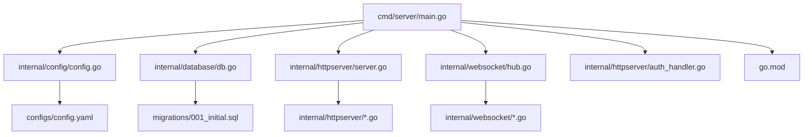
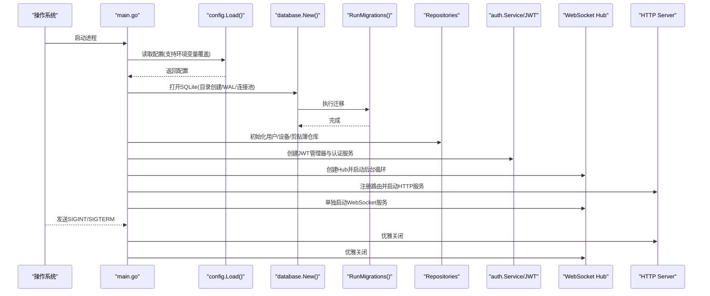
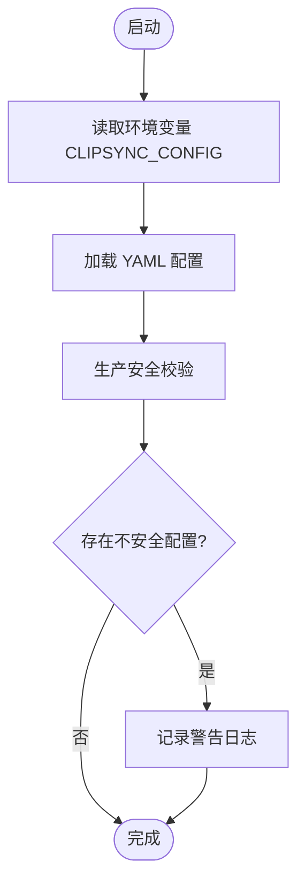
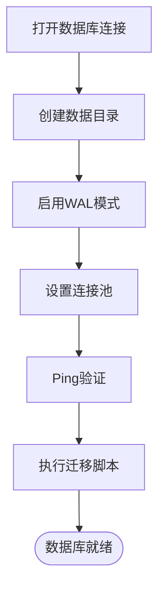
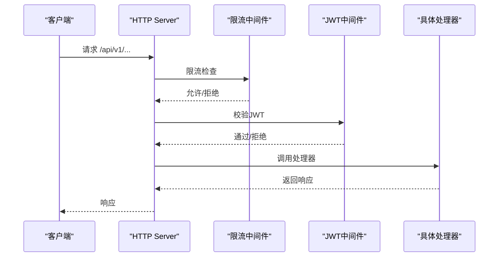
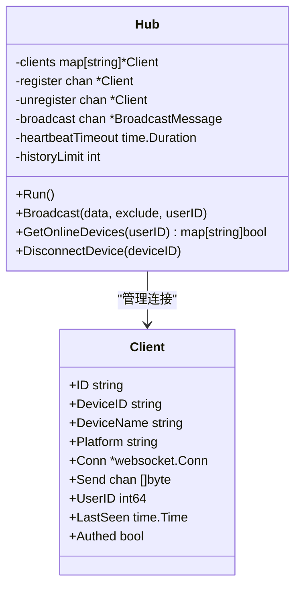
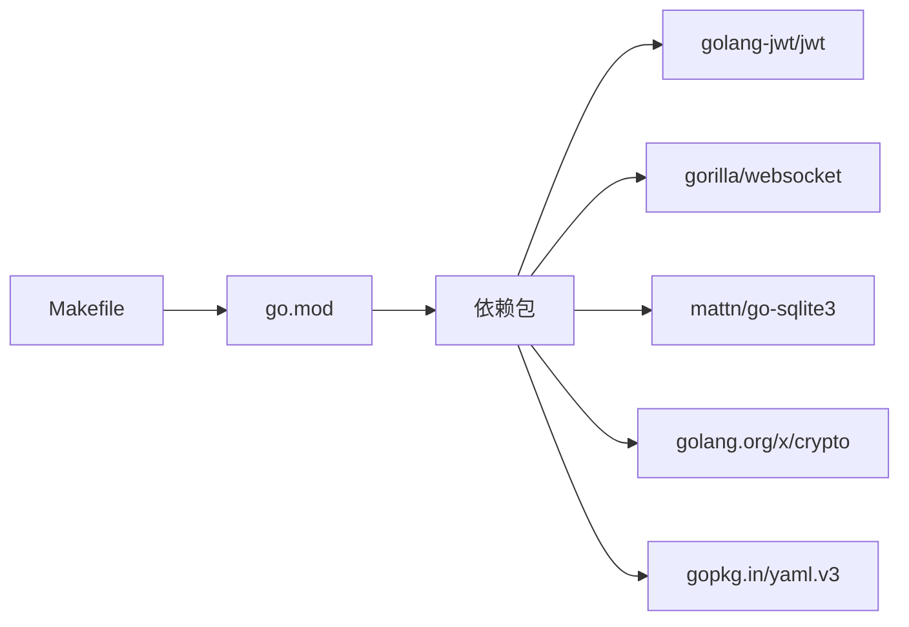

# 服务器部署

<cite>
**本文引用的文件**
- [Makefile](file://clipSync-server/Makefile)
- [main.go](file://clipSync-server/cmd/server/main.go)
- [config.yaml](file://clipSync-server/configs/config.yaml)
- [config.go](file://clipSync-server/internal/config/config.go)
- [server.go](file://clipSync-server/internal/httpserver/server.go)
- [db.go](file://clipSync-server/internal/database/db.go)
- [001_initial.sql](file://clipSync-server/migrations/001_initial.sql)
- [hub.go](file://clipSync-server/internal/websocket/hub.go)
- [auth_handler.go](file://clipSync-server/internal/httpserver/auth_handler.go)
- [go.mod](file://clipSync-server/go.mod)
- [DEVELOPMENT_PLAN.md](file://DEVELOPMENT_PLAN.md)
</cite>

## 目录
1. [简介](#简介)
2. [项目结构](#项目结构)
3. [核心组件](#核心组件)
4. [架构总览](#架构总览)
5. [详细组件分析](#详细组件分析)
6. [依赖关系分析](#依赖关系分析)
7. [性能与容量规划](#性能与容量规划)
8. [部署与配置指南](#部署与配置指南)
9. [常见问题排查](#常见问题排查)
10. [结论](#结论)
11. [附录：API与协议参考](#附录api与协议参考)

## 简介
本文件面向运维与开发工程师，系统性阐述 ClipSync 服务器的构建、部署与配置流程。内容覆盖：
- 使用 Makefile 的构建命令与跨平台编译
- 依赖管理与运行时要求
- 配置文件与环境变量
- 启动流程、端口与数据库初始化
- 容器化（Docker）与 systemd 服务配置建议
- Nginx 反向代理设置
- 常见部署问题定位与解决思路

## 项目结构
clipSync-server 采用模块化的 Go 项目组织方式，入口位于 cmd/server/main.go，核心业务按功能域拆分在 internal 下：
- 配置加载：internal/config
- 数据库：internal/database
- HTTP 服务：internal/httpserver
- WebSocket：internal/websocket
- 认证与中间件：internal/auth
- 协议定义：pkg/protocol
- 迁移脚本：migrations
- 默认配置：configs/config.yaml
- 构建与测试：Makefile、go.mod

**图表来源**
- [main.go:1-146](file://clipSync-server/cmd/server/main.go#L1-L146)
- [config.go:1-72](file://clipSync-server/internal/config/config.go#L1-L72)
- [db.go:1-62](file://clipSync-server/internal/database/db.go#L1-L62)
- [server.go:1-50](file://clipSync-server/internal/httpserver/server.go#L1-L50)
- [hub.go:1-200](file://clipSync-server/internal/websocket/hub.go#L1-L200)
- [auth_handler.go:1-200](file://clipSync-server/internal/httpserver/auth_handler.go#L1-L200)
- [config.yaml:1-29](file://clipSync-server/configs/config.yaml#L1-L29)
- [001_initial.sql:1-55](file://clipSync-server/migrations/001_initial.sql#L1-L55)
- [go.mod:1-14](file://clipSync-server/go.mod#L1-L14)

**章节来源**
- [main.go:1-146](file://clipSync-server/cmd/server/main.go#L1-L146)
- [DEVELOPMENT_PLAN.md:365-422](file://DEVELOPMENT_PLAN.md#L365-L422)

## 核心组件
- 配置系统：从 YAML 加载配置，支持默认值与生产安全校验；可通过环境变量覆盖配置路径。
- 数据库层：SQLite 连接封装，启用 WAL 模式与连接池优化，自动执行迁移。
- HTTP 服务：独立端口监听，路由注册与优雅关闭。
- WebSocket 服务：独立端口监听，Hub 负责连接管理、广播与心跳超时处理。
- 认证与授权：登录/注册/刷新接口，JWT 中间件保护受控路由。

**章节来源**
- [config.go:1-72](file://clipSync-server/internal/config/config.go#L1-L72)
- [config.yaml:1-29](file://clipSync-server/configs/config.yaml#L1-L29)
- [db.go:1-62](file://clipSync-server/internal/database/db.go#L1-L62)
- [server.go:1-50](file://clipSync-server/internal/httpserver/server.go#L1-L50)
- [hub.go:1-200](file://clipSync-server/internal/websocket/hub.go#L1-L200)
- [auth_handler.go:1-200](file://clipSync-server/internal/httpserver/auth_handler.go#L1-L200)

## 架构总览
服务器以“双端口”模式运行：HTTP API 与 WebSocket 分别监听不同端口，共享数据库与认证上下文。启动顺序依次为：加载配置 → 初始化数据库与迁移 → 构建仓库与服务 → 注册路由 → 启动 HTTP 与 WebSocket 服务 → 监听系统信号实现优雅退出。

**图表来源**
- [main.go:21-145](file://clipSync-server/cmd/server/main.go#L21-L145)
- [config.go:38-55](file://clipSync-server/internal/config/config.go#L38-L55)
- [db.go:17-56](file://clipSync-server/internal/database/db.go#L17-L56)
- [server.go:26-49](file://clipSync-server/internal/httpserver/server.go#L26-L49)
- [hub.go:60-112](file://clipSync-server/internal/websocket/hub.go#L60-L112)

## 详细组件分析

### 配置系统与环境变量
- 配置文件：默认路径为 configs/config.yaml，字段包括 WebSocket 端口、HTTP 端口、数据库路径、JWT 密钥与过期时间、文件存储路径、最大文件大小、剪贴簿历史限制、心跳超时等。
- 环境变量：可通过 CLIPSYNC_CONFIG 指定配置文件路径。
- 生产安全校验：若 JWT 密钥仍为默认值或过期时间过长，会输出警告日志。

**图表来源**
- [main.go:26-41](file://clipSync-server/cmd/server/main.go#L26-L41)
- [config.go:38-71](file://clipSync-server/internal/config/config.go#L38-L71)
- [config.yaml:1-29](file://clipSync-server/configs/config.yaml#L1-L29)

**章节来源**
- [config.go:1-72](file://clipSync-server/internal/config/config.go#L1-L72)
- [config.yaml:1-29](file://clipSync-server/configs/config.yaml#L1-L29)
- [main.go:26-41](file://clipSync-server/cmd/server/main.go#L26-L41)

### 数据库初始化与迁移
- 连接策略：自动创建数据库目录，打开 SQLite 并启用 WAL 模式，设置连接池上限与空闲数，优化同步级别与缓存。
- 迁移：启动时自动执行迁移脚本，确保表结构与索引就绪。

**图表来源**
- [db.go:17-56](file://clipSync-server/internal/database/db.go#L17-L56)
- [001_initial.sql:1-55](file://clipSync-server/migrations/001_initial.sql#L1-L55)

**章节来源**
- [db.go:1-62](file://clipSync-server/internal/database/db.go#L1-L62)
- [001_initial.sql:1-55](file://clipSync-server/migrations/001_initial.sql#L1-L55)

### HTTP 服务与路由
- 独立端口监听：HTTP 服务通过内部封装的 Server 类型启动，设置读写超时与空闲超时。
- 路由注册：认证（登录/注册/刷新）、健康检查、设备管理、上传下载等接口均受速率限制与 JWT 中间件保护。
- 优雅关闭：收到系统信号后，先关闭 HTTP 服务，再关闭 WebSocket 服务。

**图表来源**
- [main.go:74-108](file://clipSync-server/cmd/server/main.go#L74-L108)
- [server.go:18-49](file://clipSync-server/internal/httpserver/server.go#L18-L49)
- [auth_handler.go:63-109](file://clipSync-server/internal/httpserver/auth_handler.go#L63-L109)

**章节来源**
- [server.go:1-50](file://clipSync-server/internal/httpserver/server.go#L1-L50)
- [main.go:74-108](file://clipSync-server/cmd/server/main.go#L74-L108)
- [auth_handler.go:1-200](file://clipSync-server/internal/httpserver/auth_handler.go#L1-L200)

### WebSocket 服务与 Hub
- 独立端口：WebSocket 服务单独启动，升级 HTTP 连接为 WebSocket。
- Hub 职责：维护客户端集合、注册/注销、广播消息（排除发送者）、统计在线设备、心跳超时断连。
- 客户端生命周期：未在 30 秒内完成认证则断开；发送缓冲满的客户端会被标记并断开。

**图表来源**
- [hub.go:18-180](file://clipSync-server/internal/websocket/hub.go#L18-L180)

**章节来源**
- [hub.go:1-200](file://clipSync-server/internal/websocket/hub.go#L1-L200)
- [main.go:108-125](file://clipSync-server/cmd/server/main.go#L108-L125)

## 依赖关系分析
- 运行时语言版本：Go 1.26.2
- 关键依赖：JWT、WebSocket、SQLite 驱动、加密工具、YAML 解析
- 构建与测试：Makefile 提供 build/run/test/deps/clean/all 等常用目标

**图表来源**
- [go.mod:1-14](file://clipSync-server/go.mod#L1-L14)
- [Makefile:1-33](file://clipSync-server/Makefile#L1-L33)

**章节来源**
- [go.mod:1-14](file://clipSync-server/go.mod#L1-L14)
- [Makefile:1-33](file://clipSync-server/Makefile#L1-L33)

## 性能与容量规划
- 连接池：SQLite 设置最大打开连接数与空闲连接数，适配 2 核 2G 服务器场景。
- WAL 模式：提升并发读性能，降低锁竞争。
- 心跳与超时：WebSocket 心跳超时可避免僵尸连接占用资源。
- 速率限制：针对认证接口设置每 IP 每分钟请求数限制，缓解暴力破解与滥用。

**章节来源**
- [db.go:29-50](file://clipSync-server/internal/database/db.go#L29-L50)
- [main.go:77-79](file://clipSync-server/cmd/server/main.go#L77-L79)

## 部署与配置指南

### 一、构建与依赖管理
- 依赖安装：执行依赖整理，确保 go.mod 与 go.sum 一致。
  - 示例命令：make deps
- 本地构建：生成二进制到 bin 目录。
  - 示例命令：make build
- 跨平台编译：构建 Linux 二进制用于部署。
  - 示例命令：make build-linux
- 清理：删除构建产物与数据目录。
  - 示例命令：make clean
- 全流程：先依赖后构建。
  - 示例命令：make all

**章节来源**
- [Makefile:1-33](file://clipSync-server/Makefile#L1-L33)

### 二、配置文件与环境变量
- 默认配置文件位置：configs/config.yaml
- 关键参数说明（节选）
  - ws_port：WebSocket 端口，默认 8080
  - http_port：HTTP API 端口，默认 8081
  - db_path：SQLite 文件路径，默认 ./data/clipsync.db
  - jwt_secret：JWT 密钥（生产务必修改）
  - jwt_expiry_hours：令牌有效期（小时）
  - file_storage_path：文件存储目录，默认 ./data/files
  - max_file_size_mb：最大文件大小（MB）
  - clipboard_history_limit：每个用户的剪贴簿历史条目上限
  - heartbeat_timeout_seconds：心跳超时（秒）
- 环境变量
  - CLIPSYNC_CONFIG：覆盖默认配置文件路径

**章节来源**
- [config.yaml:1-29](file://clipSync-server/configs/config.yaml#L1-L29)
- [config.go:10-21](file://clipSync-server/internal/config/config.go#L10-L21)
- [main.go:26-29](file://clipSync-server/cmd/server/main.go#L26-L29)

### 三、启动流程与端口配置
- 启动顺序
  1) 加载配置（支持环境变量覆盖）
  2) 初始化数据库并执行迁移
  3) 构建仓库与认证服务
  4) 注册 HTTP 路由并启动 HTTP 服务
  5) 单独启动 WebSocket 服务
  6) 监听系统信号，优雅关闭两个服务
- 端口
  - HTTP API：默认 8081
  - WebSocket：默认 8080

**章节来源**
- [main.go:21-145](file://clipSync-server/cmd/server/main.go#L21-L145)
- [server.go:26-41](file://clipSync-server/internal/httpserver/server.go#L26-L41)
- [hub.go:181-200](file://clipSync-server/internal/websocket/hub.go#L181-L200)

### 四、数据库初始化
- 自动创建数据目录
- 打开 SQLite 并启用 WAL 模式
- 应用迁移脚本，建立用户、设备、剪贴簿历史、上传文件等表及索引

**章节来源**
- [db.go:17-56](file://clipSync-server/internal/database/db.go#L17-L56)
- [001_initial.sql:1-55](file://clipSync-server/migrations/001_initial.sql#L1-L55)

### 五、Docker 容器化部署（建议）
- 基础镜像：使用官方 Go 镜像进行多阶段构建，最终使用精简的基础镜像运行
- 构建步骤（示意）
  - 多阶段构建：编译 → 打包 → 运行镜像
  - 暴露端口：8080（WebSocket）、8081（HTTP）
  - 挂载卷：映射数据目录与配置文件
  - 环境变量：通过 CLIPSYNC_CONFIG 指定配置路径
- 注意事项
  - 确保容器内用户对数据目录有写权限
  - 将 JWT 密钥与敏感配置通过环境变量或密钥管理注入

### 六、systemd 服务配置（建议）
- 目标：以服务形式运行服务器，开机自启、异常重启、日志归档
- 关键点
  - ExecStart：指向编译后的二进制
  - WorkingDirectory：工作目录
  - Environment：注入 CLIPSYNC_CONFIG 等必要环境变量
  - Restart：always
  - User/Group：非 root 用户运行
  - Logs：结合 journald 或日志轮转

### 七、Nginx 反向代理设置（建议）
- 场景：对外仅暴露 HTTPS，将 HTTP API 与 WebSocket 代理至服务器
- 建议
  - HTTPS 终止于 Nginx，转发到本地 8081（HTTP API）
  - WebSocket 升级：开启 proxy_set_header Upgrade 与 Connection
  - 超时与缓冲：合理设置 proxy_read_timeout、proxy_send_timeout、proxy_buffering
  - 访问日志：便于审计与排障

## 常见问题排查

### 1. 端口占用
- 现象：启动时报端口被占用
- 排查
  - 检查 8080/8081 是否已被占用
  - 修改配置文件中的 ws_port 与 http_port
- 验证
  - 使用 netstat/ss/lsof 查看端口占用情况

### 2. 权限问题（无法创建数据库/文件）
- 现象：启动报错提示无法创建目录或打开数据库
- 排查
  - 确认运行用户对 db_path 与 file_storage_path 具有读写权限
  - 若挂载了外部卷，确认挂载权限与 SELinux/AppArmor 策略
- 处理
  - 在 systemd 中设置合适的 User/Group 与 WorkingDirectory
  - Docker 中使用正确的 -v 权限映射

### 3. 数据库连接失败
- 现象：启动时报数据库连接错误或迁移失败
- 排查
  - 检查 db_path 是否可写
  - 确认 SQLite 驱动可用（go.mod 已包含 mattn/go-sqlite3）
  - 检查 WAL 模式与同步参数是否生效
- 处理
  - 重新创建数据目录并赋予足够权限
  - 如需迁移失败回滚，清理数据库后重试

### 4. JWT 安全告警
- 现象：启动日志出现关于默认 JWT 密钥的警告
- 处理
  - 在生产中替换 jwt_secret
  - 合理设置 jwt_expiry_hours，避免过长有效期

### 5. WebSocket 无法连接或频繁断开
- 现象：客户端连接后很快断开
- 排查
  - 检查 Nginx/防火墙是否正确透传 Upgrade/Connection 头
  - 核对心跳超时与网络延迟，适当调整 heartbeat_timeout_seconds
  - 观察 Hub 日志，确认认证超时与发送缓冲满导致的断连

**章节来源**
- [main.go:38-41](file://clipSync-server/cmd/server/main.go#L38-L41)
- [config.go:57-71](file://clipSync-server/internal/config/config.go#L57-L71)
- [hub.go:197-200](file://clipSync-server/internal/websocket/hub.go#L197-L200)

## 结论
ClipSync 服务器采用简洁清晰的双端口架构，配置灵活、依赖明确、具备良好的可运维性。通过 Makefile 实现一键构建与测试，配合 systemd 与 Nginx 可实现稳定可靠的生产部署。建议在生产环境中重点落实以下事项：
- 替换默认 JWT 密钥并合理设置有效期
- 明确数据目录权限与持久化策略
- 使用 Nginx 进行 HTTPS 终止与 WebSocket 升级
- 通过 systemd 管理进程生命周期与自动重启

## 附录：API与协议参考

### 端口与服务
- HTTP API 端口：默认 8081
- WebSocket 端口：默认 8080

### HTTP API 路由概览
- 认证
  - POST /api/v1/auth/login
  - POST /api/v1/auth/register
  - POST /api/v1/auth/refresh
- 健康检查
  - GET /api/v1/health
- 设备管理
  - GET /api/v1/devices
  - DELETE /api/v1/devices/{device_id}
- 文件上传/下载
  - POST /api/v1/upload
  - GET /api/v1/download/{file_id}

**章节来源**
- [main.go:80-98](file://clipSync-server/cmd/server/main.go#L80-L98)
- [DEVELOPMENT_PLAN.md:182-328](file://DEVELOPMENT_PLAN.md#L182-L328)