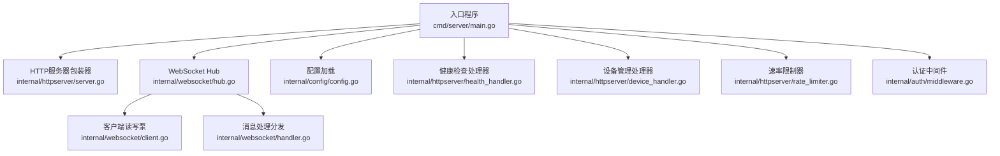
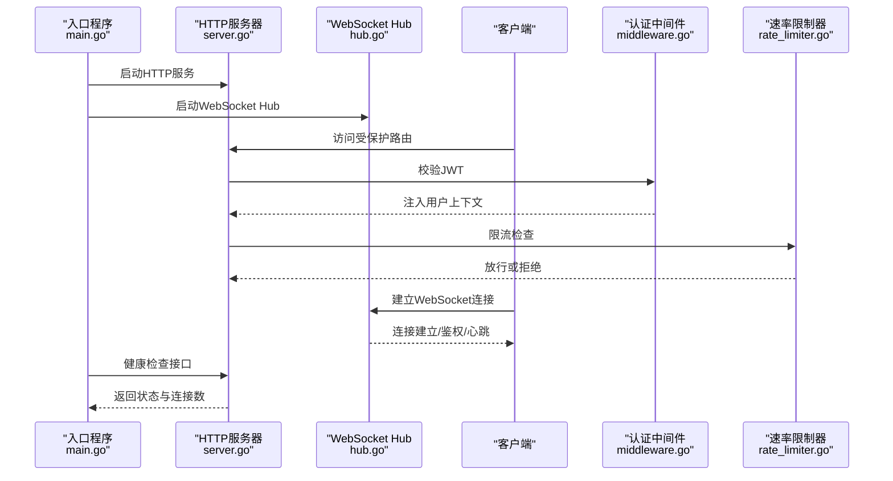
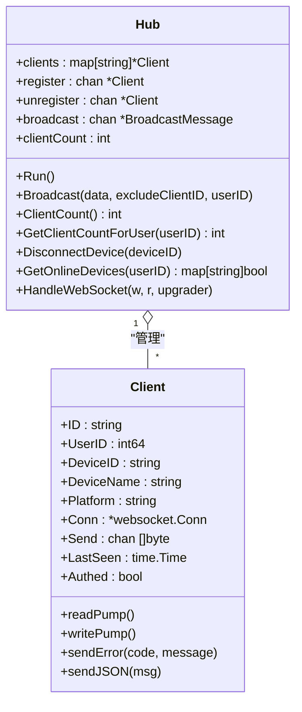
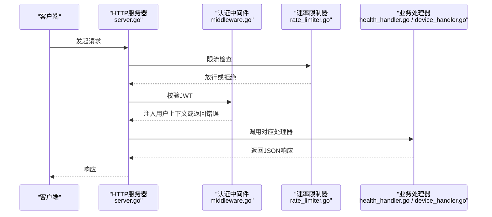
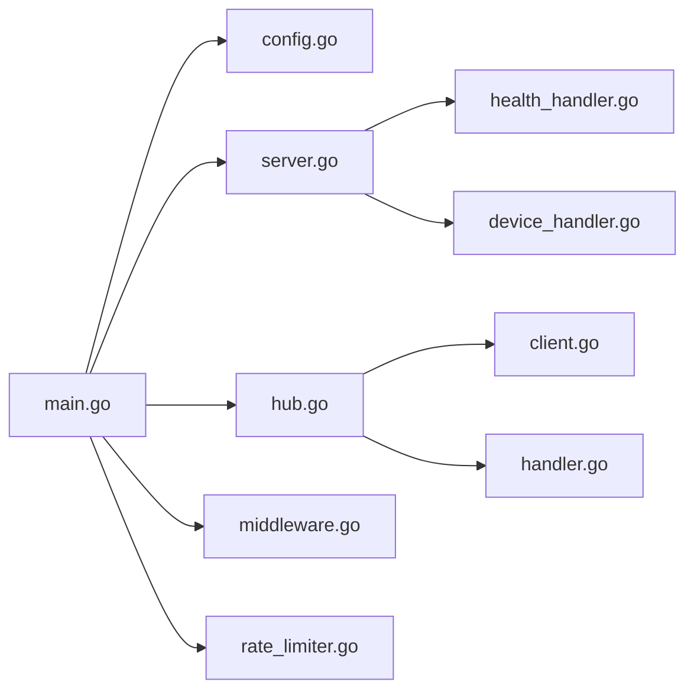

# 监控和日志

<cite>
**本文引用的文件**
- [main.go](file://clipSync-server/cmd/server/main.go)
- [config.yaml](file://clipSync-server/configs/config.yaml)
- [config.go](file://clipSync-server/internal/config/config.go)
- [hub.go](file://clipSync-server/internal/websocket/hub.go)
- [client.go](file://clipSync-server/internal/websocket/client.go)
- [handler.go](file://clipSync-server/internal/websocket/handler.go)
- [server.go](file://clipSync-server/internal/httpserver/server.go)
- [health_handler.go](file://clipSync-server/internal/httpserver/health_handler.go)
- [rate_limiter.go](file://clipSync-server/internal/httpserver/rate_limiter.go)
- [middleware.go](file://clipSync-server/internal/auth/middleware.go)
- [device_handler.go](file://clipSync-server/internal/httpserver/device_handler.go)
</cite>

## 目录
1. [简介](#简介)
2. [项目结构](#项目结构)
3. [核心组件](#核心组件)
4. [架构总览](#架构总览)
5. [详细组件分析](#详细组件分析)
6. [依赖关系分析](#依赖关系分析)
7. [性能考量](#性能考量)
8. [故障排查指南](#故障排查指南)
9. [结论](#结论)
10. [附录](#附录)

## 简介
本章节面向ClipSync服务器端的监控与日志体系，聚焦以下目标：
- 服务器端监控指标收集：连接数、消息处理、数据库健康、HTTP请求与错误率等
- 日志记录与轮转：日志级别、输出位置、敏感信息过滤建议
- 告警机制：基于健康检查与错误码的告警策略
- Prometheus与Grafana：指标导出与仪表板配置思路
- 配置调优：来自config.yaml的关键监控参数
- 常见问题：指标丢失、日志过大、告警风暴的预防与处理

当前代码库未内置Prometheus指标导出或专用日志轮转组件，但已具备健康检查、连接数统计、速率限制等基础能力，可作为构建监控体系的起点。

## 项目结构
服务器端由入口程序、配置加载、HTTP服务、WebSocket Hub与认证中间件组成。入口程序负责启动HTTP与WebSocket服务，并将健康检查、设备管理、上传下载等路由注册到HTTP路由器；WebSocket Hub负责客户端连接生命周期与广播分发；认证中间件负责JWT校验并将用户上下文注入请求。

图示来源
- [main.go:21-146](file://clipSync-server/cmd/server/main.go#L21-L146)
- [server.go:18-50](file://clipSync-server/internal/httpserver/server.go#L18-L50)
- [hub.go:44-112](file://clipSync-server/internal/websocket/hub.go#L44-L112)
- [config.go:38-71](file://clipSync-server/internal/config/config.go#L38-L71)
- [health_handler.go:18-54](file://clipSync-server/internal/httpserver/health_handler.go#L18-L54)
- [device_handler.go:17-82](file://clipSync-server/internal/httpserver/device_handler.go#L17-L82)
- [rate_limiter.go:22-85](file://clipSync-server/internal/httpserver/rate_limiter.go#L22-L85)
- [middleware.go:27-61](file://clipSync-server/internal/auth/middleware.go#L27-L61)
- [client.go:33-117](file://clipSync-server/internal/websocket/client.go#L33-L117)
- [handler.go:10-31](file://clipSync-server/internal/websocket/handler.go#L10-L31)

章节来源
- [main.go:21-146](file://clipSync-server/cmd/server/main.go#L21-L146)
- [config.go:38-71](file://clipSync-server/internal/config/config.go#L38-L71)

## 核心组件
- 入口程序：加载配置、初始化数据库与迁移、构建HTTP路由、启动HTTP与WebSocket服务、优雅关闭
- 配置模块：从YAML加载配置，提供默认值与生产安全校验
- HTTP服务器：封装标准库Server，设置超时参数，统一日志输出
- WebSocket Hub：维护客户端集合、注册/注销流程、广播消息、连接数统计
- 客户端读写泵：读取消息、心跳处理、写入消息、发送Ping
- 消息处理分发：按消息类型分派到具体处理函数（鉴权、心跳、剪贴板推送/拉取、设备列表、设备注销）
- 认证中间件：校验Bearer Token，注入用户上下文
- 速率限制器：基于滑动窗口的IP级限流
- 健康检查：返回版本、运行时长、连接数、数据库连通性

章节来源
- [main.go:21-146](file://clipSync-server/cmd/server/main.go#L21-L146)
- [config.go:38-71](file://clipSync-server/internal/config/config.go#L38-L71)
- [server.go:18-50](file://clipSync-server/internal/httpserver/server.go#L18-L50)
- [hub.go:44-153](file://clipSync-server/internal/websocket/hub.go#L44-L153)
- [client.go:33-117](file://clipSync-server/internal/websocket/client.go#L33-L117)
- [handler.go:10-31](file://clipSync-server/internal/websocket/handler.go#L10-L31)
- [middleware.go:27-61](file://clipSync-server/internal/auth/middleware.go#L27-L61)
- [rate_limiter.go:22-85](file://clipSync-server/internal/httpserver/rate_limiter.go#L22-L85)
- [health_handler.go:18-54](file://clipSync-server/internal/httpserver/health_handler.go#L18-L54)

## 架构总览
下图展示了服务器端监控与日志的关键交互路径：入口程序加载配置并启动HTTP与WebSocket服务；HTTP层通过认证中间件与速率限制器进行访问控制；WebSocket Hub负责连接生命周期与消息分发；健康检查接口汇总运行状态供外部监控系统采集。

图示来源
- [main.go:71-125](file://clipSync-server/cmd/server/main.go#L71-L125)
- [server.go:26-41](file://clipSync-server/internal/httpserver/server.go#L26-L41)
- [hub.go:61-112](file://clipSync-server/internal/websocket/hub.go#L61-L112)
- [middleware.go:32-60](file://clipSync-server/internal/auth/middleware.go#L32-L60)
- [rate_limiter.go:71-85](file://clipSync-server/internal/httpserver/rate_limiter.go#L71-L85)

## 详细组件分析

### WebSocket Hub：连接状态、消息统计与内存监控
- 连接状态监控
  - 注册/注销：Hub在注册与注销通道中分别增加/减少连接计数，并打印连接与断开日志
  - 在线设备查询：根据用户ID统计在线设备数量
  - 设备断连：支持按设备ID主动断开连接
- 消息统计
  - 消息类型分发：按消息类型进入不同处理函数（鉴权、心跳、剪贴板推送/拉取、设备列表、设备注销）
  - 广播：向同一用户的其他客户端广播消息，同时记录异常与丢弃行为
- 内存使用监控
  - 客户端Send缓冲区大小固定，避免无限增长
  - Hub广播时检测客户端发送缓冲是否满，满则标记断开，防止内存膨胀

图示来源
- [hub.go:18-58](file://clipSync-server/internal/websocket/hub.go#L18-L58)
- [hub.go:61-112](file://clipSync-server/internal/websocket/hub.go#L61-L112)
- [client.go:13-31](file://clipSync-server/internal/websocket/client.go#L13-L31)
- [client.go:33-117](file://clipSync-server/internal/websocket/client.go#L33-L117)

章节来源
- [hub.go:61-153](file://clipSync-server/internal/websocket/hub.go#L61-L153)
- [client.go:33-117](file://clipSync-server/internal/websocket/client.go#L33-L117)

### HTTP服务器：请求监控、响应时间与错误率
- 请求监控
  - 路由注册：登录、注册、刷新、健康检查、设备列表、上传下载等
  - 速率限制：对认证相关端点应用滑动窗口限流，防止暴力破解与滥用
  - 认证中间件：校验JWT，失败时返回标准化错误码
- 响应时间与错误率
  - 标准库Server已设置Read/Write/Idle超时，有助于避免慢连接与资源泄漏
  - 健康检查接口返回连接数与数据库状态，便于外部系统评估整体健康度

图示来源
- [main.go:74-106](file://clipSync-server/cmd/server/main.go#L74-L106)
- [rate_limiter.go:71-85](file://clipSync-server/internal/httpserver/rate_limiter.go#L71-L85)
- [middleware.go:32-60](file://clipSync-server/internal/auth/middleware.go#L32-L60)
- [health_handler.go:28-54](file://clipSync-server/internal/httpserver/health_handler.go#L28-L54)
- [device_handler.go:25-82](file://clipSync-server/internal/httpserver/device_handler.go#L25-L82)

章节来源
- [main.go:74-106](file://clipSync-server/cmd/server/main.go#L74-L106)
- [server.go:26-41](file://clipSync-server/internal/httpserver/server.go#L26-L41)
- [rate_limiter.go:22-85](file://clipSync-server/internal/httpserver/rate_limiter.go#L22-L85)
- [middleware.go:27-61](file://clipSync-server/internal/auth/middleware.go#L27-L61)
- [health_handler.go:18-54](file://clipSync-server/internal/httpserver/health_handler.go#L18-L54)
- [device_handler.go:17-82](file://clipSync-server/internal/httpserver/device_handler.go#L17-L82)

### 日志记录与配置
- 日志输出
  - 入口程序设置标准日志格式，包含日期、时间与短文件名
  - 各模块使用log包输出关键事件（连接、断开、错误、鉴权超时、速率限制触发等）
- 日志级别与敏感信息过滤
  - 当前实现以info级别为主，未区分debug/warn/error级别
  - 建议在生产环境引入结构化日志（如zap/slog）并开启敏感字段脱敏（如令牌、设备ID）
- 日志轮转
  - 代码库未包含日志轮转逻辑，建议结合系统工具（如logrotate）或第三方库实现按大小/时间轮转

章节来源
- [main.go:21-23](file://clipSync-server/cmd/server/main.go#L21-L23)
- [hub.go:68-79](file://clipSync-server/internal/websocket/hub.go#L68-L79)
- [client.go:47-53](file://clipSync-server/internal/websocket/client.go#L47-L53)

### 健康检查与告警
- 健康检查接口
  - 提供版本、运行时长、连接数、数据库状态等信息
  - 可被Prometheus等监控系统定时抓取
- 告警策略建议
  - 连接数骤降/骤增
  - 数据库Ping失败持续一定周期
  - 认证失败/速率限制触发率异常升高
  - WebSocket消息处理错误码出现峰值

章节来源
- [health_handler.go:28-54](file://clipSync-server/internal/httpserver/health_handler.go#L28-L54)

### 配置与参数调优
- 来自config.yaml的关键监控参数
  - WebSocket端口、HTTP端口、数据库路径、JWT密钥与过期时间、文件存储路径、最大文件大小、剪贴板历史条数、心跳超时秒数
- 参数调优建议
  - 心跳超时：根据网络质量与设备活跃度调整，避免误判断连
  - 剪贴板历史：限制历史条数以平衡存储与检索性能
  - 文件上传：合理设置最大文件大小，配合前端与后端校验
  - JWT过期：缩短过期时间提升安全性，结合刷新机制优化用户体验

章节来源
- [config.yaml:1-29](file://clipSync-server/configs/config.yaml#L1-L29)
- [config.go:38-71](file://clipSync-server/internal/config/config.go#L38-L71)

## 依赖关系分析
- 组件耦合
  - 入口程序耦合配置、HTTP、WebSocket、认证与仓库层
  - WebSocket Hub与客户端读写泵紧密耦合，负责连接生命周期与消息分发
  - 认证中间件与速率限制器作为HTTP层横切关注点
- 外部依赖
  - 标准库net/http、time、sync
  - gorilla/websocket用于WebSocket协议
  - gopkg.in/yaml.v3用于配置解析

图示来源
- [main.go:21-146](file://clipSync-server/cmd/server/main.go#L21-L146)
- [config.go:38-71](file://clipSync-server/internal/config/config.go#L38-L71)
- [server.go:18-50](file://clipSync-server/internal/httpserver/server.go#L18-L50)
- [hub.go:44-112](file://clipSync-server/internal/websocket/hub.go#L44-L112)
- [client.go:33-117](file://clipSync-server/internal/websocket/client.go#L33-L117)
- [handler.go:10-31](file://clipSync-server/internal/websocket/handler.go#L10-L31)
- [health_handler.go:18-54](file://clipSync-server/internal/httpserver/health_handler.go#L18-L54)
- [device_handler.go:17-82](file://clipSync-server/internal/httpserver/device_handler.go#L17-L82)
- [rate_limiter.go:22-85](file://clipSync-server/internal/httpserver/rate_limiter.go#L22-L85)
- [middleware.go:27-61](file://clipSync-server/internal/auth/middleware.go#L27-L61)

## 性能考量
- 连接与消息处理
  - Hub使用select处理注册/注销/广播，避免阻塞主循环
  - 客户端Send缓冲区大小固定，防止内存无界增长
- 心跳与超时
  - 客户端读取设置心跳超时，pong处理器刷新deadline
  - 服务器定期发送Ping，维持连接活性
- HTTP超时
  - 设置Read/Write/Idle超时，降低慢连接风险
- 速率限制
  - 滑动窗口限流减少恶意请求对系统的影响

章节来源
- [hub.go:61-112](file://clipSync-server/internal/websocket/hub.go#L61-L112)
- [client.go:33-117](file://clipSync-server/internal/websocket/client.go#L33-L117)
- [server.go:26-41](file://clipSync-server/internal/httpserver/server.go#L26-L41)
- [rate_limiter.go:22-85](file://clipSync-server/internal/httpserver/rate_limiter.go#L22-L85)

## 故障排查指南
- 指标丢失
  - 现象：健康检查无法获取连接数或数据库状态
  - 排查：确认健康检查端点已注册、数据库连接正常、Hub已启动
- 日志过大
  - 现象：日志文件快速增长
  - 排查：启用日志轮转、减少不必要的info级别日志、对敏感字段脱敏
- 告警风暴
  - 现象：短时间内大量告警导致噪音
  - 排查：调整阈值与静默窗口、合并相似告警、限制告警频率
- 连接断开频繁
  - 现象：客户端频繁掉线
  - 排查：检查心跳超时配置、网络稳定性、客户端Send缓冲是否经常满载
- 认证失败/限流过多
  - 现象：大量AUTH_FAILED或RATE_LIMITED
  - 排查：核对JWT密钥与过期时间、调整限流参数、检查客户端实现

章节来源
- [health_handler.go:28-54](file://clipSync-server/internal/httpserver/health_handler.go#L28-L54)
- [hub.go:68-79](file://clipSync-server/internal/websocket/hub.go#L68-L79)
- [rate_limiter.go:71-85](file://clipSync-server/internal/httpserver/rate_limiter.go#L71-L85)
- [client.go:47-53](file://clipSync-server/internal/websocket/client.go#L47-L53)

## 结论
ClipSync服务器端已具备基础的监控与日志能力：健康检查、连接数统计、速率限制与认证中间件。为进一步完善监控体系，建议：
- 引入结构化日志与日志轮转
- 扩展健康检查维度（CPU、内存、磁盘、连接池状态）
- 基于健康检查数据建立Prometheus指标与Grafana仪表板
- 制定告警规则并结合静默与抑制策略
- 对关键路径增加埋点与采样，逐步过渡到全量观测

## 附录

### Prometheus指标导出与Grafana仪表板配置思路
- 指标导出
  - 使用标准库expvar或第三方库（如github.com/prometheus/client_golang）暴露连接数、请求总数、错误计数、响应时间等
  - 将健康检查接口改造为/metrics，返回文本格式指标
- Grafana仪表板
  - 展示：连接数趋势、每分钟请求数、错误率、数据库Ping成功率、WebSocket消息类型分布
  - 告警面板：连接数异常、错误率突增、数据库不可达、心跳超时比例
- 告警规则示例
  - 连接数连续5分钟下降超过阈值
  - 错误率超过阈值且持续时间超过窗口
  - 数据库Ping失败次数超过阈值

[本节为概念性指导，不直接分析具体文件]

### 来自config.yaml的日志配置示例与监控参数
- 日志配置示例（建议）
  - 输出：stdout/stderr + 文件轮转
  - 级别：info（生产）/debug（开发）
  - 字段：timestamp、level、module、message、trace_id
  - 脱敏：token、device_id、checksum等
- 监控参数调优
  - 心跳超时：根据网络RTT与设备活跃度调整
  - 剪贴板历史：平衡检索性能与存储成本
  - 速率限制：针对不同端点设置差异化阈值

章节来源
- [config.yaml:1-29](file://clipSync-server/configs/config.yaml#L1-L29)