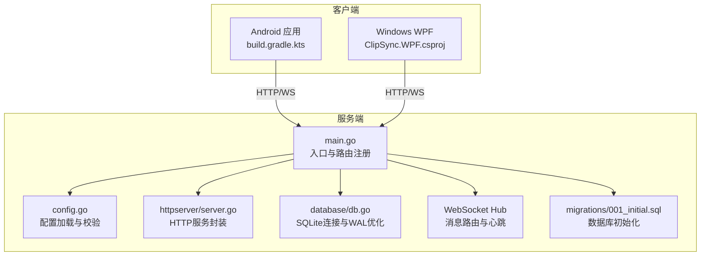
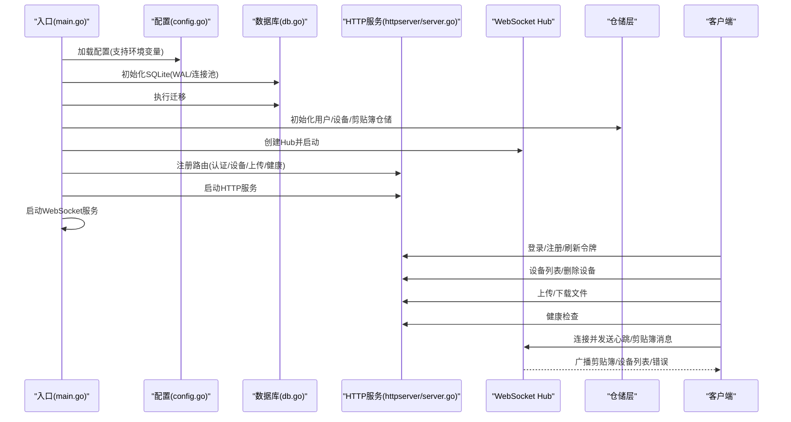
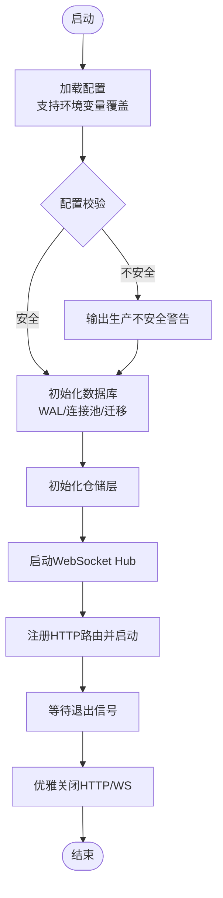
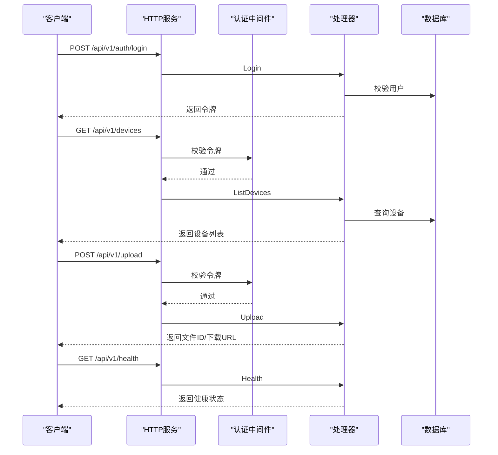
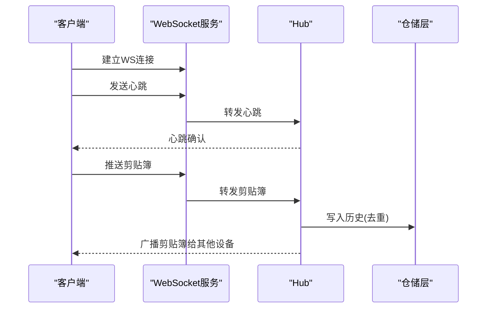
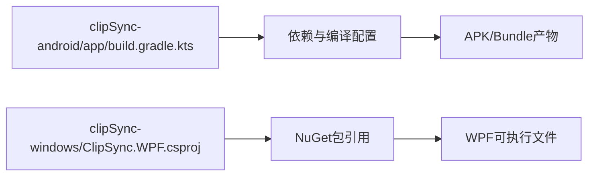
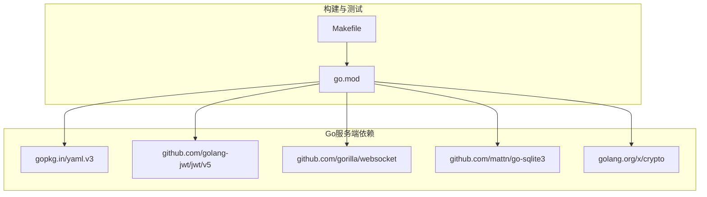

# 部署和运维

<cite>
**本文引用的文件**
- [clipSync-server/cmd/server/main.go](file://clipSync-server/cmd/server/main.go)
- [clipSync-server/configs/config.yaml](file://clipSync-server/configs/config.yaml)
- [clipSync-server/Makefile](file://clipSync-server/Makefile)
- [clipSync-server/go.mod](file://clipSync-server/go.mod)
- [clipSync-server/internal/httpserver/server.go](file://clipSync-server/internal/httpserver/server.go)
- [clipSync-server/internal/config/config.go](file://clipSync-server/internal/config/config.go)
- [clipSync-server/internal/database/db.go](file://clipSync-server/internal/database/db.go)
- [clipSync-server/migrations/001_initial.sql](file://clipSync-server/migrations/001_initial.sql)
- [DEVELOPMENT_PLAN.md](file://DEVELOPMENT_PLAN.md)
- [clipSync-android/build.gradle.kts](file://clipSync-android/build.gradle.kts)
- [clipSync-android/app/build.gradle.kts](file://clipSync-android/app/build.gradle.kts)
- [clipSync-windows/ClipSync.WPF/ClipSync.WPF.csproj](file://clipSync-windows/ClipSync.WPF/ClipSync.WPF.csproj)
- [scripts/test-protocol-compatibility.ps1](file://scripts/test-protocol-compatibility.ps1)
- [InstallationLog.txt](file://InstallationLog.txt)
</cite>

## 目录
1. [简介](#简介)
2. [项目结构](#项目结构)
3. [核心组件](#核心组件)
4. [架构总览](#架构总览)
5. [详细组件分析](#详细组件分析)
6. [依赖关系分析](#依赖关系分析)
7. [性能考量](#性能考量)
8. [故障排除指南](#故障排除指南)
9. [结论](#结论)
10. [附录](#附录)

## 简介
本文件面向ClipSync的部署与运维，覆盖服务器端部署、客户端打包、监控与日志、故障排除、容器化与负载均衡、备份恢复、性能监控与安全加固等主题。文档以仓库中的真实代码为依据，提供可操作的部署配置、参数说明与执行步骤，并通过图示帮助不同背景的读者快速上手。

## 项目结构
ClipSync采用多语言分层结构：Go服务端负责认证、设备管理、文件上传下载、健康检查与WebSocket广播；Windows与Android客户端分别使用WPF与Jetpack Compose实现跨平台同步；协议与API在开发计划中统一定义，确保三方协同。

**图表来源**
- [clipSync-server/cmd/server/main.go:21-146](file://clipSync-server/cmd/server/main.go#L21-L146)
- [clipSync-server/internal/config/config.go:38-72](file://clipSync-server/internal/config/config.go#L38-L72)
- [clipSync-server/internal/httpserver/server.go:18-52](file://clipSync-server/internal/httpserver/server.go#L18-L52)
- [clipSync-server/internal/database/db.go:17-56](file://clipSync-server/internal/database/db.go#L17-L56)
- [clipSync-server/migrations/001_initial.sql:1-55](file://clipSync-server/migrations/001_initial.sql#L1-L55)
- [clipSync-android/app/build.gradle.kts:1-102](file://clipSync-android/app/build.gradle.kts#L1-L102)
- [clipSync-windows/ClipSync.WPF/ClipSync.WPF.csproj:1-24](file://clipSync-windows/ClipSync.WPF/ClipSync.WPF.csproj#L1-L24)

**章节来源**
- [clipSync-server/cmd/server/main.go:21-146](file://clipSync-server/cmd/server/main.go#L21-L146)
- [DEVELOPMENT_PLAN.md:365-422](file://DEVELOPMENT_PLAN.md#L365-L422)

## 核心组件
- 服务器入口与路由：负责加载配置、初始化数据库与迁移、构建HTTP与WebSocket路由、启动优雅关闭。
- 配置系统：从YAML读取配置，支持环境变量覆盖，提供生产不安全默认值警告。
- HTTP服务封装：统一超时设置与优雅关闭。
- 数据库：SQLite连接、WAL模式、连接池与性能参数优化。
- WebSocket Hub：连接管理、消息路由、心跳检测与广播。
- 客户端打包：Android Gradle配置、Windows WPF工程文件。

**章节来源**
- [clipSync-server/cmd/server/main.go:21-146](file://clipSync-server/cmd/server/main.go#L21-L146)
- [clipSync-server/internal/config/config.go:38-72](file://clipSync-server/internal/config/config.go#L38-L72)
- [clipSync-server/internal/httpserver/server.go:18-52](file://clipSync-server/internal/httpserver/server.go#L18-L52)
- [clipSync-server/internal/database/db.go:17-56](file://clipSync-server/internal/database/db.go#L17-L56)
- [clipSync-android/app/build.gradle.kts:1-102](file://clipSync-android/app/build.gradle.kts#L1-L102)
- [clipSync-windows/ClipSync.WPF/ClipSync.WPF.csproj:1-24](file://clipSync-windows/ClipSync.WPF/ClipSync.WPF.csproj#L1-L24)

## 架构总览
下图展示服务端启动到运行的关键交互：配置加载、数据库初始化与迁移、HTTP与WebSocket服务启动、认证与设备管理API、文件上传下载、健康检查与心跳。

**图表来源**
- [clipSync-server/cmd/server/main.go:31-125](file://clipSync-server/cmd/server/main.go#L31-L125)
- [clipSync-server/internal/config/config.go:38-55](file://clipSync-server/internal/config/config.go#L38-L55)
- [clipSync-server/internal/database/db.go:17-56](file://clipSync-server/internal/database/db.go#L17-L56)
- [clipSync-server/internal/httpserver/server.go:26-41](file://clipSync-server/internal/httpserver/server.go#L26-L41)

## 详细组件分析

### 服务器部署与配置
- 配置文件位置与优先级
  - 默认路径：configs/config.yaml
  - 环境变量覆盖：CLIPSYNC_CONFIG
- 关键配置项
  - WebSocket端口、HTTP端口、数据库路径、JWT密钥与过期时间、文件存储目录、最大文件大小、剪贴簿历史条数、心跳超时
- 配置校验
  - 对默认JWT密钥与较长JWT过期时间给出生产不安全警告
- 数据库初始化与迁移
  - 自动创建目录、打开SQLite、启用WAL、设置连接池、执行迁移脚本
- 服务启动与优雅关闭
  - HTTP与WebSocket分别监听端口，统一信号处理与超时关闭

**图表来源**
- [clipSync-server/cmd/server/main.go:21-146](file://clipSync-server/cmd/server/main.go#L21-L146)
- [clipSync-server/internal/config/config.go:38-72](file://clipSync-server/internal/config/config.go#L38-L72)
- [clipSync-server/internal/database/db.go:17-56](file://clipSync-server/internal/database/db.go#L17-L56)

**章节来源**
- [clipSync-server/cmd/server/main.go:21-146](file://clipSync-server/cmd/server/main.go#L21-L146)
- [clipSync-server/configs/config.yaml:1-29](file://clipSync-server/configs/config.yaml#L1-L29)
- [clipSync-server/internal/config/config.go:38-72](file://clipSync-server/internal/config/config.go#L38-L72)
- [clipSync-server/internal/database/db.go:17-56](file://clipSync-server/internal/database/db.go#L17-L56)
- [clipSync-server/migrations/001_initial.sql:1-55](file://clipSync-server/migrations/001_initial.sql#L1-L55)

### HTTP API与健康检查
- 认证接口
  - 登录/注册/刷新令牌，带速率限制（每IP每分钟10次）
- 设备管理
  - 列出设备、删除设备（需鉴权）
- 文件上传/下载
  - 二进制上传与按ID下载
- 健康检查
  - 返回状态、版本、运行时长、连接客户端数

**图表来源**
- [clipSync-server/cmd/server/main.go:77-98](file://clipSync-server/cmd/server/main.go#L77-L98)
- [clipSync-server/internal/httpserver/server.go:26-41](file://clipSync-server/internal/httpserver/server.go#L26-L41)
- [DEVELOPMENT_PLAN.md:182-329](file://DEVELOPMENT_PLAN.md#L182-L329)

**章节来源**
- [clipSync-server/cmd/server/main.go:74-98](file://clipSync-server/cmd/server/main.go#L74-L98)
- [DEVELOPMENT_PLAN.md:182-329](file://DEVELOPMENT_PLAN.md#L182-L329)

### WebSocket与心跳
- WebSocket端口独立于HTTP端口
- 心跳间隔与超时控制
- 消息类型与广播逻辑由Hub负责

**图表来源**
- [clipSync-server/cmd/server/main.go:108-125](file://clipSync-server/cmd/server/main.go#L108-L125)
- [DEVELOPMENT_PLAN.md:20-181](file://DEVELOPMENT_PLAN.md#L20-L181)

**章节来源**
- [clipSync-server/cmd/server/main.go:108-125](file://clipSync-server/cmd/server/main.go#L108-L125)
- [DEVELOPMENT_PLAN.md:20-181](file://DEVELOPMENT_PLAN.md#L20-L181)

### 客户端打包与构建
- Android应用
  - Gradle插件与依赖、编译选项、Compose、Room、OkHttp、序列化、协程、DataStore
  - Release/Debug构建类型差异
- Windows WPF
  - .NET 8、WPF、NotifyIcon、SQLite、MVVM工具包、JSON序列化

**图表来源**
- [clipSync-android/app/build.gradle.kts:1-102](file://clipSync-android/app/build.gradle.kts#L1-L102)
- [clipSync-windows/ClipSync.WPF/ClipSync.WPF.csproj:1-24](file://clipSync-windows/ClipSync.WPF/ClipSync.WPF.csproj#L1-L24)

**章节来源**
- [clipSync-android/app/build.gradle.kts:1-102](file://clipSync-android/app/build.gradle.kts#L1-L102)
- [clipSync-windows/ClipSync.WPF/ClipSync.WPF.csproj:1-24](file://clipSync-windows/ClipSync.WPF/ClipSync.WPF.csproj#L1-L24)

### 开发与测试脚本
- 协议兼容性测试脚本
  - 检查心跳、加密、错误码等实现情况
- 安装日志
  - 提供安装过程与目标目录占用信息

**章节来源**
- [scripts/test-protocol-compatibility.ps1:130-150](file://scripts/test-protocol-compatibility.ps1#L130-L150)
- [InstallationLog.txt:1-8](file://InstallationLog.txt#L1-L8)

## 依赖关系分析
- 服务端依赖
  - YAML解析、JWT、WebSocket、SQLite驱动、加解密
- 构建与测试
  - Makefile提供构建、清理、测试、依赖安装等目标
- 客户端依赖
  - Android：Compose、Room、OkHttp、Serialization、Coroutines、DataStore
  - Windows：SQLite、MVVM、NotifyIcon、Newtonsoft.Json

**图表来源**
- [clipSync-server/go.mod:5-11](file://clipSync-server/go.mod#L5-L11)
- [clipSync-server/Makefile:1-33](file://clipSync-server/Makefile#L1-L33)

**章节来源**
- [clipSync-server/go.mod:5-11](file://clipSync-server/go.mod#L5-L11)
- [clipSync-server/Makefile:1-33](file://clipSync-server/Makefile#L1-L33)

## 性能考量
- 数据库优化
  - WAL模式、连接池上限、同步级别、缓存大小、临时表内存化
- 服务器并发
  - 2核2G服务器场景下的连接池与超时设置
- 传输与存储
  - 大对象通过文件上传下载，避免消息体过大
- 日志与监控
  - 建议接入结构化日志与指标采集，结合健康检查端点进行可用性监控

**章节来源**
- [clipSync-server/internal/database/db.go:29-49](file://clipSync-server/internal/database/db.go#L29-L49)
- [DEVELOPMENT_PLAN.md:789-796](file://DEVELOPMENT_PLAN.md#L789-L796)

## 故障排除指南
- 启动失败
  - 检查配置文件路径与权限、环境变量是否正确覆盖
  - 查看配置校验输出的不安全警告
- 数据库问题
  - 确认数据库目录存在且可写、WAL启用成功、迁移执行无异常
- 连接与超时
  - HTTP/WS超时设置合理，优雅关闭时上下文超时应足够
- 客户端无法登录或鉴权失败
  - 确认JWT密钥与过期时间配置、速率限制阈值、网络连通性
- 协议兼容性
  - 使用协议兼容性测试脚本验证心跳、加密与错误码实现

**章节来源**
- [clipSync-server/cmd/server/main.go:25-54](file://clipSync-server/cmd/server/main.go#L25-L54)
- [clipSync-server/internal/config/config.go:57-71](file://clipSync-server/internal/config/config.go#L57-L71)
- [clipSync-server/internal/database/db.go:17-56](file://clipSync-server/internal/database/db.go#L17-L56)
- [scripts/test-protocol-compatibility.ps1:130-150](file://scripts/test-protocol-compatibility.ps1#L130-L150)

## 结论
本文基于仓库中的真实代码，系统梳理了ClipSync的服务端部署、客户端打包、配置与运行机制，并提供了运维层面的监控、日志、故障排除建议。建议在生产环境中替换默认JWT密钥、缩短令牌有效期、启用TLS、配置反向代理与负载均衡，并建立完善的备份与恢复策略。

## 附录

### 部署配置清单
- 服务器配置
  - 端口：WebSocket与HTTP分离
  - 数据库：SQLite路径、WAL模式、连接池
  - 安全：JWT密钥与过期时间、速率限制
  - 存储：文件上传目录、最大文件大小
  - 其他：剪贴簿历史限制、心跳超时
- 客户端打包
  - Android：Gradle插件与依赖、Release/Debug差异
  - Windows：WPF工程与NuGet包

**章节来源**
- [clipSync-server/configs/config.yaml:1-29](file://clipSync-server/configs/config.yaml#L1-L29)
- [clipSync-android/app/build.gradle.kts:1-102](file://clipSync-android/app/build.gradle.kts#L1-L102)
- [clipSync-windows/ClipSync.WPF/ClipSync.WPF.csproj:1-24](file://clipSync-windows/ClipSync.WPF/ClipSync.WPF.csproj#L1-L24)