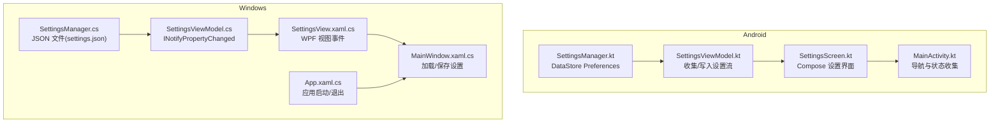
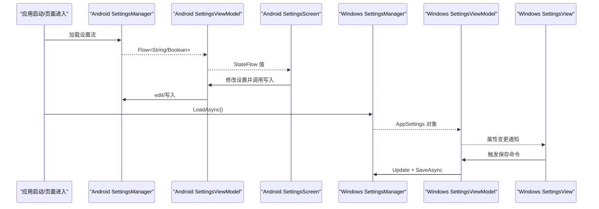
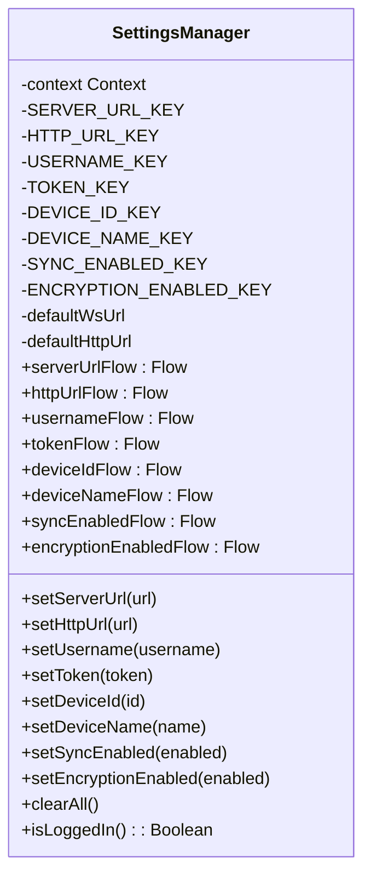
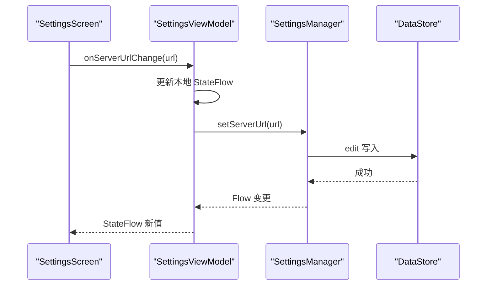
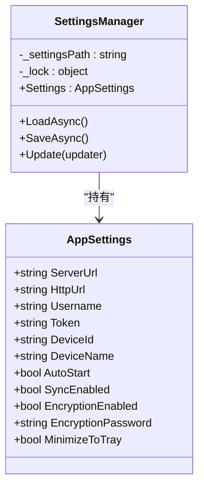
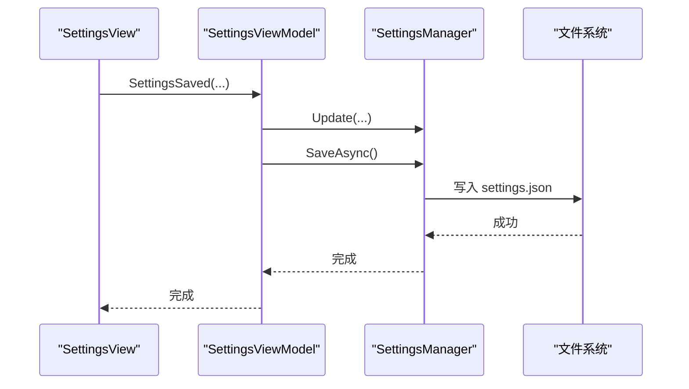
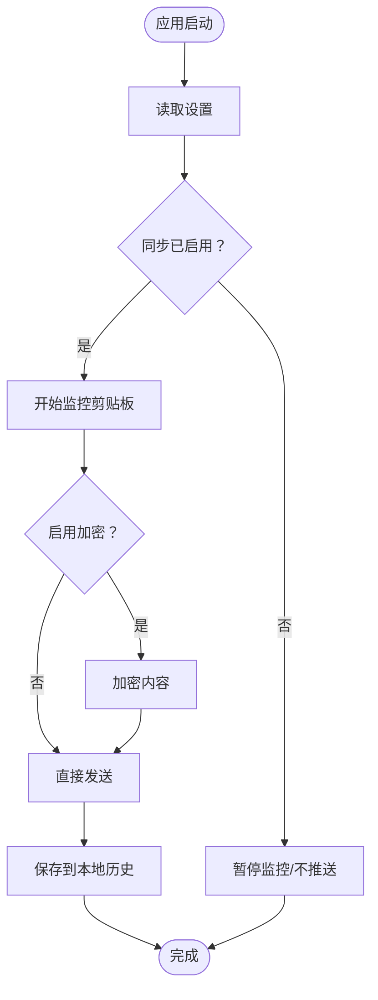
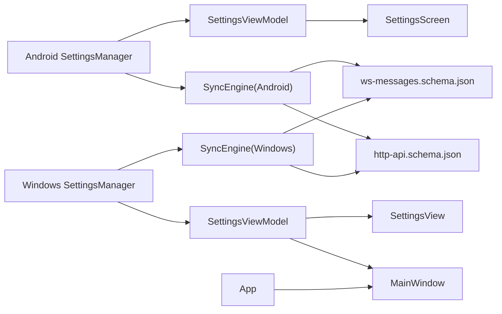

# 客户端设置

<cite>
**本文引用的文件**
- [SettingsManager.kt](file://clipSync-android/app/src/main/java/com/clipsync/app/core/SettingsManager.kt)
- [SettingsViewModel.kt](file://clipSync-android/app/src/main/java/com/clipsync/app/viewmodel/SettingsViewModel.kt)
- [SettingsScreen.kt](file://clipSync-android/app/src/main/java/com/clipsync/app/ui/screens/SettingsScreen.kt)
- [MainActivity.kt](file://clipSync-android/app/src/main/java/com/clipsync/app/MainActivity.kt)
- [strings.xml](file://clipSync-android/app/src/main/res/values/strings.xml)
- [SettingsManager.cs](file://clipSync-windows/ClipSync.WPF/Core/SettingsManager.cs)
- [SettingsViewModel.cs](file://clipSync-windows/ClipSync.WPF/UI/ViewModels/SettingsViewModel.cs)
- [SettingsView.xaml.cs](file://clipSync-windows/ClipSync.WPF/UI/Views/SettingsView.xaml.cs)
- [MainWindow.xaml.cs](file://clipSync-windows/ClipSync.WPF/MainWindow.xaml.cs)
- [App.xaml.cs](file://clipSync-windows/ClipSync.WPF/App.xaml.cs)
- [SyncEngine.kt](file://clipSync-android/app/src/main/java/com/clipsync/app/core/SyncEngine.kt)
- [SyncEngine.cs](file://clipSync-windows/ClipSync.WPF/Core/SyncEngine.cs)
- [ws-messages.schema.json](file://protocol/ws-messages.schema.json)
- [http-api.schema.json](file://protocol/http-api.schema.json)
</cite>

## 目录
1. [简介](#简介)
2. [项目结构](#项目结构)
3. [核心组件](#核心组件)
4. [架构总览](#架构总览)
5. [详细组件分析](#详细组件分析)
6. [依赖关系分析](#依赖关系分析)
7. [性能考量](#性能考量)
8. [故障排查指南](#故障排查指南)
9. [结论](#结论)
10. [附录](#附录)

## 简介
本文件系统性梳理客户端设置管理系统的实现，覆盖 Windows 和 Android 平台的设置定义、默认值、持久化存储、读取写入机制、设置与 UI 的绑定关系、设置变更通知、设置分类与验证、以及与同步引擎的联动。文档以实际代码为依据，提供面向初学者的易懂说明与面向开发者的深度分析。

## 项目结构
设置管理在两个平台分别由独立的设置管理器负责：
- Android：使用 DataStore Preferences 持久化，通过 ViewModel 将设置流暴露给 Compose UI。
- Windows：使用 JSON 文件持久化到 %APPDATA%\ClipSync\settings.json，通过 MVVM 绑定 WPF UI。

**图表来源**
- [SettingsManager.kt:21-169](file://clipSync-android/app/src/main/java/com/clipsync/app/core/SettingsManager.kt#L21-L169)
- [SettingsViewModel.kt:17-95](file://clipSync-android/app/src/main/java/com/clipsync/app/viewmodel/SettingsViewModel.kt#L17-L95)
- [SettingsScreen.kt:29-175](file://clipSync-android/app/src/main/java/com/clipsync/app/ui/screens/SettingsScreen.kt#L29-L175)
- [MainActivity.kt:44-138](file://clipSync-android/app/src/main/java/com/clipsync/app/MainActivity.kt#L44-L138)
- [SettingsManager.cs:44-100](file://clipSync-windows/ClipSync.WPF/Core/SettingsManager.cs#L44-L100)
- [SettingsViewModel.cs:8-121](file://clipSync-windows/ClipSync.WPF/UI/ViewModels/SettingsViewModel.cs#L8-L121)
- [SettingsView.xaml.cs:7-44](file://clipSync-windows/ClipSync.WPF/UI/Views/SettingsView.xaml.cs#L7-L44)
- [MainWindow.xaml.cs:72-270](file://clipSync-windows/ClipSync.WPF/MainWindow.xaml.cs#L72-L270)
- [App.xaml.cs:12-52](file://clipSync-windows/ClipSync.WPF/App.xaml.cs#L12-L52)

**章节来源**
- [SettingsManager.kt:21-169](file://clipSync-android/app/src/main/java/com/clipsync/app/core/SettingsManager.kt#L21-L169)
- [SettingsManager.cs:44-100](file://clipSync-windows/ClipSync.WPF/Core/SettingsManager.cs#L44-L100)
- [SettingsViewModel.kt:17-95](file://clipSync-android/app/src/main/java/com/clipsync/app/viewmodel/SettingsViewModel.kt#L17-L95)
- [SettingsViewModel.cs:8-121](file://clipSync-windows/ClipSync.WPF/UI/ViewModels/SettingsViewModel.cs#L8-L121)
- [SettingsScreen.kt:29-175](file://clipSync-android/app/src/main/java/com/clipsync/app/ui/screens/SettingsScreen.kt#L29-L175)
- [SettingsView.xaml.cs:7-44](file://clipSync-windows/ClipSync.WPF/UI/Views/SettingsView.xaml.cs#L7-L44)
- [MainActivity.kt:44-138](file://clipSync-android/app/src/main/java/com/clipsync/app/MainActivity.kt#L44-L138)
- [MainWindow.xaml.cs:72-270](file://clipSync-windows/ClipSync.WPF/MainWindow.xaml.cs#L72-L270)
- [App.xaml.cs:12-52](file://clipSync-windows/ClipSync.WPF/App.xaml.cs#L12-L52)

## 核心组件
- Android 设置管理器
  - 使用 DataStore Preferences 存储键值对，提供 Flow 形式的读取接口与 edit 写入接口。
  - 默认值在读取时通过空值回退提供。
  - 包含设备 ID 自动生成逻辑。
- Windows 设置管理器
  - 使用 JSON 文件持久化，提供异步加载/保存方法与线程安全的更新委托。
  - 默认值在类属性层面直接给出。
- 设置视图模型与 UI
  - Android：ViewModel 收集 SettingsManager 的 Flow，并将状态暴露给 Compose。
  - Windows：ViewModel 实现 INotifyPropertyChanged，视图通过事件回调触发保存。
- 同步引擎联动
  - 两者均从设置中读取“是否启用同步”、“是否启用加密”等关键开关，驱动本地剪贴板监控与消息发送。

**章节来源**
- [SettingsManager.kt:21-169](file://clipSync-android/app/src/main/java/com/clipsync/app/core/SettingsManager.kt#L21-L169)
- [SettingsManager.cs:44-100](file://clipSync-windows/ClipSync.WPF/Core/SettingsManager.cs#L44-L100)
- [SettingsViewModel.kt:17-95](file://clipSync-android/app/src/main/java/com/clipsync/app/viewmodel/SettingsViewModel.kt#L17-L95)
- [SettingsViewModel.cs:8-121](file://clipSync-windows/ClipSync.WPF/UI/ViewModels/SettingsViewModel.cs#L8-L121)
- [SettingsScreen.kt:29-175](file://clipSync-android/app/src/main/java/com/clipsync/app/ui/screens/SettingsScreen.kt#L29-L175)
- [SettingsView.xaml.cs:7-44](file://clipSync-windows/ClipSync.WPF/UI/Views/SettingsView.xaml.cs#L7-L44)
- [SyncEngine.kt:27-50](file://clipSync-android/app/src/main/java/com/clipsync/app/core/SyncEngine.kt#L27-L50)
- [SyncEngine.cs:8-57](file://clipSync-windows/ClipSync.WPF/Core/SyncEngine.cs#L8-L57)

## 架构总览
设置系统围绕“设置定义—默认值—持久化—读取写入—UI 绑定—引擎联动”展开。Android 采用响应式流，Windows 采用显式保存，二者均在应用启动或页面初始化阶段完成设置加载。

**图表来源**
- [SettingsManager.kt:39-49](file://clipSync-android/app/src/main/java/com/clipsync/app/core/SettingsManager.kt#L39-L49)
- [SettingsViewModel.kt:43-64](file://clipSync-android/app/src/main/java/com/clipsync/app/viewmodel/SettingsViewModel.kt#L43-L64)
- [SettingsScreen.kt:115-136](file://clipSync-android/app/src/main/java/com/clipsync/app/ui/screens/SettingsScreen.kt#L115-L136)
- [SettingsManager.cs:62-91](file://clipSync-windows/ClipSync.WPF/Core/SettingsManager.cs#L62-L91)
- [SettingsViewModel.cs:70-113](file://clipSync-windows/ClipSync.WPF/UI/ViewModels/SettingsViewModel.cs#L70-L113)
- [SettingsView.xaml.cs:32-42](file://clipSync-windows/ClipSync.WPF/UI/Views/SettingsView.xaml.cs#L32-L42)

## 详细组件分析

### Android 设置管理器（DataStore）
- 设置项与默认值
  - 服务器地址、HTTP 地址、用户名、令牌、设备 ID、设备名称、同步开关、加密开关。
  - 默认值在读取时通过空值回退提供；设备 ID 不存在时自动生成并写入。
- 持久化与读写
  - 使用 DataStore Preferences，写入通过 edit 执行；读取通过 Flow 映射返回。
- 与 UI 绑定
  - SettingsViewModel 收集各 Flow 并暴露 StateFlow；MainActivity 在 Compose 中收集并传入 UI。

**图表来源**
- [SettingsManager.kt:21-169](file://clipSync-android/app/src/main/java/com/clipsync/app/core/SettingsManager.kt#L21-L169)

**章节来源**
- [SettingsManager.kt:21-169](file://clipSync-android/app/src/main/java/com/clipsync/app/core/SettingsManager.kt#L21-L169)
- [SettingsViewModel.kt:17-95](file://clipSync-android/app/src/main/java/com/clipsync/app/viewmodel/SettingsViewModel.kt#L17-L95)
- [SettingsScreen.kt:29-175](file://clipSync-android/app/src/main/java/com/clipsync/app/ui/screens/SettingsScreen.kt#L29-L175)
- [MainActivity.kt:57-62](file://clipSync-android/app/src/main/java/com/clipsync/app/MainActivity.kt#L57-L62)

### Android 设置视图模型与 UI
- 视图模型
  - 初始化时并发收集多个 Flow 到本地 StateFlow，提供修改方法异步写入。
- UI
  - SettingsScreen 提供账户、服务器、同步、安全、设备等分组设置项，支持文本输入与开关切换。
- 导航与状态
  - MainActivity 在导航图中收集设置状态并传递给 SettingsScreen。

**图表来源**
- [SettingsScreen.kt:115-136](file://clipSync-android/app/src/main/java/com/clipsync/app/ui/screens/SettingsScreen.kt#L115-L136)
- [SettingsViewModel.kt:66-70](file://clipSync-android/app/src/main/java/com/clipsync/app/viewmodel/SettingsViewModel.kt#L66-L70)
- [SettingsManager.kt:45-49](file://clipSync-android/app/src/main/java/com/clipsync/app/core/SettingsManager.kt#L45-L49)

**章节来源**
- [SettingsViewModel.kt:17-95](file://clipSync-android/app/src/main/java/com/clipsync/app/viewmodel/SettingsViewModel.kt#L17-L95)
- [SettingsScreen.kt:29-175](file://clipSync-android/app/src/main/java/com/clipsync/app/ui/screens/SettingsScreen.kt#L29-L175)
- [MainActivity.kt:115-136](file://clipSync-android/app/src/main/java/com/clipsync/app/MainActivity.kt#L115-L136)

### Windows 设置管理器（JSON）
- 设置项与默认值
  - 服务器地址、HTTP 地址、用户名、令牌、设备 ID、设备名称、自动启动、同步开关、加密开关、加密密码、最小化到托盘。
  - 默认值在类属性层面直接给出。
- 持久化与读写
  - settings.json 存放于 %APPDATA%\ClipSync，提供 LoadAsync/SaveAsync；Update 使用锁保护。
- 与 UI 绑定
  - SettingsViewModel 实现 INotifyPropertyChanged，SettingsView 通过事件回调触发保存；MainWindow 负责加载/保存。

**图表来源**
- [SettingsManager.cs:8-42](file://clipSync-windows/ClipSync.WPF/Core/SettingsManager.cs#L8-L42)
- [SettingsManager.cs:44-100](file://clipSync-windows/ClipSync.WPF/Core/SettingsManager.cs#L44-L100)

**章节来源**
- [SettingsManager.cs:44-100](file://clipSync-windows/ClipSync.WPF/Core/SettingsManager.cs#L44-L100)
- [SettingsViewModel.cs:8-121](file://clipSync-windows/ClipSync.WPF/UI/ViewModels/SettingsViewModel.cs#L8-L121)
- [SettingsView.xaml.cs:7-44](file://clipSync-windows/ClipSync.WPF/UI/Views/SettingsView.xaml.cs#L7-L44)
- [MainWindow.xaml.cs:72-270](file://clipSync-windows/ClipSync.WPF/MainWindow.xaml.cs#L72-L270)
- [App.xaml.cs:12-52](file://clipSync-windows/ClipSync.WPF/App.xaml.cs#L12-L52)

### Windows 设置视图模型与 UI
- 视图模型
  - 保存命令触发 Update 后调用 SaveAsync；根据 AutoStart 开关控制系统自启动。
- 视图
  - SettingsView 通过事件向父窗口传递设置值；MainWindow 负责加载初始值与保存。

**图表来源**
- [SettingsView.xaml.cs:32-42](file://clipSync-windows/ClipSync.WPF/UI/Views/SettingsView.xaml.cs#L32-L42)
- [SettingsViewModel.cs:90-113](file://clipSync-windows/ClipSync.WPF/UI/ViewModels/SettingsViewModel.cs#L90-L113)
- [SettingsManager.cs:81-91](file://clipSync-windows/ClipSync.WPF/Core/SettingsManager.cs#L81-L91)

**章节来源**
- [SettingsViewModel.cs:70-113](file://clipSync-windows/ClipSync.WPF/UI/ViewModels/SettingsViewModel.cs#L70-L113)
- [SettingsView.xaml.cs:19-42](file://clipSync-windows/ClipSync.WPF/UI/Views/SettingsView.xaml.cs#L19-L42)
- [MainWindow.xaml.cs:246-270](file://clipSync-windows/ClipSync.WPF/MainWindow.xaml.cs#L246-L270)

### 设置与同步引擎的联动
- Android
  - SyncEngine 初始化时读取“同步开关”，决定是否开始监控；推送前检查“加密开关”并进行加解密。
- Windows
  - SyncEngine 根据“同步开关/加密开关/加密密码”决定是否发送加密内容与是否解密远端内容。

**图表来源**
- [SyncEngine.kt:43-50](file://clipSync-android/app/src/main/java/com/clipsync/app/core/SyncEngine.kt#L43-L50)
- [SyncEngine.kt:72-123](file://clipSync-android/app/src/main/java/com/clipsync/app/core/SyncEngine.kt#L72-L123)
- [SyncEngine.cs:95-125](file://clipSync-windows/ClipSync.WPF/Core/SyncEngine.cs#L95-L125)

**章节来源**
- [SyncEngine.kt:27-50](file://clipSync-android/app/src/main/java/com/clipsync/app/core/SyncEngine.kt#L27-L50)
- [SyncEngine.kt:72-123](file://clipSync-android/app/src/main/java/com/clipsync/app/core/SyncEngine.kt#L72-L123)
- [SyncEngine.cs:95-125](file://clipSync-windows/ClipSync.WPF/Core/SyncEngine.cs#L95-L125)

## 依赖关系分析
- Android
  - SettingsManager 依赖 DataStore；SettingsViewModel 依赖 SettingsManager；MainActivity 依赖 SettingsViewModel。
- Windows
  - SettingsManager 依赖文件系统；SettingsViewModel 依赖 SettingsManager；MainWindow/SettingsView 依赖 SettingsViewModel。
- 协议
  - WebSocket/HTTP 协议定义了消息类型与字段约束，设置中的服务器地址、加密开关等直接影响通信行为。

**图表来源**
- [SettingsManager.kt:21-169](file://clipSync-android/app/src/main/java/com/clipsync/app/core/SettingsManager.kt#L21-L169)
- [SettingsViewModel.kt:17-95](file://clipSync-android/app/src/main/java/com/clipsync/app/viewmodel/SettingsViewModel.kt#L17-L95)
- [SettingsScreen.kt:29-175](file://clipSync-android/app/src/main/java/com/clipsync/app/ui/screens/SettingsScreen.kt#L29-L175)
- [SettingsManager.cs:44-100](file://clipSync-windows/ClipSync.WPF/Core/SettingsManager.cs#L44-L100)
- [SettingsViewModel.cs:8-121](file://clipSync-windows/ClipSync.WPF/UI/ViewModels/SettingsViewModel.cs#L8-L121)
- [SettingsView.xaml.cs:7-44](file://clipSync-windows/ClipSync.WPF/UI/Views/SettingsView.xaml.cs#L7-L44)
- [MainWindow.xaml.cs:72-270](file://clipSync-windows/ClipSync.WPF/MainWindow.xaml.cs#L72-L270)
- [App.xaml.cs:12-52](file://clipSync-windows/ClipSync.WPF/App.xaml.cs#L12-L52)
- [SyncEngine.kt:27-50](file://clipSync-android/app/src/main/java/com/clipsync/app/core/SyncEngine.kt#L27-L50)
- [SyncEngine.cs:8-57](file://clipSync-windows/ClipSync.WPF/Core/SyncEngine.cs#L8-L57)
- [ws-messages.schema.json:1-261](file://protocol/ws-messages.schema.json#L1-L261)
- [http-api.schema.json:1-293](file://protocol/http-api.schema.json#L1-L293)

**章节来源**
- [ws-messages.schema.json:1-261](file://protocol/ws-messages.schema.json#L1-L261)
- [http-api.schema.json:1-293](file://protocol/http-api.schema.json#L1-L293)

## 性能考量
- Android DataStore
  - 基于协程与 Kotlin Flow，读写非阻塞；建议避免频繁小粒度写入，合并更新可减少磁盘 IO。
- Windows JSON
  - 异步读写配合锁，注意避免 UI 线程阻塞；建议在后台线程执行 SaveAsync。
- 同步引擎
  - 推送前进行去重校验，避免重复发送相同内容；加密/解密操作可能带来 CPU 开销，按需开启。

[本节为通用指导，无需具体文件引用]

## 故障排查指南
- 无法读取设置
  - Android：确认 DataStore 初始化与作用域正确；检查 Flow 是否被收集。
  - Windows：确认 %APPDATA%\ClipSync\settings.json 存在且可读写；检查 LoadAsync 是否成功。
- 设置未生效
  - Android：确认写入方法已调用且 edit 已提交；检查 UI 是否重新收集了新值。
  - Windows：确认 SaveAsync 已调用；检查 MainWindow/SettingsView 是否正确触发保存事件。
- 登录后仍显示未登录
  - Android：确认 SettingsManager.isLoggedIn 的用户名/令牌非空判断逻辑。
  - Windows：确认 MainWindow/SettingsView 在登录后更新了 Token 并保存。
- 同步未工作
  - 检查“同步已启用”开关；确认服务器地址格式正确；Windows 需确保设备名与平台信息正确。

**章节来源**
- [SettingsManager.kt:166-168](file://clipSync-android/app/src/main/java/com/clipsync/app/core/SettingsManager.kt#L166-L168)
- [SettingsViewModel.cs:90-113](file://clipSync-windows/ClipSync.WPF/UI/ViewModels/SettingsViewModel.cs#L90-L113)
- [MainWindow.xaml.cs:246-270](file://clipSync-windows/ClipSync.WPF/MainWindow.xaml.cs#L246-L270)
- [SyncEngine.kt:43-50](file://clipSync-android/app/src/main/java/com/clipsync/app/core/SyncEngine.kt#L43-L50)
- [SyncEngine.cs:95-125](file://clipSync-windows/ClipSync.WPF/Core/SyncEngine.cs#L95-L125)

## 结论
该设置管理系统在两个平台上分别采用现代持久化方案（DataStore/JSON），并通过清晰的 MVVM 或 Compose 流程实现了设置项的定义、默认值、持久化、读取写入与 UI 绑定。设置与同步引擎紧密耦合，确保用户偏好能够即时影响运行时行为。建议在后续版本中补充设置验证与迁移策略，进一步提升健壮性与可维护性。

[本节为总结，无需具体文件引用]

## 附录

### 设置项分类与默认值对照
- 连接设置
  - Android：WebSocket URL、HTTP URL、设备名称、设备 ID（自动生成）。
  - Windows：WebSocket URL、HTTP URL、设备名称、设备 ID（自动生成）。
- 同步设置
  - Android：启用同步（默认开启）。
  - Windows：启用同步（默认开启）。
- 安全设置
  - Android：启用加密（默认关闭）。
  - Windows：启用加密、加密密码（默认为空）。
- 其他
  - Android：用户名、令牌（登录后填充）。
  - Windows：用户名、令牌、自动启动、最小化到托盘。

**章节来源**
- [SettingsManager.kt:33-41](file://clipSync-android/app/src/main/java/com/clipsync/app/core/SettingsManager.kt#L33-L41)
- [SettingsManager.cs:8-42](file://clipSync-windows/ClipSync.WPF/Core/SettingsManager.cs#L8-L42)
- [strings.xml:20-27](file://clipSync-android/app/src/main/res/values/strings.xml#L20-L27)

### 设置验证规则（基于协议与实现）
- 服务器地址
  - Android：默认回退值用于首次使用；建议在 UI 层进行基本格式校验。
  - Windows：ConnectAndAuthenticateAsync 会补全 ws:// 前缀，建议 UI 层提示。
- 登录凭据
  - HTTP API 规范要求用户名长度、密码长度与平台枚举；应在 UI 层进行前端校验后再发起请求。
- 加密开关
  - 同步引擎在两端均会根据开关与密码决定是否加密/解密；建议 UI 层提示密码不可逆。

**章节来源**
- [http-api.schema.json:10-21](file://protocol/http-api.schema.json#L10-L21)
- [SyncEngine.kt:93-98](file://clipSync-android/app/src/main/java/com/clipsync/app/core/SyncEngine.kt#L93-L98)
- [SyncEngine.cs:108-115](file://clipSync-windows/ClipSync.WPF/Core/SyncEngine.cs#L108-L115)

### 设置迁移策略建议
- 版本升级时新增设置项
  - Android：在 DataStore 中新增键并在读取时提供默认值；保持向后兼容。
  - Windows：在 AppSettings 新增属性并提供默认值；LoadAsync 时反序列化不会失败。
- 删除或重命名键
  - Android：通过清理旧键或迁移逻辑处理；避免直接删除导致数据丢失。
  - Windows：提供迁移函数读取旧 JSON 并写入新结构，完成后删除旧文件。
- 数据一致性
  - 保存前进行轻量校验；保存后立即尝试读取验证；失败则回滚或提示用户。

[本节为通用建议，无需具体文件引用]