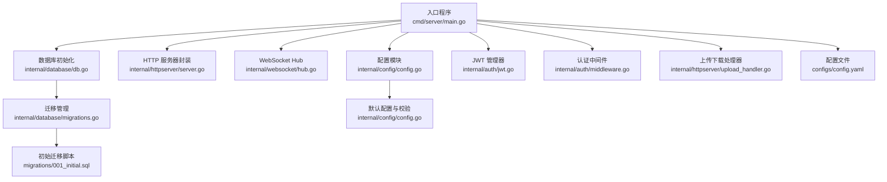
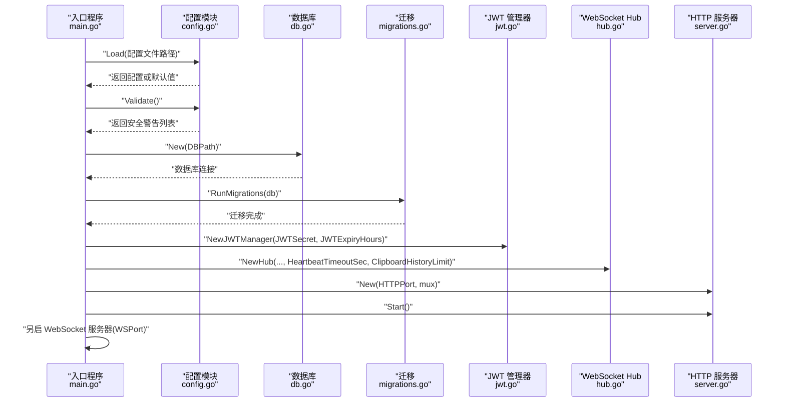
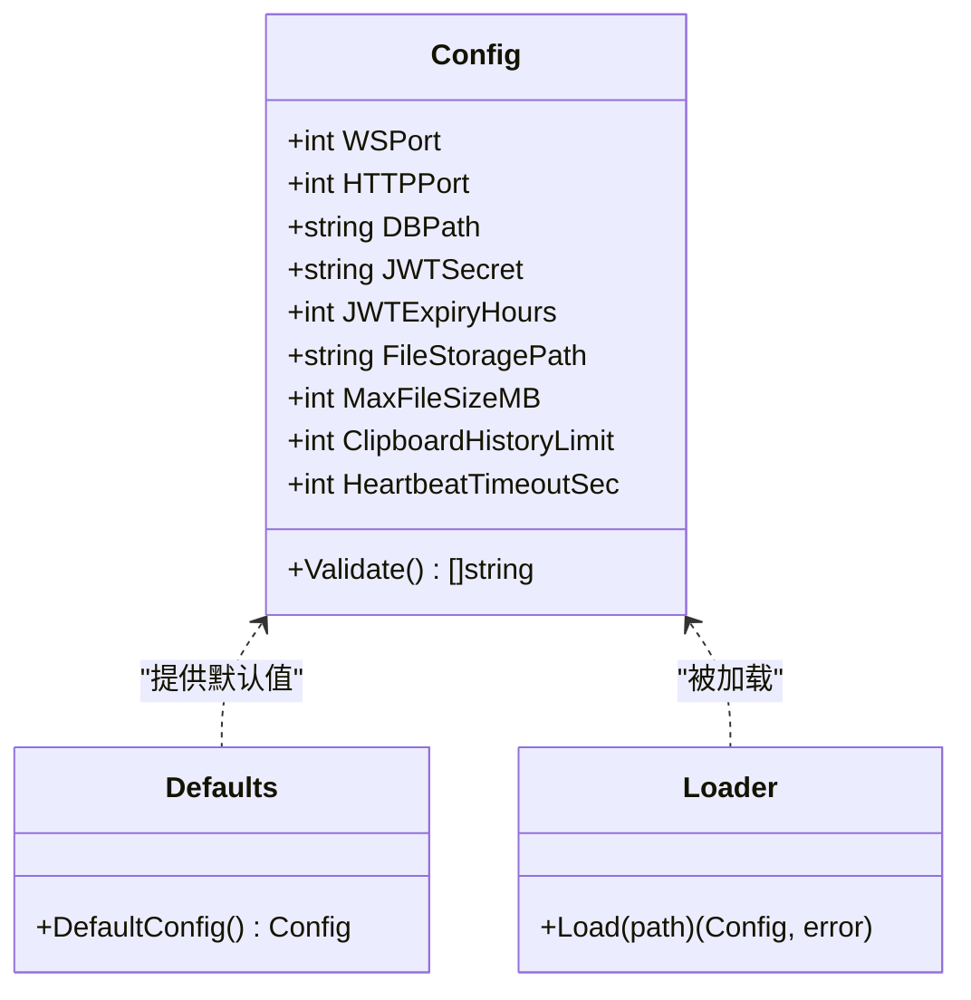
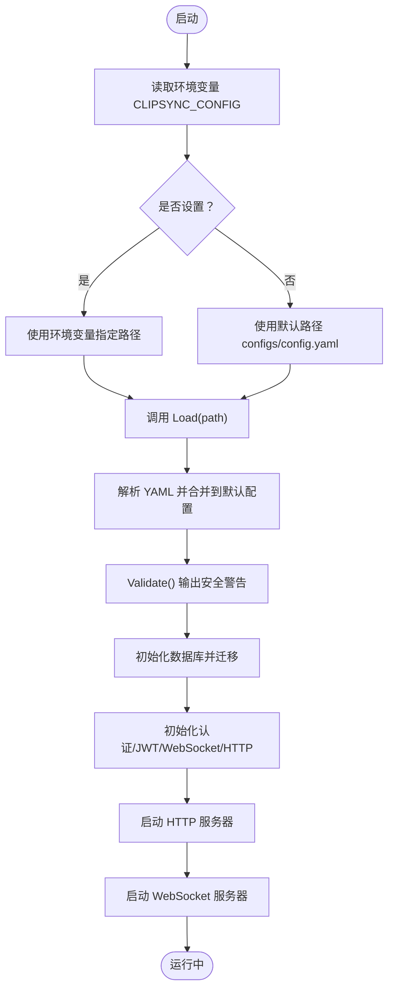
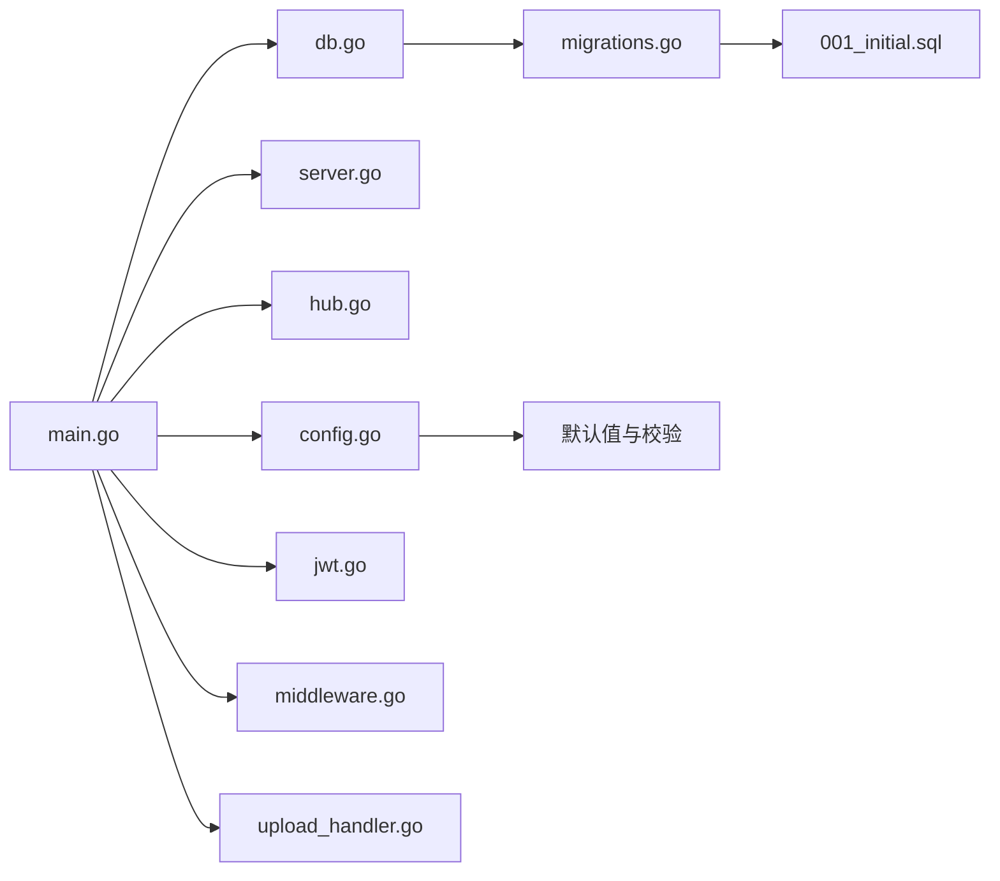

# 服务器配置

<cite>
**本文引用的文件**
- [main.go](file://clipSync-server/cmd/server/main.go)
- [config.yaml](file://clipSync-server/configs/config.yaml)
- [config.go](file://clipSync-server/internal/config/config.go)
- [server.go](file://clipSync-server/internal/httpserver/server.go)
- [hub.go](file://clipSync-server/internal/websocket/hub.go)
- [jwt.go](file://clipSync-server/internal/auth/jwt.go)
- [middleware.go](file://clipSync-server/internal/auth/middleware.go)
- [db.go](file://clipSync-server/internal/database/db.go)
- [migrations.go](file://clipSync-server/internal/database/migrations.go)
- [001_initial.sql](file://clipSync-server/migrations/001_initial.sql)
- [upload_handler.go](file://clipSync-server/internal/httpserver/upload_handler.go)
</cite>

## 目录
1. [简介](#简介)
2. [项目结构](#项目结构)
3. [核心组件](#核心组件)
4. [架构总览](#架构总览)
5. [详细组件分析](#详细组件分析)
6. [依赖关系分析](#依赖关系分析)
7. [性能考量](#性能考量)
8. [故障排查指南](#故障排查指南)
9. [结论](#结论)
10. [附录](#附录)

## 简介
本文件面向服务器配置系统，系统性阐述配置文件格式、配置项定义、默认值与加载机制，并结合实际代码说明关键配置项（如 WebSocket 端口、HTTP API 端口、数据库路径、JWT 密钥、文件存储路径等）的作用与配置方法。文档还涵盖配置验证规则、环境变量覆盖机制、配置热更新现状与限制、配置项之间的依赖关系与约束条件，并提供常见问题的排查与解决方案。

## 项目结构
服务器配置系统位于 Go 后端工程中，采用分层组织：入口程序负责加载配置、初始化服务；配置模块负责读取 YAML 并校验；HTTP 与 WebSocket 服务分别监听不同端口；数据库通过迁移脚本初始化；上传下载模块使用配置项控制文件存储与大小限制。

图表来源
- [main.go:21-145](file://clipSync-server/cmd/server/main.go#L21-L145)
- [config.go:10-71](file://clipSync-server/internal/config/config.go#L10-L71)
- [server.go:11-49](file://clipSync-server/internal/httpserver/server.go#L11-L49)
- [hub.go:18-58](file://clipSync-server/internal/websocket/hub.go#L18-L58)
- [db.go:12-56](file://clipSync-server/internal/database/db.go#L12-L56)
- [migrations.go:8-113](file://clipSync-server/internal/database/migrations.go#L8-L113)
- [001_initial.sql:1-55](file://clipSync-server/migrations/001_initial.sql#L1-L55)
- [jwt.go:18-75](file://clipSync-server/internal/auth/jwt.go#L18-L75)
- [middleware.go:22-61](file://clipSync-server/internal/auth/middleware.go#L22-L61)
- [upload_handler.go:19-34](file://clipSync-server/internal/httpserver/upload_handler.go#L19-L34)
- [config.yaml:1-29](file://clipSync-server/configs/config.yaml#L1-L29)

章节来源
- [main.go:21-145](file://clipSync-server/cmd/server/main.go#L21-L145)
- [config.yaml:1-29](file://clipSync-server/configs/config.yaml#L1-L29)

## 核心组件
- 配置模型与默认值：定义所有可配置项及默认值，确保最小可用启动。
- 配置加载与校验：从 YAML 文件读取配置，未找到文件时回退到默认值；运行前进行安全警告检查。
- 环境变量覆盖：入口程序支持通过环境变量指定配置文件路径。
- 服务初始化：根据配置启动 HTTP 与 WebSocket 服务、数据库连接、迁移、仓库与认证组件。
- 关键配置项作用：
  - WebSocket 端口：实时剪贴板同步通道。
  - HTTP API 端口：认证、健康检查、设备管理、文件上传下载等接口。
  - 数据库路径：SQLite 数据库存储位置。
  - JWT 密钥与过期时间：令牌签发与校验。
  - 文件存储路径与最大文件大小：上传文件保存目录与体积限制。
  - 剪贴板历史条数与心跳超时：服务端行为参数。

章节来源
- [config.go:10-71](file://clipSync-server/internal/config/config.go#L10-L71)
- [config.yaml:1-29](file://clipSync-server/configs/config.yaml#L1-L29)
- [main.go:21-145](file://clipSync-server/cmd/server/main.go#L21-L145)

## 架构总览
下图展示配置在启动流程中的作用与流向：入口程序加载配置，随后初始化数据库与迁移、认证与 JWT、WebSocket Hub、HTTP 路由与服务器，最终分别在不同端口对外提供服务。

图表来源
- [main.go:21-145](file://clipSync-server/cmd/server/main.go#L21-L145)
- [config.go:38-71](file://clipSync-server/internal/config/config.go#L38-L71)
- [db.go:17-56](file://clipSync-server/internal/database/db.go#L17-L56)
- [migrations.go:8-113](file://clipSync-server/internal/database/migrations.go#L8-L113)
- [jwt.go:18-30](file://clipSync-server/internal/auth/jwt.go#L18-L30)
- [hub.go:44-58](file://clipSync-server/internal/websocket/hub.go#L44-L58)
- [server.go:18-41](file://clipSync-server/internal/httpserver/server.go#L18-L41)

## 详细组件分析

### 配置模型与默认值
- 配置结构体包含以下字段：WebSocket 端口、HTTP 端口、数据库路径、JWT 密钥、JWT 过期小时数、文件存储路径、最大文件大小（MB）、剪贴板历史条数、心跳超时（秒）。
- 默认值集中于默认配置函数，确保首次运行无需手动配置即可启动。
- 配置加载函数优先读取指定路径的 YAML 文件，若文件不存在则直接返回默认配置；解析失败会返回错误。

图表来源
- [config.go:10-71](file://clipSync-server/internal/config/config.go#L10-L71)

章节来源
- [config.go:10-71](file://clipSync-server/internal/config/config.go#L10-L71)
- [config.yaml:1-29](file://clipSync-server/configs/config.yaml#L1-L29)

### 配置加载与环境变量覆盖
- 入口程序在启动时先尝试从环境变量读取配置文件路径，若未设置则使用默认路径。
- 加载成功后打印已加载的配置摘要，并执行安全校验，输出潜在风险提示。

图表来源
- [main.go:21-145](file://clipSync-server/cmd/server/main.go#L21-L145)
- [config.go:38-71](file://clipSync-server/internal/config/config.go#L38-L71)

章节来源
- [main.go:21-145](file://clipSync-server/cmd/server/main.go#L21-L145)
- [config.go:38-71](file://clipSync-server/internal/config/config.go#L38-L71)

### 关键配置项详解与配置方法
- WebSocket 端口（ws_port）
  - 作用：WebSocket 服务器监听端口，用于实时剪贴板同步。
  - 配置方式：在配置文件中设置；入口程序将其用于单独的 WebSocket 服务器实例。
  - 依赖关系：与 HTTP 端口必须不同，避免端口冲突。
  - 参考路径：[main.go:108-125](file://clipSync-server/cmd/server/main.go#L108-L125)，[config.yaml:3-4](file://clipSync-server/configs/config.yaml#L3-L4)

- HTTP API 端口（http_port）
  - 作用：HTTP 服务器监听端口，承载认证、健康检查、设备管理、文件上传下载等接口。
  - 配置方式：在配置文件中设置；入口程序构建路由并启动服务器。
  - 参考路径：[main.go:74-106](file://clipSync-server/cmd/server/main.go#L74-L106)，[server.go:18-41](file://clipSync-server/internal/httpserver/server.go#L18-L41)

- 数据库路径（db_path）
  - 作用：SQLite 数据库文件路径，包含用户、设备、剪贴板历史、上传文件等表。
  - 配置方式：在配置文件中设置；初始化时自动创建目录并启用 WAL 模式与优化参数。
  - 参考路径：[main.go:44-54](file://clipSync-server/cmd/server/main.go#L44-L54)，[db.go:17-56](file://clipSync-server/internal/database/db.go#L17-L56)，[migrations.go:8-113](file://clipSync-server/internal/database/migrations.go#L8-L113)，[001_initial.sql:1-55](file://clipSync-server/migrations/001_initial.sql#L1-L55)

- JWT 密钥（jwt_secret）与过期时间（jwt_expiry_hours）
  - 作用：签发与校验用户令牌，决定会话有效期。
  - 配置方式：在配置文件中设置；生产环境务必修改默认密钥。
  - 安全校验：默认密钥会被标记为不安全警告；过期时间超过 30 天会给出建议。
  - 参考路径：[config.yaml:12-16](file://clipSync-server/configs/config.yaml#L12-L16)，[config.go:57-71](file://clipSync-server/internal/config/config.go#L57-L71)，[jwt.go:18-75](file://clipSync-server/internal/auth/jwt.go#L18-L75)，[middleware.go:22-61](file://clipSync-server/internal/auth/middleware.go#L22-L61)

- 文件存储路径（file_storage_path）与最大文件大小（max_file_size_mb）
  - 作用：上传文件的保存目录与单次上传的最大体积限制。
  - 配置方式：在配置文件中设置；上传处理器按用户子目录保存文件并校验大小。
  - 参考路径：[config.yaml:18-22](file://clipSync-server/configs/config.yaml#L18-L22)，[upload_handler.go:26-34](file://clipSync-server/internal/httpserver/upload_handler.go#L26-L34)

- 剪贴板历史条数（clipboard_history_limit）
  - 作用：限制每个用户的剪贴板历史条目数量，影响内存与查询性能。
  - 配置方式：在配置文件中设置；WebSocket Hub 初始化时传入该参数。
  - 参考路径：[config.yaml:24-25](file://clipSync-server/configs/config.yaml#L24-L25)，[hub.go:44-58](file://clipSync-server/internal/websocket/hub.go#L44-L58)

- 心跳超时（heartbeat_timeout_seconds）
  - 作用：客户端无心跳时的断开阈值，保障服务端资源占用可控。
  - 配置方式：在配置文件中设置；WebSocket Hub 初始化时转换为持续时间。
  - 参考路径：[config.yaml:27-28](file://clipSync-server/configs/config.yaml#L27-L28)，[hub.go:44-58](file://clipSync-server/internal/websocket/hub.go#L44-L58)

章节来源
- [main.go:21-145](file://clipSync-server/cmd/server/main.go#L21-L145)
- [config.yaml:1-29](file://clipSync-server/configs/config.yaml#L1-L29)
- [config.go:10-71](file://clipSync-server/internal/config/config.go#L10-L71)
- [server.go:11-49](file://clipSync-server/internal/httpserver/server.go#L11-L49)
- [hub.go:18-58](file://clipSync-server/internal/websocket/hub.go#L18-L58)
- [jwt.go:18-75](file://clipSync-server/internal/auth/jwt.go#L18-L75)
- [middleware.go:22-61](file://clipSync-server/internal/auth/middleware.go#L22-L61)
- [db.go:12-56](file://clipSync-server/internal/database/db.go#L12-L56)
- [migrations.go:8-113](file://clipSync-server/internal/database/migrations.go#L8-L113)
- [001_initial.sql:1-55](file://clipSync-server/migrations/001_initial.sql#L1-L55)
- [upload_handler.go:19-34](file://clipSync-server/internal/httpserver/upload_handler.go#L19-L34)

### 配置验证规则与安全建议
- 默认 JWT 密钥：若仍使用默认密钥，将输出安全警告，强烈建议在生产环境替换为强随机字符串。
- JWT 过期时间：超过 30 天（720 小时）的过期时间会被提示，建议缩短以降低长期风险。
- 建议：在生产部署时，通过环境变量或外部机密管理工具注入敏感配置，避免硬编码在配置文件中。

章节来源
- [config.go:57-71](file://clipSync-server/internal/config/config.go#L57-L71)

### 环境变量覆盖机制
- CLIPSYNC_CONFIG：用于覆盖默认配置文件路径，便于容器化或多环境部署。
- 其他敏感配置（如 JWT 密钥）建议通过环境变量注入并在启动前写入配置文件或通过外部机密系统挂载。

章节来源
- [main.go:27-29](file://clipSync-server/cmd/server/main.go#L27-L29)

### 配置热更新实现
- 当前实现：服务器启动后不会自动重新加载配置；任何配置变更需要重启服务才能生效。
- 建议：若需热更新，可在应用内增加配置文件监控与重载逻辑，或通过外部配置中心推送变更事件触发重启。

章节来源
- [main.go:21-145](file://clipSync-server/cmd/server/main.go#L21-L145)
- [config.go:38-55](file://clipSync-server/internal/config/config.go#L38-L55)

### 配置项之间的依赖关系与约束条件
- 端口约束：WebSocket 端口与 HTTP 端口必须不同，否则启动时会冲突。
- 存储约束：文件存储路径需具备写权限；数据库路径所在目录需可创建。
- 安全约束：JWT 密钥必须足够随机且保密；过期时间应合理设置。
- 性能约束：剪贴板历史条数与心跳超时会影响内存与连接数；文件大小限制影响磁盘与带宽。

章节来源
- [main.go:108-125](file://clipSync-server/cmd/server/main.go#L108-L125)
- [upload_handler.go:26-34](file://clipSync-server/internal/httpserver/upload_handler.go#L26-L34)
- [db.go:17-56](file://clipSync-server/internal/database/db.go#L17-L56)

## 依赖关系分析
- 入口程序依赖配置模块、HTTP 服务器封装、WebSocket Hub、数据库与迁移、JWT 管理器与认证中间件、上传下载处理器。
- 配置模块为其他组件提供统一的配置源，贯穿启动与运行阶段。
- 数据库与迁移模块独立于配置文件，但受数据库路径影响。

图表来源
- [main.go:21-145](file://clipSync-server/cmd/server/main.go#L21-L145)
- [config.go:10-71](file://clipSync-server/internal/config/config.go#L10-L71)
- [server.go:11-49](file://clipSync-server/internal/httpserver/server.go#L11-L49)
- [hub.go:18-58](file://clipSync-server/internal/websocket/hub.go#L18-L58)
- [db.go:12-56](file://clipSync-server/internal/database/db.go#L12-L56)
- [migrations.go:8-113](file://clipSync-server/internal/database/migrations.go#L8-L113)
- [001_initial.sql:1-55](file://clipSync-server/migrations/001_initial.sql#L1-L55)
- [jwt.go:18-75](file://clipSync-server/internal/auth/jwt.go#L18-L75)
- [middleware.go:22-61](file://clipSync-server/internal/auth/middleware.go#L22-L61)
- [upload_handler.go:19-34](file://clipSync-server/internal/httpserver/upload_handler.go#L19-L34)

章节来源
- [main.go:21-145](file://clipSync-server/cmd/server/main.go#L21-L145)
- [config.go:10-71](file://clipSync-server/internal/config/config.go#L10-L71)

## 性能考量
- 数据库连接池：SQLite 在小规模场景下已做连接池与 WAL 模式优化，适合轻量部署。
- WebSocket：心跳超时与广播队列缓冲有助于控制资源占用；建议根据并发量调整历史条数与缓冲大小。
- HTTP：请求超时与限流中间件可缓解突发流量；上传大小限制避免大文件拖垮带宽。
- 建议：在高并发场景下，考虑使用更高性能的数据库与反向代理，或拆分 HTTP 与 WebSocket 服务到独立进程/容器。

章节来源
- [db.go:17-56](file://clipSync-server/internal/database/db.go#L17-L56)
- [hub.go:44-58](file://clipSync-server/internal/websocket/hub.go#L44-L58)
- [server.go:26-41](file://clipSync-server/internal/httpserver/server.go#L26-L41)
- [upload_handler.go:26-34](file://clipSync-server/internal/httpserver/upload_handler.go#L26-L34)

## 故障排查指南
- 配置文件无法读取或解析
  - 症状：启动时报错或使用默认配置。
  - 排查：确认配置文件路径存在且可读；检查 YAML 格式；查看加载函数返回的错误信息。
  - 参考路径：[config.go:38-55](file://clipSync-server/internal/config/config.go#L38-L55)

- JWT 密钥为默认值或过期时间过长
  - 症状：启动日志出现安全警告。
  - 排查：更换为强随机密钥；调整过期时间为更合理的范围。
  - 参考路径：[config.go:57-71](file://clipSync-server/internal/config/config.go#L57-L71)，[jwt.go:18-75](file://clipSync-server/internal/auth/jwt.go#L18-L75)

- 端口冲突
  - 症状：HTTP 或 WebSocket 启动失败。
  - 排查：确保 ws_port 与 http_port 不同；检查系统端口占用。
  - 参考路径：[main.go:108-125](file://clipSync-server/cmd/server/main.go#L108-L125)

- 数据库初始化失败
  - 症状：迁移或连接失败。
  - 排查：确认数据库路径可写；检查 SQLite 扩展可用性；查看迁移脚本与 WAL 设置。
  - 参考路径：[db.go:17-56](file://clipSync-server/internal/database/db.go#L17-L56)，[migrations.go:8-113](file://clipSync-server/internal/database/migrations.go#L8-L113)，[001_initial.sql:1-55](file://clipSync-server/migrations/001_initial.sql#L1-L55)

- 上传文件失败或校验不通过
  - 症状：上传返回错误或校验和不匹配。
  - 排查：确认文件大小未超过限制；检查客户端提供的校验和；确认存储目录权限。
  - 参考路径：[upload_handler.go:36-150](file://clipSync-server/internal/httpserver/upload_handler.go#L36-L150)

章节来源
- [config.go:38-71](file://clipSync-server/internal/config/config.go#L38-L71)
- [jwt.go:18-75](file://clipSync-server/internal/auth/jwt.go#L18-L75)
- [main.go:108-125](file://clipSync-server/cmd/server/main.go#L108-L125)
- [db.go:17-56](file://clipSync-server/internal/database/db.go#L17-L56)
- [migrations.go:8-113](file://clipSync-server/internal/database/migrations.go#L8-L113)
- [001_initial.sql:1-55](file://clipSync-server/migrations/001_initial.sql#L1-L55)
- [upload_handler.go:36-150](file://clipSync-server/internal/httpserver/upload_handler.go#L36-L150)

## 结论
服务器配置系统以 YAML 为中心，提供简洁明确的默认值与严格的启动前安全校验。通过环境变量覆盖与清晰的依赖关系，系统可在多种部署环境中快速启动。对于生产环境，务必替换默认 JWT 密钥、合理设置过期时间与文件大小限制，并关注端口与存储权限等约束。当前版本不支持配置热更新，建议通过外部机制实现变更后的平滑重启。

## 附录
- 配置文件示例路径：[config.yaml:1-29](file://clipSync-server/configs/config.yaml#L1-L29)
- 入口程序与启动流程：[main.go:21-145](file://clipSync-server/cmd/server/main.go#L21-L145)
- 配置模型与加载：[config.go:10-71](file://clipSync-server/internal/config/config.go#L10-L71)
- HTTP 服务器封装：[server.go:11-49](file://clipSync-server/internal/httpserver/server.go#L11-L49)
- WebSocket Hub 初始化：[hub.go:44-58](file://clipSync-server/internal/websocket/hub.go#L44-L58)
- JWT 管理与中间件：[jwt.go:18-75](file://clipSync-server/internal/auth/jwt.go#L18-L75)，[middleware.go:22-61](file://clipSync-server/internal/auth/middleware.go#L22-L61)
- 数据库与迁移：[db.go:12-56](file://clipSync-server/internal/database/db.go#L12-L56)，[migrations.go:8-113](file://clipSync-server/internal/database/migrations.go#L8-L113)，[001_initial.sql:1-55](file://clipSync-server/migrations/001_initial.sql#L1-L55)
- 上传下载处理器：[upload_handler.go:19-34](file://clipSync-server/internal/httpserver/upload_handler.go#L19-L34)