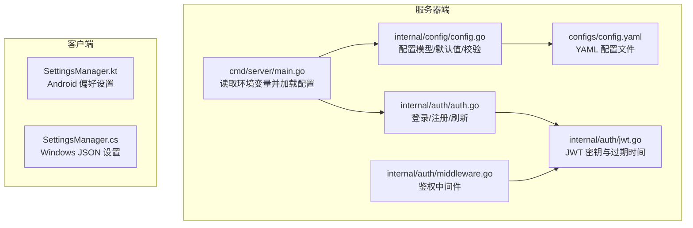
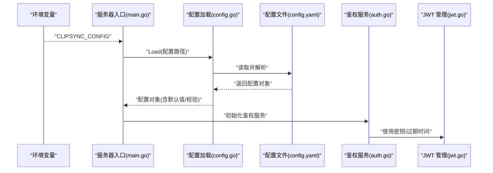
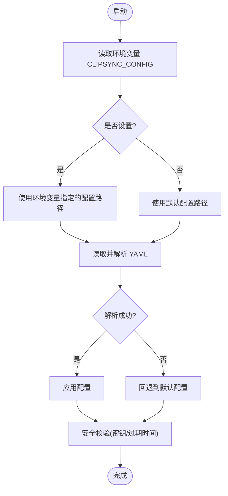
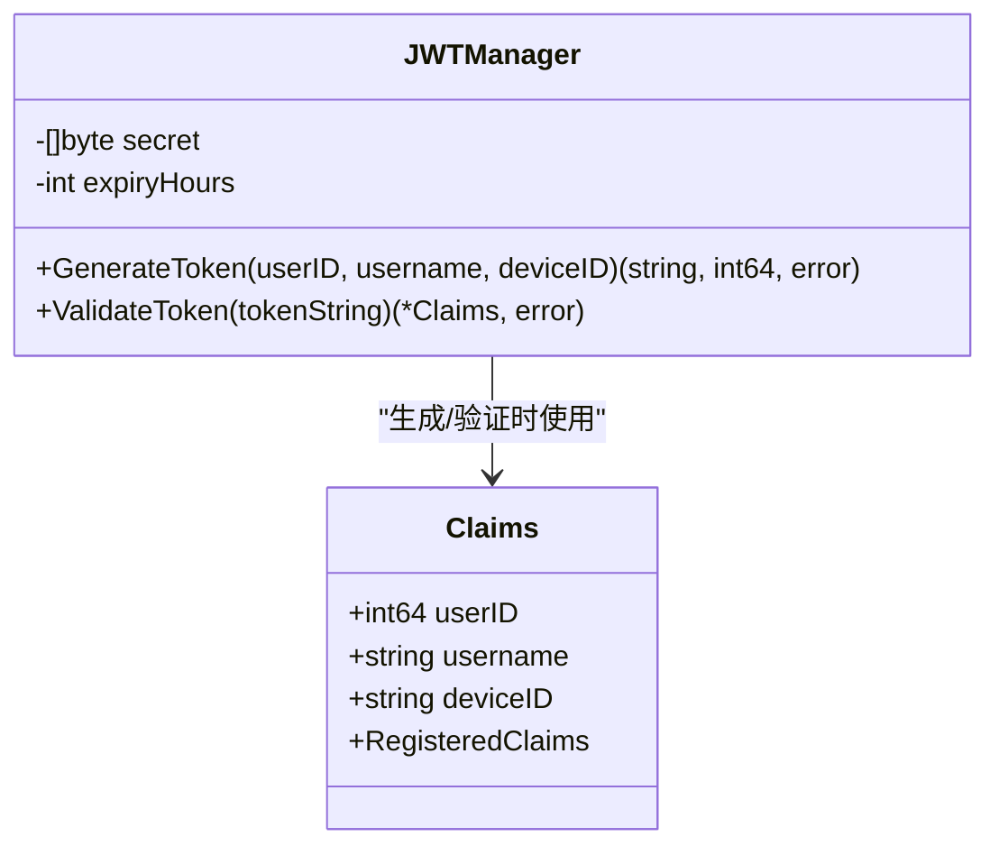
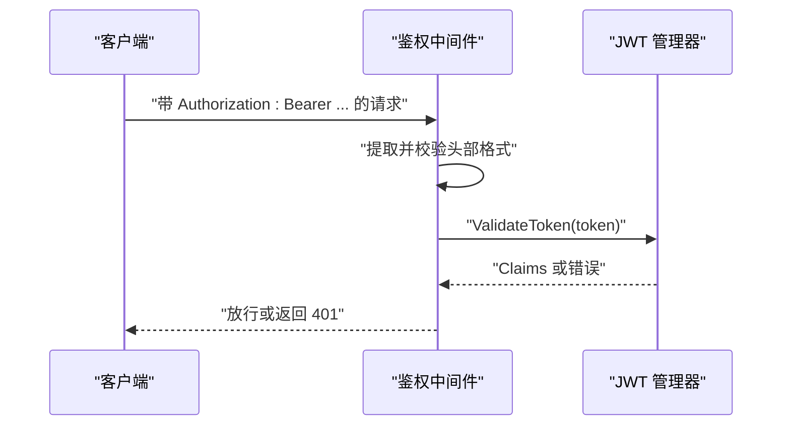
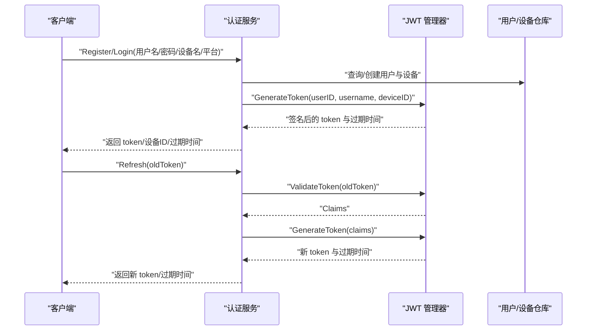
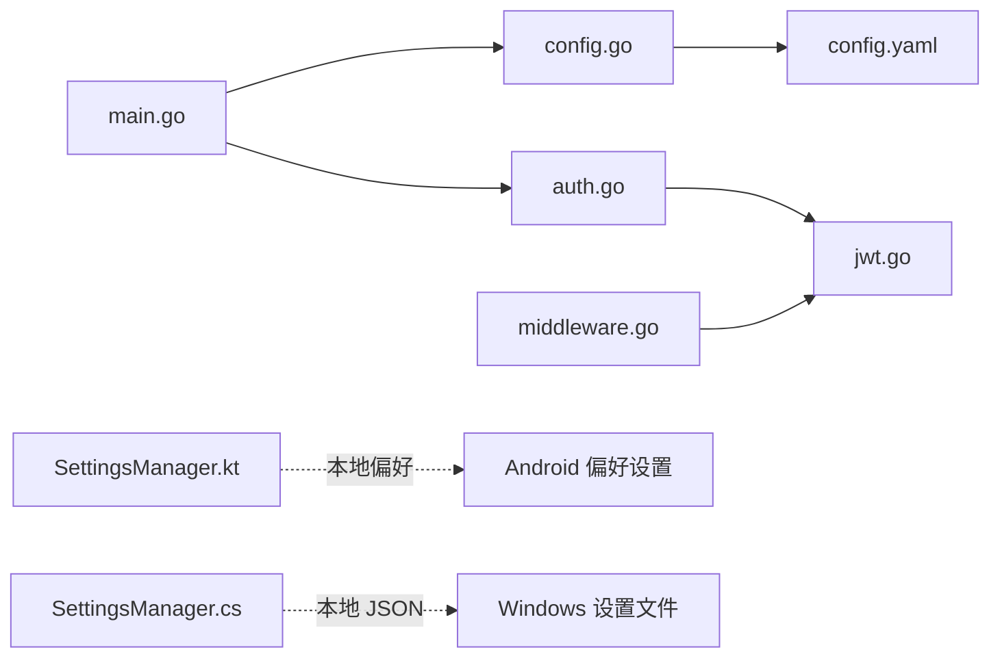

# 环境变量管理

<cite>
**本文引用的文件**
- [clipSync-server/cmd/server/main.go](file://clipSync-server/cmd/server/main.go)
- [clipSync-server/internal/config/config.go](file://clipSync-server/internal/config/config.go)
- [clipSync-server/configs/config.yaml](file://clipSync-server/configs/config.yaml)
- [clipSync-server/internal/auth/jwt.go](file://clipSync-server/internal/auth/jwt.go)
- [clipSync-server/internal/auth/middleware.go](file://clipSync-server/internal/auth/middleware.go)
- [clipSync-server/internal/auth/auth.go](file://clipSync-server/internal/auth/auth.go)
- [clipSync-android/app/src/main/java/com/clipsync/app/core/SettingsManager.kt](file://clipSync-android/app/src/main/java/com/clipsync/app/core/SettingsManager.kt)
- [clipSync-windows/ClipSync.WPF/Core/SettingsManager.cs](file://clipSync-windows/ClipSync.WPF/Core/SettingsManager.cs)
- [clipSync-server/Makefile](file://clipSync-server/Makefile)
</cite>

## 目录
1. [简介](#简介)
2. [项目结构](#项目结构)
3. [核心组件](#核心组件)
4. [架构总览](#架构总览)
5. [详细组件分析](#详细组件分析)
6. [依赖关系分析](#依赖关系分析)
7. [性能考量](#性能考量)
8. [故障排查指南](#故障排查指南)
9. [结论](#结论)
10. [附录](#附录)

## 简介
本文件系统性梳理了 ClipSync 项目的“环境变量与配置”体系，涵盖服务器端与客户端的配置加载、优先级、覆盖机制、安全注意事项、命名规范、类型转换与默认值处理、验证规则，以及开发/测试/生产环境的最佳实践。文档以代码为依据，结合流程图与类图，帮助初学者快速上手，同时为有经验的开发者提供深入的技术细节。

## 项目结构
- 服务器端通过命令行入口读取环境变量决定配置文件路径，随后从 YAML 文件加载运行参数；客户端（Android、Windows）通过本地持久化存储保存用户可配置项（如服务端地址、设备名等），不直接使用系统环境变量。
- 关键文件：
  - 服务器入口：读取环境变量并加载配置
  - 配置模型与默认值：YAML 字段映射与默认值、安全校验
  - 客户端设置管理：本地数据存储与默认值
  - 构建与运行脚本：构建与运行命令

**图表来源**
- [clipSync-server/cmd/server/main.go:21-36](file://clipSync-server/cmd/server/main.go#L21-L36)
- [clipSync-server/internal/config/config.go:10-36](file://clipSync-server/internal/config/config.go#L10-L36)
- [clipSync-server/configs/config.yaml:1-29](file://clipSync-server/configs/config.yaml#L1-L29)
- [clipSync-server/internal/auth/jwt.go:19-30](file://clipSync-server/internal/auth/jwt.go#L19-L30)
- [clipSync-android/app/src/main/java/com/clipsync/app/core/SettingsManager.kt:21-36](file://clipSync-android/app/src/main/java/com/clipsync/app/core/SettingsManager.kt#L21-L36)
- [clipSync-windows/ClipSync.WPF/Core/SettingsManager.cs:44-60](file://clipSync-windows/ClipSync.WPF/Core/SettingsManager.cs#L44-L60)

**章节来源**
- [clipSync-server/cmd/server/main.go:21-36](file://clipSync-server/cmd/server/main.go#L21-L36)
- [clipSync-server/internal/config/config.go:10-36](file://clipSync-server/internal/config/config.go#L10-L36)
- [clipSync-server/configs/config.yaml:1-29](file://clipSync-server/configs/config.yaml#L1-L29)
- [clipSync-android/app/src/main/java/com/clipsync/app/core/SettingsManager.kt:21-36](file://clipSync-android/app/src/main/java/com/clipsync/app/core/SettingsManager.kt#L21-L36)
- [clipSync-windows/ClipSync.WPF/Core/SettingsManager.cs:44-60](file://clipSync-windows/ClipSync.WPF/Core/SettingsManager.cs#L44-L60)

## 核心组件
- 服务器配置加载与优先级
  - 入口程序先检查环境变量以确定配置文件路径，若未设置则使用默认路径。
  - 配置文件采用 YAML 格式，字段与 Go 结构体标签一一对应。
  - 默认值在 Go 层提供，若文件缺失或解析失败，将回退到默认值。
  - 运行前进行安全校验，提示默认密钥与过期时间等风险项。
- 客户端配置存储
  - Android 使用 DataStore Preferences 存储用户可配置项（如服务端地址、用户名、令牌、设备名等），并提供默认值。
  - Windows 使用 JSON 文件存储应用设置，位于用户应用数据目录下。
- 安全要点
  - JWT 密钥与过期时间来自配置；默认密钥在生产中必须替换。
  - 中间件要求 Authorization 头携带 Bearer 令牌，否则拒绝请求。

**章节来源**
- [clipSync-server/cmd/server/main.go:25-41](file://clipSync-server/cmd/server/main.go#L25-L41)
- [clipSync-server/internal/config/config.go:23-55](file://clipSync-server/internal/config/config.go#L23-L55)
- [clipSync-server/internal/config/config.go:57-71](file://clipSync-server/internal/config/config.go#L57-L71)
- [clipSync-server/internal/auth/jwt.go:24-30](file://clipSync-server/internal/auth/jwt.go#L24-L30)
- [clipSync-server/internal/auth/middleware.go:32-51](file://clipSync-server/internal/auth/middleware.go#L32-L51)
- [clipSync-android/app/src/main/java/com/clipsync/app/core/SettingsManager.kt:33-36](file://clipSync-android/app/src/main/java/com/clipsync/app/core/SettingsManager.kt#L33-L36)
- [clipSync-windows/ClipSync.WPF/Core/SettingsManager.cs:10-42](file://clipSync-windows/ClipSync.WPF/Core/SettingsManager.cs#L10-L42)

## 架构总览
服务器启动流程中，环境变量用于定位配置文件；配置加载后驱动数据库初始化、迁移、鉴权与路由注册。客户端通过本地设置管理器读取/写入用户配置，不依赖系统环境变量。

**图表来源**
- [clipSync-server/cmd/server/main.go:25-36](file://clipSync-server/cmd/server/main.go#L25-L36)
- [clipSync-server/internal/config/config.go:38-55](file://clipSync-server/internal/config/config.go#L38-L55)
- [clipSync-server/configs/config.yaml:1-29](file://clipSync-server/configs/config.yaml#L1-L29)
- [clipSync-server/internal/auth/auth.go:15-22](file://clipSync-server/internal/auth/auth.go#L15-L22)
- [clipSync-server/internal/auth/jwt.go:24-30](file://clipSync-server/internal/auth/jwt.go#L24-L30)

## 详细组件分析

### 服务器端配置加载与覆盖机制
- 环境变量优先级
  - 服务器入口会读取环境变量以决定配置文件路径；若未设置，则使用默认路径。
- 配置来源与回退
  - 优先从 YAML 文件加载；若文件不存在或解析失败，回退到默认配置。
- 类型与默认值
  - 配置结构体字段与 YAML 键一一对应；默认值在 Go 层提供。
- 安全校验
  - 对默认密钥与过期时间进行告警，提示生产环境必须修改。

**图表来源**
- [clipSync-server/cmd/server/main.go:25-36](file://clipSync-server/cmd/server/main.go#L25-L36)
- [clipSync-server/internal/config/config.go:38-55](file://clipSync-server/internal/config/config.go#L38-L55)
- [clipSync-server/internal/config/config.go:57-71](file://clipSync-server/internal/config/config.go#L57-L71)

**章节来源**
- [clipSync-server/cmd/server/main.go:25-41](file://clipSync-server/cmd/server/main.go#L25-L41)
- [clipSync-server/internal/config/config.go:23-55](file://clipSync-server/internal/config/config.go#L23-L55)
- [clipSync-server/internal/config/config.go:57-71](file://clipSync-server/internal/config/config.go#L57-L71)

### JWT 密钥与过期时间
- 密钥来源
  - 来自配置对象中的密钥字段；服务器启动时由 JWT 管理器使用。
- 过期时间
  - 来自配置对象中的过期小时数；用于生成与验证令牌。
- 安全建议
  - 生产环境必须替换默认密钥；合理设置过期时间，避免长期有效令牌。

**图表来源**
- [clipSync-server/internal/auth/jwt.go:19-30](file://clipSync-server/internal/auth/jwt.go#L19-L30)
- [clipSync-server/internal/auth/jwt.go:32-55](file://clipSync-server/internal/auth/jwt.go#L32-L55)
- [clipSync-server/internal/auth/jwt.go:57-75](file://clipSync-server/internal/auth/jwt.go#L57-L75)

**章节来源**
- [clipSync-server/internal/auth/jwt.go:24-30](file://clipSync-server/internal/auth/jwt.go#L24-L30)
- [clipSync-server/internal/auth/jwt.go:32-55](file://clipSync-server/internal/auth/jwt.go#L32-L55)
- [clipSync-server/internal/auth/jwt.go:57-75](file://clipSync-server/internal/auth/jwt.go#L57-L75)

### HTTP 鉴权中间件
- 认证流程
  - 要求请求头携带 Bearer 令牌；校验失败返回错误。
  - 成功则将用户信息注入上下文，供后续处理器使用。
- 与 JWT 的关系
  - 中间件依赖 JWT 管理器进行令牌解析与校验。

**图表来源**
- [clipSync-server/internal/auth/middleware.go:32-51](file://clipSync-server/internal/auth/middleware.go#L32-L51)
- [clipSync-server/internal/auth/jwt.go:57-75](file://clipSync-server/internal/auth/jwt.go#L57-L75)

**章节来源**
- [clipSync-server/internal/auth/middleware.go:32-51](file://clipSync-server/internal/auth/middleware.go#L32-L51)
- [clipSync-server/internal/auth/jwt.go:57-75](file://clipSync-server/internal/auth/jwt.go#L57-L75)

### 登录/注册/刷新流程
- 注册/登录
  - 根据用户名密码创建/验证用户，按设备名与平台查找或创建设备，最终生成令牌。
- 刷新
  - 基于现有有效令牌生成新令牌，更新过期时间。
- WebSocket 鉴权
  - 使用相同的令牌校验逻辑。

**图表来源**
- [clipSync-server/internal/auth/auth.go:31-65](file://clipSync-server/internal/auth/auth.go#L31-L65)
- [clipSync-server/internal/auth/auth.go:118-131](file://clipSync-server/internal/auth/auth.go#L118-L131)
- [clipSync-server/internal/auth/jwt.go:32-55](file://clipSync-server/internal/auth/jwt.go#L32-L55)

**章节来源**
- [clipSync-server/internal/auth/auth.go:31-65](file://clipSync-server/internal/auth/auth.go#L31-L65)
- [clipSync-server/internal/auth/auth.go:118-131](file://clipSync-server/internal/auth/auth.go#L118-L131)
- [clipSync-server/internal/auth/jwt.go:32-55](file://clipSync-server/internal/auth/jwt.go#L32-L55)

### 客户端设置管理（Android）
- 存储介质
  - 使用 DataStore Preferences 持久化用户配置。
- 默认值
  - 提供默认的服务端 WebSocket 与 HTTP 地址。
- 可配置项
  - 包括服务端地址、用户名、令牌、设备 ID/名称、同步开关、加密开关等。
- 默认行为
  - 若未设置设备 ID，首次访问会生成并保存。

**章节来源**
- [clipSync-android/app/src/main/java/com/clipsync/app/core/SettingsManager.kt:21-36](file://clipSync-android/app/src/main/java/com/clipsync/app/core/SettingsManager.kt#L21-L36)
- [clipSync-android/app/src/main/java/com/clipsync/app/core/SettingsManager.kt:95-112](file://clipSync-android/app/src/main/java/com/clipsync/app/core/SettingsManager.kt#L95-L112)

### 客户端设置管理（Windows）
- 存储介质
  - 使用 JSON 文件存储应用设置，位于用户应用数据目录下。
- 默认值
  - 提供默认的服务端 WebSocket 与 HTTP 地址、设备名等。
- 可配置项
  - 包括服务端地址、用户名、令牌、设备 ID/名称、自动启动、同步开关、加密开关、最小化到托盘等。

**章节来源**
- [clipSync-windows/ClipSync.WPF/Core/SettingsManager.cs:44-60](file://clipSync-windows/ClipSync.WPF/Core/SettingsManager.cs#L44-L60)
- [clipSync-windows/ClipSync.WPF/Core/SettingsManager.cs:10-42](file://clipSync-windows/ClipSync.WPF/Core/SettingsManager.cs#L10-L42)

## 依赖关系分析
- 服务器端
  - 入口依赖配置模块；配置模块依赖 YAML 解析；鉴权服务依赖 JWT 管理器；中间件依赖 JWT 管理器。
- 客户端
  - Android 与 Windows 分别依赖各自的设置管理器，不依赖系统环境变量。

**图表来源**
- [clipSync-server/cmd/server/main.go:31-36](file://clipSync-server/cmd/server/main.go#L31-L36)
- [clipSync-server/internal/config/config.go:38-55](file://clipSync-server/internal/config/config.go#L38-L55)
- [clipSync-server/internal/auth/auth.go:15-22](file://clipSync-server/internal/auth/auth.go#L15-L22)
- [clipSync-server/internal/auth/jwt.go:24-30](file://clipSync-server/internal/auth/jwt.go#L24-L30)
- [clipSync-server/internal/auth/middleware.go:27-30](file://clipSync-server/internal/auth/middleware.go#L27-L30)
- [clipSync-android/app/src/main/java/com/clipsync/app/core/SettingsManager.kt:15](file://clipSync-android/app/src/main/java/com/clipsync/app/core/SettingsManager.kt#L15)
- [clipSync-windows/ClipSync.WPF/Core/SettingsManager.cs:46-60](file://clipSync-windows/ClipSync.WPF/Core/SettingsManager.cs#L46-L60)

**章节来源**
- [clipSync-server/cmd/server/main.go:31-36](file://clipSync-server/cmd/server/main.go#L31-L36)
- [clipSync-server/internal/config/config.go:38-55](file://clipSync-server/internal/config/config.go#L38-L55)
- [clipSync-server/internal/auth/auth.go:15-22](file://clipSync-server/internal/auth/auth.go#L15-L22)
- [clipSync-server/internal/auth/jwt.go:24-30](file://clipSync-server/internal/auth/jwt.go#L24-L30)
- [clipSync-server/internal/auth/middleware.go:27-30](file://clipSync-server/internal/auth/middleware.go#L27-L30)
- [clipSync-android/app/src/main/java/com/clipsync/app/core/SettingsManager.kt:15](file://clipSync-android/app/src/main/java/com/clipsync/app/core/SettingsManager.kt#L15)
- [clipSync-windows/ClipSync.WPF/Core/SettingsManager.cs:46-60](file://clipSync-windows/ClipSync.WPF/Core/SettingsManager.cs#L46-L60)

## 性能考量
- 配置加载
  - YAML 解析仅在启动阶段执行一次，开销极小。
- 数据库存储
  - 客户端设置使用本地轻量存储（DataStore/JSON），读写为异步操作，对 UI 无阻塞。
- 令牌生成与校验
  - JWT 为内存计算，开销低；建议在高并发场景下注意密钥长度与算法选择。

[本节为通用性能讨论，无需列出具体文件来源]

## 故障排查指南
- 服务器无法加载配置
  - 确认环境变量是否正确设置；若未设置，确认默认路径是否存在且可读。
  - 检查 YAML 语法与字段拼写。
- 启动后出现安全警告
  - 默认密钥或过期时间超出安全阈值，需在生产环境修改配置。
- 请求被拒绝
  - 检查 Authorization 头是否为 Bearer 格式；确认令牌未过期。
- 客户端连接不上服务端
  - 检查本地设置中的服务端地址是否与服务器实际监听地址一致。
- 客户端设置未生效
  - 确认设置已保存并重启应用；Android 使用 DataStore，Windows 使用 JSON 文件。

**章节来源**
- [clipSync-server/cmd/server/main.go:25-36](file://clipSync-server/cmd/server/main.go#L25-L36)
- [clipSync-server/internal/config/config.go:57-71](file://clipSync-server/internal/config/config.go#L57-L71)
- [clipSync-server/internal/auth/middleware.go:32-51](file://clipSync-server/internal/auth/middleware.go#L32-L51)
- [clipSync-android/app/src/main/java/com/clipsync/app/core/SettingsManager.kt:39-49](file://clipSync-android/app/src/main/java/com/clipsync/app/core/SettingsManager.kt#L39-L49)
- [clipSync-windows/ClipSync.WPF/Core/SettingsManager.cs:62-79](file://clipSync-windows/ClipSync.WPF/Core/SettingsManager.cs#L62-L79)

## 结论
- 服务器端通过环境变量控制配置文件位置，YAML 提供灵活的运行时参数，Go 默认值与安全校验确保健壮性。
- 客户端通过本地存储管理用户可配置项，不依赖系统环境变量，便于跨平台部署。
- 生产环境务必替换默认密钥、合理设置过期时间，并严格管理配置文件权限与访问。

[本节为总结性内容，无需列出具体文件来源]

## 附录

### 环境变量与配置清单
- 服务器端
  - 环境变量：用于指定配置文件路径
  - 配置文件字段：端口、数据库路径、JWT 密钥、JWT 过期小时、文件存储路径、最大文件大小、剪贴板历史限制、心跳超时等
- 客户端
  - Android：服务端地址、用户名、令牌、设备 ID/名称、同步开关、加密开关等
  - Windows：服务端地址、用户名、令牌、设备 ID/名称、自动启动、同步开关、加密开关、最小化到托盘等

**章节来源**
- [clipSync-server/cmd/server/main.go:25-29](file://clipSync-server/cmd/server/main.go#L25-L29)
- [clipSync-server/internal/config/config.go:10-21](file://clipSync-server/internal/config/config.go#L10-L21)
- [clipSync-server/configs/config.yaml:3-28](file://clipSync-server/configs/config.yaml#L3-L28)
- [clipSync-android/app/src/main/java/com/clipsync/app/core/SettingsManager.kt:23-32](file://clipSync-android/app/src/main/java/com/clipsync/app/core/SettingsManager.kt#L23-L32)
- [clipSync-windows/ClipSync.WPF/Core/SettingsManager.cs:10-42](file://clipSync-windows/ClipSync.WPF/Core/SettingsManager.cs#L10-L42)

### 命名规范与类型转换
- 命名规范
  - 服务器配置字段采用驼峰命名与 YAML 键一一对应。
  - 客户端设置键使用小写下划线风格。
- 类型转换
  - YAML 解析由结构体标签自动完成；客户端设置键值均为字符串或布尔值。
- 默认值处理
  - 服务器端在 Go 层提供默认值；客户端在读取时提供默认值。
- 验证规则
  - 服务器端对默认密钥与过期时间进行安全告警；客户端设置无强制校验，但建议在业务层做输入校验。

**章节来源**
- [clipSync-server/internal/config/config.go:10-21](file://clipSync-server/internal/config/config.go#L10-L21)
- [clipSync-server/internal/config/config.go:23-36](file://clipSync-server/internal/config/config.go#L23-L36)
- [clipSync-android/app/src/main/java/com/clipsync/app/core/SettingsManager.kt:39-49](file://clipSync-android/app/src/main/java/com/clipsync/app/core/SettingsManager.kt#L39-L49)
- [clipSync-windows/ClipSync.WPF/Core/SettingsManager.cs:62-79](file://clipSync-windows/ClipSync.WPF/Core/SettingsManager.cs#L62-L79)

### 开发/测试/生产环境最佳实践
- 开发环境
  - 使用默认配置文件与默认密钥，便于快速启动；建议开启调试日志。
- 测试环境
  - 使用独立的配置文件与测试数据库；设置较短的 JWT 过期时间以便测试。
- 生产环境
  - 必须替换默认密钥；设置合理的 JWT 过期时间；限制配置文件权限；启用 HTTPS 与 TLS；定期轮换密钥。

**章节来源**
- [clipSync-server/internal/config/config.go:23-36](file://clipSync-server/internal/config/config.go#L23-L36)
- [clipSync-server/internal/config/config.go:57-71](file://clipSync-server/internal/config/config.go#L57-L71)
- [clipSync-server/Makefile:14-16](file://clipSync-server/Makefile#L14-L16)