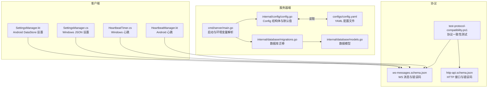
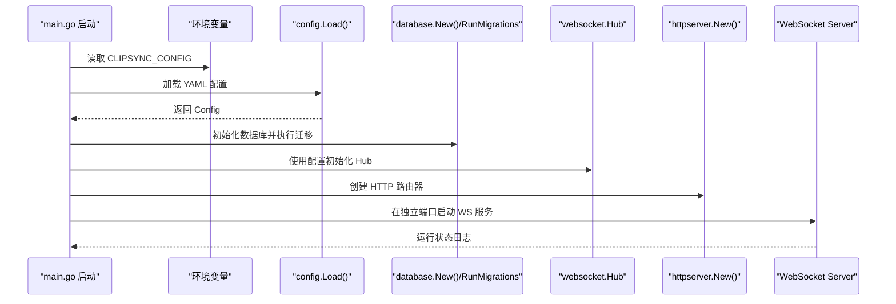
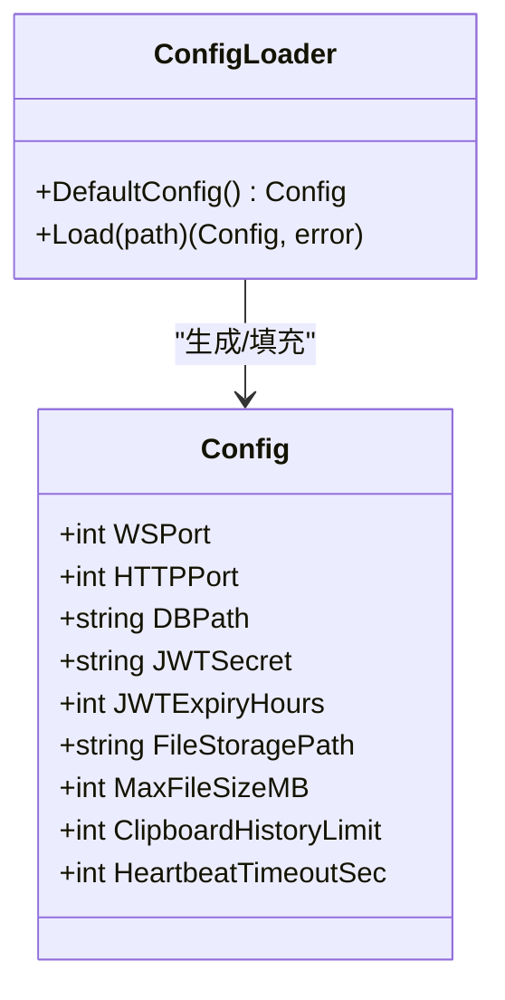
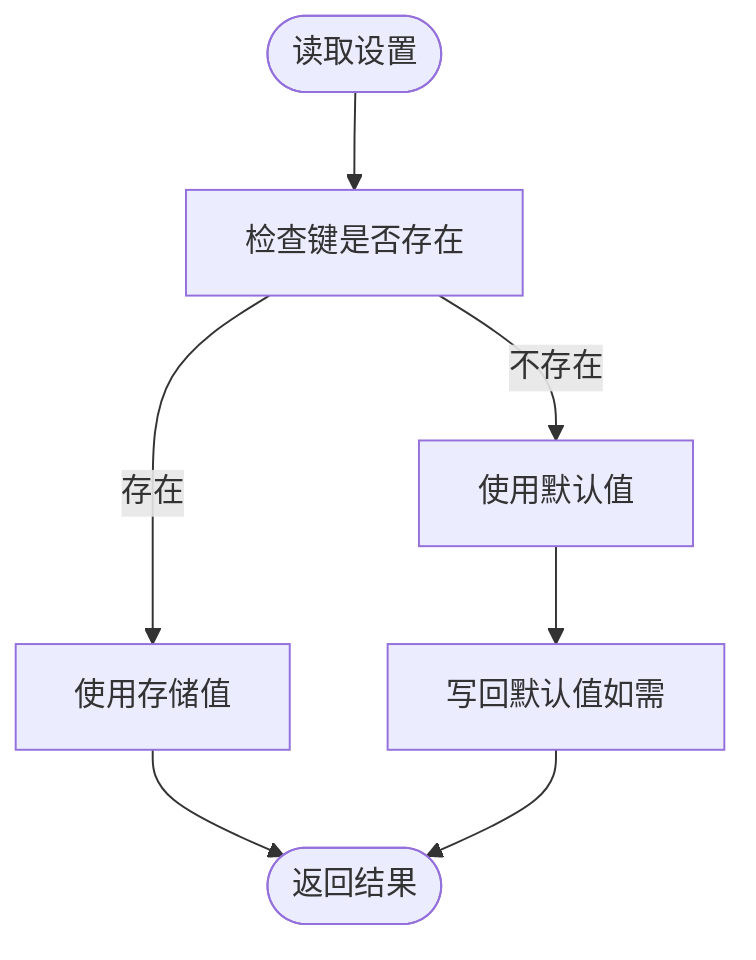
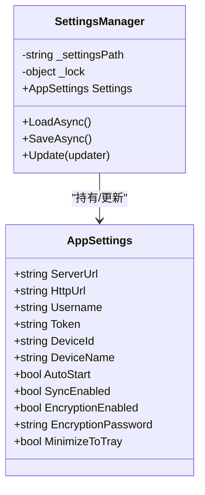
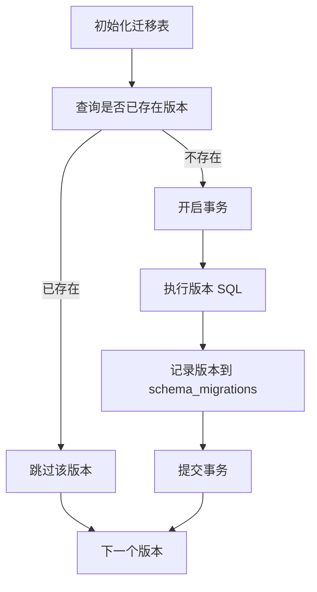
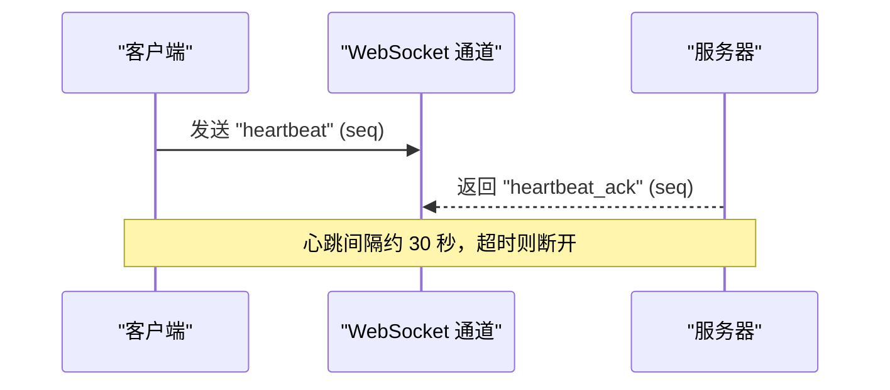
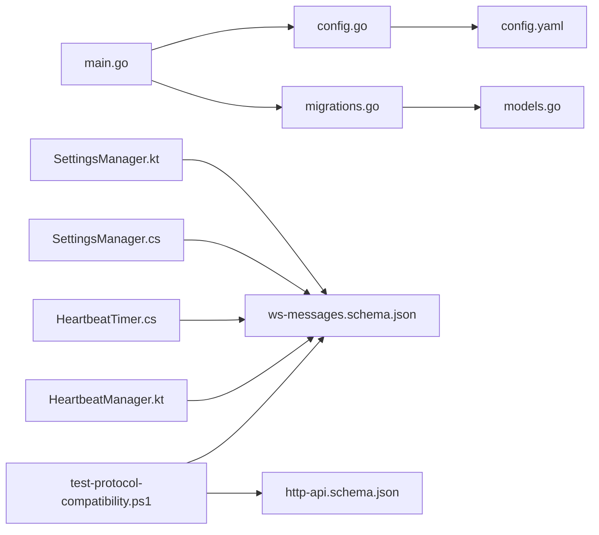

# 配置管理

<cite>
**本文引用的文件**
- [main.go](file://clipSync-server/cmd/server/main.go)
- [config.yaml](file://clipSync-server/configs/config.yaml)
- [config.go](file://clipSync-server/internal/config/config.go)
- [migrations.go](file://clipSync-server/internal/database/migrations.go)
- [models.go](file://clipSync-server/internal/database/models.go)
- [SettingsManager.kt](file://clipSync-android/app/src/main/java/com/clipsync/app/core/SettingsManager.kt)
- [SettingsManager.cs](file://clipSync-windows/ClipSync.WPF/Core/SettingsManager.cs)
- [ws-messages.schema.json](file://protocol/ws-messages.schema.json)
- [http-api.schema.json](file://protocol/http-api.schema.json)
- [HeartbeatTimer.cs](file://clipSync-windows/ClipSync.WPF/Network/HeartbeatTimer.cs)
- [HeartbeatManager.kt](file://clipSync-android/app/src/main/java/com/clipsync/app/network/HeartbeatManager.kt)
- [test-protocol-compatibility.ps1](file://scripts/test-protocol-compatibility.ps1)
</cite>

## 目录
1. [简介](#简介)
2. [项目结构](#项目结构)
3. [核心组件](#核心组件)
4. [架构总览](#架构总览)
5. [详细组件分析](#详细组件分析)
6. [依赖关系分析](#依赖关系分析)
7. [性能考虑](#性能考虑)
8. [故障排查指南](#故障排查指南)
9. [结论](#结论)
10. [附录](#附录)

## 简介
本文件系统性梳理 ClipSync 的配置管理体系，覆盖服务器端配置（YAML 文件与环境变量）、客户端配置（Android DataStore 与 Windows JSON 文件）、配置验证与迁移、环境隔离与默认值策略，并结合协议规范说明心跳、认证、上传下载等关键配置项如何影响系统行为。文档以“从入门到进阶”的方式组织，既便于初学者快速上手，也为资深开发者提供深入的技术细节与可操作的排障建议。

## 项目结构
- 服务器端通过命令行入口加载配置，支持通过环境变量覆盖配置文件路径；配置来源于 YAML 文件并在运行时注入到数据库、鉴权、HTTP/WebSocket 服务中。
- 客户端（Android 与 Windows）分别使用平台原生持久化方案存储用户设置（如服务端地址、设备名、登录态、同步开关等），并以默认值保证首次启动可用。
- 协议层定义了消息类型、错误码、HTTP 接口契约，确保跨平台一致性与可验证性。

**图表来源**
- [main.go:21-140](file://clipSync-server/cmd/server/main.go#L21-L140)
- [config.go:10-55](file://clipSync-server/internal/config/config.go#L10-L55)
- [config.yaml:1-29](file://clipSync-server/configs/config.yaml#L1-L29)
- [migrations.go:8-113](file://clipSync-server/internal/database/migrations.go#L8-L113)
- [models.go:3-45](file://clipSync-server/internal/database/models.go#L3-L45)
- [SettingsManager.kt:21-169](file://clipSync-android/app/src/main/java/com/clipsync/app/core/SettingsManager.kt#L21-L169)
- [SettingsManager.cs:44-100](file://clipSync-windows/ClipSync.WPF/Core/SettingsManager.cs#L44-L100)
- [ws-messages.schema.json:1-261](file://protocol/ws-messages.schema.json#L1-L261)
- [http-api.schema.json:1-293](file://protocol/http-api.schema.json#L1-L293)
- [test-protocol-compatibility.ps1:57-191](file://scripts/test-protocol-compatibility.ps1#L57-L191)

**章节来源**
- [main.go:21-140](file://clipSync-server/cmd/server/main.go#L21-L140)
- [config.go:10-55](file://clipSync-server/internal/config/config.go#L10-L55)
- [config.yaml:1-29](file://clipSync-server/configs/config.yaml#L1-L29)

## 核心组件
- 服务器配置加载与默认值
  - 服务器通过命令行入口解析环境变量覆盖配置文件路径，随后调用配置模块加载 YAML 并应用默认值。
  - 配置项包括 WebSocket 端口、HTTP 端口、数据库路径、JWT 密钥与过期时间、文件存储目录、最大文件大小、剪贴板历史限制、心跳超时等。
- 客户端设置管理
  - Android 使用 DataStore Preferences 存储设置，提供键值流式访问与默认值回退。
  - Windows 使用 JSON 文件存储设置，位于用户应用数据目录下，支持异步加载与保存。
- 数据库迁移与模型
  - 运行时执行数据库迁移，确保表结构与索引一致；迁移记录在 schema_migrations 表中。
  - 数据模型定义用户、设备、剪贴板历史、已上传文件等实体字段。

**章节来源**
- [config.go:10-55](file://clipSync-server/internal/config/config.go#L10-L55)
- [config.yaml:1-29](file://clipSync-server/configs/config.yaml#L1-L29)
- [SettingsManager.kt:21-169](file://clipSync-android/app/src/main/java/com/clipsync/app/core/SettingsManager.kt#L21-L169)
- [SettingsManager.cs:44-100](file://clipSync-windows/ClipSync.WPF/Core/SettingsManager.cs#L44-L100)
- [migrations.go:8-113](file://clipSync-server/internal/database/migrations.go#L8-L113)
- [models.go:3-45](file://clipSync-server/internal/database/models.go#L3-L45)

## 架构总览
服务器启动流程与配置交互的关键步骤如下：

**图表来源**
- [main.go:21-140](file://clipSync-server/cmd/server/main.go#L21-L140)
- [config.go:38-55](file://clipSync-server/internal/config/config.go#L38-L55)
- [migrations.go:8-113](file://clipSync-server/internal/database/migrations.go#L8-L113)

**章节来源**
- [main.go:21-140](file://clipSync-server/cmd/server/main.go#L21-L140)
- [config.go:38-55](file://clipSync-server/internal/config/config.go#L38-L55)

## 详细组件分析

### 服务器配置模块（Go）
- 配置结构体与默认值
  - 结构体字段覆盖网络端口、数据库路径、JWT 参数、文件存储、历史限制、心跳超时等。
  - 默认值集中于 DefaultConfig，确保未提供配置文件时仍可正常启动。
- 配置加载逻辑
  - 优先读取 YAML 文件；若文件不存在则返回默认配置；解析失败时返回错误。
  - 支持通过环境变量 CLIPSYNC_CONFIG 覆盖配置文件路径。
- 与业务组件的集成
  - 将配置传递给数据库初始化、JWT 管理器、WebSocket Hub、HTTP 服务等组件。

**图表来源**
- [config.go:10-55](file://clipSync-server/internal/config/config.go#L10-L55)

**章节来源**
- [config.go:10-55](file://clipSync-server/internal/config/config.go#L10-L55)
- [config.yaml:1-29](file://clipSync-server/configs/config.yaml#L1-L29)
- [main.go:21-140](file://clipSync-server/cmd/server/main.go#L21-L140)

### 客户端设置管理（Android）
- DataStore Preferences
  - 使用 stringPreferencesKey/booleanPreferencesKey 定义键，提供 Flow 形式的读取接口。
  - 默认值在读取时回退，例如服务端地址、设备名、同步开关等。
- 设备标识与登录态
  - 若本地无设备 ID 则自动生成并写入；登录态通过用户名与令牌联合判断。
- 异步更新与清理
  - 提供异步编辑与清空所有设置的能力，保障线程安全与一致性。

**图表来源**
- [SettingsManager.kt:39-49](file://clipSync-android/app/src/main/java/com/clipsync/app/core/SettingsManager.kt#L39-L49)
- [SettingsManager.kt:116-126](file://clipSync-android/app/src/main/java/com/clipsync/app/core/SettingsManager.kt#L116-L126)

**章节来源**
- [SettingsManager.kt:21-169](file://clipSync-android/app/src/main/java/com/clipsync/app/core/SettingsManager.kt#L21-L169)

### 客户端设置管理（Windows）
- JSON 文件存储
  - 设置对象包含服务端地址、用户名、令牌、设备信息、自动启动、同步开关、加密开关、最小化托盘等。
  - 设置文件位于用户应用数据目录下的 ClipSync 文件夹，避免权限问题。
- 异步加载与保存
  - 通过序列化/反序列化实现设置持久化，内部使用锁保证并发安全。
- 更新策略
  - 提供 Update 委托方法，允许按需修改设置对象后统一保存。

**图表来源**
- [SettingsManager.cs:8-42](file://clipSync-windows/ClipSync.WPF/Core/SettingsManager.cs#L8-L42)
- [SettingsManager.cs:44-100](file://clipSync-windows/ClipSync.WPF/Core/SettingsManager.cs#L44-L100)

**章节来源**
- [SettingsManager.cs:44-100](file://clipSync-windows/ClipSync.WPF/Core/SettingsManager.cs#L44-L100)

### 数据库迁移与模型
- 迁移机制
  - 首次运行创建 schema_migrations 表用于跟踪版本；逐个版本执行 SQL 并记录。
  - 使用事务包裹单次迁移，失败即回滚，保证幂等与一致性。
- 数据模型
  - 用户、设备、剪贴板历史、已上传文件等模型字段明确，含时间戳与外键约束。

**图表来源**
- [migrations.go:8-113](file://clipSync-server/internal/database/migrations.go#L8-L113)
- [models.go:3-45](file://clipSync-server/internal/database/models.go#L3-L45)

**章节来源**
- [migrations.go:8-113](file://clipSync-server/internal/database/migrations.go#L8-L113)
- [models.go:3-45](file://clipSync-server/internal/database/models.go#L3-L45)

### 协议与配置联动（心跳、认证、上传下载）
- WebSocket 消息与心跳
  - 协议定义了 heartbeat/heartbeat_ack 等消息类型，客户端按固定间隔发送心跳，服务器据此维护连接活跃度。
  - Android 与 Windows 的心跳实现均采用约 30 秒间隔，与协议版本保持一致。
- HTTP API 与错误码
  - HTTP 接口契约定义了认证、注册、刷新、健康检查、设备列表、上传下载等端点与响应结构。
  - 错误码覆盖鉴权失败、令牌过期、请求限流、负载无效、内容过大、设备不存在、内部错误、重复内容等场景。
- 协议一致性测试
  - PowerShell 脚本校验 Go/Windows/Android 三端在消息字段命名、端点、协议版本、心跳实现、加密支持、错误码等方面的一致性。

**图表来源**
- [ws-messages.schema.json:115-134](file://protocol/ws-messages.schema.json#L115-L134)
- [HeartbeatTimer.cs:14](file://clipSync-windows/ClipSync.WPF/Network/HeartbeatTimer.cs#L14)
- [HeartbeatManager.kt:73](file://clipSync-android/app/src/main/java/com/clipsync/app/network/HeartbeatManager.kt#L73)

**章节来源**
- [ws-messages.schema.json:1-261](file://protocol/ws-messages.schema.json#L1-L261)
- [http-api.schema.json:1-293](file://protocol/http-api.schema.json#L1-L293)
- [test-protocol-compatibility.ps1:57-191](file://scripts/test-protocol-compatibility.ps1#L57-L191)
- [HeartbeatTimer.cs:14-49](file://clipSync-windows/ClipSync.WPF/Network/HeartbeatTimer.cs#L14-L49)
- [HeartbeatManager.kt:27-44](file://clipSync-android/app/src/main/java/com/clipsync/app/network/HeartbeatManager.kt#L27-L44)

## 依赖关系分析
- 服务器端
  - main.go 依赖 config.Load 与 database.RunMigrations；配置驱动数据库初始化与服务启动。
  - 配置项直接影响 HTTP/WebSocket 端口、JWT 策略、文件存储与历史限制。
- 客户端
  - Android/Windows 设置管理器分别依赖平台持久化能力，读取默认值并写回用户选择。
- 协议
  - 心跳、认证、上传下载等行为受协议约束，客户端与服务器必须遵循相同的消息格式与错误码。

**图表来源**
- [main.go:21-140](file://clipSync-server/cmd/server/main.go#L21-L140)
- [config.go:38-55](file://clipSync-server/internal/config/config.go#L38-L55)
- [config.yaml:1-29](file://clipSync-server/configs/config.yaml#L1-L29)
- [migrations.go:8-113](file://clipSync-server/internal/database/migrations.go#L8-L113)
- [models.go:3-45](file://clipSync-server/internal/database/models.go#L3-L45)
- [SettingsManager.kt:21-169](file://clipSync-android/app/src/main/java/com/clipsync/app/core/SettingsManager.kt#L21-L169)
- [SettingsManager.cs:44-100](file://clipSync-windows/ClipSync.WPF/Core/SettingsManager.cs#L44-L100)
- [ws-messages.schema.json:1-261](file://protocol/ws-messages.schema.json#L1-L261)
- [http-api.schema.json:1-293](file://protocol/http-api.schema.json#L1-L293)
- [test-protocol-compatibility.ps1:57-191](file://scripts/test-protocol-compatibility.ps1#L57-L191)

**章节来源**
- [main.go:21-140](file://clipSync-server/cmd/server/main.go#L21-L140)
- [config.go:38-55](file://clipSync-server/internal/config/config.go#L38-L55)
- [SettingsManager.kt:21-169](file://clipSync-android/app/src/main/java/com/clipsync/app/core/SettingsManager.kt#L21-L169)
- [SettingsManager.cs:44-100](file://clipSync-windows/ClipSync.WPF/Core/SettingsManager.cs#L44-L100)

## 性能考虑
- 配置加载
  - YAML 解析仅在启动阶段进行，成本极低；默认值策略避免了磁盘 IO。
- 数据库迁移
  - 事务化迁移减少锁竞争；版本检查避免重复执行。
- 心跳频率
  - 约 30 秒的心跳间隔在保活与资源消耗之间取得平衡；可根据网络状况调整（需保持跨平台一致）。
- 文件上传
  - 最大文件大小限制与哈希去重有助于控制带宽与存储压力。

[本节为通用指导，无需特定文件引用]

## 故障排查指南
- 服务器无法启动或配置未生效
  - 检查环境变量 CLIPSYNC_CONFIG 是否正确指向配置文件路径。
  - 确认 YAML 语法正确且字段名称与默认值一致。
  - 查看启动日志中的配置打印，确认端口与数据库路径。
- 数据库迁移失败
  - 检查 schema_migrations 表是否创建成功；查看具体迁移 SQL 执行错误。
  - 确保数据库文件可写且无并发写入冲突。
- 客户端无法连接服务器
  - 核对服务端地址与端口设置（Android/Windows 设置项）。
  - 确认防火墙放行对应端口；检查 WebSocket 与 HTTP 服务是否同时启动。
- 心跳频繁断开
  - 检查客户端心跳实现是否与协议一致（约 30 秒间隔）。
  - 服务器端心跳超时配置是否过短；适当增大以适应网络波动。
- HTTP 请求报错
  - 对照 HTTP API 错误码，定位是鉴权失败、负载无效、内容过大还是设备不存在等问题。
  - 使用协议一致性测试脚本验证三端实现是否匹配。

**章节来源**
- [main.go:21-140](file://clipSync-server/cmd/server/main.go#L21-L140)
- [config.yaml:1-29](file://clipSync-server/configs/config.yaml#L1-L29)
- [migrations.go:8-113](file://clipSync-server/internal/database/migrations.go#L8-L113)
- [http-api.schema.json:280-292](file://protocol/http-api.schema.json#L280-L292)
- [test-protocol-compatibility.ps1:57-191](file://scripts/test-protocol-compatibility.ps1#L57-L191)

## 结论
ClipSync 的配置管理以“服务器 YAML + 环境变量覆盖 + 客户端平台化存储”为核心，辅以严格的协议约束与迁移机制，实现了跨平台的一致性与可维护性。通过默认值策略与错误码规范，系统在异常情况下也能提供清晰的反馈与恢复路径。建议在生产环境中：
- 显式设置 CLIPSYNC_CONFIG 并定期备份配置文件；
- 为 JWT 密钥与敏感参数启用环境变量注入；
- 在网络波动较大的环境下适度调整心跳超时；
- 使用协议一致性测试持续验证三端实现。

[本节为总结性内容，无需特定文件引用]

## 附录

### 配置项与默认值对照（服务器）
- ws_port: 默认 8080
- http_port: 默认 8081
- db_path: 默认 ./data/clipsync.db
- jwt_secret: 默认 clipsync-secret-change-in-production
- jwt_expiry_hours: 默认 720（30 天）
- file_storage_path: 默认 ./data/files
- max_file_size_mb: 默认 5
- clipboard_history_limit: 默认 50
- heartbeat_timeout_seconds: 默认 90

**章节来源**
- [config.go:24-35](file://clipSync-server/internal/config/config.go#L24-L35)
- [config.yaml:3-28](file://clipSync-server/configs/config.yaml#L3-L28)

### 客户端配置要点（Android/Windows）
- Android
  - 服务端地址、HTTP 地址、用户名、令牌、设备 ID/Name、同步开关、加密开关等。
  - 默认值在读取时回退，设备 ID 缺失时自动生成。
- Windows
  - 服务端地址、HTTP 地址、用户名、令牌、设备 ID/Name、自动启动、同步开关、加密开关、最小化托盘等。
  - 设置文件位于用户应用数据目录，支持异步加载与保存。

**章节来源**
- [SettingsManager.kt:21-169](file://clipSync-android/app/src/main/java/com/clipsync/app/core/SettingsManager.kt#L21-L169)
- [SettingsManager.cs:8-42](file://clipSync-windows/ClipSync.WPF/Core/SettingsManager.cs#L8-L42)
- [SettingsManager.cs:44-100](file://clipSync-windows/ClipSync.WPF/Core/SettingsManager.cs#L44-L100)

### 协议与错误码参考
- WebSocket 消息类型：auth、auth_response、heartbeat、heartbeat_ack、clipboard_push、clipboard_sync、clipboard_pull、clipboard_history、device_list、device_list_response、device_unregister、error、ping、pong
- HTTP 错误码：AUTH_FAILED、TOKEN_EXPIRED、RATE_LIMITED、INVALID_PAYLOAD、CONTENT_TOO_LARGE、DEVICE_NOT_FOUND、INTERNAL_ERROR、DUPLICATE_CONTENT、USERNAME_EXISTS、INVALID_CREDENTIALS

**章节来源**
- [ws-messages.schema.json:8-261](file://protocol/ws-messages.schema.json#L8-L261)
- [http-api.schema.json:280-292](file://protocol/http-api.schema.json#L280-L292)