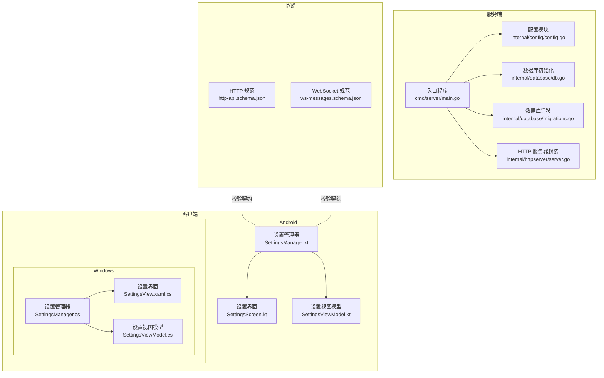
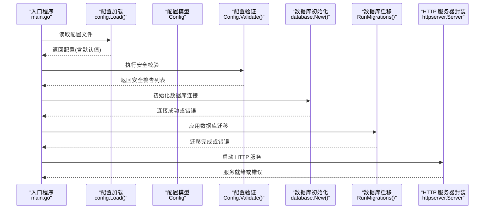
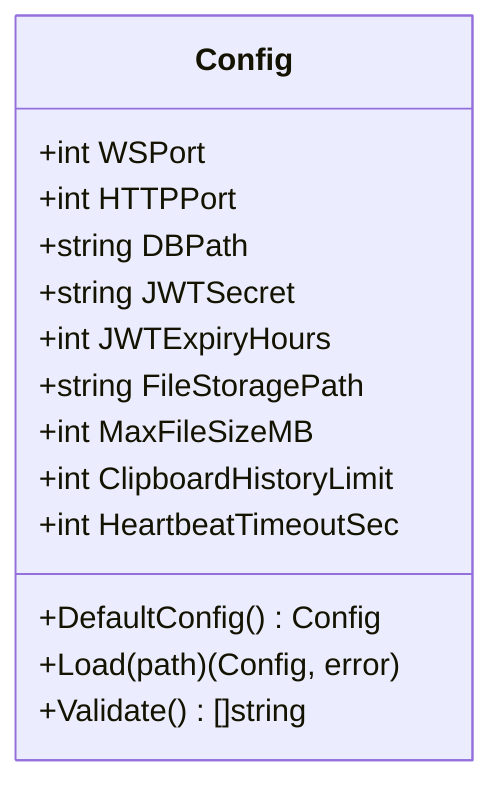
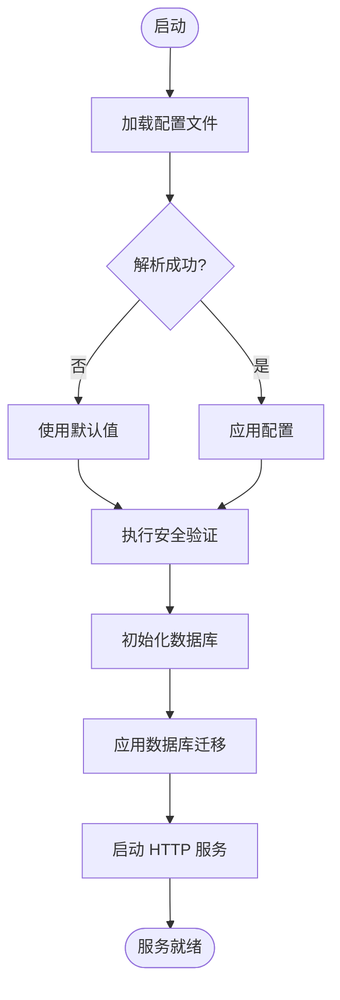
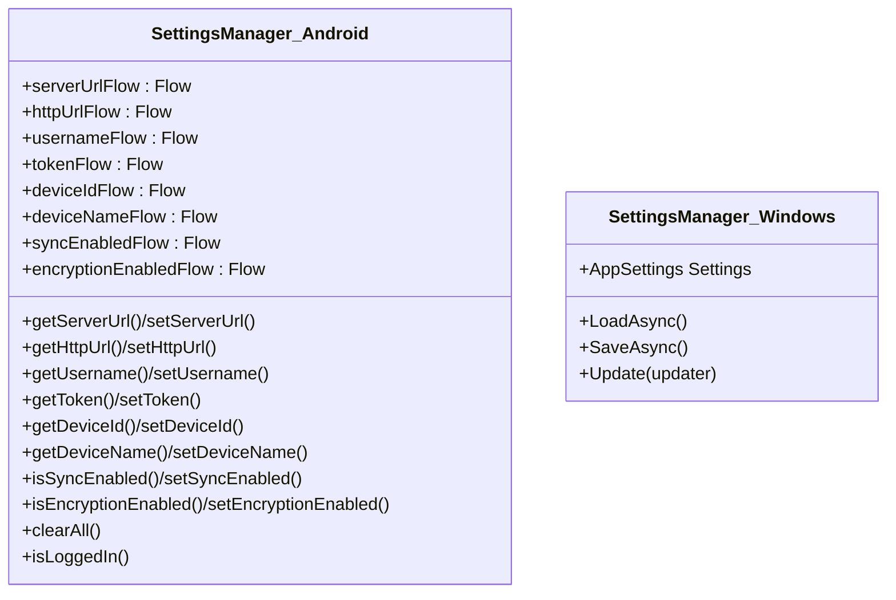
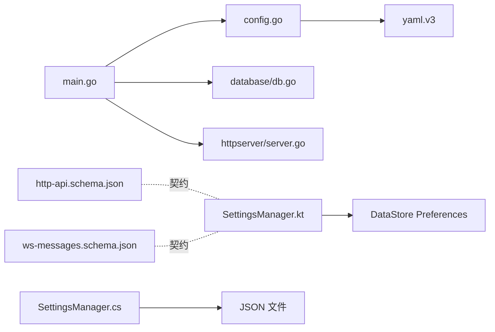

# 配置验证

<cite>
**本文引用的文件**
- [clipSync-server 内部配置模块 config.go](file://clipSync-server/internal/config/config.go)
- [服务器配置文件 config.yaml](file://clipSync-server/configs/config.yaml)
- [服务器入口 main.go](file://clipSync-server/cmd/server/main.go)
- [HTTP 服务器封装 server.go](file://clipSync-server/internal/httpserver/server.go)
- [数据库初始化与连接 db.go](file://clipSync-server/internal/database/db.go)
- [数据库迁移 migrations.go](file://clipSync-server/internal/database/migrations.go)
- [认证错误定义 errors.go](file://clipSync-server/internal/auth/errors.go)
- [Android 设置管理器 SettingsManager.kt](file://clipSync-android/app/src/main/java/com/clipsync/app/core/SettingsManager.kt)
- [Windows 设置管理器 SettingsManager.cs](file://clipSync-windows/ClipSync.WPF/Core/SettingsManager.cs)
- [Android 设置界面 SettingsScreen.kt](file://clipSync-android/app/src/main/java/com/clipsync/app/ui/screens/SettingsScreen.kt)
- [Android 设置视图模型 SettingsViewModel.kt](file://clipSync-android/app/src/main/java/com/clipsync/app/viewmodel/SettingsViewModel.kt)
- [Windows 设置界面 SettingsView.xaml.cs](file://clipSync-windows/ClipSync.WPF/UI/Views/SettingsView.xaml.cs)
- [Windows 设置视图模型 SettingsViewModel.cs](file://clipSync-windows/ClipSync.WPF/UI/ViewModels/SettingsViewModel.cs)
- [HTTP 协议规范 http-api.schema.json](file://protocol/http-api.schema.json)
- [WebSocket 协议规范 ws-messages.schema.json](file://protocol/ws-messages.schema.json)
</cite>

## 目录
1. [简介](#简介)
2. [项目结构](#项目结构)
3. [核心组件](#核心组件)
4. [架构总览](#架构总览)
5. [详细组件分析](#详细组件分析)
6. [依赖关系分析](#依赖关系分析)
7. [性能考量](#性能考量)
8. [故障排查指南](#故障排查指南)
9. [结论](#结论)
10. [附录](#附录)

## 简介
本文件围绕“配置验证系统”进行深入说明，覆盖以下方面：
- 配置加载与默认值策略
- 配置验证规则（类型、范围、安全与依赖）
- 错误处理与用户反馈机制
- 启动阶段与运行时的执行时机
- 常见问题与解决方案
- 跨平台客户端设置持久化与校验思路

目标是让初学者快速理解系统如何保证配置安全与一致性，同时为有经验的开发者提供足够的技术细节与可扩展建议。

## 项目结构
本仓库包含服务端、Android 客户端、Windows 客户端以及协议规范。与配置验证直接相关的关键位置如下：
- 服务端配置：内部配置模块负责解析 YAML 并提供默认值与安全校验；入口程序在启动时加载并验证配置。
- 客户端配置：Android 使用 DataStore Preferences 持久化；Windows 使用本地 JSON 文件持久化；两者均提供默认值与基本输入约束。
- 协议规范：HTTP 与 WebSocket 的请求/响应字段、枚举值、错误码等构成客户端与服务端交互的契约，间接用于配置项的格式与取值校验。

图表来源
- [clipSync-server 内部配置模块 config.go:1-72](file://clipSync-server/internal/config/config.go#L1-L72)
- [服务器入口 main.go:1-146](file://clipSync-server/cmd/server/main.go#L1-L146)
- [HTTP 服务器封装 server.go:1-49](file://clipSync-server/internal/httpserver/server.go#L1-L49)
- [数据库初始化与连接 db.go:1-62](file://clipSync-server/internal/database/db.go#L1-L62)
- [数据库迁移 migrations.go:1-113](file://clipSync-server/internal/database/migrations.go#L1-L113)
- [Android 设置管理器 SettingsManager.kt:1-170](file://clipSync-android/app/src/main/java/com/clipsync/app/core/SettingsManager.kt#L1-L170)
- [Android 设置界面 SettingsScreen.kt:1-229](file://clipSync-android/app/src/main/java/com/clipsync/app/ui/screens/SettingsScreen.kt#L1-L229)
- [Android 设置视图模型 SettingsViewModel.kt:1-96](file://clipSync-android/app/src/main/java/com/clipsync/app/viewmodel/SettingsViewModel.kt#L1-L96)
- [Windows 设置管理器 SettingsManager.cs:1-102](file://clipSync-windows/ClipSync.WPF/Core/SettingsManager.cs#L1-L102)
- [Windows 设置界面 SettingsView.xaml.cs:1-45](file://clipSync-windows/ClipSync.WPF/UI/Views/SettingsView.xaml.cs#L1-L45)
- [Windows 设置视图模型 SettingsViewModel.cs:1-123](file://clipSync-windows/ClipSync.WPF/UI/ViewModels/SettingsViewModel.cs#L1-L123)
- [HTTP 协议规范 http-api.schema.json:1-293](file://protocol/http-api.schema.json#L1-L293)
- [WebSocket 协议规范 ws-messages.schema.json:1-261](file://protocol/ws-messages.schema.json#L1-L261)

章节来源
- [clipSync-server 内部配置模块 config.go:1-72](file://clipSync-server/internal/config/config.go#L1-L72)
- [服务器入口 main.go:1-146](file://clipSync-server/cmd/server/main.go#L1-L146)

## 核心组件
本节聚焦配置验证的核心构件与职责：
- 服务端配置模型与默认值：定义所有配置项、默认值与安全校验。
- 配置加载与解析：从 YAML 文件读取并回退到默认值。
- 启动阶段验证：在服务启动时输出安全警告。
- 客户端配置持久化：Android 与 Windows 分别使用偏好存储与 JSON 文件，提供默认值与基本约束。
- 协议契约：通过 JSON Schema 明确字段类型、长度、枚举与错误码，作为配置项格式与取值的外部约束。

章节来源
- [clipSync-server 内部配置模块 config.go:10-71](file://clipSync-server/internal/config/config.go#L10-L71)
- [服务器配置文件 config.yaml:1-29](file://clipSync-server/configs/config.yaml#L1-L29)
- [服务器入口 main.go:25-41](file://clipSync-server/cmd/server/main.go#L25-L41)
- [Android 设置管理器 SettingsManager.kt:21-170](file://clipSync-android/app/src/main/java/com/clipsync/app/core/SettingsManager.kt#L21-L170)
- [Windows 设置管理器 SettingsManager.cs:8-102](file://clipSync-windows/ClipSync.WPF/Core/SettingsManager.cs#L8-L102)
- [HTTP 协议规范 http-api.schema.json:1-293](file://protocol/http-api.schema.json#L1-L293)
- [WebSocket 协议规范 ws-messages.schema.json:1-261](file://protocol/ws-messages.schema.json#L1-L261)

## 架构总览
下图展示配置验证在启动阶段的执行路径与各组件之间的交互：

图表来源
- [服务器入口 main.go:25-106](file://clipSync-server/cmd/server/main.go#L25-L106)
- [clipSync-server 内部配置模块 config.go:38-71](file://clipSync-server/internal/config/config.go#L38-L71)
- [HTTP 服务器封装 server.go:26-41](file://clipSync-server/internal/httpserver/server.go#L26-L41)
- [数据库初始化与连接 db.go:17-56](file://clipSync-server/internal/database/db.go#L17-L56)
- [数据库迁移 migrations.go:8-113](file://clipSync-server/internal/database/migrations.go#L8-L113)

## 详细组件分析

### 服务端配置模型与验证
- 配置项与默认值：服务端通过结构体承载所有配置项，并提供合理的默认值，确保最小可用配置。
- 加载与解析：优先从指定路径读取 YAML，不存在则返回默认值；解析失败返回错误。
- 安全验证：当前实现检查默认密钥与过长的令牌有效期，输出安全警告，便于生产环境调整。

图表来源
- [clipSync-server 内部配置模块 config.go:10-71](file://clipSync-server/internal/config/config.go#L10-L71)

章节来源
- [clipSync-server 内部配置模块 config.go:23-71](file://clipSync-server/internal/config/config.go#L23-L71)
- [服务器配置文件 config.yaml:1-29](file://clipSync-server/configs/config.yaml#L1-L29)

### 配置加载与启动流程
- 入口程序支持通过环境变量覆盖配置文件路径，默认读取项目内配置文件。
- 成功加载后打印关键配置信息；随后执行安全验证并输出警告。
- 初始化数据库、应用迁移，再启动 HTTP 与 WebSocket 服务。

图表来源
- [服务器入口 main.go:25-106](file://clipSync-server/cmd/server/main.go#L25-L106)
- [clipSync-server 内部配置模块 config.go:38-55](file://clipSync-server/internal/config/config.go#L38-L55)

章节来源
- [服务器入口 main.go:21-106](file://clipSync-server/cmd/server/main.go#L21-L106)

### 客户端配置持久化与默认值
- Android：使用 DataStore Preferences 存储设置，提供默认值（如服务器地址、同步开关、加密开关等），并在首次访问时生成设备标识。
- Windows：使用本地 JSON 文件存储设置，提供默认值与自动启动、托盘最小化等选项，保存时加锁避免并发写入冲突。

图表来源
- [Android 设置管理器 SettingsManager.kt:21-170](file://clipSync-android/app/src/main/java/com/clipsync/app/core/SettingsManager.kt#L21-L170)
- [Windows 设置管理器 SettingsManager.cs:44-102](file://clipSync-windows/ClipSync.WPF/Core/SettingsManager.cs#L44-L102)

章节来源
- [Android 设置管理器 SettingsManager.kt:21-170](file://clipSync-android/app/src/main/java/com/clipsync/app/core/SettingsManager.kt#L21-L170)
- [Windows 设置管理器 SettingsManager.cs:44-102](file://clipSync-windows/ClipSync.WPF/Core/SettingsManager.cs#L44-L102)

### 协议契约与配置项格式校验
- HTTP 协议规范：明确请求/响应字段类型、长度限制、枚举取值与错误码，可用于客户端侧对输入进行格式与取值校验。
- WebSocket 协议规范：定义消息类型、版本、时间戳、负载结构及各消息类型的必需字段与取值范围，有助于客户端和服务端在消息层面对配置项进行一致性校验。

章节来源
- [HTTP 协议规范 http-api.schema.json:10-293](file://protocol/http-api.schema.json#L10-L293)
- [WebSocket 协议规范 ws-messages.schema.json:1-261](file://protocol/ws-messages.schema.json#L1-L261)

## 依赖关系分析
- 服务端入口依赖配置模块、数据库模块与 HTTP 服务器封装；配置模块依赖 YAML 解析库。
- 客户端设置管理器分别依赖各自平台的数据存储方案（Android DataStore、Windows JSON 文件）。
- 协议规范为客户端与服务端交互提供契约，间接影响配置项的取值与格式。

图表来源
- [服务器入口 main.go:1-17](file://clipSync-server/cmd/server/main.go#L1-L17)
- [clipSync-server 内部配置模块 config.go:3-8](file://clipSync-server/internal/config/config.go#L3-L8)
- [HTTP 服务器封装 server.go:1-16](file://clipSync-server/internal/httpserver/server.go#L1-L16)
- [数据库初始化与连接 db.go:1-10](file://clipSync-server/internal/database/db.go#L1-L10)
- [Android 设置管理器 SettingsManager.kt:1-14](file://clipSync-android/app/src/main/java/com/clipsync/app/core/SettingsManager.kt#L1-L14)
- [Windows 设置管理器 SettingsManager.cs:1-5](file://clipSync-windows/ClipSync.WPF/Core/SettingsManager.cs#L1-L5)
- [HTTP 协议规范 http-api.schema.json:1-6](file://protocol/http-api.schema.json#L1-L6)
- [WebSocket 协议规范 ws-messages.schema.json:1-6](file://protocol/ws-messages.schema.json#L1-L6)

章节来源
- [服务器入口 main.go:1-17](file://clipSync-server/cmd/server/main.go#L1-L17)
- [clipSync-server 内部配置模块 config.go:3-8](file://clipSync-server/internal/config/config.go#L3-L8)

## 性能考量
- 数据库连接池与 WAL 模式：服务端数据库初始化设置了最大连接数、空闲连接数，并启用 WAL 与若干 PRAGMA 优化，以适配低资源环境。
- 迁移事务：数据库迁移在事务中执行，失败回滚，保证数据结构一致性。
- 配置加载成本：YAML 解析与默认值回退开销极小，通常可忽略不计。

章节来源
- [数据库初始化与连接 db.go:17-56](file://clipSync-server/internal/database/db.go#L17-L56)
- [数据库迁移 migrations.go:8-113](file://clipSync-server/internal/database/migrations.go#L8-L113)

## 故障排查指南
- 配置文件读取失败
  - 现象：启动时报错提示无法读取配置文件。
  - 处理：确认配置文件路径是否正确，是否存在权限问题；若文件缺失，系统会回退到默认值。
  - 参考
    - [clipSync-server 内部配置模块 config.go:42-48](file://clipSync-server/internal/config/config.go#L42-L48)
    - [服务器入口 main.go:31-34](file://clipSync-server/cmd/server/main.go#L31-L34)

- 配置解析失败
  - 现象：YAML 解析报错。
  - 处理：检查 YAML 语法与缩进；核对键名与类型是否匹配。
  - 参考
    - [clipSync-server 内部配置模块 config.go:50-52](file://clipSync-server/internal/config/config.go#L50-L52)

- 安全警告
  - 现象：启动日志出现安全警告（如默认密钥、令牌有效期过长）。
  - 处理：在生产环境中修改密钥与令牌有效期，避免使用默认值。
  - 参考
    - [clipSync-server 内部配置模块 config.go:59-71](file://clipSync-server/internal/config/config.go#L59-L71)
    - [服务器入口 main.go:38-41](file://clipSync-server/cmd/server/main.go#L38-L41)

- 数据库初始化失败
  - 现象：数据库打开失败或 Ping 失败。
  - 处理：检查数据库路径权限、磁盘空间；确认 SQLite 驱动可用。
  - 参考
    - [数据库初始化与连接 db.go:18-53](file://clipSync-server/internal/database/db.go#L18-L53)

- 数据库迁移失败
  - 现象：迁移执行失败或记录迁移版本失败。
  - 处理：查看具体迁移 SQL 与权限；必要时清理迁移表重新尝试。
  - 参考
    - [数据库迁移 migrations.go:91-110](file://clipSync-server/internal/database/migrations.go#L91-L110)

- 认证错误
  - 现象：登录/刷新令牌返回特定错误码。
  - 处理：根据错误码定位问题（凭据无效、用户名已存在、令牌过期等）。
  - 参考
    - [认证错误定义 errors.go:7-11](file://clipSync-server/internal/auth/errors.go#L7-L11)
    - [HTTP 协议规范 http-api.schema.json:280-291](file://protocol/http-api.schema.json#L280-L291)

- 客户端设置无法保存
  - 现象：Windows 设置保存后未生效或抛出异常。
  - 处理：确认 JSON 文件路径存在且可写；检查并发写入锁逻辑。
  - 参考
    - [Windows 设置管理器 SettingsManager.cs:62-91](file://clipSync-windows/ClipSync.WPF/Core/SettingsManager.cs#L62-L91)

## 结论
本项目的配置验证体系在服务端通过“默认值 + 安全校验”的方式，在启动阶段即暴露潜在风险；在客户端通过平台原生存储提供默认值与基本约束。配合协议规范，形成从配置到协议的一致性保障。建议后续扩展包括：
- 在服务端增加更严格的范围与依赖校验（如端口范围、路径存在性、文件大小上限等）。
- 在客户端增加输入格式校验与即时反馈（如 URL 格式、布尔开关范围）。
- 将协议规范引入客户端校验流程，减少跨端不一致导致的运行时错误。

## 附录

### 配置项类型与范围检查清单
- 类型验证
  - 端口类：整数范围校验（如 1–65535）。
  - 路径类：字符串非空且存在性检查（服务端数据库路径、文件存储目录）。
  - 时间类：整数单位（小时/秒）与合理范围。
- 范围检查
  - 文件大小：正整数，不超过服务端限制。
  - 历史条目：正整数，建议上限（如 50）。
  - 心跳超时：正整数，建议合理区间（如 30–300 秒）。
- 依赖关系
  - JWT 密钥与过期时间：密钥不可为默认值，过期时间建议不超过 30 天。
  - 服务器 URL：需与协议规范中的端口一致，避免跨端不一致。
- 格式验证
  - URL：符合 URI 格式；WebSocket 与 HTTP 端口应匹配。
  - 设备名称：长度限制与字符集限制。
  - 平台枚举：仅允许预定义值（windows/android/macos/ios）。

### 错误处理与用户反馈
- 服务端
  - 配置加载失败：返回错误并终止启动。
  - 安全警告：通过日志输出，提示修改默认值。
  - 数据库错误：包装为统一错误并终止启动。
- 客户端
  - 设置保存失败：捕获异常并提示用户重试或检查权限。
  - 输入非法：在 UI 层提示格式错误并阻止提交。

### 配置回滚机制
- 服务端：当前未实现配置回滚；可在新增严格校验后，若校验失败则拒绝启动并提示修复。
- 客户端：设置采用原子写入（Windows JSON 文件加锁），若写入失败可保留旧配置不变。