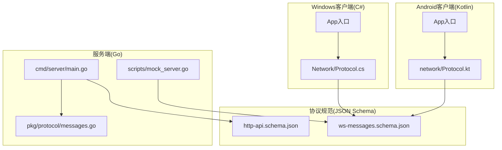
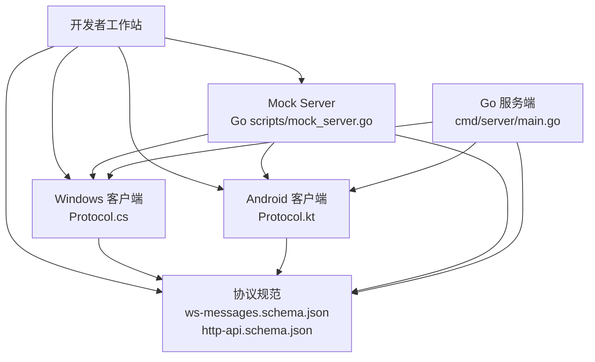
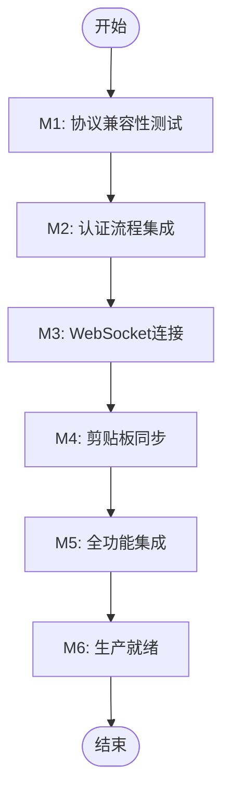
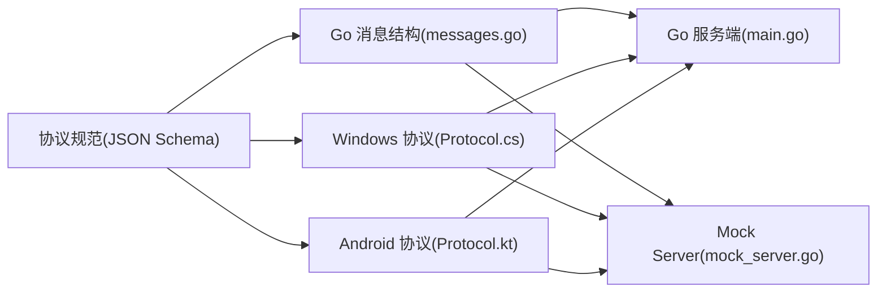

# 并行开发策略

<cite>
**本文引用的文件**
- [DEVELOPMENT_PLAN.md](file://DEVELOPMENT_PLAN.md)
- [http-api.schema.json](file://protocol/http-api.schema.json)
- [ws-messages.schema.json](file://protocol/ws-messages.schema.json)
- [test-protocol-compatibility.ps1](file://scripts/test-protocol-compatibility.ps1)
- [messages.go](file://clipSync-server/pkg/protocol/messages.go)
- [mock_server.go](file://clipSync-server/scripts/mock_server.go)
- [main.go](file://clipSync-server/cmd/server/main.go)
- [Protocol.cs](file://clipSync-windows/ClipSync.WPF/Network/Protocol.cs)
- [Protocol.kt](file://clipSync-android/app/src/main/java/com/clipsync/app/network/Protocol.kt)
</cite>

## 目录
1. [引言](#引言)
2. [项目结构](#项目结构)
3. [核心组件](#核心组件)
4. [架构总览](#架构总览)
5. [详细组件分析](#详细组件分析)
6. [依赖关系分析](#依赖关系分析)
7. [性能考量](#性能考量)
8. [故障排查指南](#故障排查指南)
9. [结论](#结论)
10. [附录](#附录)

## 引言
本文件面向ClipSync项目的并行开发策略，系统阐述“零依赖并行开发”的理念与实施路径，围绕共享协议规范、阶段化开发计划、模拟器与桩代码策略、集成里程碑测试验证以及风险评估与应对展开，帮助跨Go服务端、Windows WPF客户端、Android客户端三轨并行推进，降低耦合、缩短交付周期、提升质量与可维护性。

## 项目结构
项目采用多模块分层组织：
- 服务端（Go）：命令入口、配置、认证、数据库、HTTP与WebSocket服务、协议消息定义、脚本与测试
- 客户端（Windows WPF）：应用入口、核心组件（剪贴板监听、加密、设置）、网络层（HTTP/WS）、UI与视图模型
- 客户端（Android）：应用入口、核心组件（剪贴板监听、加密、设置）、网络层（HTTP/WS）、UI与数据层
- 协议规范：HTTP API与WebSocket消息的JSON Schema与开发计划中的规范说明
- 脚本工具：协议兼容性测试脚本、Go模拟服务器



图表来源
- [main.go:1-146](file://clipSync-server/cmd/server/main.go#L1-L146)
- [messages.go:1-132](file://clipSync-server/pkg/protocol/messages.go#L1-L132)
- [mock_server.go:1-664](file://clipSync-server/scripts/mock_server.go#L1-L664)
- [Protocol.cs:1-167](file://clipSync-windows/ClipSync.WPF/Network/Protocol.cs#L1-L167)
- [Protocol.kt:1-263](file://clipSync-android/app/src/main/java/com/clipsync/app/network/Protocol.kt#L1-L263)
- [http-api.schema.json:1-293](file://protocol/http-api.schema.json#L1-L293)
- [ws-messages.schema.json:1-261](file://protocol/ws-messages.schema.json#L1-L261)

章节来源
- [DEVELOPMENT_PLAN.md:365-527](file://DEVELOPMENT_PLAN.md#L365-L527)

## 核心组件
- 共享协议规范：以JSON Schema定义HTTP API与WebSocket消息格式，确保三端一致性
- 消息类型与字段：统一的消息类型枚举、字段命名（snake_case）、版本号、时间戳等
- 加密规范：AES-256-CBC参数与可选启用标志
- 错误码：统一的错误码与HTTP状态映射
- 模拟服务器：Go编写的无依赖Mock Server，支持延迟与错误注入
- 客户端协议适配：Windows与Android分别实现消息序列化/反序列化与辅助构造器

章节来源
- [DEVELOPMENT_PLAN.md:18-362](file://DEVELOPMENT_PLAN.md#L18-L362)
- [http-api.schema.json:1-293](file://protocol/http-api.schema.json#L1-L293)
- [ws-messages.schema.json:1-261](file://protocol/ws-messages.schema.json#L1-L261)
- [messages.go:1-132](file://clipSync-server/pkg/protocol/messages.go#L1-L132)
- [mock_server.go:1-664](file://clipSync-server/scripts/mock_server.go#L1-L664)
- [Protocol.cs:1-167](file://clipSync-windows/ClipSync.WPF/Network/Protocol.cs#L1-L167)
- [Protocol.kt:1-263](file://clipSync-android/app/src/main/java/com/clipsync/app/network/Protocol.kt#L1-L263)

## 架构总览
并行开发以“协议即契约”为核心，三端在不依赖真实后端的情况下完成各自模块的开发与自测；服务端负责最终集成与稳定性验证；客户端通过Mock Server进行端到端演练。



图表来源
- [mock_server.go:1-664](file://clipSync-server/scripts/mock_server.go#L1-L664)
- [main.go:1-146](file://clipSync-server/cmd/server/main.go#L1-L146)
- [ws-messages.schema.json:1-261](file://protocol/ws-messages.schema.json#L1-L261)
- [http-api.schema.json:1-293](file://protocol/http-api.schema.json#L1-L293)
- [Protocol.cs:1-167](file://clipSync-windows/ClipSync.WPF/Network/Protocol.cs#L1-L167)
- [Protocol.kt:1-263](file://clipSync-android/app/src/main/java/com/clipsync/app/network/Protocol.kt#L1-L263)

## 详细组件分析

### 共享协议规范设计与重要性
- 规范来源：HTTP API与WebSocket消息均以JSON Schema定义，覆盖请求/响应体、字段约束、错误码映射
- 设计要点：
  - WebSocket消息统一Envelope：type、version、timestamp、device_id、payload
  - 消息类型枚举一致：auth、auth_response、heartbeat、heartbeat_ack、clipboard_push、clipboard_sync、clipboard_pull、clipboard_history、device_list、device_list_response、device_unregister、error、ping、pong
  - 字段命名一致性：snake_case，便于跨语言序列化/反序列化
  - 版本控制：消息包含version字段，协议版本变更需向后兼容
- 重要性：消除平台间差异，避免“接口漂移”，确保三端在开发早期即可对齐

章节来源
- [DEVELOPMENT_PLAN.md:18-362](file://DEVELOPMENT_PLAN.md#L18-L362)
- [ws-messages.schema.json:1-261](file://protocol/ws-messages.schema.json#L1-L261)
- [http-api.schema.json:1-293](file://protocol/http-api.schema.json#L1-L293)

### 阶段化开发计划
- 基础建设期（第1周）：三端同时启动，仅依赖协议规范；服务端完成工程骨架与Mock Server；客户端完成协议类/数据类与本地UI壳
- 核心基础设施期（第2-3周）：服务端完成认证与HTTP API、数据库与迁移；客户端完成剪贴板监听、本地存储、HTTP客户端与WebSocket骨架
- WebSocket与同步期（第4-5周）：服务端完成WebSocket Hub与广播；客户端完成心跳、重连、推送与接收
- 功能完善期（第6-7周）：服务端完善文件上传下载与设备管理；客户端完善系统托盘/前台服务、设备列表与历史界面
- 集成里程碑（第8周）：端到端测试、性能与安全审计、生产就绪验证

章节来源
- [DEVELOPMENT_PLAN.md:531-581](file://DEVELOPMENT_PLAN.md#L531-L581)
- [DEVELOPMENT_PLAN.md:834-870](file://DEVELOPMENT_PLAN.md#L834-L870)

### 模拟器与桩代码策略
- Go模拟服务器
  - 独立运行于本地端口，无需数据库
  - 支持延迟与错误注入，便于测试健壮性
  - 提供HTTP API与WebSocket端点，模拟登录、心跳、剪贴板同步、设备列表等
- 客户端桩代码
  - Windows：通过接口注入方式在开发时切换Mock或Real实现
  - Android：通过依赖注入框架提供不同环境下的实现绑定
- 数据生成
  - 提供Mock数据样例，用于快速填充UI与逻辑测试

```mermaid
sequenceDiagram
participant Dev as "开发者"
participant Mock as "Mock Server"
participant Win as "Windows 客户端"
participant And as "Android 客户端"
Dev->>Mock : 启动Mock Server
Dev->>Win : 使用Mock Provider连接
Dev->>And : 使用Mock Provider连接
Win->>Mock : 登录/认证
And->>Mock : 登录/认证
Win->>Mock : 发送剪贴板推送
Mock-->>And : 广播剪贴板同步
And->>Mock : 心跳/拉取历史
Mock-->>Win : 广播剪贴板同步
```

图表来源
- [mock_server.go:1-664](file://clipSync-server/scripts/mock_server.go#L1-L664)
- [Protocol.cs:1-167](file://clipSync-windows/ClipSync.WPF/Network/Protocol.cs#L1-L167)
- [Protocol.kt:1-263](file://clipSync-android/app/src/main/java/com/clipsync/app/network/Protocol.kt#L1-L263)

章节来源
- [DEVELOPMENT_PLAN.md:583-714](file://DEVELOPMENT_PLAN.md#L583-L714)
- [mock_server.go:1-664](file://clipSync-server/scripts/mock_server.go#L1-L664)

### 集成里程碑与测试验证
- M1：协议兼容性（第2周末）
  - 目标：三端对所有消息类型序列化/反序列化一致
  - 方法：脚本扫描三端源码，校验消息类型、字段命名、版本号、心跳与加密支持、错误码
- M2：认证流程集成（第3周末）
  - 目标：两客户端能完成注册/登录并获得有效令牌
- M3：WebSocket连接（第4周末）
  - 目标：稳定连接、心跳、自动重连
- M4：剪贴板同步（第5周末）
  - 目标：双向实时同步文本与图片，历史记录与去重
- M5：全功能集成（第7周末）
  - 目标：设备管理、文件上传下载、自动启动、系统托盘/前台服务、性能压力测试
- M6：生产就绪（第8周末）
  - 目标：24小时稳定性、内存泄漏检测、数据库性能与错误恢复、安全审计



图表来源
- [test-protocol-compatibility.ps1:1-207](file://scripts/test-protocol-compatibility.ps1#L1-L207)
- [DEVELOPMENT_PLAN.md:716-870](file://DEVELOPMENT_PLAN.md#L716-L870)

章节来源
- [test-protocol-compatibility.ps1:1-207](file://scripts/test-protocol-compatibility.ps1#L1-L207)
- [DEVELOPMENT_PLAN.md:716-870](file://DEVELOPMENT_PLAN.md#L716-L870)

### 风险评估与应对策略
- 阻塞风险
  - 协议变更：冻结协议，版本升级需向后兼容
  - 服务端延迟：Mock Server消除阻塞
  - 平台差异：早期研究与文档化
  - 加密不一致：使用标准库并M1验证
  - 连接限制：负载测试与优化
  - 平台后台限制：提前研究并采用前台服务/通知
- 并行开发风险
  - 接口漂移：协议为单源，生成代码优先
  - 消息格式不一致：M1与Schema校验
  - 时间假设差异：统一文档化心跳、重连、超时
  - 错误处理不一致：协议中定义错误码
- 资源风险
  - 服务器资源不足：早期剖析与查询优化
  - 内存泄漏：监控与阈值重启
  - 数据库增长：历史上限与清理任务

章节来源
- [DEVELOPMENT_PLAN.md:800-929](file://DEVELOPMENT_PLAN.md#L800-L929)

## 依赖关系分析
- 服务端依赖
  - 配置加载、数据库初始化与迁移、JWT管理、HTTP路由、WebSocket Hub
  - 协议消息结构与版本常量
- 客户端依赖
  - 协议消息结构与序列化/反序列化
  - 加密实现（AES-256）
  - 网络层（HTTP/WS）与定时器/重连机制
- 协议规范作为唯一契约，三端均依赖之



图表来源
- [messages.go:1-132](file://clipSync-server/pkg/protocol/messages.go#L1-L132)
- [main.go:1-146](file://clipSync-server/cmd/server/main.go#L1-L146)
- [mock_server.go:1-664](file://clipSync-server/scripts/mock_server.go#L1-L664)
- [Protocol.cs:1-167](file://clipSync-windows/ClipSync.WPF/Network/Protocol.cs#L1-L167)
- [Protocol.kt:1-263](file://clipSync-android/app/src/main/java/com/clipsync/app/network/Protocol.kt#L1-L263)
- [ws-messages.schema.json:1-261](file://protocol/ws-messages.schema.json#L1-L261)
- [http-api.schema.json:1-293](file://protocol/http-api.schema.json#L1-L293)

章节来源
- [messages.go:1-132](file://clipSync-server/pkg/protocol/messages.go#L1-L132)
- [main.go:1-146](file://clipSync-server/cmd/server/main.go#L1-L146)
- [mock_server.go:1-664](file://clipSync-server/scripts/mock_server.go#L1-L664)
- [Protocol.cs:1-167](file://clipSync-windows/ClipSync.WPF/Network/Protocol.cs#L1-L167)
- [Protocol.kt:1-263](file://clipSync-android/app/src/main/java/com/clipsync/app/network/Protocol.kt#L1-L263)

## 性能考量
- 服务器端
  - SQLite WAL模式优化
  - 连接数与并发限制（2核服务器）
  - 心跳超时与自动断线检测
- 客户端
  - 剪贴板监听频率与去抖
  - WebSocket发送队列与批量处理
  - 图像/文件内容大小限制与分片上传
- 测试与验证
  - 多次快速剪贴板变更的压力测试
  - 24小时稳定性与内存监控

章节来源
- [DEVELOPMENT_PLAN.md:912-923](file://DEVELOPMENT_PLAN.md#L912-L923)

## 故障排查指南
- 协议兼容性问题
  - 使用协议兼容性测试脚本定位缺失的消息类型、字段命名不一致、版本号不匹配、错误码未定义等问题
- 连接与认证问题
  - 检查Mock Server健康检查端点是否可达
  - 确认登录/注册返回的token与device_id是否完整
- 同步与历史问题
  - 校验checksum一致性与去重逻辑
  - 检查limit与after_id参数是否正确传递
- 加密问题
  - 确保加密失败时不回退为明文
  - 统一加密参数（PBKDF2迭代次数、IV长度、填充方式）

章节来源
- [test-protocol-compatibility.ps1:1-207](file://scripts/test-protocol-compatibility.ps1#L1-L207)
- [mock_server.go:178-190](file://clipSync-server/scripts/mock_server.go#L178-L190)
- [Protocol.cs:111-124](file://clipSync-windows/ClipSync.WPF/Network/Protocol.cs#L111-L124)
- [Protocol.kt:227-236](file://clipSync-android/app/src/main/java/com/clipsync/app/network/Protocol.kt#L227-L236)

## 结论
通过“协议即契约”的共享规范与Mock Server策略，ClipSync实现了真正的零依赖并行开发：三端在开发早期即可独立演进，减少集成阻塞；通过阶段性里程碑与自动化测试保障质量；通过明确的风险应对与性能优化策略确保项目按期交付并具备生产就绪能力。

## 附录
- 快速启动命令与版本与尺寸限制参见开发计划附录

章节来源
- [DEVELOPMENT_PLAN.md:873-929](file://DEVELOPMENT_PLAN.md#L873-L929)