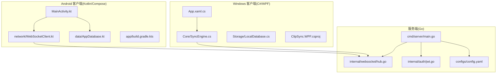
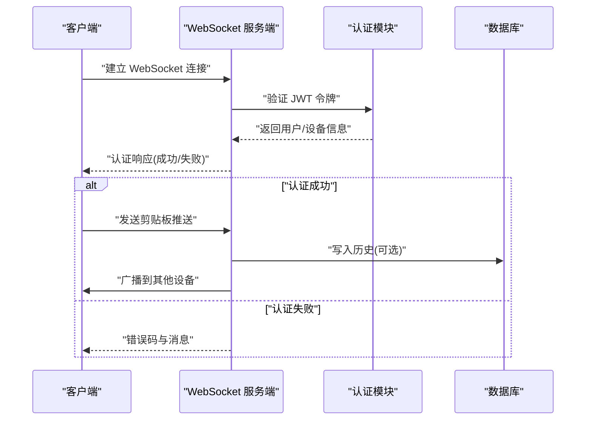
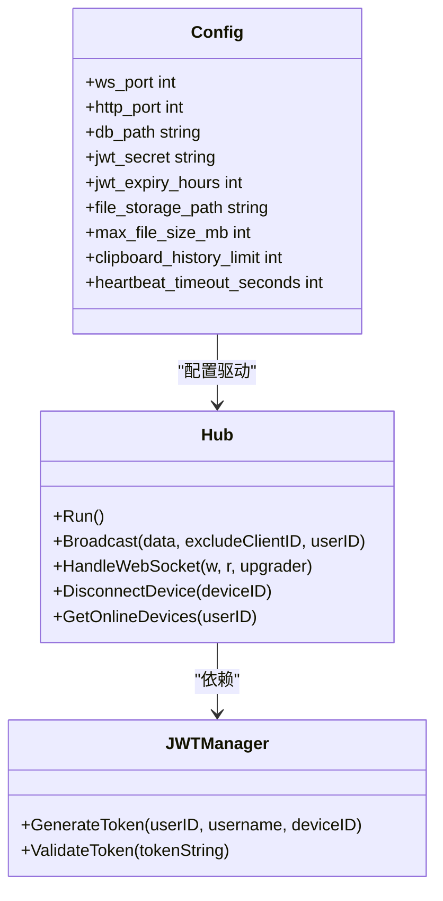
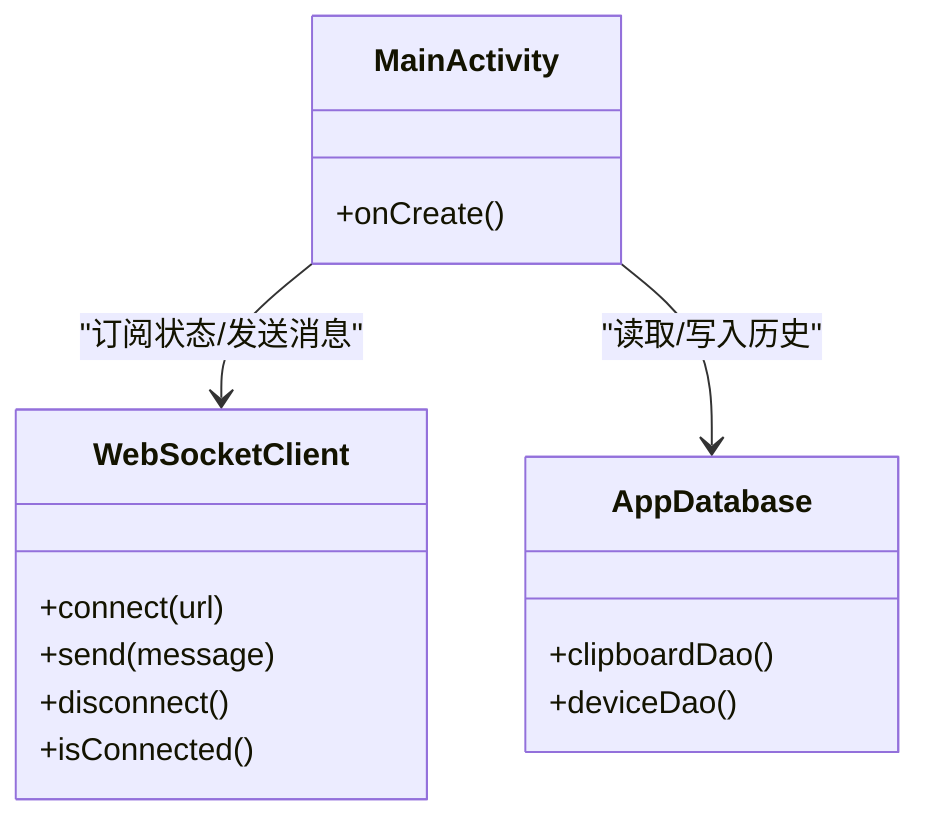
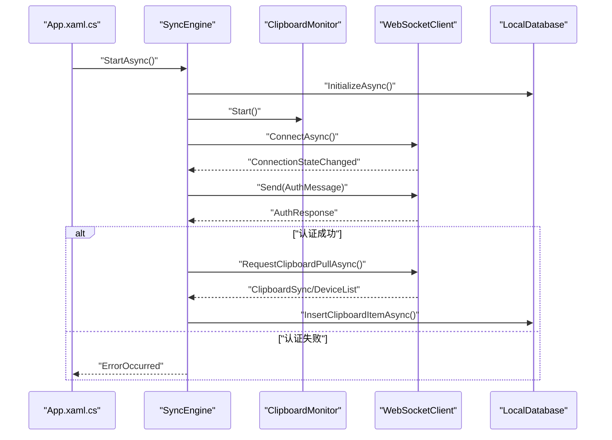
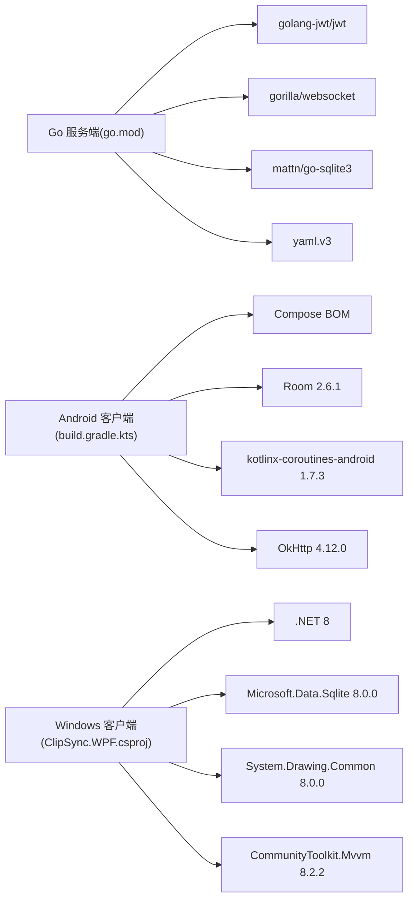

# 技术栈概览

<cite>
**本文引用的文件**
- [go.mod](file://clipSync-server/go.mod)
- [main.go](file://clipSync-server/cmd/server/main.go)
- [hub.go](file://clipSync-server/internal/websocket/hub.go)
- [jwt.go](file://clipSync-server/internal/auth/jwt.go)
- [config.yaml](file://clipSync-server/configs/config.yaml)
- [build.gradle.kts](file://clipSync-android/app/build.gradle.kts)
- [MainActivity.kt](file://clipSync-android/app/src/main/java/com/clipsync/app/MainActivity.kt)
- [WebSocketClient.kt](file://clipSync-android/app/src/main/java/com/clipsync/app/network/WebSocketClient.kt)
- [AppDatabase.kt](file://clipSync-android/app/src/main/java/com/clipsync/app/data/AppDatabase.kt)
- [ClipSync.WPF.csproj](file://clipSync-windows/ClipSync.WPF/ClipSync.WPF.csproj)
- [App.xaml.cs](file://clipSync-windows/ClipSync.WPF/App.xaml.cs)
- [SyncEngine.cs](file://clipSync-windows/ClipSync.WPF/Core/SyncEngine.cs)
- [LocalDatabase.cs](file://clipSync-windows/ClipSync.WPF/Storage/LocalDatabase.cs)
</cite>

## 目录
1. [引言](#引言)
2. [项目结构](#项目结构)
3. [核心组件](#核心组件)
4. [架构总览](#架构总览)
5. [详细组件分析](#详细组件分析)
6. [依赖分析](#依赖分析)
7. [性能考虑](#性能考虑)
8. [故障排除指南](#故障排除指南)
9. [结论](#结论)
10. [附录](#附录)

## 引言
本文件为 ClipSync 项目的全面技术栈概览，覆盖三大平台：服务端（Go）、Android 客户端（Kotlin/Compose）、Windows 客户端（C#/WPF）。我们将从技术选型、依赖管理、版本与兼容性、升级路径以及背景知识等维度进行系统化阐述，并通过图示展示关键流程与组件关系。

## 项目结构
- 服务端采用 Go 模块管理，核心功能集中在内部包中，包括认证、数据库、HTTP 服务、WebSocket 中枢与协议定义。
- Android 客户端采用 Gradle/Kotlin DSL 构建，UI 使用 Jetpack Compose，数据持久化采用 Room，网络通信基于 OkHttp 的 WebSocket，协程用于异步处理。
- Windows 客户端采用 .NET 8（WPF），使用 NuGet 管理依赖，本地存储采用 SQLite（Microsoft.Data.Sqlite），UI 使用 WPF/XAML，系统托盘集成使用第三方库。

**图表来源**
- [main.go:1-146](file://clipSync-server/cmd/server/main.go#L1-L146)
- [hub.go:1-230](file://clipSync-server/internal/websocket/hub.go#L1-L230)
- [jwt.go:1-76](file://clipSync-server/internal/auth/jwt.go#L1-L76)
- [config.yaml:1-29](file://clipSync-server/configs/config.yaml#L1-L29)
- [MainActivity.kt:1-139](file://clipSync-android/app/src/main/java/com/clipsync/app/MainActivity.kt#L1-L139)
- [WebSocketClient.kt:1-156](file://clipSync-android/app/src/main/java/com/clipsync/app/network/WebSocketClient.kt#L1-L156)
- [AppDatabase.kt:1-41](file://clipSync-android/app/src/main/java/com/clipsync/app/data/AppDatabase.kt#L1-L41)
- [App.xaml.cs:1-66](file://clipSync-windows/ClipSync.WPF/App.xaml.cs#L1-L66)
- [SyncEngine.cs:1-422](file://clipSync-windows/ClipSync.WPF/Core/SyncEngine.cs#L1-L422)
- [LocalDatabase.cs:1-169](file://clipSync-windows/ClipSync.WPF/Storage/LocalDatabase.cs#L1-L169)

**章节来源**
- [main.go:1-146](file://clipSync-server/cmd/server/main.go#L1-L146)
- [build.gradle.kts:1-102](file://clipSync-android/app/build.gradle.kts#L1-L102)
- [ClipSync.WPF.csproj:1-24](file://clipSync-windows/ClipSync.WPF/ClipSync.WPF.csproj#L1-L24)

## 核心组件
- 服务端（Go）
  - Gorilla WebSocket：实现高并发、低延迟的实时消息广播与客户端管理。
  - JWT 库：golang-jwt 实现令牌签发与校验，保障会话安全。
  - SQLite 驱动：mattn/go-sqlite3 提供数据库访问能力。
  - YAML 配置：gopkg.in/yaml.v3 解析运行时配置。
  - 加密：golang.org/x/crypto 提供加密算法支持。
- Android 客户端（Kotlin/Compose）
  - Jetpack Compose：声明式 UI，统一状态与导航。
  - Room：类型安全的 SQLite 抽象，提供编译期校验。
  - Kotlin 协程：简化异步与并发逻辑。
  - OkHttp：HTTP/WS 客户端，支持心跳与重连。
  - kotlinx.serialization：JSON 序列化。
- Windows 客户端（C#/WPF）
  - WPF：桌面应用 UI 框架。
  - .NET 8：目标框架，提供现代化运行时与性能。
  - System.Drawing：图像处理与剪贴板操作。
  - CommunityToolkit.Mvvm：MVVM 基础设施。
  - Microsoft.Data.Sqlite：SQLite 访问。
  - NotifyIcon：系统托盘图标。

**章节来源**
- [go.mod:1-14](file://clipSync-server/go.mod#L1-L14)
- [build.gradle.kts:57-101](file://clipSync-android/app/build.gradle.kts#L57-L101)
- [ClipSync.WPF.csproj:13-19](file://clipSync-windows/ClipSync.WPF/ClipSync.WPF.csproj#L13-L19)

## 架构总览
ClipSync 采用“服务端 + 多客户端”的架构。服务端负责用户认证、设备管理、剪贴板历史与实时广播；客户端负责本地剪贴板监控、消息收发、状态同步与本地历史存储。

**图表来源**
- [main.go:100-125](file://clipSync-server/cmd/server/main.go#L100-L125)
- [hub.go:182-208](file://clipSync-server/internal/websocket/hub.go#L182-L208)
- [jwt.go:57-75](file://clipSync-server/internal/auth/jwt.go#L57-L75)

## 详细组件分析

### 服务端（Go）
- 启动与配置
  - 读取环境变量或默认配置文件，加载端口、数据库路径、JWT 密钥、文件存储目录等参数。
  - 初始化数据库并执行迁移，确保表结构与索引存在。
- 认证与中间件
  - 使用 golang-jwt 实现 HS256 签发与校验，支持过期时间控制。
  - HTTP 路由层对鉴权接口设置限流策略。
- WebSocket 中枢
  - Hub 维护连接集合、广播队列与计数器，按用户维度进行消息分发。
  - 客户端在 30 秒内未完成认证将被断开，避免资源占用。
- HTTP 服务
  - 提供健康检查、设备列表、上传下载等接口，分离 WS 与 HTTP 端口以优化资源利用。

**图表来源**
- [hub.go:18-58](file://clipSync-server/internal/websocket/hub.go#L18-L58)
- [jwt.go:18-30](file://clipSync-server/internal/auth/jwt.go#L18-L30)
- [config.yaml:1-29](file://clipSync-server/configs/config.yaml#L1-L29)

**章节来源**
- [main.go:21-145](file://clipSync-server/cmd/server/main.go#L21-L145)
- [hub.go:60-121](file://clipSync-server/internal/websocket/hub.go#L60-L121)
- [jwt.go:32-75](file://clipSync-server/internal/auth/jwt.go#L32-L75)
- [config.yaml:1-29](file://clipSync-server/configs/config.yaml#L1-L29)

### Android 客户端（Kotlin/Compose）
- UI 层
  - MainActivity 作为 Compose 入口，承载导航图与状态收集。
  - 使用 Navigation Compose 实现屏幕切换与参数传递。
- 网络层
  - WebSocketClient 基于 OkHttp，封装连接生命周期、消息收发与重连策略。
  - 使用 Kotlin 协程与 Flow 管理异步状态与事件流。
- 数据层
  - Room 数据库抽象剪贴板与设备实体，提供 DAO 访问。
  - 使用 kotlinx.serialization 处理 JSON 协议。
- 依赖与版本
  - Compose BOM 版本：2023.10.01
  - Room 版本：2.6.1
  - OkHttp 版本：4.12.0
  - 协程版本：1.7.3
  - DataStore 版本：1.0.0

**图表来源**
- [MainActivity.kt:26-42](file://clipSync-android/app/src/main/java/com/clipsync/app/MainActivity.kt#L26-L42)
- [WebSocketClient.kt:26-144](file://clipSync-android/app/src/main/java/com/clipsync/app/network/WebSocketClient.kt#L26-L144)
- [AppDatabase.kt:14-40](file://clipSync-android/app/src/main/java/com/clipsync/app/data/AppDatabase.kt#L14-L40)

**章节来源**
- [MainActivity.kt:44-138](file://clipSync-android/app/src/main/java/com/clipsync/app/MainActivity.kt#L44-L138)
- [WebSocketClient.kt:83-144](file://clipSync-android/app/src/main/java/com/clipsync/app/network/WebSocketClient.kt#L83-L144)
- [AppDatabase.kt:14-40](file://clipSync-android/app/src/main/java/com/clipsync/app/data/AppDatabase.kt#L14-L40)
- [build.gradle.kts:57-101](file://clipSync-android/app/build.gradle.kts#L57-L101)

### Windows 客户端（C#/WPF）
- 启动与生命周期
  - App.xaml.cs 设置全局异常处理，初始化设置管理器、同步引擎与系统托盘。
  - 支持最小化到托盘与优雅退出。
- 同步引擎
  - SyncEngine 负责本地剪贴板监控、WebSocket 连接、心跳、重连、消息处理与本地历史保存。
  - 支持文本与图片内容的剪贴板设置，必要时进行解密。
- 本地数据库
  - LocalDatabase 使用 SQLite 存储剪贴板历史，自动维护索引与上限清理。
- 依赖与版本
  - .NET 8（net8.0-windows）
  - CommunityToolkit.Mvvm：8.2.2
  - Microsoft.Data.Sqlite：8.0.0
  - System.Drawing.Common：8.0.0
  - NotifyIcon：2.0.1

**图表来源**
- [App.xaml.cs:35-51](file://clipSync-windows/ClipSync.WPF/App.xaml.cs#L35-L51)
- [SyncEngine.cs:32-93](file://clipSync-windows/ClipSync.WPF/Core/SyncEngine.cs#L32-L93)
- [LocalDatabase.cs:26-96](file://clipSync-windows/ClipSync.WPF/Storage/LocalDatabase.cs#L26-L96)

**章节来源**
- [App.xaml.cs:12-52](file://clipSync-windows/ClipSync.WPF/App.xaml.cs#L12-L52)
- [SyncEngine.cs:32-186](file://clipSync-windows/ClipSync.WPF/Core/SyncEngine.cs#L32-L186)
- [LocalDatabase.cs:26-137](file://clipSync-windows/ClipSync.WPF/Storage/LocalDatabase.cs#L26-L137)
- [ClipSync.WPF.csproj:13-19](file://clipSync-windows/ClipSync.WPF/ClipSync.WPF.csproj#L13-L19)

## 依赖分析
- Go 服务端
  - go.mod 明确 Go 版本与依赖版本，建议在生产环境替换默认 JWT 密钥并启用 HTTPS。
- Android 客户端
  - Compose BOM 统一版本，Room 与协程版本固定，OkHttp 用于 WebSocket 与 HTTP。
- Windows 客户端
  - .NET 8 目标框架，NuGet 包管理，System.Drawing 用于图像处理。

**图表来源**
- [go.mod:3-13](file://clipSync-server/go.mod#L3-L13)
- [build.gradle.kts:57-101](file://clipSync-android/app/build.gradle.kts#L57-L101)
- [ClipSync.WPF.csproj:13-19](file://clipSync-windows/ClipSync.WPF/ClipSync.WPF.csproj#L13-L19)

**章节来源**
- [go.mod:1-14](file://clipSync-server/go.mod#L1-L14)
- [build.gradle.kts:57-101](file://clipSync-android/app/build.gradle.kts#L57-L101)
- [ClipSync.WPF.csproj:13-19](file://clipSync-windows/ClipSync.WPF/ClipSync.WPF.csproj#L13-L19)

## 性能考虑
- 服务端
  - Hub 使用通道与锁保护客户端映射，广播采用非阻塞发送并标记缓冲区满的客户端断开，降低拥塞风险。
  - HTTP 与 WebSocket 分离端口，避免长连接影响 HTTP 接口性能。
- Android
  - Compose BOM 与编译选项统一，减少版本冲突；Room 编译器 KSP 提升构建稳定性。
  - OkHttp 心跳与超时配置有助于维持稳定连接。
- Windows
  - SQLite 写入与清理在后台线程执行，避免 UI 卡顿；剪贴板操作在 STA 线程执行以满足平台要求。

[本节为通用性能讨论，不直接分析具体文件]

## 故障排除指南
- 服务端
  - 认证超时：客户端需在 30 秒内完成认证，否则被断开。
  - 配置警告：默认 JWT 密钥与端口仅用于开发，请在生产环境修改。
- Android
  - 连接状态：通过 ConnectionState 流观察连接变化，结合日志定位问题。
  - 重连机制：ReconnectHandler 自动调度重连，注意网络权限与防火墙。
- Windows
  - 全局异常：App.xaml.cs 注册了未处理异常处理器，便于捕获崩溃。
  - 剪贴板异常：设置剪贴板内容时需在 UI 线程调用，错误将触发错误事件。

**章节来源**
- [hub.go:197-204](file://clipSync-server/internal/websocket/hub.go#L197-L204)
- [config.yaml:12-13](file://clipSync-server/configs/config.yaml#L12-L13)
- [WebSocketClient.kt:46-78](file://clipSync-android/app/src/main/java/com/clipsync/app/network/WebSocketClient.kt#L46-L78)
- [App.xaml.cs:16-33](file://clipSync-windows/ClipSync.WPF/App.xaml.cs#L16-L33)
- [SyncEngine.cs:223-241](file://clipSync-windows/ClipSync.WPF/Core/SyncEngine.cs#L223-L241)

## 结论
ClipSync 在三大平台上分别选择了成熟稳定的生态组件：服务端以 Gorilla WebSocket 与 JWT 为核心，兼顾安全性与扩展性；Android 采用 Jetpack Compose 与 Room，强调现代开发体验与数据一致性；Windows 客户端依托 WPF 与 .NET 8，结合 SQLite 与系统托盘，提供桌面端最佳实践。整体架构清晰、职责分明，具备良好的可维护性与可扩展性。

[本节为总结性内容，不直接分析具体文件]

## 附录

### 技术选型背景与优势
- 服务端（Go）
  - Gorilla WebSocket：高性能、社区活跃、易于扩展。
  - JWT：无状态认证，适合多实例部署。
  - SQLite：轻量、零配置、适合中小规模数据。
- Android
  - Jetpack Compose：声明式 UI，学习成本低、维护简单。
  - Room：类型安全、编译期校验、迁移友好。
  - OkHttp：成熟的网络栈，WebSocket 与 HTTP 统一管理。
  - 协程：简化异步逻辑，提升可读性与性能。
- Windows
  - WPF：成熟的桌面 UI 框架，丰富的控件与样式支持。
  - .NET 8：性能与安全性持续改进，跨平台能力增强。
  - System.Drawing：图像处理基础能力，与剪贴板 API 集成良好。
  - SQLite：跨平台、易部署，适合本地缓存与历史记录。

### 依赖管理与版本要求
- Go 服务端
  - Go 版本：1.26.2
  - 关键依赖：gorilla/websocket、golang-jwt/jwt、mattn/go-sqlite3、yaml.v3
- Android 客户端
  - Gradle/Kotlin DSL，Compose BOM 2023.10.01，Room 2.6.1，OkHttp 4.12.0，协程 1.7.3
- Windows 客户端
  - .NET 8（net8.0-windows），Microsoft.Data.Sqlite 8.0.0，System.Drawing.Common 8.0.0，CommunityToolkit.Mvvm 8.2.2

**章节来源**
- [go.mod:3-13](file://clipSync-server/go.mod#L3-L13)
- [build.gradle.kts:8-55](file://clipSync-android/app/build.gradle.kts#L8-L55)
- [ClipSync.WPF.csproj:3-11](file://clipSync-windows/ClipSync.WPF/ClipSync.WPF.csproj#L3-L11)

### 兼容性与升级路径
- Go
  - 建议在生产环境替换默认 JWT 密钥与端口，启用 HTTPS 并配置 TLS。
  - 升级时优先更新 gorilla/websocket 与 golang-jwt 至最新稳定版，保持与 Go 1.26.x 兼容。
- Android
  - Compose BOM 与 Room 版本保持一致，升级前先在测试环境验证。
  - OkHttp 与协程版本建议同步升级，关注迁移变更。
- Windows
  - .NET 8 为当前 LTS/长期支持版本，建议跟随官方更新节奏。
  - SQLite 与 System.Drawing 版本建议与 .NET 8 生态保持一致。

[本节为通用指导，不直接分析具体文件]