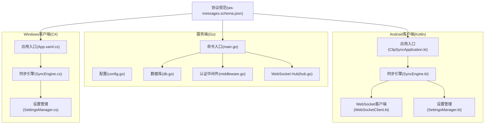
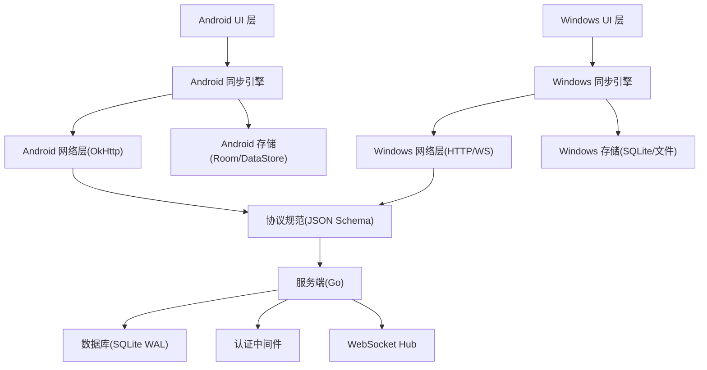
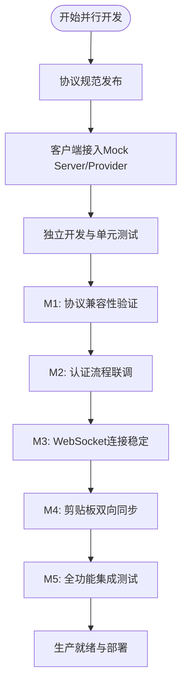
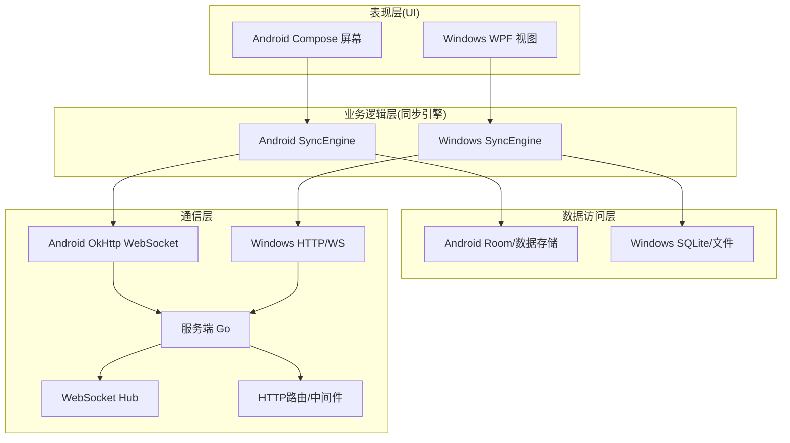
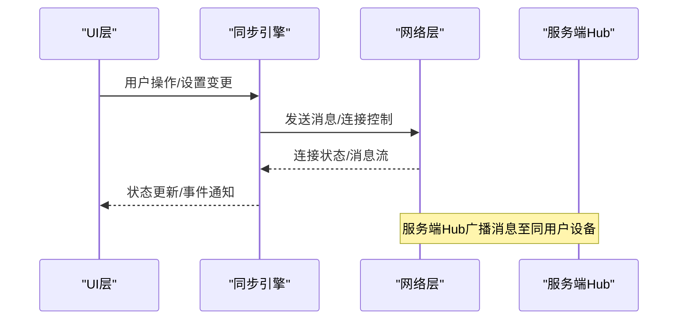
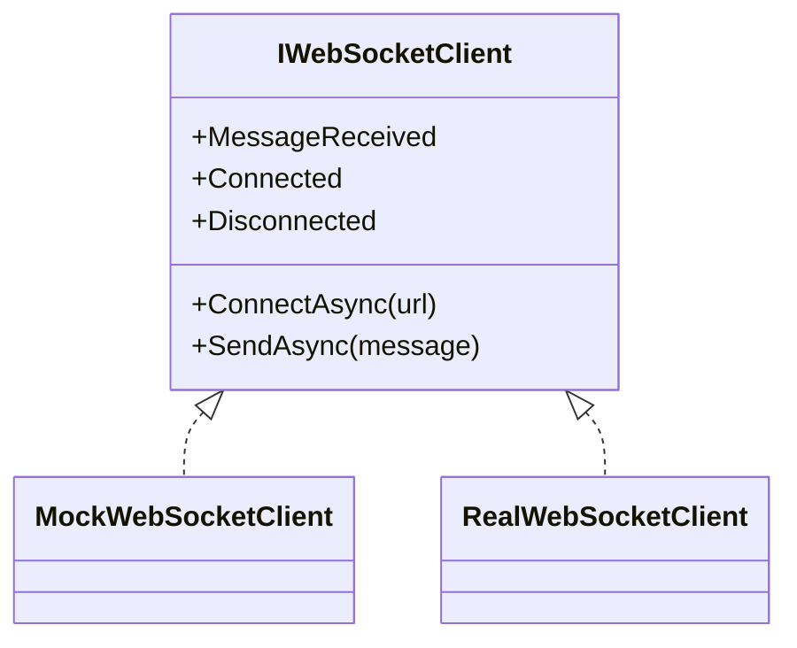
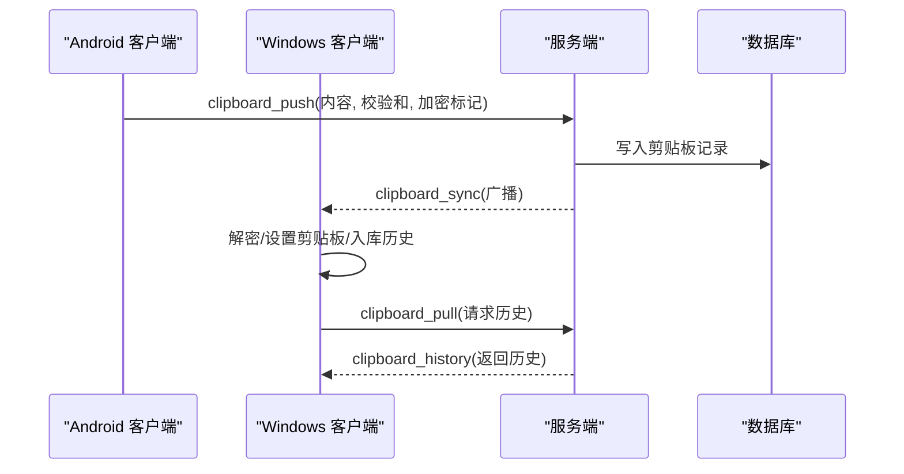
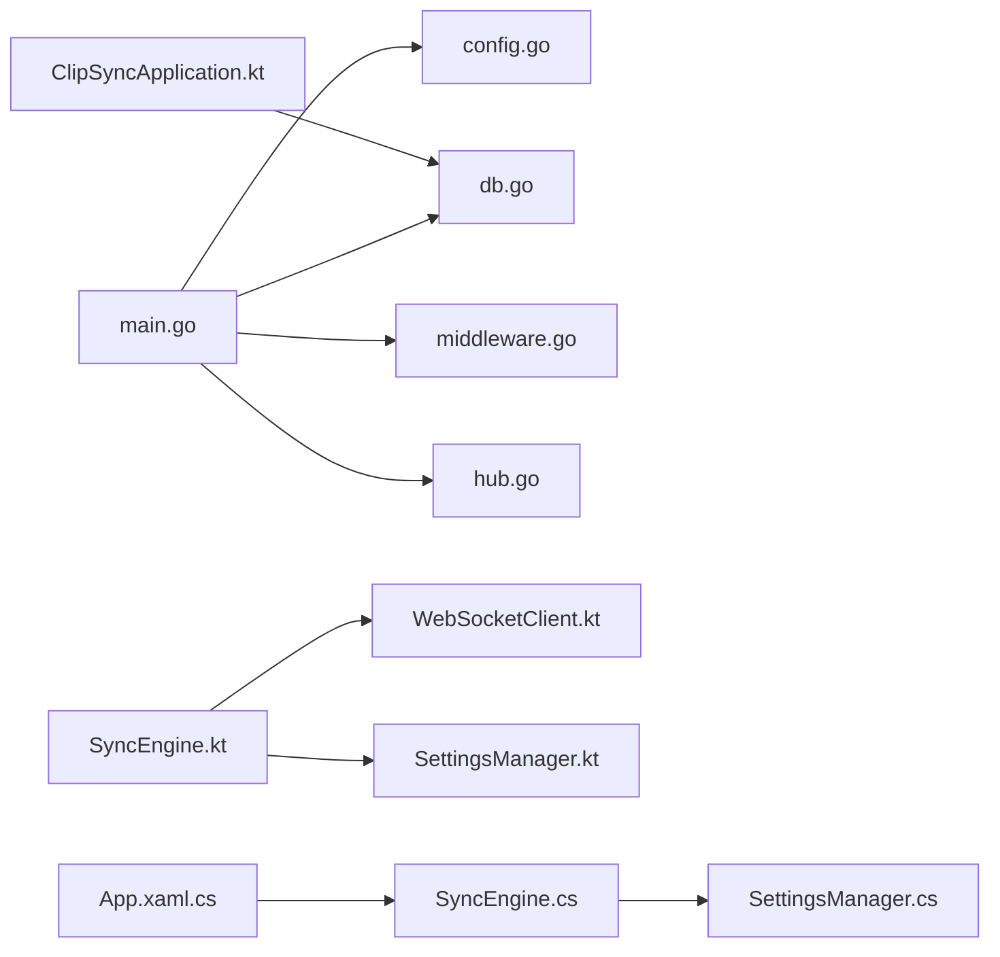

# 架构设计理念

<cite>
**本文引用的文件**
- [DEVELOPMENT_PLAN.md](file://DEVELOPMENT_PLAN.md)
- [main.go](file://clipSync-server/cmd/server/main.go)
- [hub.go](file://clipSync-server/internal/websocket/hub.go)
- [db.go](file://clipSync-server/internal/database/db.go)
- [config.go](file://clipSync-server/internal/config/config.go)
- [middleware.go](file://clipSync-server/internal/auth/middleware.go)
- [ws-messages.schema.json](file://protocol/ws-messages.schema.json)
- [SyncEngine.kt](file://clipSync-android/app/src/main/java/com/clipsync/app/core/SyncEngine.kt)
- [WebSocketClient.kt](file://clipSync-android/app/src/main/java/com/clipsync/app/network/WebSocketClient.kt)
- [SettingsManager.kt](file://clipSync-android/app/src/main/java/com/clipsync/app/core/SettingsManager.kt)
- [SyncEngine.cs](file://clipSync-windows/ClipSync.WPF/Core/SyncEngine.cs)
- [SettingsManager.cs](file://clipSync-windows/ClipSync.WPF/Core/SettingsManager.cs)
- [App.xaml.cs](file://clipSync-windows/ClipSync.WPF/App.xaml.cs)
- [ClipSyncApplication.kt](file://clipSync-android/app/src/main/java/com/clipsync/app/ClipSyncApplication.kt)
</cite>

## 目录
1. [引言](#引言)
2. [项目结构](#项目结构)
3. [核心组件](#核心组件)
4. [架构总览](#架构总览)
5. [详细组件分析](#详细组件分析)
6. [依赖关系分析](#依赖关系分析)
7. [性能考虑](#性能考虑)
8. [故障排查指南](#故障排查指南)
9. [结论](#结论)
10. [附录](#附录)

## 引言
本文件面向ClipSync项目的架构设计理念进行系统化阐述，围绕“零依赖并行开发”“分层架构”“事件驱动与观察者模式”“接口抽象与依赖注入”等主题展开，结合协议规范、服务端实现与客户端实践，给出可落地的设计原则、技术权衡与可视化图示，帮助开发者在多平台并行开发中高效协作、降低耦合、提升稳定性。

## 项目结构
ClipSync采用跨平台并行开发策略：服务端（Go）、Windows WPF客户端、Android Kotlin客户端三路并进，共享统一的协议规范与Mock基础设施，确保各端在早期即可独立开发与测试，避免传统串行开发中的阻塞与返工。

- 协议与规范
  - WebSocket消息与HTTP API契约由统一的协议文件定义，作为“单一事实来源”，三端据此实现序列化/反序列化与行为一致性校验。
- 服务端（Go）
  - 命令入口负责配置加载、数据库初始化、路由注册与服务器启动；WebSocket与HTTP分别监听不同端口，解耦长连接与短连接。
- 客户端（Android）
  - 应用入口负责全局资源初始化；同步引擎编排剪贴板监听、消息推送与历史管理；网络层基于OkHttp封装WebSocket客户端；设置持久化使用DataStore。
- 客户端（Windows）
  - 应用入口负责异常处理与生命周期管理；同步引擎通过事件回调与观察者模式驱动UI与本地存储；设置持久化使用JSON文件。

图表来源
- [main.go:21-146](file://clipSync-server/cmd/server/main.go#L21-L146)
- [config.go:10-72](file://clipSync-server/internal/config/config.go#L10-L72)
- [db.go:12-62](file://clipSync-server/internal/database/db.go#L12-L62)
- [middleware.go:22-111](file://clipSync-server/internal/auth/middleware.go#L22-L111)
- [hub.go:18-230](file://clipSync-server/internal/websocket/hub.go#L18-L230)
- [ClipSyncApplication.kt:10-25](file://clipSync-android/app/src/main/java/com/clipsync/app/ClipSyncApplication.kt#L10-L25)
- [SyncEngine.kt:27-250](file://clipSync-android/app/src/main/java/com/clipsync/app/core/SyncEngine.kt#L27-L250)
- [WebSocketClient.kt:26-156](file://clipSync-android/app/src/main/java/com/clipsync/app/network/WebSocketClient.kt#L26-L156)
- [SettingsManager.kt:21-170](file://clipSync-android/app/src/main/java/com/clipsync/app/core/SettingsManager.kt#L21-L170)
- [App.xaml.cs:12-65](file://clipSync-windows/ClipSync.WPF/App.xaml.cs#L12-L65)
- [SyncEngine.cs:8-422](file://clipSync-windows/ClipSync.WPF/Core/SyncEngine.cs#L8-L422)
- [SettingsManager.cs:8-102](file://clipSync-windows/ClipSync.WPF/Core/SettingsManager.cs#L8-L102)
- [ws-messages.schema.json:1-261](file://protocol/ws-messages.schema.json#L1-L261)

章节来源
- [DEVELOPMENT_PLAN.md:18-714](file://DEVELOPMENT_PLAN.md#L18-L714)
- [main.go:21-146](file://clipSync-server/cmd/server/main.go#L21-L146)
- [ws-messages.schema.json:1-261](file://protocol/ws-messages.schema.json#L1-L261)

## 核心组件
- 协议规范（Protocol）
  - 统一的WebSocket消息包体与HTTP API契约，定义消息类型、版本、时间戳、设备标识与载荷字段，确保三端一致性。
- 服务端（Server）
  - 配置中心：集中管理端口、数据库路径、JWT密钥、历史条数限制、心跳超时等参数。
  - 认证中间件：基于Bearer Token的HTTP鉴权，向请求上下文注入用户/设备信息。
  - 数据库：SQLite WAL模式、连接池与性能参数优化，适配2核2G服务器。
  - WebSocket Hub：连接管理、广播分发、心跳超时与断线清理。
- 客户端（Android）
  - 同步引擎：编排本地剪贴板监听、去重推送、远端同步接收、历史入库与拉取。
  - 网络层：基于OkHttp的WebSocket客户端，支持自动重连、连接状态流与消息流。
  - 设置管理：DataStore持久化，提供流式读写与默认值。
- 客户端（Windows）
  - 同步引擎：事件驱动的消息处理、STA线程设置剪贴板、本地历史存储与设备列表更新。
  - 设置管理：JSON文件持久化，线程安全更新。

章节来源
- [DEVELOPMENT_PLAN.md:18-362](file://DEVELOPMENT_PLAN.md#L18-L362)
- [config.go:10-72](file://clipSync-server/internal/config/config.go#L10-L72)
- [middleware.go:22-111](file://clipSync-server/internal/auth/middleware.go#L22-L111)
- [db.go:17-62](file://clipSync-server/internal/database/db.go#L17-L62)
- [hub.go:18-230](file://clipSync-server/internal/websocket/hub.go#L18-L230)
- [SyncEngine.kt:27-250](file://clipSync-android/app/src/main/java/com/clipsync/app/core/SyncEngine.kt#L27-L250)
- [WebSocketClient.kt:26-156](file://clipSync-android/app/src/main/java/com/clipsync/app/network/WebSocketClient.kt#L26-L156)
- [SettingsManager.kt:21-170](file://clipSync-android/app/src/main/java/com/clipsync/app/core/SettingsManager.kt#L21-L170)
- [SyncEngine.cs:8-422](file://clipSync-windows/ClipSync.WPF/Core/SyncEngine.cs#L8-L422)
- [SettingsManager.cs:8-102](file://clipSync-windows/ClipSync.WPF/Core/SettingsManager.cs#L8-L102)

## 架构总览
ClipSync采用“协议先行、接口抽象、事件驱动”的分层架构：
- 表现层（UI/界面）
  - Android：Jetpack Compose屏幕与ViewModel。
  - Windows：WPF视图与ViewModel。
- 业务逻辑层（同步引擎）
  - 负责剪贴板事件编排、消息去重、历史管理、设备列表与错误处理。
- 数据访问层（本地/远程）
  - Android：Room数据库与DataStore。
  - Windows：SQLite本地缓存与文件存储。
  - 服务端：SQLite WAL、仓库层与HTTP路由。
- 通信层（WebSocket/HTTP）
  - 服务端：WebSocket Hub与HTTP路由；客户端：OkHttp WebSocket与Retrofit/自研HTTP。

图表来源
- [SyncEngine.kt:27-250](file://clipSync-android/app/src/main/java/com/clipsync/app/core/SyncEngine.kt#L27-L250)
- [WebSocketClient.kt:26-156](file://clipSync-android/app/src/main/java/com/clipsync/app/network/WebSocketClient.kt#L26-L156)
- [SyncEngine.cs:8-422](file://clipSync-windows/ClipSync.WPF/Core/SyncEngine.cs#L8-L422)
- [SettingsManager.cs:8-102](file://clipSync-windows/ClipSync.WPF/Core/SettingsManager.cs#L8-L102)
- [ws-messages.schema.json:1-261](file://protocol/ws-messages.schema.json#L1-L261)
- [main.go:74-125](file://clipSync-server/cmd/server/main.go#L74-L125)
- [db.go:17-62](file://clipSync-server/internal/database/db.go#L17-L62)
- [middleware.go:22-111](file://clipSync-server/internal/auth/middleware.go#L22-L111)
- [hub.go:18-230](file://clipSync-server/internal/websocket/hub.go#L18-L230)

## 详细组件分析

### 并行开发策略与零依赖瓶颈消除
- 设计思想
  - 以协议规范为“单一事实来源”，客户端在未接入真实服务端前即可通过Mock Server或Mock Provider完成开发与联调。
  - 通过接口抽象（IWebSocketClient等）隔离实现细节，开发态注入Mock，生产态注入Real，避免跨模块耦合。
- 实践要点
  - Mock Server：服务端脚本提供认证、心跳、设备列表与剪贴板回显等模拟响应，支持延迟与错误注入。
  - Mock Provider：客户端以接口为契约，通过DI容器在开发与生产环境切换具体实现。
  - 集成里程碑：协议兼容性、认证流程、WebSocket连接、剪贴板同步、全功能集成与生产就绪测试。
- 效果
  - 消除串行依赖：服务端无需等待客户端完成，客户端无需等待服务端上线。
  - 提升交付速度：三端并行，早期持续集成，快速发现协议差异与实现偏差。

图表来源
- [DEVELOPMENT_PLAN.md:583-797](file://DEVELOPMENT_PLAN.md#L583-L797)

章节来源
- [DEVELOPMENT_PLAN.md:583-797](file://DEVELOPMENT_PLAN.md#L583-L797)

### 分层架构设计：表现层、业务逻辑层、数据访问层
- 表现层
  - Android：Compose屏幕与ViewModel，绑定状态流与命令。
  - Windows：XAML视图与ViewModel，绑定命令与通知。
- 业务逻辑层
  - Android：SyncEngine负责去重推送、历史入库、消息分发。
  - Windows：SyncEngine负责事件回调、STA线程设置剪贴板、设备列表与错误通知。
- 数据访问层
  - Android：Room数据库与DataStore，支持历史查询与设置持久化。
  - Windows：SQLite本地缓存与文件存储，支持历史查询与设置持久化。
- 通信层
  - 服务端：WebSocket Hub与HTTP路由，认证中间件与限流策略。
  - 客户端：OkHttp WebSocket与Retrofit/自研HTTP。

图表来源
- [SyncEngine.kt:27-250](file://clipSync-android/app/src/main/java/com/clipsync/app/core/SyncEngine.kt#L27-L250)
- [WebSocketClient.kt:26-156](file://clipSync-android/app/src/main/java/com/clipsync/app/network/WebSocketClient.kt#L26-L156)
- [SyncEngine.cs:8-422](file://clipSync-windows/ClipSync.WPF/Core/SyncEngine.cs#L8-L422)
- [main.go:74-125](file://clipSync-server/cmd/server/main.go#L74-L125)
- [hub.go:18-230](file://clipSync-server/internal/websocket/hub.go#L18-L230)
- [middleware.go:22-111](file://clipSync-server/internal/auth/middleware.go#L22-L111)

章节来源
- [SyncEngine.kt:27-250](file://clipSync-android/app/src/main/java/com/clipsync/app/core/SyncEngine.kt#L27-L250)
- [SyncEngine.cs:8-422](file://clipSync-windows/ClipSync.WPF/Core/SyncEngine.cs#L8-L422)
- [main.go:74-125](file://clipSync-server/cmd/server/main.go#L74-L125)

### 事件驱动架构与观察者模式在状态更新中的应用
- 事件驱动
  - 服务端：WebSocket Hub通过select循环处理注册/注销/广播，实现高并发下的事件分发。
  - 客户端：Android使用SharedFlow/StateFlow，Windows使用事件回调，均以异步事件驱动UI与状态更新。
- 观察者模式
  - Android：连接状态、消息流、设置变更均以Flow/StateFlow暴露，UI订阅变化。
  - Windows：ConnectionStateChanged、ClipboardItemReceived、DeviceListUpdated等事件，UI与逻辑组件订阅。
- 优势
  - 解耦UI与业务：状态变化通过事件传播，不直接依赖底层实现。
  - 可测试性强：事件可被Mock，便于单元测试与集成测试。

图表来源
- [SyncEngine.kt:35-67](file://clipSync-android/app/src/main/java/com/clipsync/app/core/SyncEngine.kt#L35-L67)
- [WebSocketClient.kt:36-78](file://clipSync-android/app/src/main/java/com/clipsync/app/network/WebSocketClient.kt#L36-L78)
- [SyncEngine.cs:20-31](file://clipSync-windows/ClipSync.WPF/Core/SyncEngine.cs#L20-L31)
- [hub.go:81-121](file://clipSync-server/internal/websocket/hub.go#L81-L121)

章节来源
- [SyncEngine.kt:35-67](file://clipSync-android/app/src/main/java/com/clipsync/app/core/SyncEngine.kt#L35-L67)
- [WebSocketClient.kt:36-78](file://clipSync-android/app/src/main/java/com/clipsync/app/network/WebSocketClient.kt#L36-L78)
- [SyncEngine.cs:20-31](file://clipSync-windows/ClipSync.WPF/Core/SyncEngine.cs#L20-L31)
- [hub.go:81-121](file://clipSync-server/internal/websocket/hub.go#L81-L121)

### 接口抽象与依赖注入设计原则
- 接口优先
  - 客户端以接口（如IWebSocketClient）为契约，开发期注入Mock，生产期注入Real，避免对具体实现的硬编码依赖。
- 依赖注入
  - Android：通过Application级单例持有数据库实例，配合协程Scope组织业务逻辑。
  - Windows：应用入口集中初始化设置管理器、同步引擎与托盘图标，保证生命周期可控。
- 价值
  - 易于替换与扩展：可在不修改上层逻辑的情况下更换网络实现或存储后端。
  - 易于测试：通过DI注入Mock对象，隔离外部依赖，提高测试覆盖率。

图表来源
- [DEVELOPMENT_PLAN.md:691-712](file://DEVELOPMENT_PLAN.md#L691-L712)
- [WebSocketClient.kt:26-156](file://clipSync-android/app/src/main/java/com/clipsync/app/network/WebSocketClient.kt#L26-L156)
- [SyncEngine.kt:27-32](file://clipSync-android/app/src/main/java/com/clipsync/app/core/SyncEngine.kt#L27-L32)
- [SyncEngine.cs:8-31](file://clipSync-windows/ClipSync.WPF/Core/SyncEngine.cs#L8-L31)

章节来源
- [DEVELOPMENT_PLAN.md:691-712](file://DEVELOPMENT_PLAN.md#L691-L712)
- [ClipSyncApplication.kt:10-25](file://clipSync-android/app/src/main/java/com/clipsync/app/ClipSyncApplication.kt#L10-L25)
- [App.xaml.cs:12-65](file://clipSync-windows/ClipSync.WPF/App.xaml.cs#L12-L65)

### 系统边界定义、组件交互模式与数据流向
- 系统边界
  - 协议边界：所有消息必须满足JSON Schema定义的Envelope与Payload结构。
  - 服务边界：HTTP API用于认证与文件传输；WebSocket用于实时同步与心跳。
- 交互模式
  - 请求-响应：HTTP认证/注册/刷新、设备管理、文件上传下载。
  - 发布-订阅：WebSocket广播剪贴板同步消息给同一用户的其他设备。
- 数据流向
  - 本地到远端：剪贴板变更触发去重推送，服务端入库并广播。
  - 远端到本地：服务端广播同步消息，客户端解密并设置剪贴板，同时入库历史。
  - 配置与状态：设置管理器提供流式读写，UI与引擎订阅状态变化。

图表来源
- [ws-messages.schema.json:135-209](file://protocol/ws-messages.schema.json#L135-L209)
- [SyncEngine.kt:128-194](file://clipSync-android/app/src/main/java/com/clipsync/app/core/SyncEngine.kt#L128-L194)
- [SyncEngine.cs:188-294](file://clipSync-windows/ClipSync.WPF/Core/SyncEngine.cs#L188-L294)
- [hub.go:114-121](file://clipSync-server/internal/websocket/hub.go#L114-L121)
- [db.go:17-62](file://clipSync-server/internal/database/db.go#L17-L62)

章节来源
- [ws-messages.schema.json:1-261](file://protocol/ws-messages.schema.json#L1-L261)
- [SyncEngine.kt:128-194](file://clipSync-android/app/src/main/java/com/clipsync/app/core/SyncEngine.kt#L128-L194)
- [SyncEngine.cs:188-294](file://clipSync-windows/ClipSync.WPF/Core/SyncEngine.cs#L188-L294)
- [hub.go:114-121](file://clipSync-server/internal/websocket/hub.go#L114-L121)

## 依赖关系分析
- 服务端
  - 命令入口依赖配置、数据库、认证与WebSocket Hub；HTTP路由依赖认证中间件与仓库层；WebSocket Hub依赖认证服务与仓库层。
- 客户端
  - Android：同步引擎依赖网络层、设置管理与数据库；应用入口依赖数据库初始化。
  - Windows：同步引擎依赖网络层、设置管理与本地数据库；应用入口集中初始化与异常处理。

图表来源
- [main.go:31-125](file://clipSync-server/cmd/server/main.go#L31-L125)
- [config.go:38-55](file://clipSync-server/internal/config/config.go#L38-L55)
- [db.go:17-62](file://clipSync-server/internal/database/db.go#L17-L62)
- [middleware.go:32-61](file://clipSync-server/internal/auth/middleware.go#L32-L61)
- [hub.go:44-58](file://clipSync-server/internal/websocket/hub.go#L44-L58)
- [SyncEngine.kt:27-32](file://clipSync-android/app/src/main/java/com/clipsync/app/core/SyncEngine.kt#L27-L32)
- [WebSocketClient.kt:26-44](file://clipSync-android/app/src/main/java/com/clipsync/app/network/WebSocketClient.kt#L26-L44)
- [SettingsManager.kt:21-170](file://clipSync-android/app/src/main/java/com/clipsync/app/core/SettingsManager.kt#L21-L170)
- [ClipSyncApplication.kt:10-25](file://clipSync-android/app/src/main/java/com/clipsync/app/ClipSyncApplication.kt#L10-L25)
- [SyncEngine.cs:8-31](file://clipSync-windows/ClipSync.WPF/Core/SyncEngine.cs#L8-L31)
- [SettingsManager.cs:8-102](file://clipSync-windows/ClipSync.WPF/Core/SettingsManager.cs#L8-L102)
- [App.xaml.cs:12-65](file://clipSync-windows/ClipSync.WPF/App.xaml.cs#L12-L65)

章节来源
- [main.go:31-125](file://clipSync-server/cmd/server/main.go#L31-L125)
- [SyncEngine.kt:27-32](file://clipSync-android/app/src/main/java/com/clipsync/app/core/SyncEngine.kt#L27-L32)
- [SyncEngine.cs:8-31](file://clipSync-windows/ClipSync.WPF/Core/SyncEngine.cs#L8-L31)

## 性能考虑
- 服务端
  - SQLite WAL模式与连接池参数针对2核2G服务器优化，减少锁竞争与提升并发读性能。
  - 心跳超时与广播队列缓冲，避免慢消费者导致的阻塞。
- 客户端
  - Android：OkHttp WebSocket ping间隔与缓冲队列，配合去重与历史上限控制，降低网络与存储压力。
  - Windows：STA线程设置剪贴板，避免UI阻塞；本地数据库按上限清理历史。
- 协议与加密
  - 大内容走文件上传下载，小内容走WebSocket，结合校验和去重，降低带宽与CPU开销。

章节来源
- [db.go:17-62](file://clipSync-server/internal/database/db.go#L17-L62)
- [WebSocketClient.kt:92-103](file://clipSync-android/app/src/main/java/com/clipsync/app/network/WebSocketClient.kt#L92-L103)
- [SyncEngine.kt:208-227](file://clipSync-android/app/src/main/java/com/clipsync/app/core/SyncEngine.kt#L208-L227)
- [SyncEngine.cs:394-411](file://clipSync-windows/ClipSync.WPF/Core/SyncEngine.cs#L394-L411)

## 故障排查指南
- 认证失败
  - 检查HTTP认证头格式与Bearer Token有效性；确认JWT密钥与过期时间配置。
- 连接不稳定
  - 检查WebSocket Ping间隔、自动重连策略与服务端心跳超时设置。
- 消息未到达
  - 核对协议消息类型与载荷字段是否符合Schema；检查服务端广播目标用户ID与排除发送者逻辑。
- 性能问题
  - 服务端：确认WAL模式启用、连接池参数合理；客户端：检查历史上限与去重策略。

章节来源
- [middleware.go:32-61](file://clipSync-server/internal/auth/middleware.go#L32-L61)
- [config.go:57-71](file://clipSync-server/internal/config/config.go#L57-L71)
- [WebSocketClient.kt:92-103](file://clipSync-android/app/src/main/java/com/clipsync/app/network/WebSocketClient.kt#L92-L103)
- [hub.go:114-121](file://clipSync-server/internal/websocket/hub.go#L114-L121)
- [ws-messages.schema.json:1-261](file://protocol/ws-messages.schema.json#L1-L261)

## 结论
ClipSync通过“协议先行、接口抽象、事件驱动”的架构设计，实现了服务端与多端客户端的零依赖并行开发，显著降低了串行开发中的瓶颈与风险。分层架构明确了职责边界，事件驱动与观察者模式提升了系统的解耦与可维护性，而严格的协议约束与Mock策略则保障了跨平台的一致性与可测试性。在生产环境中，服务端的SQLite优化与客户端的去重、限流策略共同确保了系统在低资源条件下的稳定运行。

## 附录
- 关键协议字段与消息类型参考：见协议Schema文件。
- 开发阶段里程碑与测试清单：见开发计划文档。

章节来源
- [ws-messages.schema.json:1-261](file://protocol/ws-messages.schema.json#L1-L261)
- [DEVELOPMENT_PLAN.md:716-797](file://DEVELOPMENT_PLAN.md#L716-L797)