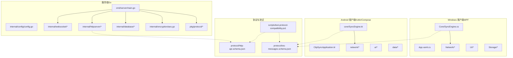
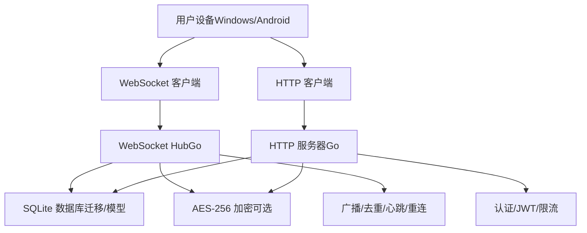
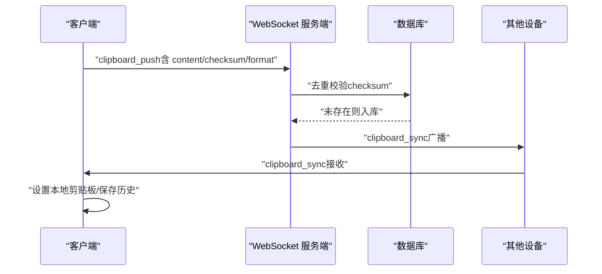
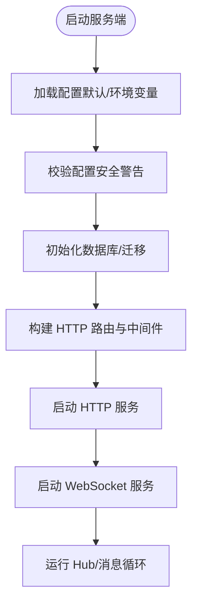
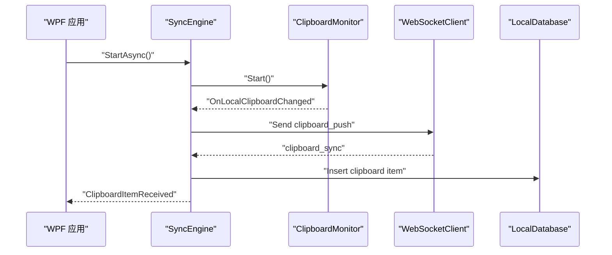
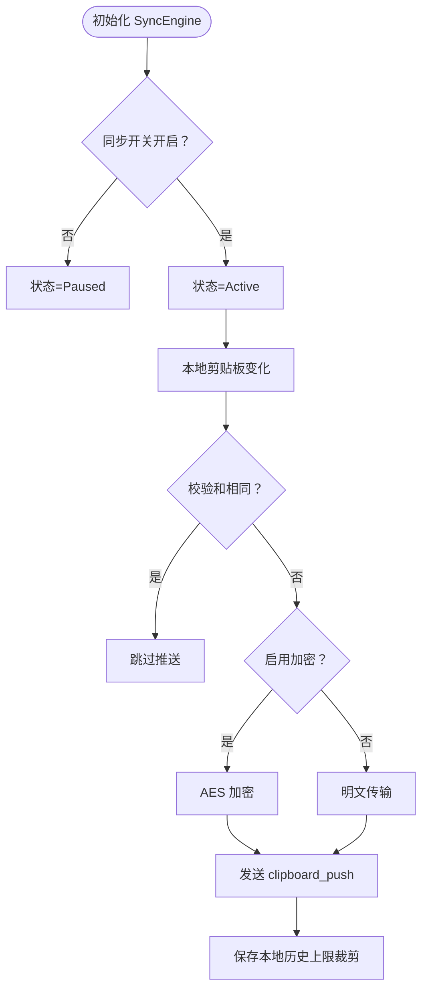
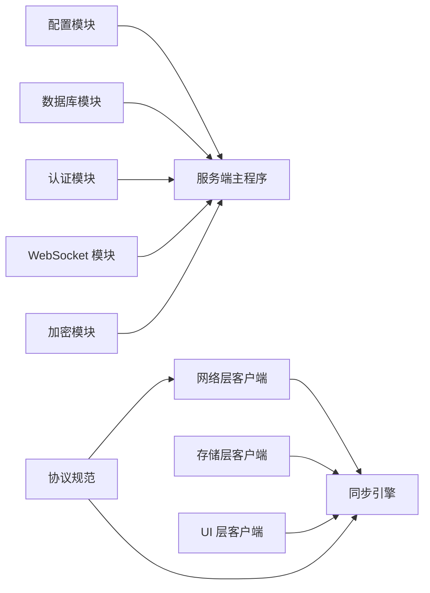

# 项目介绍

<cite>
**本文引用的文件**
- [DEVELOPMENT_PLAN.md](file://DEVELOPMENT_PLAN.md)
- [main.go](file://clipSync-server/cmd/server/main.go)
- [config.go](file://clipSync-server/internal/config/config.go)
- [config.yaml](file://clipSync-server/configs/config.yaml)
- [SyncEngine.kt](file://clipSync-android/app/src/main/java/com/clipsync/app/core/SyncEngine.kt)
- [SyncEngine.cs](file://clipSync-windows/ClipSync.WPF/Core/SyncEngine.cs)
- [App.xaml.cs](file://clipSync-windows/ClipSync.WPF/App.xaml.cs)
- [ClipSyncApplication.kt](file://clipSync-android/app/src/main/java/com/clipsync/app/ClipSyncApplication.kt)
- [http-api.schema.json](file://protocol/http-api.schema.json)
- [ws-messages.schema.json](file://protocol/ws-messages.schema.json)
- [test-protocol-compatibility.ps1](file://scripts/test-protocol-compatibility.ps1)
- [InstallationLog.txt](file://InstallationLog.txt)
</cite>

## 目录
1. [引言](#引言)
2. [项目结构](#项目结构)
3. [核心组件](#核心组件)
4. [架构总览](#架构总览)
5. [详细组件分析](#详细组件分析)
6. [依赖关系分析](#依赖关系分析)
7. [性能考量](#性能考量)
8. [故障排查指南](#故障排查指南)
9. [结论](#结论)
10. [附录](#附录)

## 引言
ClipSync 是一个跨平台的实时剪贴板同步系统，旨在解决多设备之间内容共享不便、效率低下以及数据一致性难以保障的问题。通过统一的协议规范与两端（服务端与客户端）并行开发模式，ClipSync 实现了 Windows 与 Android 平台之间的无缝剪贴板内容同步，并提供可选的端到端加密、历史记录管理、心跳保活与自动重连等能力，帮助用户在不同设备间高效流转文本、图片与文件片段。

本项目的核心价值主张：
- 多设备实时同步：一次复制，多端即刻可用
- 高效工作流：减少跨设备切换成本，提升内容流转效率
- 数据一致性：基于校验和去重与广播机制，避免重复与冲突
- 安全可控：支持可选的 AES-256 加密，保障敏感内容安全
- 可靠连接：心跳保活与自动重连，保证长时稳定运行
- 开放协议：标准化消息格式与 HTTP 接口，便于扩展与集成

## 项目结构
项目采用“协议先行 + 并行开发”的组织方式，服务端与两个客户端分别独立开发，通过共享协议规范实现解耦与协作。整体结构如下图所示：

图表来源
- [main.go:1-146](file://clipSync-server/cmd/server/main.go#L1-L146)
- [config.go:1-72](file://clipSync-server/internal/config/config.go#L1-L72)
- [App.xaml.cs:1-66](file://clipSync-windows/ClipSync.WPF/App.xaml.cs#L1-L66)
- [ClipSyncApplication.kt:1-26](file://clipSync-android/app/src/main/java/com/clipsync/app/ClipSyncApplication.kt#L1-L26)
- [http-api.schema.json:1-293](file://protocol/http-api.schema.json#L1-L293)
- [ws-messages.schema.json:1-261](file://protocol/ws-messages.schema.json#L1-L261)
- [test-protocol-compatibility.ps1:1-207](file://scripts/test-protocol-compatibility.ps1#L1-L207)

章节来源
- [main.go:1-146](file://clipSync-server/cmd/server/main.go#L1-L146)
- [config.go:1-72](file://clipSync-server/internal/config/config.go#L1-L72)
- [App.xaml.cs:1-66](file://clipSync-windows/ClipSync.WPF/App.xaml.cs#L1-L66)
- [ClipSyncApplication.kt:1-26](file://clipSync-android/app/src/main/java/com/clipsync/app/ClipSyncApplication.kt#L1-L26)
- [http-api.schema.json:1-293](file://protocol/http-api.schema.json#L1-L293)
- [ws-messages.schema.json:1-261](file://protocol/ws-messages.schema.json#L1-L261)
- [test-protocol-compatibility.ps1:1-207](file://scripts/test-protocol-compatibility.ps1#L1-L207)

## 核心组件
- 协议规范（Protocol）
  - WebSocket 消息封装与类型定义，确保三端一致的消息契约
  - HTTP API 约束，覆盖认证、设备管理、文件上传下载与健康检查
- 服务端（Go）
  - 配置加载与校验、数据库迁移、JWT 管理、HTTP 路由与限流、WebSocket Hub、消息处理与广播
- Windows 客户端（WPF）
  - 应用生命周期与异常处理、剪贴板监控、同步引擎、网络层（WebSocket/HTTP）、本地存储与托盘集成
- Android 客户端（Kotlin/Compose）
  - 应用入口与数据库初始化、剪贴板监听、同步引擎、网络层（WebSocket/Retrofit）、Room 数据库存储与 UI 层

章节来源
- [DEVELOPMENT_PLAN.md:18-362](file://DEVELOPMENT_PLAN.md#L18-L362)
- [main.go:21-146](file://clipSync-server/cmd/server/main.go#L21-L146)
- [config.yaml:1-29](file://clipSync-server/configs/config.yaml#L1-L29)
- [SyncEngine.cs:1-422](file://clipSync-windows/ClipSync.WPF/Core/SyncEngine.cs#L1-L422)
- [SyncEngine.kt:1-250](file://clipSync-android/app/src/main/java/com/clipsync/app/core/SyncEngine.kt#L1-L250)

## 架构总览
ClipSync 的整体架构围绕“协议 + 服务端 + 客户端”三层展开。服务端负责认证、设备与剪贴板数据的持久化与广播；客户端负责监听本地剪贴板变化、推送内容、接收同步消息、维护本地历史与状态。

图表来源
- [main.go:75-125](file://clipSync-server/cmd/server/main.go#L75-L125)
- [config.go:10-21](file://clipSync-server/internal/config/config.go#L10-L21)
- [config.yaml:12-28](file://clipSync-server/configs/config.yaml#L12-L28)
- [SyncEngine.cs:32-93](file://clipSync-windows/ClipSync.WPF/Core/SyncEngine.cs#L32-L93)
- [SyncEngine.kt:72-123](file://clipSync-android/app/src/main/java/com/clipsync/app/core/SyncEngine.kt#L72-L123)

## 详细组件分析

### 协议与消息流
- WebSocket 消息封装
  - 统一的 envelope 字段：type、version、timestamp、device_id、payload
  - 支持的消息类型：认证、心跳、剪贴板推送/同步、历史拉取、设备列表、错误通知等
- HTTP API 合约
  - 登录/注册/刷新令牌、设备管理、文件上传/下载、健康检查
- 错误码与约束
  - 明确的错误码与响应状态，便于客户端进行稳健处理

图表来源
- [ws-messages.schema.json:135-167](file://protocol/ws-messages.schema.json#L135-L167)
- [http-api.schema.json:8-49](file://protocol/http-api.schema.json#L8-L49)
- [http-api.schema.json:211-236](file://protocol/http-api.schema.json#L211-L236)

章节来源
- [ws-messages.schema.json:1-261](file://protocol/ws-messages.schema.json#L1-L261)
- [http-api.schema.json:1-293](file://protocol/http-api.schema.json#L1-L293)

### 服务端启动与路由
- 配置加载与校验：支持环境变量覆盖，默认值与生产安全警告
- 数据库初始化与迁移：SQLite 连接、表结构与迁移脚本
- HTTP 路由：认证、设备管理、文件上传下载、健康检查
- WebSocket 服务：Hub 初始化、消息处理、心跳与断线重连

图表来源
- [main.go:21-146](file://clipSync-server/cmd/server/main.go#L21-L146)
- [config.go:38-71](file://clipSync-server/internal/config/config.go#L38-L71)
- [config.yaml:1-29](file://clipSync-server/configs/config.yaml#L1-L29)

章节来源
- [main.go:1-146](file://clipSync-server/cmd/server/main.go#L1-L146)
- [config.go:1-72](file://clipSync-server/internal/config/config.go#L1-L72)
- [config.yaml:1-29](file://clipSync-server/configs/config.yaml#L1-L29)

### Windows 客户端同步引擎
- 生命周期与异常处理：全局未处理异常捕获，应用启动/退出流程
- 剪贴板监控：本地变化触发推送，避免回环（自身内容跳过）
- 同步与历史：接收同步消息后写入本地数据库，支持历史查询
- 网络层：WebSocket 认证、心跳、自动重连、HTTP 认证与设备管理

图表来源
- [App.xaml.cs:12-52](file://clipSync-windows/ClipSync.WPF/App.xaml.cs#L12-L52)
- [SyncEngine.cs:32-125](file://clipSync-windows/ClipSync.WPF/Core/SyncEngine.cs#L32-L125)
- [SyncEngine.cs:188-267](file://clipSync-windows/ClipSync.WPF/Core/SyncEngine.cs#L188-L267)

章节来源
- [App.xaml.cs:1-66](file://clipSync-windows/ClipSync.WPF/App.xaml.cs#L1-L66)
- [SyncEngine.cs:1-422](file://clipSync-windows/ClipSync.WPF/Core/SyncEngine.cs#L1-L422)

### Android 客户端同步引擎
- 协程驱动的状态机：同步状态（空闲/活跃/暂停/错误）
- 去重与加密：基于校验和去重，可选 AES-256 加密
- Room 数据库：本地历史存储与上限裁剪
- Compose UI：设备列表、历史、设置与登录界面

图表来源
- [SyncEngine.kt:43-123](file://clipSync-android/app/src/main/java/com/clipsync/app/core/SyncEngine.kt#L43-L123)
- [SyncEngine.kt:208-227](file://clipSync-android/app/src/main/java/com/clipsync/app/core/SyncEngine.kt#L208-L227)

章节来源
- [SyncEngine.kt:1-250](file://clipSync-android/app/src/main/java/com/clipsync/app/core/SyncEngine.kt#L1-L250)
- [ClipSyncApplication.kt:1-26](file://clipSync-android/app/src/main/java/com/clipsync/app/ClipSyncApplication.kt#L1-L26)

### 协议兼容性测试
- 自动扫描三端源码与协议 JSON，验证消息类型、字段命名、HTTP 端点、协议版本、心跳与加密、错误码等
- 提供健康检查与登录端点的连通性测试，辅助开发调试

章节来源
- [test-protocol-compatibility.ps1:1-207](file://scripts/test-protocol-compatibility.ps1#L1-L207)
- [ws-messages.schema.json:1-261](file://protocol/ws-messages.schema.json#L1-L261)
- [http-api.schema.json:1-293](file://protocol/http-api.schema.json#L1-L293)

## 依赖关系分析
- 服务端依赖
  - 配置模块：加载与校验
  - 数据库模块：SQLite 连接、迁移、仓库层
  - 认证模块：JWT 管理与中间件
  - WebSocket 模块：Hub、消息处理、心跳与断线重连
  - 加密模块：AES-256 工具
- 客户端依赖
  - 网络层：WebSocket/HTTP 客户端、协议序列化
  - 存储层：本地数据库（WPF SQLite/Room）
  - UI 层：WPF 视图与 ViewModel、Android Compose 屏幕
  - 共享协议：JSON Schema 与消息结构

图表来源
- [main.go:56-69](file://clipSync-server/cmd/server/main.go#L56-L69)
- [config.go:10-21](file://clipSync-server/internal/config/config.go#L10-L21)
- [SyncEngine.cs:40-47](file://clipSync-windows/ClipSync.WPF/Core/SyncEngine.cs#L40-L47)
- [SyncEngine.kt:27-32](file://clipSync-android/app/src/main/java/com/clipsync/app/core/SyncEngine.kt#L27-L32)

章节来源
- [main.go:1-146](file://clipSync-server/cmd/server/main.go#L1-L146)
- [config.go:1-72](file://clipSync-server/internal/config/config.go#L1-L72)
- [SyncEngine.cs:1-422](file://clipSync-windows/ClipSync.WPF/Core/SyncEngine.cs#L1-L422)
- [SyncEngine.kt:1-250](file://clipSync-android/app/src/main/java/com/clipsync/app/core/SyncEngine.kt#L1-L250)

## 性能考量
- 心跳与保活：30 秒心跳间隔，超时阈值可配置，降低无效连接占用
- 去重与压缩：基于校验和去重，避免重复广播；大文件通过上传/下载接口处理
- 限流与健壮性：HTTP 认证端点限流，全局异常捕获防止崩溃
- 存储优化：本地历史上限裁剪，WAL 模式提升并发读写性能
- 并发模型：服务端 Hub 与客户端协程/异步任务并行处理，减少阻塞

## 故障排查指南
- 连接失败
  - 检查服务端端口与配置（WS/HTTP），确认防火墙放行
  - 使用健康检查端点验证服务可用性
- 认证失败
  - 核对用户名/密码与设备名称平台参数
  - 检查 JWT 密钥与过期时间配置
- 同步不生效
  - 确认客户端已连接并完成认证
  - 检查去重逻辑（相同校验和会被跳过）
  - 查看错误消息事件，定位具体错误码
- 文件同步异常
  - 检查文件大小限制与上传/下载接口调用
- 协议不兼容
  - 使用协议兼容性测试脚本，核对消息类型、字段命名与版本号

章节来源
- [http-api.schema.json:125-143](file://protocol/http-api.schema.json#L125-L143)
- [ws-messages.schema.json:235-258](file://protocol/ws-messages.schema.json#L235-L258)
- [test-protocol-compatibility.ps1:166-191](file://scripts/test-protocol-compatibility.ps1#L166-L191)

## 结论
ClipSync 以协议为中心，结合服务端与多端客户端的并行开发，实现了跨平台实时剪贴板同步。其设计强调一致性、安全性与可靠性，既满足日常办公效率需求，也为后续扩展（如文件传输、设备管理、权限控制）提供了清晰的路径。通过完善的测试与配置校验，项目具备良好的工程化基础与部署稳定性。

## 附录

### 发展历程与版本演进
- 阶段划分
  - 基础设施阶段：服务端骨架、协议消息结构、客户端 UI 模板
  - 核心能力阶段：认证、剪贴板监听、WebSocket 连接与心跳
  - 功能完善阶段：历史记录、设备管理、自动启动、托盘/前台服务
  - 集成测试阶段：端到端验证、性能与安全审计
- 版本标识
  - 服务端版本常量与健康检查返回版本号保持一致

章节来源
- [DEVELOPMENT_PLAN.md:531-581](file://DEVELOPMENT_PLAN.md#L531-L581)
- [main.go:19-23](file://clipSync-server/cmd/server/main.go#L19-L23)

### 使用场景与定位
- 场景
  - 在 Windows 与 Android 设备间快速传递文本与图片
  - 需要可选加密的敏感内容同步
  - 需要历史记录与设备管理的团队协作
- 定位
  - 轻量级、易部署、跨平台的剪贴板同步工具
  - 适合个人效率提升与小团队协作

### 安装与运行提示
- 服务端
  - 通过配置文件或环境变量设置端口、数据库路径、JWT 密钥与文件存储目录
  - 启动后自动执行数据库迁移
- 客户端
  - Windows：应用启动即初始化同步引擎，支持最小化到托盘
  - Android：应用进程内初始化数据库与同步引擎，支持前台服务与开机自启

章节来源
- [config.yaml:1-29](file://clipSync-server/configs/config.yaml#L1-L29)
- [App.xaml.cs:35-51](file://clipSync-windows/ClipSync.WPF/App.xaml.cs#L35-L51)
- [ClipSyncApplication.kt:10-24](file://clipSync-android/app/src/main/java/com/clipsync/app/ClipSyncApplication.kt#L10-L24)
- [InstallationLog.txt:1-8](file://InstallationLog.txt#L1-L8)