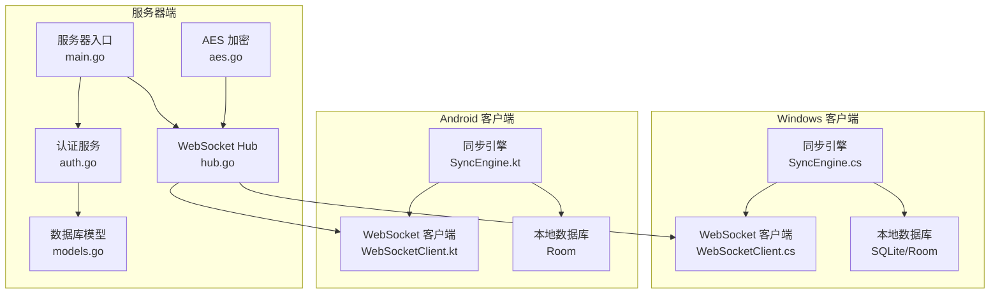
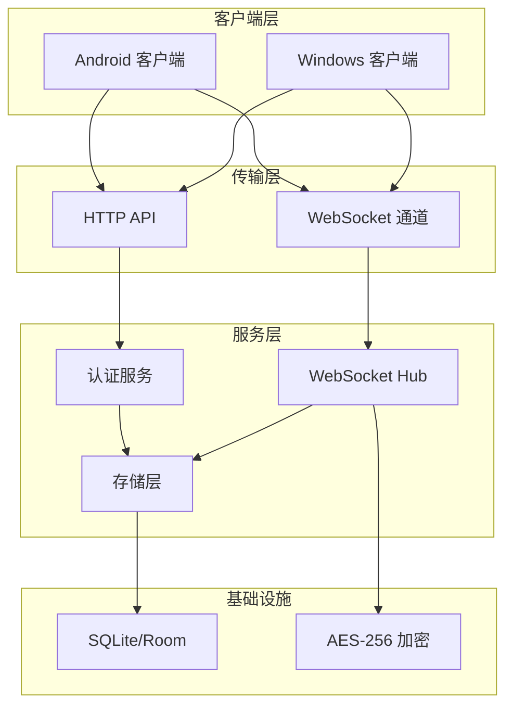
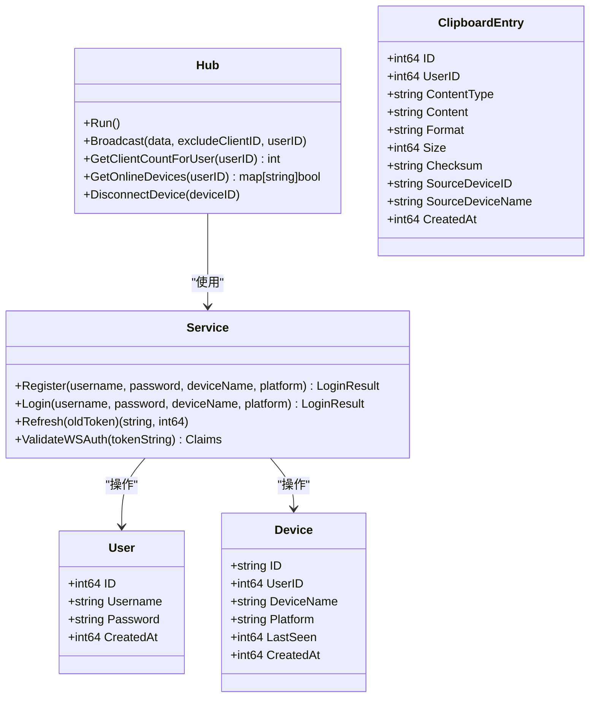
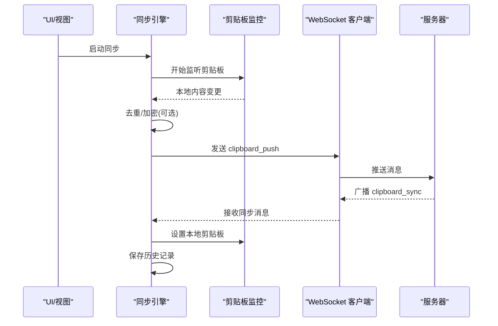
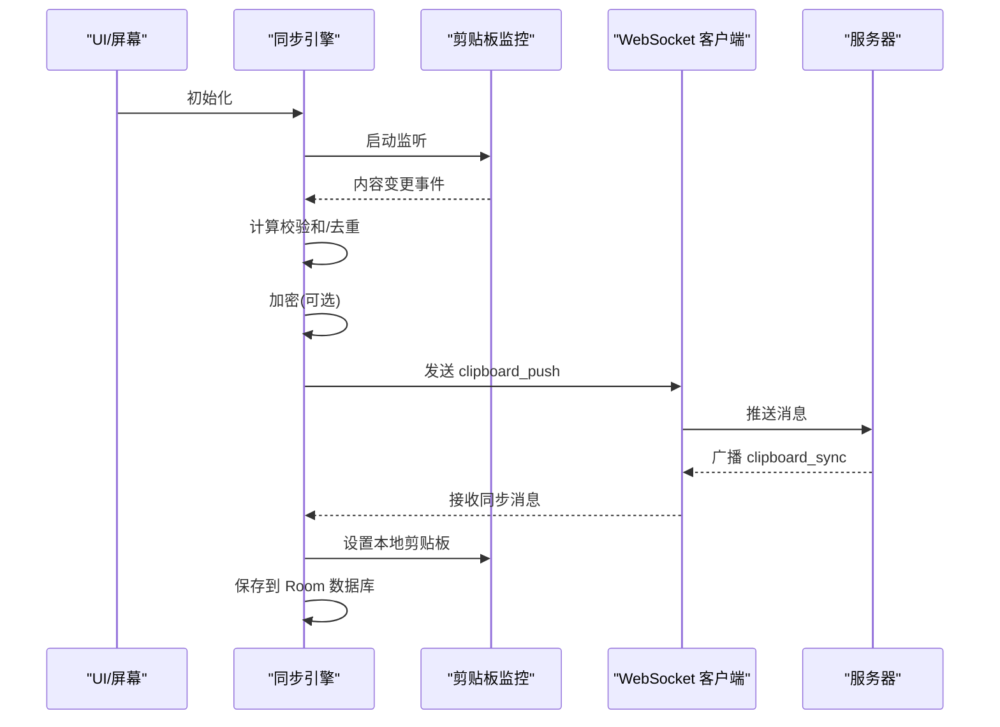
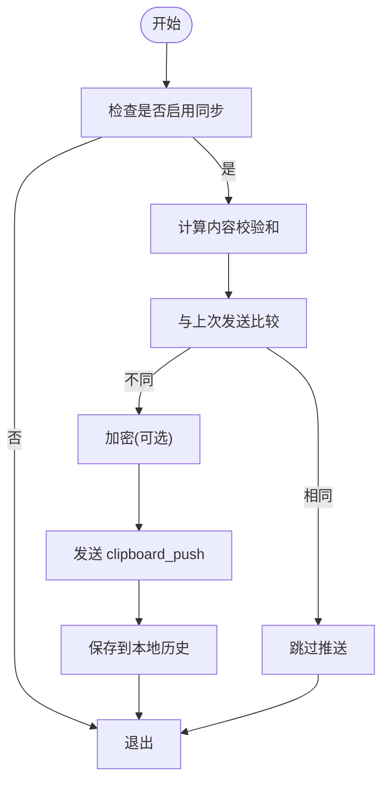
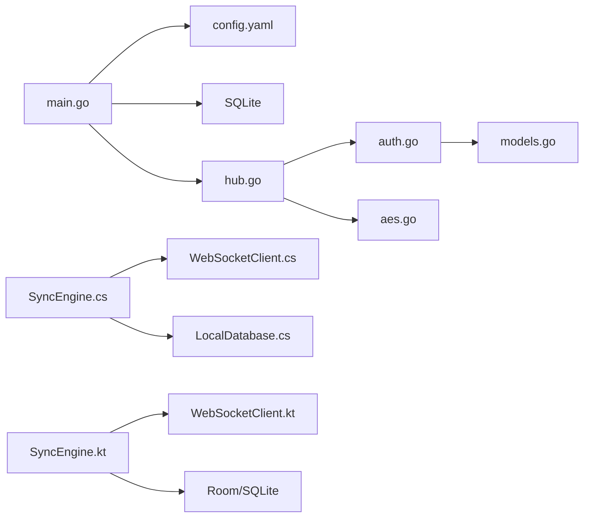

# 项目概述

<cite>
**本文档引用的文件**
- [DEVELOPMENT_PLAN.md](file://DEVELOPMENT_PLAN.md)
- [http-api.schema.json](file://protocol/http-api.schema.json)
- [ws-messages.schema.json](file://protocol/ws-messages.schema.json)
- [main.go](file://clipSync-server/cmd/server/main.go)
- [config.yaml](file://clipSync-server/configs/config.yaml)
- [hub.go](file://clipSync-server/internal/websocket/hub.go)
- [auth.go](file://clipSync-server/internal/auth/auth.go)
- [models.go](file://clipSync-server/internal/database/models.go)
- [aes.go](file://clipSync-server/internal/encryption/aes.go)
- [SyncEngine.kt](file://clipSync-android/app/src/main/java/com/clipsync/app/core/SyncEngine.kt)
- [WebSocketClient.kt](file://clipSync-android/app/src/main/java/com/clipsync/app/network/WebSocketClient.kt)
- [SyncEngine.cs](file://clipSync-windows/ClipSync.WPF/Core/SyncEngine.cs)
- [WebSocketClient.cs](file://clipSync-windows/ClipSync.WPF/Network/WebSocketClient.cs)
</cite>

## 目录
1. [简介](#简介)
2. [项目结构](#项目结构)
3. [核心组件](#核心组件)
4. [架构总览](#架构总览)
5. [详细组件分析](#详细组件分析)
6. [依赖关系分析](#依赖关系分析)
7. [性能考虑](#性能考虑)
8. [故障排除指南](#故障排除指南)
9. [结论](#结论)
10. [附录](#附录)

## 简介
ClipSync 是一个支持多平台（Go 服务器、Windows WPF 客户端、Android 客户端）并行开发的实时跨设备剪贴板同步系统。其核心目标是通过统一的协议规范与实时通信机制，在不同操作系统之间实现安全、可靠且低延迟的剪贴板内容同步。

- 核心价值主张
  - 实时同步：基于 WebSocket 的双向消息通道，确保跨设备内容即时一致。
  - 安全性：支持可选的 AES-256 加密与 JWT 认证，保障数据隐私与访问控制。
  - 可靠性：心跳保活、自动重连、去重与历史回放，提升用户体验与鲁棒性。
  - 可扩展性：分层架构与接口抽象，便于功能迭代与平台扩展。

- 应用场景
  - 开发者在多设备间快速共享代码片段、图片或文件。
  - 办公人员在桌面与移动设备间无缝粘贴文本与截图。
  - 团队协作中进行轻量级内容传递与临时共享。

- 并行开发策略
  - 以“共享协议规范”为单一事实来源，三端独立开发、独立测试。
  - 通过 Mock 服务与接口抽象，消除跨端阻塞依赖。
  - 分阶段集成与里程碑测试，确保各阶段质量与交付节奏。

**章节来源**
- [DEVELOPMENT_PLAN.md:1-16](file://DEVELOPMENT_PLAN.md#L1-L16)

## 项目结构
项目采用“三端并行 + 协议先行”的组织方式，三大模块职责清晰、边界明确：

- Go 服务器（clipSync-server）
  - 负责用户认证、设备管理、文件上传下载、WebSocket 连接管理与消息广播。
  - 使用 SQLite 存储用户、设备与剪贴板历史，支持 WAL 模式优化并发。
  - 提供 HTTP API 与 WebSocket 服务，端口分离（8081/8080）。

- Windows WPF 客户端（clipSync-windows）
  - 基于 .NET 的桌面应用，负责本地剪贴板监控、消息编解码、WebSocket 通信与本地数据库缓存。
  - 支持系统托盘、开机自启与图像剪贴板处理。

- Android 客户端（clipSync-android）
  - 基于 Kotlin/Compose 的移动端应用，负责剪贴板监听、协程驱动的消息处理、OkHttp WebSocket 客户端与 Room 数据库。
  - 支持前台服务、开机自启动与通知管理。

**图表来源**
- [main.go:19-126](file://clipSync-server/cmd/server/main.go#L19-L126)
- [hub.go:18-230](file://clipSync-server/internal/websocket/hub.go#L18-L230)
- [auth.go:8-137](file://clipSync-server/internal/auth/auth.go#L8-L137)
- [models.go:1-46](file://clipSync-server/internal/database/models.go#L1-L46)
- [aes.go:22-106](file://clipSync-server/internal/encryption/aes.go#L22-L106)
- [SyncEngine.cs:1-422](file://clipSync-windows/ClipSync.WPF/Core/SyncEngine.cs#L1-L422)
- [WebSocketClient.cs:1-126](file://clipSync-windows/ClipSync.WPF/Network/WebSocketClient.cs#L1-L126)
- [SyncEngine.kt:1-250](file://clipSync-android/app/src/main/java/com/clipsync/app/core/SyncEngine.kt#L1-L250)
- [WebSocketClient.kt:1-156](file://clipSync-android/app/src/main/java/com/clipsync/app/network/WebSocketClient.kt#L1-L156)

**章节来源**
- [DEVELOPMENT_PLAN.md:365-527](file://DEVELOPMENT_PLAN.md#L365-L527)

## 核心组件
- 协议规范（JSON Schema）
  - WebSocket 消息封装：统一的 envelope 结构，包含类型、版本、时间戳、设备标识与负载。
  - HTTP API 合同：登录/注册/刷新、健康检查、设备管理、文件上传下载。
  - 错误码与状态：标准化错误响应，便于客户端统一处理。

- 服务器组件
  - 配置管理：端口、JWT 密钥、文件存储路径、历史限制、心跳超时等。
  - 认证与授权：JWT 生成与校验、HTTP 中间件保护。
  - WebSocket Hub：连接注册/注销、广播、心跳超时检测、在线设备查询。
  - 数据库模型：用户、设备、剪贴板条目、上传文件。
  - 加密工具：AES-256-CBC 与 PBKDF2 密钥派生，支持跨端兼容格式。

- 客户端组件
  - 同步引擎：本地剪贴板监听、去重、推送、接收同步、历史拉取与保存。
  - WebSocket 客户端：连接生命周期管理、消息收发、自动重连与状态流。
  - 本地存储：SQLite/Room 缓存剪贴板历史，支持上限裁剪。

**章节来源**
- [http-api.schema.json:1-293](file://protocol/http-api.schema.json#L1-L293)
- [ws-messages.schema.json:1-261](file://protocol/ws-messages.schema.json#L1-L261)
- [config.yaml:1-29](file://clipSync-server/configs/config.yaml#L1-L29)
- [auth.go:24-137](file://clipSync-server/internal/auth/auth.go#L24-L137)
- [hub.go:18-230](file://clipSync-server/internal/websocket/hub.go#L18-L230)
- [models.go:3-46](file://clipSync-server/internal/database/models.go#L3-L46)
- [aes.go:22-106](file://clipSync-server/internal/encryption/aes.go#L22-L106)
- [SyncEngine.cs:32-422](file://clipSync-windows/ClipSync.WPF/Core/SyncEngine.cs#L32-L422)
- [WebSocketClient.cs:20-126](file://clipSync-windows/ClipSync.WPF/Network/WebSocketClient.cs#L20-L126)
- [SyncEngine.kt:27-250](file://clipSync-android/app/src/main/java/com/clipsync/app/core/SyncEngine.kt#L27-L250)
- [WebSocketClient.kt:26-156](file://clipSync-android/app/src/main/java/com/clipsync/app/network/WebSocketClient.kt#L26-L156)

## 架构总览
ClipSync 采用分层架构与事件驱动模式，结合观察者模式实现消息广播与状态更新。系统边界清晰：服务器负责认证、存储与广播；客户端负责本地监听与状态展示。

**图表来源**
- [main.go:68-126](file://clipSync-server/cmd/server/main.go#L68-L126)
- [hub.go:60-121](file://clipSync-server/internal/websocket/hub.go#L60-L121)
- [auth.go:15-137](file://clipSync-server/internal/auth/auth.go#L15-L137)
- [models.go:3-46](file://clipSync-server/internal/database/models.go#L3-L46)
- [aes.go:22-106](file://clipSync-server/internal/encryption/aes.go#L22-L106)

## 详细组件分析

### 服务器端架构
- 入口与配置
  - 从环境变量加载配置，初始化数据库并执行迁移，构建路由与中间件。
  - 分离 HTTP 与 WebSocket 服务，分别监听 8081/8080 端口。

- WebSocket Hub
  - 维护客户端集合、注册/注销通道与广播队列，按用户维度进行消息广播。
  - 处理心跳超时、连接断开与设备断连逻辑，保证会话一致性。

- 认证与授权
  - 用户注册/登录时创建/更新设备记录，并签发 JWT。
  - WebSocket 认证要求在 30 秒内完成，超时自动断开。

- 数据与加密
  - 数据模型涵盖用户、设备、剪贴板条目与上传文件。
  - AES-256-CBC 加密采用 PBKDF2-SHA3 密钥派生，输出跨端兼容格式。

**图表来源**
- [hub.go:18-180](file://clipSync-server/internal/websocket/hub.go#L18-L180)
- [auth.go:8-137](file://clipSync-server/internal/auth/auth.go#L8-L137)
- [models.go:3-46](file://clipSync-server/internal/database/models.go#L3-L46)

**章节来源**
- [main.go:19-126](file://clipSync-server/cmd/server/main.go#L19-L126)
- [hub.go:60-230](file://clipSync-server/internal/websocket/hub.go#L60-L230)
- [auth.go:31-137](file://clipSync-server/internal/auth/auth.go#L31-L137)
- [models.go:3-46](file://clipSync-server/internal/database/models.go#L3-L46)
- [aes.go:22-106](file://clipSync-server/internal/encryption/aes.go#L22-L106)

### 客户端同步流程（Windows）

**图表来源**
- [SyncEngine.cs:32-125](file://clipSync-windows/ClipSync.WPF/Core/SyncEngine.cs#L32-L125)
- [WebSocketClient.cs:20-79](file://clipSync-windows/ClipSync.WPF/Network/WebSocketClient.cs#L20-L79)

**章节来源**
- [SyncEngine.cs:95-267](file://clipSync-windows/ClipSync.WPF/Core/SyncEngine.cs#L95-L267)
- [WebSocketClient.cs:20-126](file://clipSync-windows/ClipSync.WPF/Network/WebSocketClient.cs#L20-L126)

### 客户端同步流程（Android）

**图表来源**
- [SyncEngine.kt:55-123](file://clipSync-android/app/src/main/java/com/clipsync/app/core/SyncEngine.kt#L55-L123)
- [WebSocketClient.kt:83-122](file://clipSync-android/app/src/main/java/com/clipsync/app/network/WebSocketClient.kt#L83-L122)

**章节来源**
- [SyncEngine.kt:128-194](file://clipSync-android/app/src/main/java/com/clipsync/app/core/SyncEngine.kt#L128-L194)
- [WebSocketClient.kt:83-156](file://clipSync-android/app/src/main/java/com/clipsync/app/network/WebSocketClient.kt#L83-L156)

### 去重与一致性算法

**图表来源**
- [SyncEngine.cs:95-125](file://clipSync-windows/ClipSync.WPF/Core/SyncEngine.cs#L95-L125)
- [SyncEngine.kt:72-123](file://clipSync-android/app/src/main/java/com/clipsync/app/core/SyncEngine.kt#L72-L123)

**章节来源**
- [SyncEngine.cs:95-125](file://clipSync-windows/ClipSync.WPF/Core/SyncEngine.cs#L95-L125)
- [SyncEngine.kt:72-123](file://clipSync-android/app/src/main/java/com/clipsync/app/core/SyncEngine.kt#L72-L123)

## 依赖关系分析
- 服务器端
  - main.go 依赖配置、数据库、认证与 WebSocket Hub。
  - Hub 依赖认证服务、仓库与协议消息结构。
  - 认证服务依赖用户/设备仓库与 JWT 管理器。
  - 加密模块提供通用 AES 工具，被服务器与客户端共同使用。

- 客户端
  - 同步引擎依赖 WebSocket 客户端、剪贴板监控与本地数据库。
  - WebSocket 客户端提供连接状态与消息流，支持自动重连。
  - 两端均依赖协议规范与加密工具，确保消息格式与安全一致。

**图表来源**
- [main.go:29-126](file://clipSync-server/cmd/server/main.go#L29-L126)
- [config.yaml:1-29](file://clipSync-server/configs/config.yaml#L1-L29)
- [hub.go:45-121](file://clipSync-server/internal/websocket/hub.go#L45-L121)
- [auth.go:15-137](file://clipSync-server/internal/auth/auth.go#L15-L137)
- [models.go:3-46](file://clipSync-server/internal/database/models.go#L3-L46)
- [aes.go:22-106](file://clipSync-server/internal/encryption/aes.go#L22-L106)
- [SyncEngine.cs:32-57](file://clipSync-windows/ClipSync.WPF/Core/SyncEngine.cs#L32-L57)
- [WebSocketClient.cs:20-79](file://clipSync-windows/ClipSync.WPF/Network/WebSocketClient.cs#L20-L79)
- [SyncEngine.kt:43-67](file://clipSync-android/app/src/main/java/com/clipsync/app/core/SyncEngine.kt#L43-L67)
- [WebSocketClient.kt:83-122](file://clipSync-android/app/src/main/java/com/clipsync/app/network/WebSocketClient.kt#L83-L122)

**章节来源**
- [main.go:29-126](file://clipSync-server/cmd/server/main.go#L29-L126)
- [hub.go:45-121](file://clipSync-server/internal/websocket/hub.go#L45-L121)
- [auth.go:15-137](file://clipSync-server/internal/auth/auth.go#L15-L137)
- [models.go:3-46](file://clipSync-server/internal/database/models.go#L3-L46)
- [aes.go:22-106](file://clipSync-server/internal/encryption/aes.go#L22-L106)
- [SyncEngine.cs:32-57](file://clipSync-windows/ClipSync.WPF/Core/SyncEngine.cs#L32-L57)
- [WebSocketClient.cs:20-79](file://clipSync-windows/ClipSync.WPF/Network/WebSocketClient.cs#L20-L79)
- [SyncEngine.kt:43-67](file://clipSync-android/app/src/main/java/com/clipsync/app/core/SyncEngine.kt#L43-L67)
- [WebSocketClient.kt:83-122](file://clipSync-android/app/src/main/java/com/clipsync/app/network/WebSocketClient.kt#L83-L122)

## 性能考虑
- 连接与广播
  - Hub 使用 select 循环处理注册/注销/广播，避免阻塞主循环。
  - 广播时对非目标用户与发送方进行过滤，减少无效投递。

- 心跳与保活
  - 客户端定时发送 heartbeat，服务器在超时后断开不活跃连接。
  - WebSocket ping/pong 与 OkHttp pingInterval 降低长连接空闲成本。

- 去重与历史
  - 基于内容校验和的去重策略，避免重复推送与广播风暴。
  - 本地历史上限裁剪（如 50 条），防止无限增长。

- 存储与加密
  - 服务器端 WAL 模式提升 SQLite 并发写入性能。
  - AES-256 加密采用 PBKDF2-SHA3，兼顾安全性与跨端兼容。

[本节为通用性能建议，无需特定文件引用]

## 故障排除指南
- 认证失败
  - 检查用户名/密码是否正确，确认 JWT 是否过期。
  - 服务器端对无效令牌返回明确错误码，客户端应提示重新登录。

- 连接问题
  - 确认 WebSocket 地址与端口（默认 ws://localhost:8080）。
  - 查看客户端连接状态流与自动重连日志，定位网络异常。

- 同步异常
  - 检查去重逻辑：若内容校验和相同会被跳过。
  - 确认加密开关一致性：仅当两端均启用加密时才进行加解密。

- 文件上传
  - 确认文件大小未超过最大限制（默认 5MB），校验和匹配避免重复上传。

**章节来源**
- [http-api.schema.json:280-291](file://protocol/http-api.schema.json#L280-L291)
- [hub.go:197-204](file://clipSync-server/internal/websocket/hub.go#L197-L204)
- [SyncEngine.cs:165-186](file://clipSync-windows/ClipSync.WPF/Core/SyncEngine.cs#L165-L186)
- [SyncEngine.kt:128-159](file://clipSync-android/app/src/main/java/com/clipsync/app/core/SyncEngine.kt#L128-L159)

## 结论
ClipSync 通过“协议先行、接口抽象、并行开发”的策略，成功实现了跨平台剪贴板同步的高一致性与高可用性。服务器端以 Hub 为核心，结合认证、存储与加密模块，提供稳定可靠的实时通信能力；客户端以同步引擎为中心，配合 WebSocket 客户端与本地缓存，实现流畅的用户体验。该架构既适合初学者理解实时通信与跨平台开发的基本原理，也为有经验的开发者提供了可扩展、可维护的工程实践范式。

[本节为总结性内容，无需特定文件引用]

## 附录
- 技术栈概览
  - 服务器：Go、gorilla/websocket、SQLite、JWT、PBKDF2-SHA3
  - Windows：C#、.NET、System.Net.WebSockets、SQLite/Room
  - Android：Kotlin、OkHttp、Coroutines、Room、Material 3

- 系统边界与主要组件
  - 边界：HTTP API（8081）、WebSocket（8080）、本地数据库（SQLite/Room）
  - 关键组件：认证服务、WebSocket Hub、同步引擎、WebSocket 客户端、本地数据库

[本节为概览性内容，无需特定文件引用]